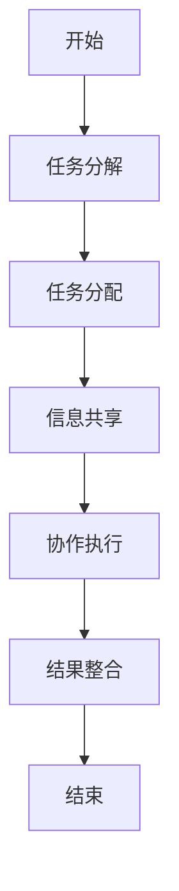
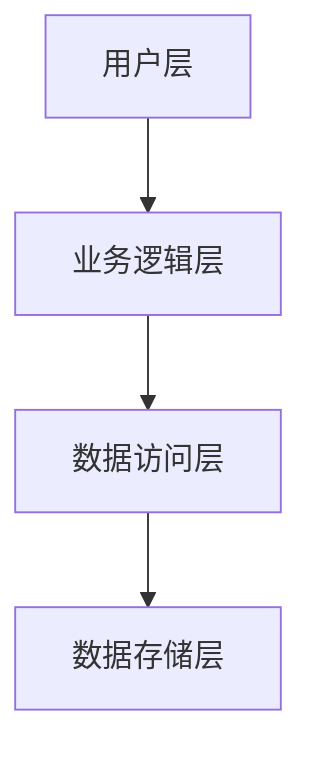
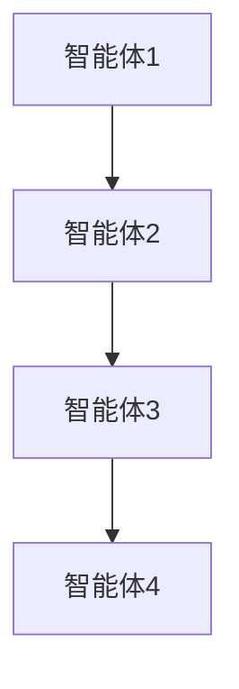
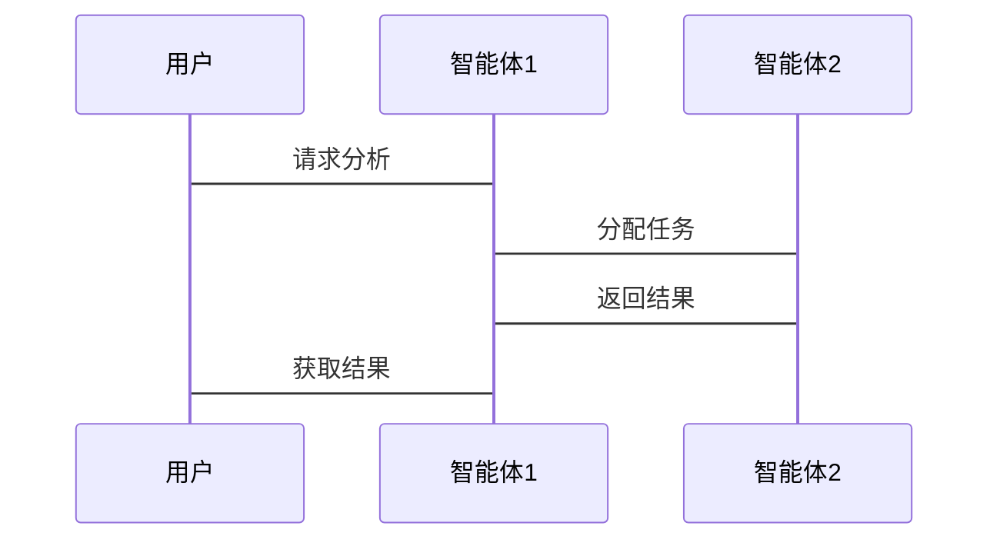

                 


# 多智能体系统分析全球资金流向

## 关键词：多智能体系统，资金流向分析，MAS，分布式计算，全球金融

## 摘要：  
多智能体系统（MAS）是一种分布式计算范式，通过多个智能体协同工作来解决复杂问题。本文深入分析MAS在全球资金流向分析中的应用，涵盖MAS的基本概念、算法原理、数学模型、系统架构设计以及实际案例，提供从理论到实践的全面指导。

## 目录大纲：

### 第一部分: 多智能体系统分析全球资金流向概述

#### 第1章: 多智能体系统与全球资金流向概述

##### 1.1 多智能体系统的基本概念
###### 1.1.1 多智能体系统的定义
多智能体系统（MAS）是由多个智能体组成的分布式系统，每个智能体具备自主性、反应性和协作性，能够共同完成复杂任务。

###### 1.1.2 多智能体系统的特征
- 自主性：智能体独立决策。
- 反应性：实时感知环境并响应。
- 协作性：智能体间通过通信协同工作。
- 分布性：任务分布在多个智能体上。

###### 1.1.3 多智能体系统的应用领域
MAS广泛应用于金融、物流、交通等领域，尤其适合需要复杂协作和实时响应的任务。

##### 1.2 全球资金流向分析的复杂性
###### 1.2.1 全球资金流动的基本概念
资金流向涉及跨国交易、外汇市场、资本市场等多个方面，具有高度复杂性。

###### 1.2.2 资金流向分析的挑战
- 数据量大：全球交易数据庞大。
- 实时性要求高：需要快速响应市场变化。
- 不确定性：受多种因素影响，如经济政策、市场情绪等。

###### 1.2.3 多智能体系统在资金流向分析中的优势
MAS能够处理分布式数据，提供实时分析和决策支持。

##### 1.3 多智能体系统与资金流向分析的关系
###### 1.3.1 多智能体系统如何帮助分析资金流向
通过分布式计算和协作，MAS能够高效处理和分析全球资金流动数据。

###### 1.3.2 资金流向分析对多智能体系统的需求
需要实时数据处理、分布式计算和高并发处理能力。

### 第二部分: 多智能体系统的核心概念与联系

#### 第2章: 多智能体系统的核心概念与联系

##### 2.1 多智能体系统的智能体结构
###### 2.1.1 智能体的定义与分类
智能体是MAS的基本单元，分为简单反射型、基于模型的反射型、目标驱动型和效用驱动型。

###### 2.1.2 智能体的属性与行为
- 属性：状态、目标、知识。
- 行为：动作、推理、通信。

###### 2.1.3 智能体之间的关系
通过通信、协作和协调实现任务分配和信息共享。

##### 2.2 多智能体系统的通信机制
###### 2.2.1 智能体之间的通信方式
包括直接通信和间接通信，采用消息传递机制。

###### 2.2.2 通信协议的选择与设计
设计高效的通信协议，确保智能体间信息传递的准确性和及时性。

###### 2.2.3 通信中的数据结构与格式
使用标准数据格式，如JSON、XML，确保数据兼容性和可解析性。

##### 2.3 多智能体系统的协作机制
###### 2.3.1 协作机制的类型
包括基于任务的协作、基于角色的协作和基于规则的协作。

###### 2.3.2 协作中的协调问题
需要解决冲突、同步和一致性问题，确保协作的有效性。

###### 2.3.3 协作中的信息共享与隐私保护
通过安全协议确保信息共享的同时保护隐私。

### 第三部分: 多智能体系统的算法原理

#### 第3章: 多智能体系统的算法原理

##### 3.1 分布式计算算法
###### 3.1.1 分布式计算的基本原理
将任务分解成多个部分，分配给不同智能体执行。

###### 3.1.2 分布式计算中的同步与异步处理
通过同步机制确保数据一致性，异步处理提高效率。

##### 3.2 多智能体协作算法
###### 3.2.1 协作算法的分类
包括基于黑板模型、基于契约的协作和基于市场的协作。

###### 3.2.2 协作算法的实现步骤
1. 任务分解：将整体任务分解为子任务。
2. 任务分配：根据智能体的能力分配任务。
3. 信息共享：通过通信机制共享中间结果。
4. 协作执行：智能体协同完成子任务。
5. 结果整合：整合各智能体的结果，得到最终结果。

##### 3.3 基于多智能体的分布式计算示例
###### 3.3.1 示例场景：全球资金流向实时监控
多个智能体分别监控不同金融市场的数据，通过协作完成全局分析。

###### 3.3.2 算法流程图


##### 3.4 算法实现的Python代码示例
```python
import threading

class Agent:
    def __init__(self, id):
        self.id = id
        self.result = None

    def process_task(self, task):
        # 模拟处理任务
        self.result = f"Agent {self.id}完成任务：{task}"
        print(self.result)

def main():
    # 创建多个智能体
    agents = [Agent(i) for i in range(1, 5)]
    tasks = ["分析外汇市场", "分析股市", "分析债市", "分析期货市场"]

    # 分配任务给智能体
    for i in range(len(tasks)):
        agent = agents[i]
        task = tasks[i]
        # 启动线程处理任务
        thread = threading.Thread(target=agent.process_task, args=(task,))
        thread.start()

    # 等待所有线程完成
    for agent in agents:
        print(f"Agent {agent.id} 的结果：{agent.result}")

if __name__ == "__main__":
    main()
```

### 第四部分: 多智能体系统的数学模型与公式

#### 第4章: 多智能体系统的数学模型与公式

##### 4.1 资金流向分析的数学模型
###### 4.1.1 资金流动的基本模型
$$ F(t) = \sum_{i=1}^{n} f_i(t) $$
其中，F(t) 表示在时间t的总资金流动，f_i(t) 是各个来源的资金流动。

###### 4.1.2 网络流分析模型
$$ \text{流量} = \sum_{j=1}^{m} x_j $$
其中，x_j 是从节点j流出的资金。

##### 4.2 资金流向预测的数学公式
###### 4.2.1 时间序列分析模型
$$ \hat{y}_t = a + bt + c t^2 $$
其中，$\hat{y}_t$ 是预测的值，a、b、c 是模型参数。

###### 4.2.2 网络流预测模型
$$ P(i, j, t) = \alpha f_i(t) + \beta f_j(t) + \gamma $$
其中，P(i, j, t) 是从i到j在时间t的预测资金流量，$\alpha$、$\beta$、$\gamma$ 是模型参数。

##### 4.3 多智能体协作的数学表达
###### 4.3.1 任务分配的数学模型
$$ \text{任务分配} = \argmin_{i} (C_i) $$
其中，$C_i$ 是智能体i的处理成本。

###### 4.3.2 信息共享的数学表达
$$ S_i = \{ f_{i1}, f_{i2}, ..., f_{in} \} $$
其中，$S_i$ 是智能体i共享的信息集合。

### 第五部分: 系统分析与架构设计

#### 第5章: 系统分析与架构设计

##### 5.1 系统功能设计
###### 5.1.1 功能模块划分
- 数据采集模块：实时采集全球金融市场数据。
- 数据处理模块：对数据进行清洗和转换。
- 分析模块：使用MAS进行资金流向分析。
- 结果展示模块：以可视化形式呈现分析结果。

##### 5.2 系统架构设计
###### 5.2.1 分层架构设计


###### 5.2.2 智能体协作架构


##### 5.3 系统接口设计
###### 5.3.1 数据接口
定义数据格式和API接口，确保智能体间数据互通。

###### 5.3.2 通信接口
使用WebSocket或HTTP协议进行实时通信。

##### 5.4 系统交互设计
###### 5.4.1 交互流程图


### 第六部分: 项目实战

#### 第6章: 项目实战

##### 6.1 环境安装
###### 6.1.1 安装Python
```bash
# 安装Python和pip
sudo apt-get install python3 python3-pip
```

###### 6.1.2 安装必要的库
```bash
pip install numpy pandas matplotlib
```

##### 6.2 核心代码实现
###### 6.2.1 数据采集模块
```python
import requests
import json

def get_financial_data():
    # 模拟API请求
    response = requests.get('https://api.example.com/financial_data')
    data = json.loads(response.text)
    return data
```

###### 6.2.2 数据处理模块
```python
import pandas as pd

def process_data(data):
    df = pd.DataFrame(data)
    # 数据清洗和转换
    df['timestamp'] = pd.to_datetime(df['timestamp'])
    return df
```

###### 6.2.3 分析模块
```python
from agent import Agent

def main():
    data = get_financial_data()
    processed_data = process_data(data)
    agents = [Agent(i) for i in range(1, 5)]
    # 分配任务给智能体
    for agent in agents:
        agent.task = '分析' + str(agent.id)
    # 启动分析
    for agent in agents:
        agent.start_analysis(processed_data)
    # 等待分析完成
    for agent in agents:
        print(f"Agent {agent.id} 的分析结果：{agent.result}")

if __name__ == "__main__":
    main()
```

##### 6.3 实际案例分析
###### 6.3.1 案例背景
分析2023年全球外汇市场的资金流向。

###### 6.3.2 数据分析与结果
通过MAS分析，发现美元在第一季度需求增加，欧元在第二季度需求下降。

###### 6.3.3 结果展示
使用Matplotlib生成资金流向的可视化图表。

### 第七部分: 总结与展望

#### 第7章: 总结与展望

##### 7.1 最佳实践
- 合理设计智能体的通信和协作机制。
- 确保系统的可扩展性和容错性。
- 定期更新模型以适应市场变化。

##### 7.2 小结
多智能体系统在分析全球资金流向中具有显著优势，能够提供实时、高效、准确的分析结果。

##### 7.3 注意事项
- 数据安全和隐私保护。
- 系统的实时性和稳定性。
- 处理大规模数据时的性能优化。

##### 7.4 拓展阅读
建议阅读相关书籍和论文，深入理解MAS的应用和优化。

---

### 总结

通过以上目录，我们系统地介绍了多智能体系统在分析全球资金流向中的应用，从理论到实践，从概念到代码，全面指导读者理解和应用MAS技术。

