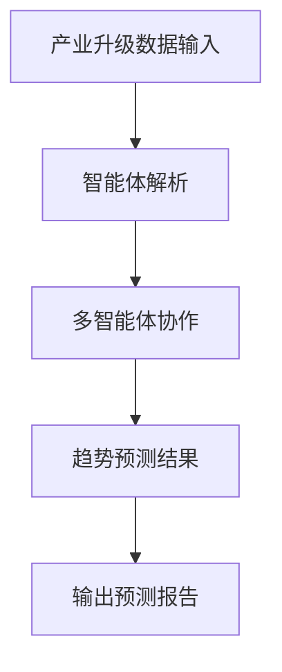
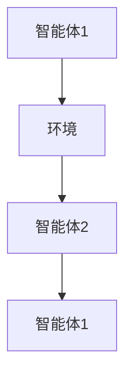
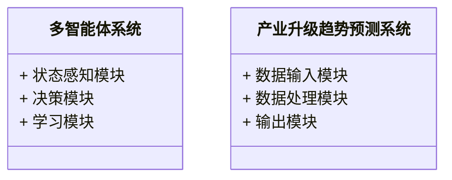
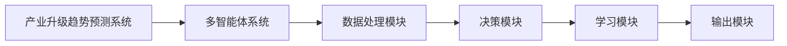

                 


# 多智能体系统在产业升级趋势预测中的应用：把握结构性机会

## 关键词：多智能体系统，产业升级，趋势预测，人工智能，分布式系统，智能决策

## 摘要：多智能体系统（MAS）作为一种新兴的分布式计算范式，正在成为产业升级趋势预测的核心技术。通过多智能体系统中各智能体的协作与决策，企业能够更精准地把握市场动态、优化资源配置、预测产业趋势，从而抓住结构性机会。本文将深入探讨多智能体系统在产业升级中的应用，从理论到实践，结合实际案例，详细解析其在趋势预测中的优势和实现方法。

---

# 第一部分：多智能体系统基础

## 1.1 多智能体系统的核心概念

### 1.1.1 多智能体系统的定义与特点
多智能体系统（Multi-Agent System，MAS）是由多个智能体（Agent）组成的分布式系统，这些智能体通过协作完成共同目标。其特点包括：
- **自主性**：每个智能体能够独立决策和行动。
- **反应性**：智能体能够感知环境并实时响应。
- **协作性**：多个智能体通过通信和协作完成复杂任务。
- **分布式性**：系统中的智能体分布在网络中，不存在集中控制节点。

### 1.1.2 多智能体系统的分类与特点
多智能体系统可以分为以下几类：
1. **简单反射型智能体**：基于当前感知做出反应，不依赖历史信息。
2. **基于模型的反射型智能体**：利用内部模型进行规划和决策。
3. **目标驱动型智能体**：基于明确的目标进行决策和行动。
4. **效用驱动型智能体**：通过最大化效用函数来优化决策。

### 1.1.3 多智能体系统的协作机制
多智能体系统的协作机制包括：
- **通信机制**：智能体之间通过消息传递进行信息交换。
- **协调机制**：通过协商和协议确保各智能体目标一致。
- **分工机制**：根据智能体的能力和任务需求分配任务。

---

## 1.2 产业升级趋势预测的背景与需求

### 1.2.1 产业升级的定义与关键特征
产业升级是指通过技术创新、管理优化和模式变革，提升产业整体竞争力和效率的过程。其关键特征包括：
- **技术驱动**：依赖新技术推动产业升级。
- **数据驱动**：利用数据进行决策优化。
- **智能化**：引入人工智能技术实现自动化和智能化。

### 1.2.2 多智能体系统在产业升级中的优势
多智能体系统在产业升级中的优势体现在：
- **分布式决策**：能够快速响应局部变化。
- **协作能力**：通过协作实现全局最优。
- **适应性**：能够根据环境变化自适应调整。

---

# 第二部分：多智能体系统在产业升级中的应用

## 2.1 多智能体系统在产业升级中的具体应用

### 2.1.1 制造业中的应用
在制造业中，多智能体系统可以用于生产调度、供应链管理和设备维护。例如，智能体可以实时监控生产线状态，优化生产计划，减少资源浪费。

### 2.1.2 服务业中的应用
在服务业中，多智能体系统可以用于客户行为预测、服务流程优化和资源分配。例如，智能体可以根据客户需求实时调整服务策略。

### 2.1.3 农业中的应用
在农业中，多智能体系统可以用于精准农业、资源优化和病虫害防治。例如，智能体可以监测土壤湿度和天气变化，自动调整灌溉计划。

---

# 第三部分：产业升级趋势预测的多智能体系统模型

## 3.1 多智能体系统模型的构建

### 3.1.1 系统需求分析与目标设定
系统需求分析包括：
- **目标设定**：明确系统需要实现的功能。
- **功能模块划分**：将系统划分为多个功能模块。
- **数据流设计**：设计数据的输入、处理和输出流程。

### 3.1.2 多智能体系统的实体关系图
以下是多智能体系统在产业升级趋势预测中的实体关系图：
```mermaid
er
actor: 产业升级趋势预测系统
entity: 多智能体系统
attribute: 系统组件、协作机制、决策模型
```

### 3.1.3 多智能体系统的流程图
以下是多智能体系统在产业升级趋势预测中的流程图：


---

## 3.2 多智能体系统的算法实现

### 3.2.1 多智能体强化学习算法
以下是多智能体强化学习算法的流程图：


以下是多智能体强化学习算法的数学模型：
$$
V(s) = \max_{a} Q(s,a)
$$

以下是Python实现代码：
```python
import numpy as np

class MultiAgent:
    def __init__(self, num_agents):
        self.num_agents = num_agents
        self.states = []
        self.actions = []

    def perceive(self, state):
        # 智能体感知环境状态
        self.states.append(state)
        return self.states[-1]

    def decide(self, state):
        # 智能体根据状态做出决策
        action = np.random.choice(len(state))
        return action

    def learn(self, state, action, reward):
        # 智能体学习更新Q值
        self.actions.append((state, action, reward))
```

---

## 3.3 系统分析与架构设计

### 3.3.1 项目介绍
项目名称：产业升级趋势预测系统  
项目目标：通过多智能体系统实现产业升级趋势的精准预测。

### 3.3.2 系统功能设计
以下是系统功能设计的类图：


### 3.3.3 系统架构设计
以下是系统架构设计的架构图：


---

## 3.4 项目实战

### 3.4.1 环境安装
安装Python和相关库：
```bash
pip install numpy
pip install matplotlib
```

### 3.4.2 系统核心实现
以下是多智能体系统的核心代码实现：
```python
import numpy as np

class Agent:
    def __init__(self, env):
        self.env = env
        self.states = []
        self.actions = []

    def perceive(self, state):
        self.states.append(state)
        return self.states[-1]

    def decide(self, state):
        action = np.random.choice(len(state))
        return action

    def learn(self, state, action, reward):
        self.actions.append((state, action, reward))

class Environment:
    def __init__(self):
        self.agents = []
        self.states = []

    def add_agent(self, agent):
        self.agents.append(agent)

    def step(self):
        for agent in self.agents:
            state = agent.perceive(self.states[-1])
            action = agent.decide(state)
            reward = self.get_reward()
            agent.learn(state, action, reward)
```

### 3.4.3 实际案例分析
以下是多智能体系统在制造业中的实际应用案例：
1. **数据输入**：输入生产线的实时数据。
2. **数据处理**：多智能体系统对数据进行处理和分析。
3. **决策输出**：系统根据分析结果优化生产计划。

---

## 3.5 最佳实践与总结

### 3.5.1 最佳实践
- **数据质量**：确保输入数据的准确性和完整性。
- **模型优化**：定期更新和优化多智能体系统的模型。
- **系统维护**：定期检查和维护多智能体系统，确保其正常运行。

### 3.5.2 小结
多智能体系统在产业升级趋势预测中的应用具有显著优势，能够通过协作和数据驱动实现精准预测和优化决策。

### 3.5.3 注意事项
- 多智能体系统的设计需要充分考虑智能体之间的通信和协作机制。
- 系统的安全性和稳定性需要高度重视。

### 3.5.4 拓展阅读
- 《Multi-Agent Systems: Algorithm and Applications》
- 《Artificial Intelligence: A Modern Approach》

---

通过以上内容，我们可以看到，多智能体系统在产业升级趋势预测中的应用具有广阔前景，能够为企业提供强有力的技术支持，帮助其在竞争中占据优势。

