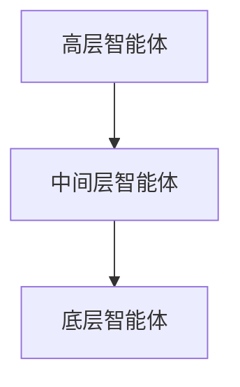
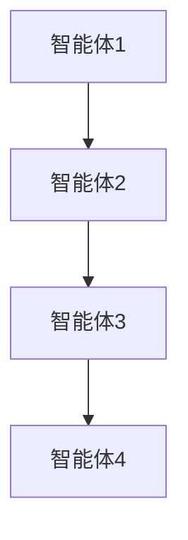
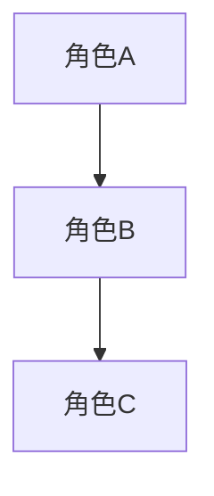
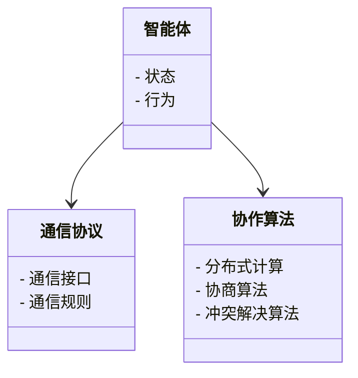
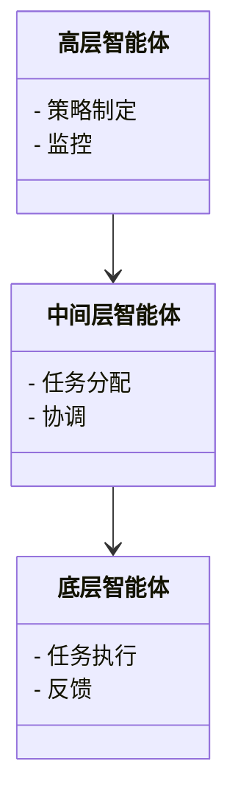
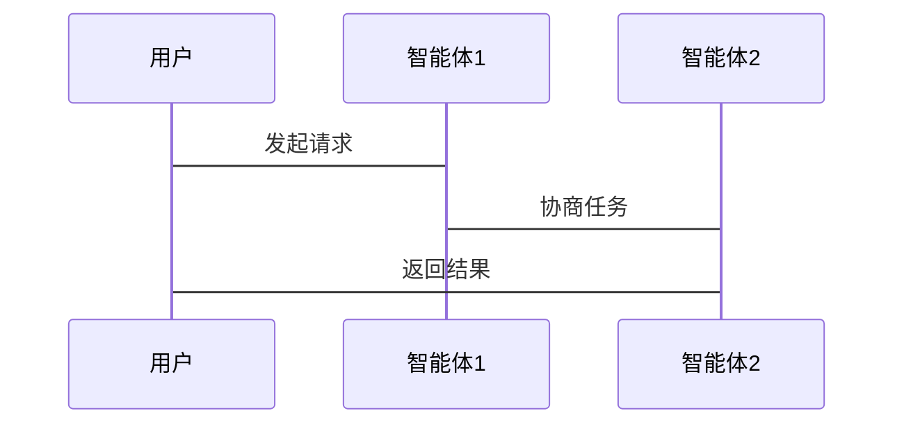

                 


# 多智能体系统在产品生命周期分析中的应用

> 关键词：多智能体系统、产品生命周期、系统架构、算法原理、协作机制、案例分析、应用前景

> 摘要：  
> 本文探讨了多智能体系统在产品生命周期分析中的应用，从核心概念、算法原理到实际应用场景进行了全面分析。文章首先介绍了多智能体系统的基本概念及其在产品生命周期管理中的重要性，然后深入讲解了多智能体系统的体系结构、通信机制、协作算法和数学模型，接着分析了多智能体系统在产品设计、制造和市场阶段的具体应用，最后结合实际案例总结了多智能体系统的应用优势及未来发展方向。

---

# 第一部分：多智能体系统与产品生命周期概述

## 第1章：多智能体系统与产品生命周期概述

### 1.1 多智能体系统的基本概念

#### 1.1.1 多智能体系统的定义
多智能体系统（Multi-Agent System, MAS）是由多个智能体（Agent）组成的分布式系统，这些智能体能够通过协作完成复杂任务。每个智能体都有一定的自主性、反应性和社会性，能够感知环境并采取行动。

#### 1.1.2 多智能体系统的特征
- **自主性**：智能体能够自主决策。
- **反应性**：能够实时感知环境并做出反应。
- **协作性**：多个智能体通过协作完成共同目标。
- **分布式性**：系统中的智能体分布在不同的位置，通过通信进行协作。

#### 1.1.3 多智能体系统与分布式系统的关系
| 特性          | 多智能体系统         | 分布式系统         |
|---------------|--------------------|-------------------|
| 自主性         | 高                 | 低或无            |
| 协作性         | 高                 | 低或无            |
| 智能性         | 高                 | 低或无            |
| 通信机制       | 支持复杂通信         | 支持简单通信         |

### 1.2 产品生命周期的基本概念

#### 1.2.1 产品生命周期的定义
产品生命周期是指产品从构思、设计、生产、销售到报废的整个过程。

#### 1.2.2 产品生命周期的各个阶段
1. **概念阶段**：需求分析和初步设计。
2. **设计阶段**：详细设计和原型开发。
3. **生产阶段**：制造和组装。
4. **销售阶段**：市场推广和客户支持。
5. **报废阶段**：回收和处理。

#### 1.2.3 产品生命周期管理的重要性
- 提高效率：通过系统化管理减少资源浪费。
- 提高质量：确保每个阶段的质量控制。
- 提高客户满意度：通过实时反馈优化产品。

### 1.3 多智能体系统在产品生命周期中的应用背景

#### 1.3.1 传统产品生命周期管理的局限性
- **信息孤岛**：不同部门之间缺乏有效的信息共享。
- **协作效率低**：各部门协作效率低下，容易出现矛盾。
- **实时性差**：无法实时响应市场变化。

#### 1.3.2 多智能体系统的优势
- **分布式协作**：智能体可以分布在不同的部门，实时协作。
- **自主性**：智能体能够自主决策，减少人为干预。
- **灵活性**：系统能够快速响应市场变化。

#### 1.3.3 多智能体系统在产品生命周期中的应用前景
随着人工智能和物联网技术的发展，多智能体系统在产品生命周期管理中的应用将越来越广泛。

### 1.4 本章小结
本章介绍了多智能体系统的基本概念、特征及其在产品生命周期管理中的重要性，指出了多智能体系统在产品生命周期中的应用背景和优势。

---

# 第二部分：多智能体系统的核心概念与算法原理

## 第2章：多智能体系统的核心概念与原理

### 2.1 多智能体系统的体系结构

#### 2.1.1 分层体系结构
分层体系结构将系统分为多个层次，每个层次负责不同的功能。



#### 2.1.2 分布式体系结构
分布式体系结构中，多个智能体分布在不同的节点上，通过通信进行协作。



#### 2.1.3 基于角色的体系结构
基于角色的体系结构中，智能体根据角色分配不同的任务。



### 2.2 多智能体系统的通信与协作机制

#### 2.2.1 通信协议
智能体之间的通信需要遵循一定的协议。

#### 2.2.2 协作算法
协作算法是多智能体系统的核心，常见的协作算法包括：

1. **分布式一致性算法**：确保系统中所有智能体的状态一致。
2. **协商算法**：通过协商分配任务。
3. **分布式计算算法**：通过分布式计算完成任务。

#### 2.2.3 冲突解决机制
冲突解决机制用于处理智能体之间的冲突，常见的冲突解决机制包括：

1. **优先级机制**：根据任务优先级解决问题。
2. **仲裁机制**：通过仲裁解决冲突。
3. **协商机制**：通过协商达成一致。

### 2.3 多智能体系统的智能体行为模型

#### 2.3.1 BDI模型
BDI模型是基于信念、愿望和意图的行为模型。

#### 2.3.2 情境意识模型
情境意识模型是基于情境感知的行为模型。

#### 2.3.3 计划与执行模型
计划与执行模型是基于计划执行的行为模型。

### 2.4 本章小结
本章详细介绍了多智能体系统的体系结构、通信与协作机制以及智能体行为模型。

---

## 第3章：多智能体系统的算法原理

### 3.1 分布式计算中的多智能体算法

#### 3.1.1 分布式计算的基本概念
分布式计算是指在分布式系统中进行计算的过程。

#### 3.1.2 多智能体系统中的分布式算法
分布式算法是多智能体系统的核心算法，常见的分布式算法包括：

1. **分布式一致性算法**：确保系统中所有智能体的状态一致。
2. **分布式计算算法**：通过分布式计算完成任务。
3. **分布式通信算法**：通过分布式通信进行协作。

#### 3.1.3 分布式算法的实现步骤


### 3.2 协作算法

#### 3.2.1 协作算法的定义
协作算法是指智能体之间通过协作完成任务的算法。

#### 3.2.2 协作算法的分类
1. **协商算法**：通过协商分配任务。
2. **分布式计算算法**：通过分布式计算完成任务。
3. **协作优化算法**：通过优化协作完成任务。

#### 3.2.3 协作算法的实现步骤


### 3.3 冲突解决算法

#### 3.3.1 冲突检测算法
冲突检测算法用于检测智能体之间的冲突。

#### 3.3.2 冲突解决算法
冲突解决算法用于解决智能体之间的冲突。

#### 3.3.3 冲突解决算法的实现步骤


### 3.4 本章小结
本章详细介绍了多智能体系统的算法原理，包括分布式计算、协作算法和冲突解决算法。

---

# 第三部分：多智能体系统在产品生命周期中的应用

## 第4章：多智能体系统在产品设计阶段的应用

### 4.1 多智能体系统在产品设计阶段的应用

#### 4.1.1 多智能体系统在需求分析中的应用
多智能体系统可以用于需求分析，帮助团队更好地理解需求。

#### 4.1.2 多智能体系统在设计优化中的应用
多智能体系统可以用于设计优化，帮助团队找到最优的设计方案。

#### 4.1.3 多智能体系统在设计协作中的应用
多智能体系统可以用于设计协作，帮助团队更好地协作完成设计任务。

### 4.2 多智能体系统的算法在产品设计中的应用

#### 4.2.1 分布式计算在需求分析中的应用
分布式计算可以帮助团队更好地进行需求分析。

#### 4.2.2 协作算法在设计优化中的应用
协作算法可以帮助团队找到最优的设计方案。

#### 4.2.3 冲突解决算法在设计协作中的应用
冲突解决算法可以帮助团队解决设计协作中的冲突。

### 4.3 本章小结
本章详细介绍了多智能体系统在产品设计阶段的应用，包括需求分析、设计优化和设计协作。

---

## 第5章：多智能体系统在产品制造阶段的应用

### 5.1 多智能体系统在产品制造阶段的应用

#### 5.1.1 多智能体系统在生产计划中的应用
多智能体系统可以用于生产计划，帮助团队更好地规划生产。

#### 5.1.2 多智能体系统在质量控制中的应用
多智能体系统可以用于质量控制，帮助团队更好地控制产品质量。

#### 5.1.3 多智能体系统在生产协作中的应用
多智能体系统可以用于生产协作，帮助团队更好地协作完成生产任务。

### 5.2 多智能体系统的算法在产品制造中的应用

#### 5.2.1 分布式计算在生产计划中的应用
分布式计算可以帮助团队更好地进行生产计划。

#### 5.2.2 协作算法在质量控制中的应用
协作算法可以帮助团队更好地控制产品质量。

#### 5.2.3 冲突解决算法在生产协作中的应用
冲突解决算法可以帮助团队解决生产协作中的冲突。

### 5.3 本章小结
本章详细介绍了多智能体系统在产品制造阶段的应用，包括生产计划、质量控制和生产协作。

---

## 第6章：多智能体系统在产品市场阶段的应用

### 6.1 多智能体系统在产品市场阶段的应用

#### 6.1.1 多智能体系统在市场分析中的应用
多智能体系统可以用于市场分析，帮助团队更好地理解市场。

#### 6.1.2 多智能体系统在市场推广中的应用
多智能体系统可以用于市场推广，帮助团队更好地推广产品。

#### 6.1.3 多智能体系统在客户支持中的应用
多智能体系统可以用于客户支持，帮助团队更好地支持客户。

### 6.2 多智能体系统的算法在产品市场中的应用

#### 6.2.1 分布式计算在市场分析中的应用
分布式计算可以帮助团队更好地进行市场分析。

#### 6.2.2 协作算法在市场推广中的应用
协作算法可以帮助团队更好地推广产品。

#### 6.2.3 冲突解决算法在客户支持中的应用
冲突解决算法可以帮助团队解决客户支持中的冲突。

### 6.3 本章小结
本章详细介绍了多智能体系统在产品市场阶段的应用，包括市场分析、市场推广和客户支持。

---

# 第四部分：多智能体系统的系统设计与实现

## 第7章：多智能体系统的系统设计与实现

### 7.1 系统设计

#### 7.1.1 系统功能设计
系统功能设计包括需求分析、设计优化、生产计划、质量控制、市场分析和客户支持。



#### 7.1.2 系统架构设计
系统架构设计包括分层架构、分布式架构和基于角色的架构。



#### 7.1.3 系统接口设计
系统接口设计包括通信接口、协作接口和用户接口。

#### 7.1.4 系统交互设计
系统交互设计包括用户与智能体的交互、智能体之间的交互和智能体与系统的交互。



### 7.2 系统实现

#### 7.2.1 环境搭建
环境搭建包括安装多智能体系统所需的软件和硬件。

#### 7.2.2 核心功能实现
核心功能实现包括通信协议实现、协作算法实现和冲突解决算法实现。

#### 7.2.3 代码实现
以下是通信协议实现的示例代码：

```python
class Agent:
    def __init__(self, name):
        self.name = name
        self.state = None
        self.communication_channel = []

    def send_message(self, message, recipient):
        recipient.communication_channel.append(message)

    def receive_message(self):
        messages = self.communication_channel.copy()
        self.communication_channel.clear()
        return messages
```

#### 7.2.4 系统测试
系统测试包括单元测试、集成测试和性能测试。

### 7.3 本章小结
本章详细介绍了多智能体系统的系统设计与实现，包括功能设计、架构设计、接口设计、交互设计、环境搭建、核心功能实现、代码实现和系统测试。

---

# 第五部分：多智能体系统的应用分析

## 第8章：多智能体系统的应用分析

### 8.1 应用场景分析

#### 8.1.1 产品设计阶段
多智能体系统在产品设计阶段的应用包括需求分析、设计优化和设计协作。

#### 8.1.2 产品制造阶段
多智能体系统在产品制造阶段的应用包括生产计划、质量控制和生产协作。

#### 8.1.3 产品市场阶段
多智能体系统在产品市场阶段的应用包括市场分析、市场推广和客户支持。

### 8.2 案例分析

#### 8.2.1 案例背景
某公司使用多智能体系统进行产品设计。

#### 8.2.2 案例分析
通过多智能体系统的协作算法，该公司成功完成了产品的设计优化。

#### 8.2.3 分析结果
分析结果显示，多智能体系统显著提高了设计效率和产品质量。

### 8.3 本章小结
本章通过实际案例分析了多智能体系统在产品生命周期中的应用，验证了其有效性和优势。

---

## 第9章：多智能体系统的应用前景与挑战

### 9.1 应用前景

#### 9.1.1 技术发展
随着人工智能和物联网技术的发展，多智能体系统的应用前景越来越广阔。

#### 9.1.2 市场需求
市场对高效、灵活的产品生命周期管理系统的需求日益增加。

#### 9.1.3 未来趋势
未来，多智能体系统将更加智能化、自动化和协作化。

### 9.2 挑战与解决方案

#### 9.2.1 技术挑战
技术挑战包括通信延迟、数据安全和系统稳定性。

#### 9.2.2 应用挑战
应用挑战包括用户接受度、系统集成和成本问题。

#### 9.2.3 解决方案
解决方案包括优化通信协议、加强数据安全和降低系统成本。

### 9.3 本章小结
本章分析了多智能体系统的应用前景和挑战，并提出了相应的解决方案。

---

# 第十章：总结与展望

## 10.1 本章总结
本文详细探讨了多智能体系统在产品生命周期分析中的应用，从核心概念、算法原理到实际应用场景进行了全面分析。

## 10.2 未来展望
未来，随着人工智能和物联网技术的发展，多智能体系统在产品生命周期管理中的应用将更加广泛和深入。

---

# 参考文献

（此处可以列出相关的参考文献）

