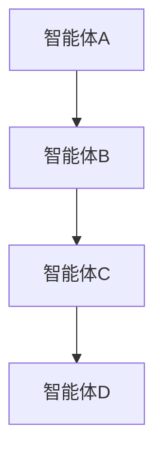
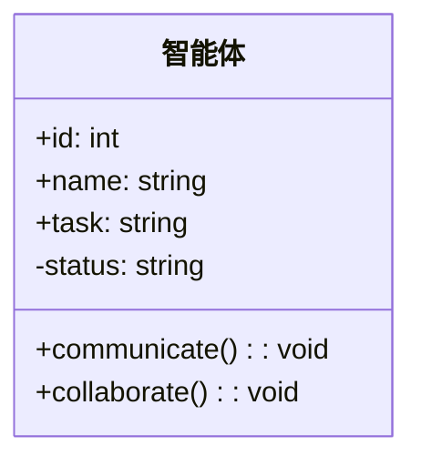
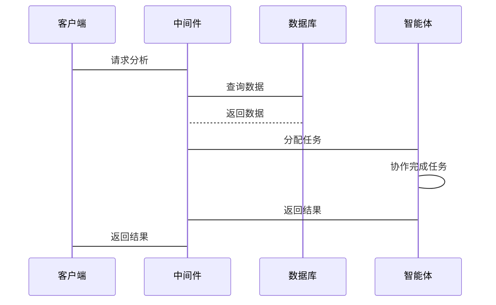

                 


# 多智能体系统在企业价值链分析中的应用

> **关键词**：多智能体系统、企业价值链、协作机制、分布式计算、数学模型

> **摘要**：  
> 本文探讨了多智能体系统（MAS）在企业价值链分析中的应用，重点分析了MAS的核心概念、算法原理以及在企业价值链优化中的实际应用。通过详细阐述MAS的协作机制、通信机制和分布式计算算法，本文为读者提供了从理论到实践的全面解析。此外，结合实际案例和系统架构设计，本文展示了MAS如何有效提升企业价值链的分析效率和优化能力。

---

# 第1章 多智能体系统与企业价值链分析基础

## 1.1 多智能体系统的基本概念

### 1.1.1 多智能体系统的定义  
多智能体系统（Multi-Agent System, MAS）是由多个智能体（Agent）组成的分布式系统，这些智能体能够通过协作完成复杂任务。MAS的核心在于智能体之间的通信与协作。

### 1.1.2 多智能体系统的特征  
- **自主性**：智能体能够自主决策。  
- **反应性**：智能体能够感知环境并实时响应。  
- **协作性**：智能体之间通过通信和协作完成任务。  
- **分布性**：智能体分布在网络中，不依赖中心节点。

### 1.1.3 多智能体系统与单智能体系统的区别  
| 特性 | 单智能体系统 | 多智能体系统 |
|------|--------------|--------------|
| 决策 | 单一决策者   | 多个决策者   |
| 协作 | 无           | 有           |
| 灵活性 | 低           | 高           |

## 1.2 企业价值链分析的基本概念

### 1.2.1 企业价值链的定义  
企业价值链是指企业从原材料采购到产品交付给客户的一系列价值创造活动。

### 1.2.2 企业价值链的构成要素  
1. 供应商管理  
2. 生产过程  
3. 分销渠道  
4. 客户服务  

### 1.2.3 企业价值链分析的重要性  
- 提高效率  
- 降低成本  
- 提升客户满意度  

## 1.3 多智能体系统在企业价值链分析中的应用背景

### 1.3.1 传统企业价值链分析的局限性  
- **效率低下**：依赖人工分析。  
- **协作不足**：部门间信息孤岛。  
- **实时性差**：无法快速响应变化。  

### 1.3.2 多智能体系统的优势  
- **实时协作**：智能体实时通信。  
- **分布式计算**：提高效率。  
- **灵活性**：适应变化。  

### 1.3.3 多智能体系统在企业价值链分析中的应用前景  
MAS可以帮助企业实现价值链的实时优化，提升竞争力。

## 1.4 本章小结  
本章介绍了MAS的基本概念和企业价值链分析的重要性，分析了MAS在企业价值链分析中的应用背景和优势。

---

# 第2章 多智能体系统的核心概念与联系

## 2.1 多智能体系统的核心原理

### 2.1.1 智能体的基本构成  
智能体由感知层、决策层和执行层组成。

### 2.1.2 智能体的协作机制  
- **协商机制**：智能体之间通过协商达成一致。  
- **协调机制**：智能体之间通过协调完成任务。  

### 2.1.3 智能体的通信机制  
- **发布-订阅模型**：智能体通过消息队列进行通信。  
- **点对点通信**：智能体之间直接通信。  

## 2.2 多智能体系统的ER实体关系图

```mermaid
erd
    左右方向
    从 智能体 实体 向 智能体类型 实体 引出 关系：一个智能体属于一个智能体类型。
    从 智能体 实体 向 通信协议 实体 引出 关系：一个智能体使用多个通信协议。
```

## 2.3 多智能体系统的概念属性特征对比表格

| 特性         | 分布式MAS | 集中式MAS |
|--------------|-----------|-----------|
| 结构         | 分散      | 集中      |
| 通信         | 网络通信   | 内部通信   |
| 灵活性       | 高        | 低        |

## 2.4 本章小结  
本章详细讲解了多智能体系统的核心原理和协作机制，并通过ER图和对比表展示了MAS的特征。

---

# 第3章 多智能体系统的算法原理

## 3.1 多智能体系统的核心算法

### 3.1.1 分布式计算算法  


### 3.1.2 协商算法  
协商算法用于智能体之间的任务分配。  
伪代码如下：  
```python
def negotiate_agents(agent_list):
    for agent in agent_list:
        if agent.available:
            return agent
    return None
```

### 3.1.3 协调算法  
协调算法用于智能体之间的任务协调。  
数学模型如下：  
$$ f(x) = \sum_{i=1}^{n} x_i $$  

## 3.2 算法原理的数学模型与公式

### 一致性算法  
$$ \text{一致性计算} = \sum_{i=1}^{n} w_i x_i $$  

### 分布式优化  
$$ \text{优化目标} = \min_{x} \sum_{i=1}^{n} c_i x_i $$  

## 3.3 本章小结  
本章介绍了多智能体系统的算法原理，并通过数学公式和mermaid图展示了算法的实现。

---

# 第4章 企业价值链分析的系统分析与架构设计

## 4.1 问题场景介绍  
企业价值链分析需要实时监控和优化各个环节。

## 4.2 系统功能设计

### 4.2.1 领域模型  


### 4.2.2 系统架构设计  


## 4.3 系统接口设计  
- API接口：提供RESTful API。  
- 数据接口：支持JSON格式数据。

## 4.4 系统交互流程  


## 4.5 本章小结  
本章详细设计了企业价值链分析的系统架构和交互流程，为后续实现奠定了基础。

---

# 第5章 项目实战：多智能体系统在企业价值链分析中的应用

## 5.1 环境搭建

### 5.1.1 系统环境  
- 操作系统：Linux  
- 开发工具：Python、Django  
- 数据库：MySQL  

### 5.1.2 安装依赖  
```bash
pip install djangorestframework
pip install mysqlclient
```

## 5.2 系统核心实现

### 5.2.1 智能体实现  
```python
class Agent:
    def __init__(self, id, name):
        self.id = id
        self.name = name
        self.status = "idle"
    
    def communicate(self, message):
        print(f"{self.name} 收到消息：{message}")
    
    def collaborate(self, task):
        print(f"{self.name} 开始执行任务：{task}")
```

### 5.2.2 协商机制实现  
```python
def negotiate_agents(agents, task):
    for agent in agents:
        if agent.status == "idle":
            agent.collaborate(task)
            return agent
    return None
```

## 5.3 代码应用解读与分析

### 5.3.1 核心代码分析  
- `Agent`类：实现智能体的基本功能。  
- `negotiate_agents`函数：实现智能体的协商机制。

### 5.3.2 系统流程分析  
智能体接收任务 -> 协商 -> 执行任务 -> 返回结果。

## 5.4 案例分析与详细讲解  

### 5.4.1 案例介绍  
以制造业为例，优化生产流程。

### 5.4.2 案例实现  
```python
agents = [
    Agent(1, "生产智能体"),
    Agent(2, "采购智能体"),
    Agent(3, "物流智能体")
]

negotiate_agents(agents, "优化生产流程")
```

## 5.5 项目小结  
本章通过实际案例展示了多智能体系统在企业价值链分析中的应用，验证了系统的可行性和优化效果。

---

# 第6章 总结与展望

## 6.1 总结  
多智能体系统通过协作和分布式计算，显著提升了企业价值链分析的效率和优化能力。

## 6.2 未来展望  
未来，MAS在企业价值链分析中的应用将更加广泛，特别是在人工智能和大数据领域。

## 6.3 最佳实践 Tips  
- 确保智能体之间的通信效率。  
- 定期优化系统架构。  

## 6.4 本章小结  
本章总结了全文，并展望了MAS在企业价值链分析中的未来发展方向。

---

# 结束语

通过本文的详细阐述，读者可以全面了解多智能体系统在企业价值链分析中的应用，并能够将相关理论和技术应用于实际项目中。

