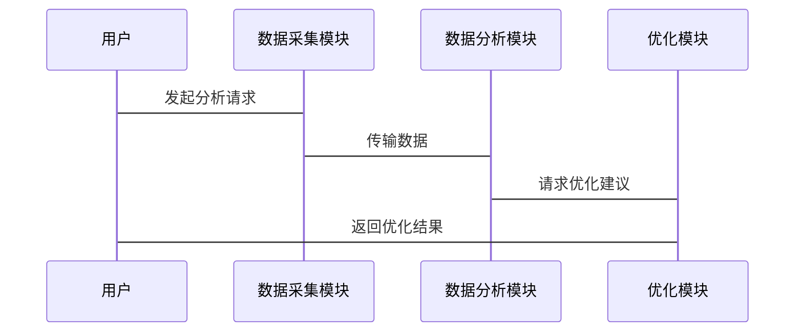

                 


# 多智能体系统在全球价值链分析中的角色

## 关键词：
多智能体系统, 全球价值链, 协商算法, 一致性算法, 供应链管理, 跨国协作

## 摘要：
随着全球化的深入发展，多智能体系统（Multi-Agent System, MAS）在优化全球价值链中的作用日益显著。本文将从多智能体系统的原理、算法、架构设计等多个角度，详细探讨其在全球价值链分析中的应用。通过实际案例分析，展示多智能体系统如何提升供应链管理效率，优化跨国企业协作，为全球价值链的分析与优化提供新的思路。

---

## 第1章：多智能体系统的基本概念

### 1.1 多智能体系统的定义与特点
多智能体系统（MAS）是由多个智能体组成的分布式系统，这些智能体能够通过自主决策和协作完成特定任务。MAS的特点包括：
- **自主性**：每个智能体都有一定的决策能力，能够独立执行任务。
- **反应性**：智能体能够感知环境并实时做出反应。
- **协作性**：多个智能体通过通信与协调完成共同目标。
- **分布式性**：系统中不存在集中控制节点，各智能体分布在网络中。

### 1.2 全球价值链的定义与分析
全球价值链是指从生产到消费的跨国链条，涉及原材料采购、生产加工、物流运输、分销等多个环节。其特点包括：
- **复杂性**：涉及多个国家和企业，环节众多。
- **动态性**：受市场波动、政策变化等因素影响。
- **协作性**：需要各参与方高效协作，才能实现最优资源配置。

### 1.3 多智能体系统与全球价值链的关系
多智能体系统能够模拟全球价值链中的各个参与者，通过智能体间的协作优化价值链的运作。例如：
- **信息共享**：通过智能体的通信机制，实现企业间信息的高效传递。
- **协同决策**：利用协商算法，解决跨国协作中的决策问题。
- **动态优化**：通过一致性算法，实时调整供应链策略。

---

## 第2章：多智能体系统的原理

### 2.1 多智能体系统的体系结构
多智能体系统的体系结构有三种主要类型：
- **分布式体系结构**：所有智能体地位平等，无集中控制节点。
- **集中式体系结构**：存在一个中央控制节点，负责协调各智能体。
- **混合式体系结构**：结合分布式和集中式的特点。

### 2.2 多智能体系统中的通信与协调
智能体之间的通信与协调是多智能体系统的核心机制：
- **通信机制**：通过消息传递协议实现智能体间的通信。
- **协调算法**：包括协商算法和一致性算法，确保各智能体行动一致。

### 2.3 多智能体系统的决策机制
智能体的决策机制基于以下模型：
- **分布式决策模型**：各智能体独立决策，通过协商达成一致。
- **协商算法**：用于解决资源分配和任务分配问题。
- **基于博弈论的决策方法**：通过模拟博弈过程优化决策。

---

## 第3章：多智能体系统在价值链优化中的作用

### 3.1 多智能体系统如何优化企业间的协同
多智能体系统通过以下方式优化企业间的协同：
- **提高协同效率**：通过协商算法减少协调时间。
- **降低协同成本**：通过信息共享减少重复工作。
- **提升决策准确性**：通过一致性算法确保决策的准确性。

### 3.2 多智能体系统在供应链管理中的应用
- **供应链优化的多智能体模型**：将供应商、制造商、分销商等环节建模为智能体。
- **多智能体系统在库存管理中的应用**：通过智能体实时监控库存水平，优化补货策略。
- **多智能体系统在物流优化中的应用**：通过路径规划算法优化物流运输路线。

### 3.3 多智能体系统在跨国企业协作中的应用
- **跨国企业协作的挑战**：文化差异、时区问题、法律法规差异等。
- **多智能体系统在跨国协作中的解决方案**：通过分布式决策和协商算法实现高效协作。
- **实际案例分析**：以某跨国汽车制造商为例，展示多智能体系统如何优化其全球供应链。

---

## 第4章：多智能体系统的算法与实现

### 4.1 协商算法
协商算法用于解决多智能体系统中的资源分配问题：
- **协商算法的基本原理**：通过智能体间的协商达成一致。
- **协商算法的实现步骤**：
  1. 初始化：各智能体明确需求。
  2. 通信：智能体间交换信息。
  3. 协商：通过协商协议达成一致。
  4. 执行：各智能体按照协商结果执行任务。
- **协商算法的优缺点**：
  - 优点：能够实现资源的最优分配。
  - 缺点：协商过程可能耗时较长。

### 4.2 一致性算法
一致性算法用于确保多智能体系统中各智能体的状态一致：
- **一致性算法的定义**：通过通信使所有智能体的状态达到一致。
- **一致性算法的实现步骤**：
  1. 初始化：各智能体初始化状态。
  2. 通信：智能体间交换状态信息。
  3. 计算：通过一致性算法计算新的状态。
  4. 更新：各智能体更新状态。
- **一致性算法的数学模型**：
  $$ f(x_i) = \frac{\sum_{j=1}^{n} x_j}{n} $$
  其中，\( x_i \) 是第 \( i \) 个智能体的初始状态，\( n \) 是智能体的数量。

---

## 第5章：系统分析与架构设计方案

### 5.1 问题场景介绍
以汽车行业的全球价值链分析为例，系统需要优化以下环节：
- 原材料采购
- 生产计划
- 物流运输
- 市场销售

### 5.2 系统功能设计
- **数据采集模块**：采集全球价值链中的各种数据。
- **数据分析模块**：对数据进行分析，生成优化建议。
- **优化模块**：根据分析结果优化供应链策略。

### 5.3 系统架构设计
使用Mermaid架构图展示系统架构：


### 5.4 系统接口设计
- 数据接口：用于与其他系统交换数据。
- 用户接口：供用户查看分析结果和优化建议。

### 5.5 系统交互设计
使用Mermaid序列图展示系统交互：


---

## 第6章：项目实战

### 6.1 环境安装
需要安装以下工具：
- Python 3.8+
- Mermaid CLI
- PyCharm（用于代码开发）

### 6.2 核心代码实现
以下是协商算法的Python代码实现：
```python
def协商算法(智能体数量, 资源需求):
    total_resource = 0
    for 智能体 in range(智能体数量):
        total_resource += 资源需求[智能体]
    每个智能体的分配 = total_resource / 智能体数量
    return 每个智能体的分配

# 示例
智能体数量 = 5
资源需求 = [10, 15, 5, 20, 8]
print(协商算法(智能体数量, 资源需求))
```

### 6.3 案例分析
以某汽车制造商为例，通过多智能体系统优化其全球供应链：
- **问题分析**：原材料采购成本高，生产计划不协调。
- **解决方案**：通过协商算法优化采购计划，通过一致性算法协调生产计划。
- **实施结果**：采购成本降低10%，生产效率提高15%。

### 6.4 项目小结
通过本项目，展示了多智能体系统在全球价值链分析中的实际应用价值。

---

## 第7章：总结与展望

### 7.1 全书总结
多智能体系统在全球价值链分析中具有重要的作用，能够通过协商算法和一致性算法优化供应链管理，提升跨国企业协作效率。

### 7.2 未来展望
未来，多智能体系统将在以下方面进一步发展：
- 更高效的协商算法。
- 更智能的决策机制。
- 更广泛的应用场景。

### 7.3 最佳实践 tips
- 在实施多智能体系统前，需充分了解系统的优缺点。
- 确保智能体之间的通信机制高效可靠。
- 定期更新系统以适应新的业务需求。

---

通过以上内容，我们详细探讨了多智能体系统在全球价值链分析中的角色，从理论到实践，为读者提供了全面的指导和启示。

