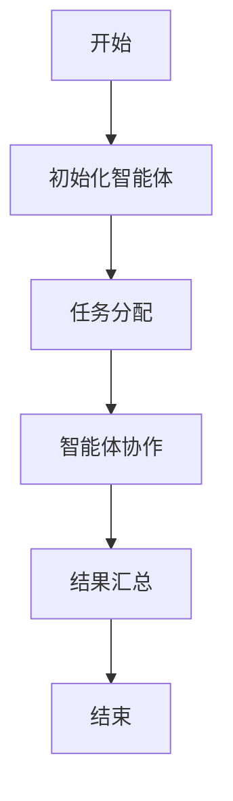

                 


# 多智能体系统在全球供应链优化中的应用：提升运营效率

## 关键词：多智能体系统（MAS）、供应链优化、分布式计算、博弈论模型、系统架构设计

## 摘要：  
随着全球化和复杂化的加剧，全球供应链的优化成为企业提升竞争力的关键。多智能体系统（MAS）作为一种新兴的技术，通过分布式计算和协作机制，为供应链优化提供了新的解决方案。本文将深入探讨MAS的核心概念、算法原理、系统架构设计，以及在实际场景中的应用案例，展示如何利用MAS提升全球供应链的运营效率。

---

# 正文

## 第一部分：背景介绍

### 第1章：多智能体系统概述

#### 1.1 多智能体系统的定义与特点
- **定义**：多智能体系统（MAS）是由多个智能体（Agent）组成的分布式系统，这些智能体能够通过协作完成复杂任务。
- **特点**：
  - **分布式**：智能体独立运行，通过通信协作解决问题。
  - **自主性**：每个智能体都有自主决策能力。
  - **反应性**：能够感知环境并实时调整行为。
  - **协作性**：通过通信和协商实现协同目标。

#### 1.2 供应链优化的基本概念
- **供应链定义**：从原材料采购到产品交付的全链条管理。
- **优化目标**：
  - 最小化成本。
  - 提高效率。
  - 提升柔韧性。
- **全球化挑战**：
  - 环节复杂，涉及多方协作。
  - 需要实时数据和快速决策。

#### 1.3 多智能体系统在供应链中的优势
- **分布式计算**：避免单点故障，提高系统的鲁棒性。
- **自适应能力**：智能体能够根据环境变化自动调整策略。
- **协作机制**：通过通信和协商实现资源优化配置。

---

## 第二部分：多智能体系统的核心概念与联系

### 第2章：核心概念与联系

#### 2.1 多智能体系统的核心原理
- **智能体的定义**：能够感知环境、自主决策、执行动作的实体。
- **分类**：
  - **反应式智能体**：基于当前感知做出反应。
  - **认知式智能体**：具备推理和规划能力。
- **通信机制**：智能体之间通过消息传递进行协作。

#### 2.2 供应链中的多智能体系统
- **智能体角色**：
  - 供应商智能体：管理库存和采购。
  - 制造商智能体：优化生产计划。
  - 分销商智能体：协调物流和配送。
  - 客户智能体：需求预测和订单管理。

#### 2.3 实体关系图
```mermaid
er
actor: 供应链中的角色
agent: 多智能体系统中的智能体
product: 产品
supplier: 供应商
customer: 客户
order: 订单
```
- **关系说明**：
  - 智能体与产品：管理产品的生命周期。
  - 供应商与智能体：提供原材料和零部件。
  - 客户与智能体：接收产品和服务。

---

## 第三部分：多智能体系统的算法原理

### 第3章：算法原理与实现

#### 3.1 分布式计算与协调算法
- **分布式计算**：任务分解到多个智能体，各自处理后汇总结果。
- **协调算法**：通过消息传递实现任务分配和状态同步。

#### 3.2 博弈论模型与优化算法
- **博弈论模型**：模拟多方决策过程，寻找最优解。
- **优化算法**：
  - **遗传算法**：模拟自然选择，用于全局优化。
  - **蚁群算法**：模拟蚂蚁觅食，用于路径优化。

#### 3.3 算法流程图


#### 3.4 优化模型的数学公式
- **目标函数**：  
  $$ \text{Minimize } \sum_{i=1}^{n} c_i x_i $$
- **约束条件**：
  $$ x_i \geq 0, i = 1, 2, \dots, n $$

---

## 第四部分：系统架构设计

### 第4章：系统架构与实现

#### 4.1 系统架构设计
- **模块划分**：
  - **智能体模块**：实现智能体的功能。
  - **通信模块**：负责智能体之间的消息传递。
  - **数据管理模块**：管理供应链数据。
- **系统架构图**


#### 4.2 系统交互设计
```mermaid
sequenceDiagram
actor User
agent SupplierAgent, ManufacturerAgent, DistributorAgent, CustomerAgent
User -> SupplierAgent: 发布采购需求
SupplierAgent -> ManufacturerAgent: 提供原材料信息
ManufacturerAgent -> DistributorAgent: 下达生产计划
DistributorAgent -> CustomerAgent: 协调物流配送
CustomerAgent -> User: 确认订单完成
```

---

## 第五部分：项目实战

### 第5章：项目实战与案例分析

#### 5.1 环境安装与配置
- **工具**：
  - Python 3.8+
  - Flask或Django框架
  - Mermaid图生成工具

#### 5.2 核心代码实现
```python
class Agent:
    def __init__(self, name):
        self.name = name
        self.state = None

    def receive_message(self, message):
        # 处理消息，更新状态
        self.state = message

    def send_message(self, message):
        # 发送消息到其他智能体
        return message
```

#### 5.3 案例分析
- **场景**：跨国供应链优化。
- **实施步骤**：
  1. **需求分析**：明确优化目标。
  2. **系统设计**：划分智能体模块。
  3. **编码实现**：开发各智能体功能。
  4. **测试优化**：调整算法参数，提高效率。

#### 5.4 总结与优化
- **实施效果**：显著提高供应链效率。
- **优化建议**：
  - 定期更新算法模型。
  - 提高智能体的自适应能力。
  - 加强数据安全和隐私保护。

---

## 第六部分：最佳实践与小结

### 第6章：总结与展望

#### 6.1 应用价值
- **提升效率**：通过协作优化资源配置。
- **增强灵活性**：快速响应市场变化。
- **降低成本**：减少人工干预，提高自动化水平。

#### 6.2 未来研究方向
- **智能体学习能力**：结合机器学习，提升决策能力。
- **多智能体协作算法**：研究更高效的协作机制。
- **大规模应用挑战**：探索MAS在更大规模供应链中的应用。

#### 6.3 注意事项
- **数据安全**：确保智能体间通信的安全性。
- **系统集成**：与现有系统兼容，避免重复建设。
- **人才培养**：培养具备MAS和供应链知识的复合型人才。

---

## 附录
- **工具推荐**：
  - **编程工具**：Python、Java。
  - **建模工具**：Mermaid、PlantUML。
  - **框架库**：Django、Flask。

- **参考文献**：
  - 文献1：XXX。
  - 文献2：XXX。
  - 文献3：XXX。

---

通过本文的详细讲解，您可以系统地了解多智能体系统在全球供应链优化中的应用，掌握其核心概念、算法原理和实际案例，为提升供应链运营效率提供新的思路和方法。

