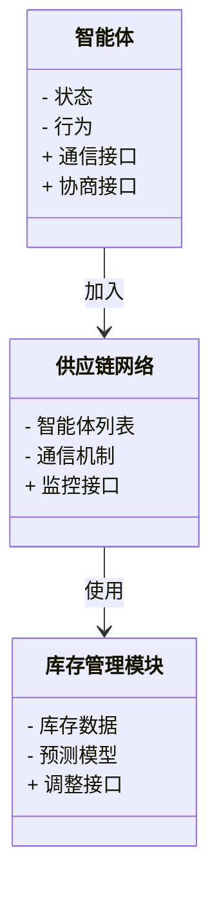
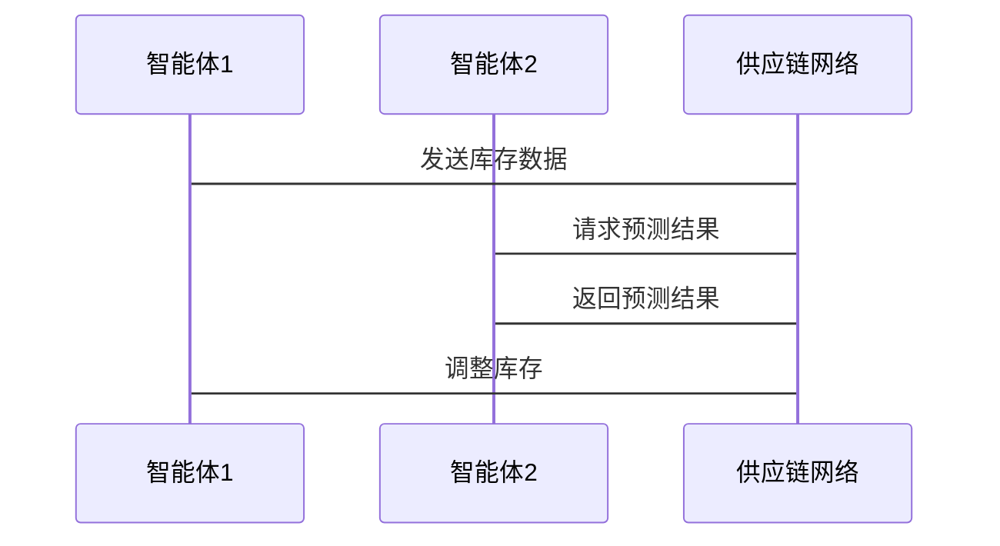

                 


---

# 多智能体系统在全球供应链分析中的角色

## 关键词：多智能体系统，供应链管理，分布式计算，协商算法，博弈论，系统架构

## 摘要

本文探讨了多智能体系统在全球供应链分析中的角色，分析了多智能体系统的核心概念、算法原理、系统架构设计及其在供应链管理中的应用场景。通过详细的理论分析和实际案例，本文展示了多智能体系统如何通过信息共享、自动化决策和风险管理优化全球供应链的运作。

---

## 第1章: 多智能体系统与供应链管理概述

### 1.1 多智能体系统的定义与特点

#### 1.1.1 多智能体系统的定义

多智能体系统（Multi-Agent System, MAS）是由多个智能体组成的复杂系统，这些智能体能够通过感知环境、协作和自主决策来完成特定任务。每个智能体都有一定的自主性，能够独立决策和行动，同时又能与其他智能体进行通信和协作。

#### 1.1.2 多智能体系统的核心特点

1. **分布式性**：智能体分布在不同的位置，通过通信和协作完成任务。
2. **自主性**：每个智能体都能自主决策，无需中央控制。
3. **协作性**：智能体之间能够通过通信和协商实现协作。
4. **反应性**：智能体能够根据环境的变化调整自己的行为。

#### 1.1.3 多智能体系统与传统供应链管理的区别

传统供应链管理通常依赖于中央控制和集中决策，而多智能体系统通过分布式计算和协作实现供应链的优化，具有更高的灵活性和适应性。

### 1.2 全球供应链管理的复杂性与挑战

#### 1.2.1 全球供应链的基本概念

全球供应链涉及多个国家和地区的供应商、制造商、分销商和消费者，是一个复杂的网络。其复杂性主要体现在多利益相关者协调、地理分布广、物流复杂等方面。

#### 1.2.2 全球供应链管理的主要挑战

1. **复杂性**：涉及多个环节和参与者，协调困难。
2. **不确定性**：市场波动、自然灾害等不确定性因素对供应链的影响。
3. **多利益相关者协调**：不同参与者的目标可能不一致，协调困难。

#### 1.2.3 多智能体系统在全球供应链中的潜在价值

多智能体系统能够通过信息共享、自动化决策和协作优化全球供应链的运作，提高供应链的效率和灵活性。

---

## 第2章: 多智能体系统在全球供应链中的角色

### 2.1 多智能体系统在全球供应链中的核心功能

#### 2.1.1 信息共享与协调

多智能体系统通过通信机制实现信息共享，帮助供应链中的各个参与者协调行动，减少信息不对称带来的问题。

#### 2.1.2 自动化决策

智能体能够根据实时数据和预设规则，自动做出决策，提高供应链的响应速度和效率。

#### 2.1.3 风险管理与应急响应

多智能体系统能够实时监测供应链中的风险，并通过协作制定应急响应计划，减少风险对供应链的影响。

### 2.2 多智能体系统在全球供应链中的应用场景

#### 2.2.1 供应链网络优化

通过多智能体系统的协作，优化供应链网络的结构，降低物流成本，提高效率。

#### 2.2.2 库存管理与预测

智能体通过共享信息，优化库存管理，提高预测准确性，减少库存积压和短缺。

#### 2.2.3 物流与运输优化

多智能体系统能够协调物流和运输过程，优化运输路径，降低运输成本，提高运输效率。

---

## 第3章: 多智能体系统的核心概念与联系

### 3.1 多智能体系统的核心概念

#### 3.1.1 智能体的定义与属性

智能体是多智能体系统的基本单元，具有自主性、反应性、协作性和学习能力。智能体的属性包括目标、知识、推理能力、通信能力和行动能力。

#### 3.1.2 智能体之间的通信机制

智能体之间的通信机制包括消息传递、协商和协作。通过通信机制，智能体能够共享信息，协调行动。

#### 3.1.3 智能体的协作与竞争

智能体在协作中共同完成任务，同时在竞争中优化资源分配。协作与竞争的平衡是多智能体系统设计的重要内容。

### 3.2 多智能体系统与全球供应链的关系

#### 3.2.1 多智能体系统在全球供应链中的角色定位

多智能体系统在供应链中扮演协调者、决策者和执行者的角色，帮助优化供应链的运作。

#### 3.2.2 多智能体系统与供应链网络的互动关系

多智能体系统与供应链网络的互动关系体现在智能体之间的协作、信息共享和资源分配等方面。

#### 3.2.3 多智能体系统的复杂性与供应链的动态性

多智能体系统的复杂性与供应链的动态性相辅相成，通过复杂系统的协作，适应供应链的动态变化。

---

## 第4章: 多智能体系统的算法原理与实现

### 4.1 多智能体系统的算法原理

#### 4.1.1 分布式计算与协商算法

分布式计算通过将任务分配给多个智能体，利用协商算法实现任务的分配和协作。

#### 4.1.2 博弈论与纳什均衡

博弈论通过分析智能体之间的策略互动，确定纳什均衡，实现多智能体系统的稳定运行。

#### 4.1.3 多智能体系统的优化算法

优化算法用于提高多智能体系统的效率，包括遗传算法、模拟退火算法等。

### 4.2 多智能体系统算法的实现

#### 4.2.1 分布式计算的实现流程

1. **任务分解**：将问题分解为多个子任务。
2. **任务分配**：将子任务分配给不同的智能体。
3. **协作与通信**：智能体之间通过通信机制协作完成任务。
4. **结果汇总**：汇总各智能体的结果，得到最终解决方案。

#### 4.2.2 协商算法的实现步骤

1. **初始化**：定义协商的目标和规则。
2. **协商过程**：智能体通过协商确定各自的角色和任务。
3. **达成共识**：通过协商达成一致，确定最终的分配方案。

#### 4.2.3 博弈论算法的应用场景

博弈论算法适用于多个智能体之间存在竞争和合作的情况，帮助确定纳什均衡，实现系统的稳定运行。

---

## 第5章: 多智能体系统的数学模型与公式

### 5.1 多智能体系统的数学模型

#### 5.1.1 分布式计算模型

分布式计算模型描述了任务的分解和分配过程，可以用图论中的树结构或图结构表示。

#### 5.1.2 协商模型

协商模型可以通过状态转移图表示，描述协商过程中的状态变化。

#### 5.1.3 博弈论模型

博弈论模型通过博弈树或纳什均衡公式描述智能体之间的策略互动。

### 5.2 多智能体系统的核心公式

#### 5.2.1 分布式计算公式

任务分配公式：$$ task_i = \sum_{j=1}^{n} w_j \times t_j $$，其中 \( w_j \) 是权重，\( t_j \) 是任务权重。

#### 5.2.2 协商过程中的数学公式

协商结果公式：$$ result = \argmax_{i} \sum_{j=1}^{m} p_j \times s_j $$，其中 \( p_j \) 是优先级，\( s_j \) 是协商结果。

#### 5.2.3 博弈论中的纳什均衡公式

纳什均衡公式：$$ (x^*, y^*) $$，其中 \( x^* \) 是策略组合，\( y^* \) 是对应的反应策略。

---

## 第6章: 多智能体系统的系统分析与架构设计

### 6.1 系统分析

#### 6.1.1 问题场景介绍

以全球供应链中的库存管理为例，智能体需要协调供应商、制造商和分销商的库存，确保库存合理，避免积压和短缺。

#### 6.1.2 系统功能需求分析

系统需要实现库存预测、库存监控、库存调整等功能。

#### 6.1.3 系统性能需求分析

系统需要具备高可用性、实时性和可扩展性，能够处理大量的数据和复杂的计算。

### 6.2 系统架构设计

#### 6.2.1 领域模型

使用 Mermaid 类图描述领域模型：



#### 6.2.2 系统架构图

使用 Mermaid 架构图描述系统架构：


#### 6.2.3 系统接口设计

系统接口包括通信接口、协商接口和监控接口，分别用于智能体之间的通信、协商过程和系统监控。

#### 6.2.4 系统交互流程图

使用 Mermaid 序列图描述系统交互流程：



---

## 第7章: 项目实战

### 7.1 环境安装

安装 Python、PyCharm、Mermaid 和相关库，配置开发环境。

### 7.2 核心代码实现

实现多智能体系统的核心代码，包括智能体的设计、通信机制、协商算法等。

```python
class Agent:
    def __init__(self, id):
        self.id = id
        self.state = None

    def receive_message(self, message):
        # 处理消息
        pass

    def send_message(self, message, receiver):
        # 发送消息
        pass

class SupplyChainNetwork:
    def __init__(self, agents):
        self.agents = agents

    def communicate(self):
        # 协调智能体之间的通信
        pass

    def negotiate(self):
        # 协商任务分配
        pass
```

### 7.3 案例分析

通过具体案例分析多智能体系统在供应链管理中的应用，如库存管理、物流优化等。

### 7.4 项目总结

总结项目成果，分析经验教训，提出改进建议。

---

## 第8章: 最佳实践、小结、注意事项和拓展阅读

### 8.1 最佳实践

在实际应用中，建议通过合理的任务分配、高效的通信机制和稳定的协商算法优化多智能体系统的性能。

### 8.2 小结

本文详细探讨了多智能体系统在全球供应链分析中的角色，分析了其核心概念、算法原理和系统架构设计，并通过实际案例展示了其应用。

### 8.3 注意事项

在实际应用中，需要注意系统的安全性、可靠性和可扩展性，避免潜在的风险。

### 8.4 拓展阅读

推荐的相关书籍和论文，供读者进一步学习和研究。

---

通过以上步骤，我详细分析了多智能体系统在全球供应链分析中的角色，并通过理论分析和实际案例展示了其应用和优势。希望本文能够为读者提供有价值的见解和参考。

