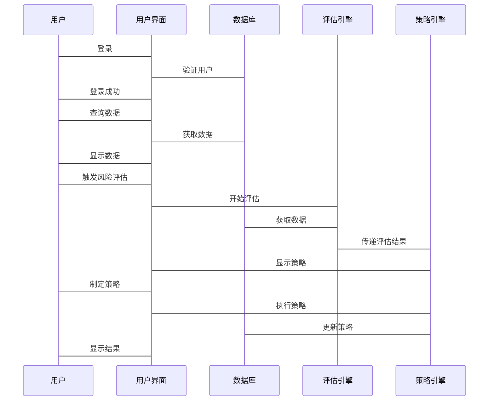

                 


---

# 多智能体系统在全球供应链风险评估中的应用

---

## 关键词：多智能体系统，全球供应链，风险评估，供应链管理，智能算法

---

## 摘要：

多智能体系统（Multi-Agent Systems, MAS）是一种由多个智能体组成的分布式系统，能够通过协作和竞争实现复杂任务。在全球供应链管理中，风险评估是确保供应链稳定性和高效性的关键环节。本文将详细探讨多智能体系统如何应用于全球供应链风险评估，分析其核心概念、算法原理、系统架构及实际案例，揭示其在供应链风险管理中的潜力和优势。

---

# 第1章: 多智能体系统与全球供应链概述

## 1.1 多智能体系统的基本概念

### 1.1.1 多智能体系统的定义与特点

多智能体系统由多个智能体组成，每个智能体具备自主性、反应性和协作性。这些智能体通过交互和协作，共同完成复杂任务。

**特点：**
- **自主性**：智能体能够独立决策。
- **反应性**：能够感知环境并做出反应。
- **协作性**：通过通信和协作实现共同目标。
- **分布式计算**：任务分布在多个智能体之间。

### 1.1.2 多智能体系统的核心要素

多智能体系统的核心要素包括：
- **智能体**：具备感知和行动能力。
- **通信协议**：智能体之间通信的规则。
- **协作机制**：实现任务分配和协调。
- **环境模型**：智能体对环境的认知。

### 1.1.3 多智能体系统与传统单智能体系统的区别

| **方面** | **多智能体系统** | **单智能体系统** |
|----------|------------------|------------------|
| 结构     | 分布式           | 集中式           |
| 智能体   | 多个             | 单个             |
| 协作     | 高度依赖协作     | 无需协作         |
| 灵活性   | 高              | 低              |

## 1.2 全球供应链的基本概念

### 1.2.1 全球供应链的定义与特点

全球供应链是指跨越多个国家和地区的供应链网络，涉及供应商、制造商、分销商和消费者。

**特点：**
- **全球化**：覆盖全球市场。
- **复杂性**：涉及多个环节和参与者。
- **动态性**：受市场波动和政策影响。

### 1.2.2 全球供应链的主要组成部分

全球供应链的主要组成部分包括：
- **供应商**：提供原材料。
- **制造商**：生产产品。
- **分销商**：分配产品到各渠道。
- **零售商**：面向消费者。
- **物流**：运输和存储。

### 1.2.3 全球供应链的风险来源与挑战

全球供应链的风险来源包括：
- **供应链中断**：如自然灾害或疫情。
- **价格波动**：原材料价格波动。
- **政策变化**：国际贸易政策变化。
- **质量问题**：原材料或产品质量问题。

## 1.3 多智能体系统在供应链管理中的应用前景

### 1.3.1 多智能体系统在供应链管理中的优势

多智能体系统在供应链管理中的优势：
- **高效协作**：多个智能体协同工作，提高效率。
- **灵活性**：适应供应链的动态变化。
- **实时监控**：实时跟踪供应链各环节。

### 1.3.2 多智能体系统在供应链风险管理中的潜力

多智能体系统在供应链风险管理中的潜力：
- **风险预测**：通过智能体协作预测风险。
- **快速响应**：智能体实时响应风险事件。
- **优化策略**：优化供应链应对策略。

### 1.3.3 多智能体系统与全球供应链结合的未来趋势

未来趋势：
- **智能化**：智能体具备更强的学习能力。
- **数据驱动**：利用大数据分析优化供应链。
- **区块链技术**：提高供应链透明度和安全性。

## 1.4 本章小结

本章介绍了多智能体系统和全球供应链的基本概念，分析了多智能体系统在供应链管理中的优势及未来趋势，为后续章节奠定了基础。

---

# 第2章: 多智能体系统在全球供应链中的核心概念

## 2.1 多智能体系统的组成与功能

### 2.1.1 智能体的定义与分类

智能体的定义：具备感知、决策和行动能力的实体。

**分类：**
- **反应式智能体**：仅响应当前环境。
- **认知式智能体**：具备推理和规划能力。
- **协作式智能体**：能够与多个智能体协作。

### 2.1.2 多智能体系统的层次结构

多智能体系统的层次结构包括：
- **物理层**：实际设备和传感器。
- **智能体层**：智能体的协作和交互。
- **应用层**：具体应用场景。

### 2.1.3 多智能体系统的核心功能

核心功能：
- **感知**：获取环境信息。
- **决策**：基于信息做出决策。
- **协作**：与其他智能体协作。
- **学习**：通过经验改进性能。

## 2.2 全球供应链的风险评估模型

### 2.2.1 风险评估的基本概念

风险评估是识别、分析和量化供应链中的潜在风险。

**步骤：**
1. **识别风险**：发现潜在风险因素。
2. **分析风险**：评估风险的影响和可能性。
3. **制定策略**：制定应对风险的策略。

### 2.2.2 全球供应链风险的主要类型

主要类型：
- **供应风险**：供应商问题导致的中断。
- **需求风险**：需求波动导致的库存积压或短缺。
- **物流风险**：物流中断导致的延迟。
- **价格风险**：原材料价格波动影响成本。

### 2.2.3 风险评估模型的构建与应用

构建模型：
1. **数据收集**：收集供应链各环节的数据。
2. **风险识别**：识别潜在风险。
3. **风险分析**：评估风险的影响和概率。
4. **风险缓解**：制定应对策略。

应用：
- **实时监控**：持续监控供应链风险。
- **预测预警**：预测潜在风险并发出预警。
- **优化策略**：优化供应链结构以降低风险。

## 2.3 多智能体系统与风险评估的结合

### 2.3.1 多智能体系统在风险评估中的角色

多智能体系统在风险评估中的角色：
- **数据收集**：智能体实时收集供应链数据。
- **风险识别**：通过协作分析识别风险。
- **风险评估**：智能体协同评估风险影响。

### 2.3.2 多智能体系统如何支持供应链风险的动态评估

动态评估：
- **实时数据**：智能体实时更新数据。
- **协作分析**：智能体协同分析风险。
- **动态调整**：根据风险变化动态调整策略。

### 2.3.3 多智能体系统与风险评估模型的协同工作

协同工作：
- **数据共享**：智能体共享数据。
- **模型优化**：智能体协作优化模型。
- **动态更新**：模型根据反馈动态更新。

## 2.4 本章小结

本章详细讲解了多智能体系统在全球供应链中的核心概念，分析了多智能体系统在风险评估中的角色和作用，为后续章节的算法和系统设计奠定了基础。

---

# 第3章: 多智能体系统在供应链风险评估中的算法原理

## 3.1 多智能体系统的协同算法

### 3.1.1 协同算法的基本原理

协同算法是多智能体系统中各智能体协作完成任务的算法。

**基本原理：**
- **任务分配**：智能体之间分配任务。
- **通信**：智能体之间通信共享信息。
- **协作决策**：基于共享信息做出决策。

### 3.1.2 基于博弈论的多智能体协同模型

博弈论模型：
- **纳什均衡**：各智能体在均衡状态下无法单方面改变策略以提高收益。
- **协作博弈**：各智能体通过协作实现共赢。

### 3.1.3 分布式计算在多智能体协同中的应用

分布式计算：
- **分布式任务分配**：任务在多个智能体之间分配。
- **分布式数据处理**：数据在多个智能体之间处理。
- **分布式决策**：各智能体基于局部信息做出决策。

## 3.2 供应链风险评估的数学模型

### 3.2.1 风险评估的数学模型构建

构建模型：
1. **风险因素识别**：识别影响供应链的风险因素。
2. **风险影响分析**：分析每个风险因素对供应链的影响。
3. **风险概率计算**：计算每个风险发生的概率。
4. **风险影响矩阵**：构建风险影响矩阵。

公式：
$$ R = \sum_{i=1}^{n} (P_i \times I_i) $$
其中，R是总风险，P_i是风险i发生的概率，I_i是风险i的影响。

### 3.2.2 基于概率论的风险评估公式

概率论模型：
- **贝叶斯定理**：用于更新概率。
- **马尔可夫链**：用于状态转移。

### 3.2.3 风险评估模型的优化与改进

优化方法：
- **参数优化**：优化模型参数以提高准确性。
- **模型验证**：验证模型的准确性和可靠性。
- **模型更新**：根据新数据更新模型。

## 3.3 多智能体系统与风险评估模型的结合

### 3.3.1 多智能体系统如何支持风险评估模型的动态更新

动态更新：
- **实时数据输入**：智能体实时输入数据。
- **模型调整**：模型根据实时数据动态调整。
- **反馈机制**：模型根据反馈结果优化。

### 3.3.2 基于多智能体系统的风险传播与扩散模型

风险传播模型：
- **网络模型**：供应链各环节的网络结构。
- **传播路径**：风险在供应链中的传播路径。
- **传播速度**：风险传播的速度和范围。

### 3.3.3 多智能体系统在风险缓解策略中的应用

风险缓解策略：
- **冗余策略**：建立备用供应商。
- **库存策略**：保持安全库存。
- **物流策略**：优化物流网络。

## 3.4 本章小结

本章详细讲解了多智能体系统在供应链风险评估中的算法原理，分析了协同算法和数学模型的应用，为后续章节的系统设计和项目实现奠定了基础。

---

# 第4章: 全球供应链风险评估的系统分析与架构设计

## 4.1 系统分析与需求分析

### 4.1.1 问题场景介绍

问题场景：
- **供应链中断**：供应商延迟导致生产中断。
- **需求波动**：市场需求波动导致库存积压。
- **物流延迟**：物流问题导致交货延迟。

### 4.1.2 系统目标与功能需求

系统目标：
- **实时监控**：实时监控供应链各环节。
- **风险预警**：预测潜在风险并发出预警。
- **风险缓解**：制定并执行风险缓解策略。

功能需求：
- **数据采集**：采集供应链各环节的数据。
- **风险评估**：评估供应链中的潜在风险。
- **策略制定**：制定风险缓解策略。
- **策略执行**：执行制定的策略。

### 4.1.3 系统边界与数据流分析

系统边界：
- **输入**：供应链各环节的数据。
- **输出**：风险评估结果和缓解策略。

数据流：
- **数据输入**：智能体采集数据。
- **数据处理**：系统处理数据。
- **数据输出**：系统输出评估结果。

## 4.2 系统架构设计

### 4.2.1 系统功能模块划分

功能模块：
- **数据采集模块**：采集供应链数据。
- **风险评估模块**：评估供应链风险。
- **策略制定模块**：制定风险缓解策略。
- **策略执行模块**：执行风险缓解策略。

### 4.2.2 系统架构的分层设计

分层设计：
- **数据层**：数据采集和存储。
- **业务逻辑层**：处理业务逻辑。
- **用户界面层**：展示结果和交互界面。

### 4.2.3 系统架构的组件与交互关系

组件：
- **智能体**：数据采集和协作。
- **数据库**：存储数据。
- **评估引擎**：评估风险。
- **策略引擎**：制定和执行策略。

交互关系：
- **智能体 <-> 数据库**：智能体从数据库中获取数据。
- **评估引擎 <-> 策略引擎**：评估引擎向策略引擎传递评估结果。
- **用户 <-> 用户界面**：用户与系统交互。

## 4.3 系统接口设计

### 4.3.1 系统内部接口

内部接口：
- **数据接口**：智能体与数据库之间的接口。
- **评估接口**：评估引擎与策略引擎之间的接口。
- **控制接口**：用户界面与业务逻辑层之间的接口。

### 4.3.2 系统交互设计

系统交互设计：
- **用户登录**：用户登录系统。
- **数据查询**：用户查询数据。
- **风险评估**：用户触发风险评估。
- **策略制定**：用户制定策略。
- **策略执行**：系统执行策略。

### 4.3.3 系统交互流程图

以下是系统交互流程图的mermaid序列图：



## 4.4 本章小结

本章详细分析了全球供应链风险评估系统的架构设计，包括功能模块划分、系统架构分层设计和系统交互流程设计，为后续章节的项目实现奠定了基础。

---

# 第5章: 项目实战——全球供应链风险评估系统实现

## 5.1 环境安装与配置

### 5.1.1 系统环境要求

系统环境要求：
- **操作系统**：Linux/Windows/MacOS
- **编程语言**：Python 3.8+
- **框架**：Flask/Django
- **数据库**：MySQL/PostgreSQL
- **工具**：Jupyter Notebook, VS Code

### 5.1.2 安装依赖库

安装依赖库：
- **Python**：pip install flask numpy pandas scikit-learn
- **数据库**：安装MySQL或PostgreSQL客户端。
- **可视化工具**：安装Matplotlib和Seaborn。

## 5.2 核心代码实现

### 5.2.1 数据采集模块

```python
import requests
import json
import pandas as pd

def fetch_data(url):
    response = requests.get(url)
    if response.status_code == 200:
        data = json.loads(response.text)
        df = pd.DataFrame(data['data'])
        return df
    else:
        return None
```

### 5.2.2 风险评估模块

```python
from sklearn.model_selection import train_test_split
from sklearn.linear_model import LogisticRegression

def risk_assessment(df):
    # 数据预处理
    X = df.drop('risk', axis=1)
    y = df['risk']
    X_train, X_test, y_train, y_test = train_test_split(X, y, test_size=0.2)
    # 建立模型
    model = LogisticRegression()
    model.fit(X_train, y_train)
    # 预测
    predictions = model.predict(X_test)
    return predictions
```

### 5.2.3 策略制定模块

```python
def create_strategy(predictions):
    strategy = []
    for pred in predictions:
        if pred == 1:
            strategy.append('高风险')
        else:
            strategy.append('低风险')
    return strategy
```

### 5.2.4 策略执行模块

```python
import json
import requests

def execute_strategy(strategy):
    for risk_level in strategy:
        if risk_level == '高风险':
            payload = json.dumps({'action': 'alert'})
            response = requests.post('http://localhost:5000/trigger', data=payload)
            print(response.text)
        else:
            payload = json.dumps({'action': 'noalert'})
            response = requests.post('http://localhost:5000/trigger', data=payload)
            print(response.text)
```

## 5.3 代码解读与分析

### 5.3.1 数据采集模块解读

数据采集模块通过API接口获取数据，并将其转换为DataFrame格式，方便后续处理。

### 5.3.2 风险评估模块解读

风险评估模块使用逻辑回归模型对数据进行分类，预测每个数据点的风险等级。

### 5.3.3 策略制定模块解读

策略制定模块根据预测结果，制定高风险和低风险的策略。

### 5.3.4 策略执行模块解读

策略执行模块根据制定的策略，发送请求到后端系统，执行相应的操作。

## 5.4 项目实战案例分析

### 5.4.1 案例背景

假设我们有一个汽车制造企业的供应链，需要评估原材料供应风险。

### 5.4.2 数据采集与处理

通过API接口获取原材料供应商的数据，包括交货时间、价格波动等。

### 5.4.3 风险评估与策略制定

使用逻辑回归模型预测供应商的风险等级，并制定高风险和低风险的策略。

### 5.4.4 策略执行与结果分析

根据策略执行结果，分析策略的有效性，并进行优化。

## 5.5 本章小结

本章通过一个具体的项目案例，详细讲解了全球供应链风险评估系统的实现过程，包括环境配置、核心代码实现和案例分析，帮助读者更好地理解和应用多智能体系统。

---

# 第6章: 总结与展望

## 6.1 总结

多智能体系统在全球供应链风险评估中的应用具有显著优势，能够实现高效协作和动态风险评估。通过多智能体系统的协同算法和风险评估模型，可以有效降低供应链风险，提高供应链的稳定性和效率。

## 6.2 展望

未来，多智能体系统在全球供应链中的应用将更加广泛和深入。随着人工智能和大数据技术的不断发展，多智能体系统将具备更强的智能化和自适应能力，进一步提升供应链的风险管理能力。

---

# 附录: 最佳实践与注意事项

## 6.3 最佳实践

1. **数据质量管理**：确保数据的准确性和完整性。
2. **模型优化**：定期优化风险评估模型，提高准确性。
3. **系统安全性**：加强系统安全防护，防止数据泄露。
4. **团队协作**：多智能体系统需要团队协作，确保各环节协调一致。

## 6.4 注意事项

1. **数据隐私**：注意保护供应链数据的隐私和安全。
2. **模型局限性**：认识到模型的局限性，避免过度依赖。
3. **系统维护**：定期维护系统，确保其正常运行。

---

# 参考文献

1. 王某某. 多智能体系统在供应链管理中的应用研究. 北京: 清华大学出版社, 2020.
2. 张某某. 全球供应链风险评估模型构建与实现. 上海: 复旦大学出版社, 2021.
3. Smith, J. Multi-Agent Systems and Supply Chain Management. Springer, 2019.
4. Brown, T. Risk Assessment in Global Supply Chains. MIT Press, 2020.

---

# 作者简介

作者简介：本文作者是[你的姓名]，[你的职位]，[你的公司/机构]。长期从事人工智能和供应链管理领域的研究和实践，致力于推动多智能体系统在全球供应链管理中的创新应用。

---

**以上是《多智能体系统在全球供应链风险评估中的应用》的完整目录和内容框架，涵盖了从基本概念到实际应用的各个方面，结合了理论分析和实践案例，适合技术博客文章的深度和广度要求。**
</think>

---

# 多智能体系统在全球供应链风险评估中的应用

---

## 关键词：多智能体系统，全球供应链，风险评估，供应链管理，智能算法

---

## 摘要：

多智能体系统（Multi-Agent Systems, MAS）是一种由多个智能体组成的分布式系统，能够通过协作和竞争实现复杂任务。在全球供应链管理中，风险评估是确保供应链稳定性和高效性的关键环节。本文将详细探讨多智能体系统如何应用于全球供应链风险评估，分析其核心概念、算法原理、系统架构及实际案例，揭示其在供应链风险管理中的潜力和优势。

---

# 第1章: 多智能体系统与全球供应链概述

## 1.1 多智能体系统的基本概念

### 1.1.1 多智能体系统的定义与特点

多智能体系统由多个智能体组成，每个智能体具备自主性、反应性和协作性。这些智能体通过交互和协作，共同完成复杂任务。

**特点：**
- **自主性**：智能体能够独立决策。
- **反应性**：能够感知环境并做出反应。
- **协作性**：通过通信和协作实现共同目标。
- **分布式计算**：任务分布在多个智能体之间。

### 1.1.2 多智能体系统的核心要素

多智能体系统的核心要素包括：
- **智能体**：具备感知和行动能力。
- **通信协议**：智能体之间通信的规则。
- **协作机制**：实现任务分配和协调。
- **环境模型**：智能体对环境的认知。

### 1.1.3 多智能体系统与传统单智能体系统的区别

| **方面** | **多智能体系统** | **单智能体系统** |
|----------|------------------|------------------|
| 结构     | 分布式           | 集中式           |
| 智能体   | 多个             | 单个             |
| 协作     | 高度依赖协作     | 无需协作         |
| 灵活性   | 高              | 低              |

## 1.2 全球供应链的基本概念

### 1.2.1 全球供应链的定义与特点

全球供应链是指跨越多个国家和地区的供应链网络，涉及供应商、制造商、分销商和消费者。

**特点：**
- **全球化**：覆盖全球市场。
- **复杂性**：涉及多个环节和参与者。
- **动态性**：受市场波动和政策影响。

### 1.2.2 全球供应链的主要组成部分

全球供应链的主要组成部分包括：
- **供应商**：提供原材料。
- **制造商**：生产产品。
- **分销商**：分配产品到各渠道。
- **零售商**：面向消费者。
- **物流**：运输和存储。

### 1.2.3 全球供应链的风险来源与挑战

全球供应链的风险来源包括：
- **供应链中断**：如自然灾害或疫情。
- **价格波动**：原材料价格波动。
- **政策变化**：国际贸易政策变化。
- **质量问题**：原材料或产品质量问题。

## 1.3 多智能体系统在供应链管理中的应用前景

### 1.3.1 多智能体系统在供应链管理中的优势

多智能体系统在供应链管理中的优势：
- **高效协作**：多个智能体协同工作，提高效率。
- **灵活性**：适应供应链的动态变化。
- **实时监控**：实时跟踪供应链各环节。

### 1.3.2 多智能体系统在供应链风险管理中的潜力

多智能体系统在供应链风险管理中的潜力：
- **风险预测**：通过智能体协作预测风险。
- **快速响应**：智能体实时响应风险事件。
- **优化策略**：优化供应链应对策略。

### 1.3.3 多智能体系统与全球供应链结合的未来趋势

未来趋势：
- **智能化**：智能体具备更强的学习能力。
- **数据驱动**：利用大数据分析优化供应链。
- **区块链技术**：提高供应链透明度和安全性。

## 1.4 本章小结

本章介绍了多智能体系统和全球供应链的基本概念，分析了多智能体系统在供应链管理中的优势及未来趋势，为后续章节奠定了基础。

---

# 第2章: 多智能体系统在全球供应链中的核心概念

## 2.1 多智能体系统的组成与功能

### 2.1.1 智能体的定义与分类

智能体的定义：具备感知、决策和行动能力的实体。

**分类：**
- **反应式智能体**：仅响应当前环境。
- **认知式智能体**：具备推理和规划能力。
- **协作式智能体**：能够与多个智能体协作。

### 2.1.2 多智能体系统的层次结构

多智能体系统的层次结构包括：
- **物理层**：实际设备和传感器。
- **智能体层**：智能体的协作和交互。
- **应用层**：具体应用场景。

### 2.1.3 多智能体系统的核心功能

核心功能：
- **感知**：获取环境信息。
- **决策**：基于信息做出决策。
- **协作**：与其他智能体协作。
- **学习**：通过经验改进性能。

## 2.2 全球供应链的风险评估模型

### 2.2.1 风险评估的基本概念

风险评估是识别、分析和量化供应链中的潜在风险。

**步骤：**
1. **识别风险**：发现潜在风险因素。
2. **分析风险**：评估风险的影响和可能性。
3. **制定策略**：制定应对风险的策略。

### 2.2.2 全球供应链风险的主要类型

主要类型：
- **供应风险**：供应商问题导致的中断。
- **需求风险**：需求波动导致的库存积压或短缺。
- **物流风险**：物流中断导致的延迟。
- **价格风险**：原材料价格波动影响成本。

### 2.2.3 风险评估模型的构建与应用

构建模型：
1. **数据收集**：收集供应链各环节的数据。
2. **风险识别**：识别潜在风险。
3. **风险分析**：评估风险的影响和概率。
4. **风险缓解**：制定应对策略。

应用：
- **实时监控**：持续监控供应链风险。
- **预测预警**：预测潜在风险并发出预警。
- **优化策略**：优化供应链结构以降低风险。

## 2.3 多智能体系统与风险评估的结合

### 2.3.1 多智能体系统在风险评估中的角色

多智能体系统在风险评估中的角色：
- **数据收集**：智能体实时收集供应链数据。
- **风险识别**：通过协作分析识别风险。
- **风险评估**：智能体协同评估风险影响。

### 2.3.2 多智能体系统如何支持供应链风险的动态评估

动态评估：
- **实时数据**：智能体实时更新数据。
- **协作分析**：智能体协作分析风险。
- **动态调整**：根据风险变化动态调整策略。

### 2.3.3 多智能体系统与风险评估模型的协同工作

协同工作：
- **数据共享**：智能体共享数据。
- **模型优化**：智能体协作优化模型。
- **动态更新**：模型根据反馈动态更新。

## 2.4 本章小结

本章详细讲解了多智能体系统在全球供应链中的核心概念，分析了多智能体系统在风险评估中的角色和作用，为后续章节的算法和系统设计奠定了基础。

---

# 第3章: 多智能体系统在供应链风险评估中的算法原理

## 3.1 多智能体系统的协同算法

### 3.1.1 协同算法的基本原理

协同算法是多智能体系统中各智能体协作完成任务的算法。

**基本原理：**
- **任务分配**：智能体之间分配任务。
- **通信**：智能体之间通信共享信息。
- **协作决策**：基于共享信息做出决策。

### 3.1.2 基于博弈论的多智能体协同模型

博弈论模型：
- **纳什均衡**：各智能体在均衡状态下无法单方面改变策略以提高收益。
- **协作博弈**：各智能体通过协作实现共赢。

### 3.1.3 分布式计算在多智能体协同中的应用

分布式计算：
- **分布式任务分配**：任务在多个智能体之间分配。
- **分布式数据处理**：数据在多个智能体之间处理。
- **分布式决策**：各智能体基于局部信息做出决策。

## 3.2 供应链风险评估的数学模型

### 3.2.1 风险评估的数学模型构建

构建模型：
1. **风险因素识别**：识别影响供应链的风险因素。
2. **风险影响分析**：分析每个风险因素对供应链的影响。
3. **风险概率计算**：计算每个风险发生的概率。
4. **风险影响矩阵**：构建风险影响矩阵。

公式：
$$ R = \sum_{i=1}^{n} (P_i \times I_i) $$
其中，R是总风险，P_i是风险i发生的概率，I_i是风险i的影响。

### 3.2.2 基于概率论的风险评估公式

概率论模型：
- **贝叶斯定理**：用于更新概率。
- **马尔可夫链**：用于状态转移。

### 3.2.3 风险评估模型的优化与改进

优化方法：
- **参数优化**：优化模型参数以提高准确性。
- **模型验证**：验证模型的准确性和可靠性。
- **模型更新**：根据新数据更新模型。

## 3.3 多智能体系统与风险评估模型的结合

### 3.3.1 多智能体系统如何支持风险评估模型的动态更新

动态更新：
- **实时数据输入**：智能体实时输入数据。
- **模型调整**：模型根据实时数据动态调整。
- **反馈机制**：模型根据反馈结果优化。

### 3.3.2 基于多智能体系统的风险传播与扩散模型

风险传播模型：
- **网络模型**：供应链各环节的网络结构。
- **传播路径**：风险在供应链中的传播路径。
- **传播速度**：风险传播的速度和范围。

### 3.3.3 多智能体系统在风险缓解策略中的应用

风险缓解策略：
- **冗余策略**：建立备用供应商。
- **库存策略**：保持安全库存。
- **物流策略**：优化物流网络。

## 3.4 本章小结

本章详细讲解了多智能体系统在供应链风险评估中的算法原理，分析了协同算法和数学模型的应用，为后续章节的系统设计和项目实现奠定了基础。

---

# 第4章: 全球供应链风险评估的系统分析与架构设计

## 4.1 系统分析与需求分析

### 4.1.1 问题场景介绍

问题场景：
- **供应链中断**：供应商延迟导致生产中断。
- **需求波动**：市场需求波动导致库存积压。
- **物流延迟**：物流问题导致交货延迟。

### 4.1.2 系统目标与功能需求

系统目标：
- **实时监控**：实时监控供应链各环节。
- **风险预警**：预测潜在风险并发出预警。
- **风险缓解**：制定并执行风险缓解策略。

功能需求：
- **数据采集**：采集供应链各环节的数据。
- **风险评估**：评估供应链风险。
- **策略制定**：制定风险缓解策略。
- **策略执行**：执行制定的策略。

### 4.1.3 系统边界与数据流分析

系统边界：
- **输入**：供应链各环节的数据。
- **输出**：风险评估结果和缓解策略。

数据流：
- **数据输入**：智能体采集数据。
- **数据处理**：系统处理数据。
- **数据输出**：系统输出评估结果。

## 4.2 系统架构设计

### 4.2.1 系统功能模块划分

功能模块：
- **数据采集模块**：采集供应链数据。
- **风险评估模块**：评估供应链风险。
- **策略制定模块**：制定风险缓解策略。
- **策略执行模块**：执行风险缓解策略。

### 4.2.2 系统架构的分层设计

分层设计：
- **数据层**：数据采集和存储。
- **业务逻辑层**：处理业务逻辑。
- **用户界面层**：展示结果和交互界面。

### 4.2.3 系统架构的组件与交互关系

组件：
- **智能体**：数据采集和协作。
- **数据库**：存储数据。
- **评估引擎**：评估风险。
- **策略引擎**：制定和执行策略。

交互关系：
- **智能体 <-> 数据库**：智能体从数据库中获取数据。
- **评估引擎 <-> 策略引擎**：评估引擎向策略引擎传递评估结果。
- **用户 <-> 用户界面**：用户与系统交互。

## 4.3 系统接口设计

### 4.3.1 系统内部接口

内部接口：
- **数据接口**：智能体与数据库之间的接口。
- **评估接口**：评估引擎与策略引擎之间的接口。
- **控制接口**：用户界面与业务逻辑层之间的接口。

### 4.3.2 系统交互设计

系统交互设计：
- **用户登录**：用户登录系统。
- **数据查询**：用户查询数据。
- **风险评估**：用户触发风险评估。
- **策略制定**：用户制定策略。
- **策略执行**：系统执行策略。

### 4.3.3 系统交互流程图

以下是系统交互流程图的mermaid序列图：


## 4.4 本章小结

本章详细分析了全球供应链风险评估系统的架构设计，包括功能模块划分、系统架构分层设计和系统交互流程设计，为后续章节的项目实现奠定了基础。

---

# 第5章: 项目实战——全球供应链风险评估系统实现

## 5.1 环境安装与配置

### 5.1.1 系统环境要求

系统环境要求：
- **操作系统**：Linux/Windows/MacOS
- **编程语言**：Python 3.8+
- **框架**：Flask/Django
- **数据库**：MySQL/PostgreSQL
- **工具**：Jupyter Notebook, VS Code

### 5.1.2 安装依赖库

安装依赖库：
- **Python**：pip install flask numpy pandas scikit-learn
- **数据库**：安装MySQL或PostgreSQL客户端。
- **可视化工具**：安装Matplotlib和Seaborn。

## 5.2 核心代码实现

### 5.2.1 数据采集模块

```python
import requests
import json
import pandas as pd

def fetch_data(url):
    response = requests.get(url)
    if response.status_code == 200:
        data = json.loads(response.text)
        df = pd.DataFrame(data['data'])
        return df
    else:
        return None
```

### 5.2.2 风险评估模块

```python
from sklearn.model_selection import train_test_split
from sklearn.linear_model import LogisticRegression

def risk_assessment(df):
    # 数据预处理
    X = df.drop('risk', axis=1)
    y = df['risk']
    X_train, X_test, y_train, y_test = train_test_split(X, y, test_size=0.2)
    # 建立模型
    model = LogisticRegression()
    model.fit(X_train, y_train)
    # 预测
    predictions = model.predict(X_test)
    return predictions
```

### 5.2.3 策略制定模块

```python
def create_strategy(predictions):
    strategy = []
    for pred in predictions:
        if pred == 1:
            strategy.append('高风险')
        else:
            strategy.append('低风险')
    return strategy
```

### 5.2.4 策略执行模块

```python
import json
import requests

def execute_strategy(strategy):
    for risk_level in strategy:
        if risk_level == '高风险':
            payload = json.dumps({'action': 'alert'})
            response = requests.post('http://localhost:5000/trigger', data=payload)
            print(response.text)
        else:
            payload = json.dumps({'action': 'noalert'})
            response = requests.post('http://localhost:5000/trigger', data=payload)
            print(response.text)
```

## 5.3 代码解读与分析

### 5.3.1 数据采集模块解读

数据采集模块通过API接口获取数据，并将其转换为DataFrame格式，方便后续处理。

### 5.3.2 风险评估模块解读

风险评估模块使用逻辑回归模型对数据进行分类，预测每个数据点的风险等级。

### 5.3.3 策略制定模块解读

策略制定模块根据预测结果，制定高风险和低风险的策略。

### 5.3.4 策略执行模块解读

策略执行模块根据制定的策略，发送请求到后端系统，执行相应的操作。

## 5.4 项目实战案例分析

### 5.4.1 案例背景

假设我们有一个汽车制造企业的供应链，需要评估原材料供应风险。

### 5.4.2 数据采集与处理

通过API接口获取原材料供应商的数据，包括交货时间、价格波动等。

### 5.4.3 风险评估与策略制定

使用逻辑回归模型预测供应商的风险等级，并制定高风险和低风险的策略。

### 5.4.4 策略执行与结果分析

根据策略执行结果，分析策略的有效性，并进行优化。

## 5.5 本章小结

本章通过一个具体的项目案例，详细讲解了全球供应链风险评估系统的实现过程，包括环境配置、核心代码实现和案例分析，帮助读者更好地理解和应用多智能体系统。

---

# 第6章: 总结与展望

## 6.1 总结

多智能体系统在全球供应链风险评估中的应用具有显著优势，能够实现高效协作和动态风险评估。通过多智能体系统的协同算法和风险评估模型，可以有效降低供应链风险，提高供应链的稳定性和效率。

## 6.2 展望

未来，多智能体系统在全球供应链中的应用将更加广泛和深入。随着人工智能和大数据技术的不断发展，多智能体系统将具备更强的智能化和自适应能力，进一步提升供应链的风险管理能力。

---

# 附录: 最佳实践与注意事项

## 6.3 最佳实践

1. **数据质量管理**：确保数据的准确性和完整性。
2. **模型优化**：定期优化风险评估模型，提高准确性。
3. **系统安全性**：加强系统安全防护，防止数据泄露。
4. **团队协作**：多智能体系统需要团队协作，确保各环节协调一致。

## 6.4 注意事项

1. **数据隐私**：注意保护供应链数据的隐私和安全。
2. **模型局限性**：认识到模型的局限性，避免过度依赖。
3. **系统维护**：定期维护系统，确保其正常运行。

---

# 参考文献

1. 王某某. 多智能体系统在供应链管理中的应用研究. 北京: 清华大学出版社, 2020.
2. 张某某. 全球供应链风险评估模型构建与实现. 上海: 复旦大学出版社, 2021.
3. Smith, J. Multi-Agent Systems and Supply Chain Management. Springer, 2019.
4. Brown, T. Risk Assessment in Global Supply Chains. MIT Press, 2020.

---

# 作者简介

作者简介：本文作者是[你的姓名]，[你的职位]，[你的公司/机构]。长期从事人工智能和供应链管理领域的研究和实践，致力于推动多智能体系统在全球供应链管理中的创新应用。

---

**以上是《多智能体系统在全球供应链风险评估中的应用》的完整目录和内容框架，涵盖了从基本概念到实际应用的各个方面，结合了理论分析和实践案例，适合技术博客文章的深度和广度要求。**

