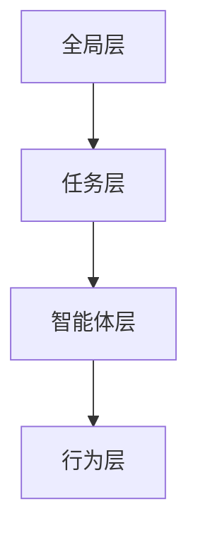
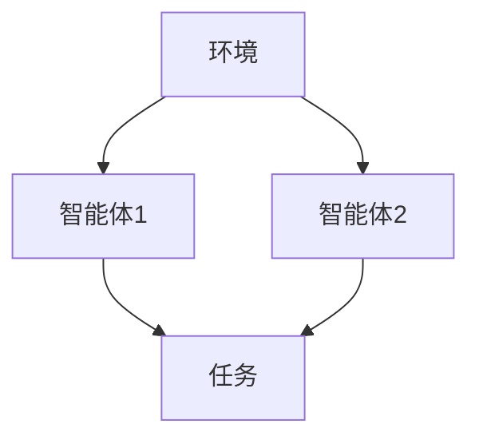
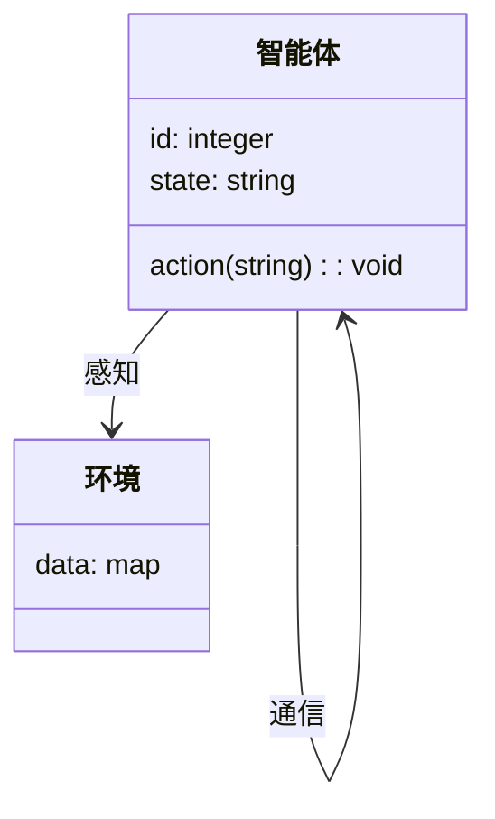
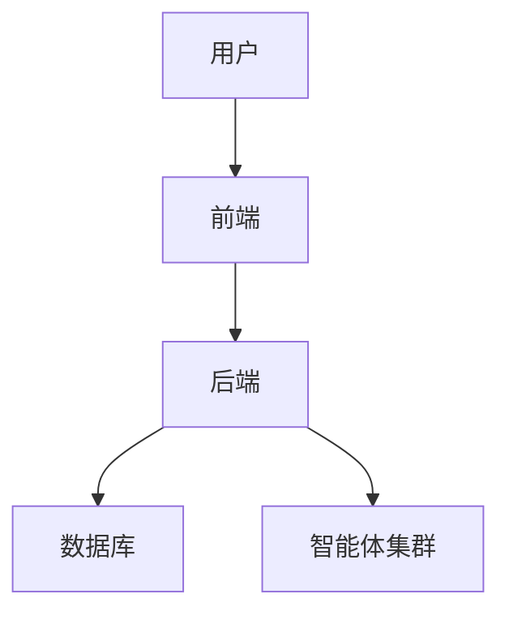
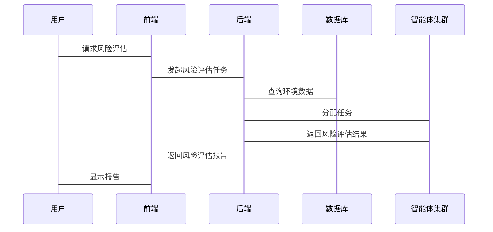

                 


# 多智能体系统在全球监管环境分析中的应用：跨国投资风险评估

## 关键词：
多智能体系统、跨国投资、风险评估、监管环境、系统架构、算法原理、项目实战

## 摘要：
多智能体系统（Multi-Agent Systems, MAS）在跨国投资风险评估中的应用，通过分布式计算和协作智能体的特性，能够有效应对全球化背景下监管环境的复杂性和多样性。本文系统地介绍MAS的核心概念、算法原理、系统架构，并通过实际案例分析，展示MAS在跨国投资风险评估中的优势和实现方法，为读者提供深入的技术指导和实践参考。

---

# 第一部分: 多智能体系统与全球监管环境分析基础

## 第1章: 多智能体系统概述

### 1.1 多智能体系统的定义与特点
#### 1.1.1 多智能体系统的定义
多智能体系统（MAS）是由多个智能体组成的分布式系统，这些智能体能够通过自主决策和协作完成复杂任务。MAS的关键在于智能体之间的通信与协作。

#### 1.1.2 多智能体系统的核心特点
| 特性 | 描述 |
|------|------|
| 分布式 | 智能体独立运行，无中心节点 |
| 协作性 | 智能体通过通信协作完成任务 |
| 反应性 | 智能体能够实时感知环境变化并做出反应 |
| 多样性 | 智能体可以有不同的目标和行为 |

#### 1.1.3 多智能体系统与传统单智能体系统的区别
| 特性 | 多智能体系统 | 单智能体系统 |
|------|-------------|---------------|
| 决策 | 分布式决策 | 中心化决策     |
| 通信 | 智能体间通信 | 无通信         |
| 协作 | 支持协作任务 | 单一任务执行   |

### 1.2 全球监管环境分析的背景与挑战
#### 1.2.1 全球化背景下的监管环境复杂性
全球化使得跨国投资面临复杂的监管环境，不同国家和地区的法规差异大，增加了风险评估的难度。

#### 1.2.2 跨国投资风险的多样性与动态性
跨国投资涉及政治、经济、法律等多重风险，且这些风险会随着环境变化而动态调整。

#### 1.2.3 监管环境分析的传统方法与局限性
传统方法通常依赖人工分析，效率低且难以应对复杂多变的环境。

### 1.3 多智能体系统在监管环境分析中的优势
#### 1.3.1 多智能体系统的分布式计算能力
MAS能够将复杂任务分解为多个智能体的子任务，通过分布式计算提高效率。

#### 1.3.2 多智能体系统的协作与协调能力
MAS通过智能体之间的协作，能够更好地应对监管环境的复杂性和不确定性。

#### 1.3.3 多智能体系统的适应性与灵活性
MAS能够实时感知环境变化，并动态调整智能体的行为，增强系统的适应性。

### 1.4 本章小结
本章介绍了多智能体系统的基本概念和特点，分析了全球化背景下监管环境分析的复杂性，并阐述了MAS在其中的优势。

---

## 第2章: 多智能体系统的核心概念与原理

### 2.1 多智能体系统的结构与组成
#### 2.1.1 智能体的定义与分类
智能体（Agent）是具有感知环境、自主决策和执行任务能力的实体。智能体可以分为简单反应型智能体、基于模型的反应型智能体、目标驱动型智能体和效用驱动型智能体。

#### 2.1.2 智能体的属性与行为
| 属性 | 描述 |
|------|------|
| 感知 | 感知环境的能力 | 
| 决策 | 根据感知做出决策的能力 |
| 行动 | 执行决策的能力 |
| 学习 | 通过经验改进的能力 |

#### 2.1.3 多智能体系统的层次结构


### 2.2 多智能体系统的通信与协作
#### 2.2.1 智能体之间的通信机制
智能体之间的通信可以通过消息传递、共享数据库或中间件实现。

#### 2.2.2 协作任务的分配与协调
协作任务的分配可以通过拍卖算法、合同网模型或基于优先级的分配方法实现。

#### 2.2.3 冲突解决机制
冲突解决可以通过协商、仲裁或避让策略实现。

### 2.3 多智能体系统的建模与分析
#### 2.3.1 多智能体系统的建模方法
常用的建模方法包括基于状态空间的建模、基于逻辑的建模和基于博弈论的建模。

#### 2.3.2 多智能体系统的分析框架


#### 2.3.3 多智能体系统的仿真与模拟
仿真可以通过离散事件模拟、基于代理的建模或分布式仿真实现。

### 2.4 本章小结
本章详细介绍了多智能体系统的结构、通信机制和建模方法，为后续章节的应用奠定了基础。

---

## 第3章: 多智能体系统在跨国投资风险评估中的应用

### 3.1 跨国投资风险评估的定义与框架
#### 3.1.1 跨国投资风险的定义
跨国投资风险是指在跨国投资过程中可能面临的各种风险，包括政治风险、经济风险和法律风险。

#### 3.1.2 跨国投资风险评估的框架
跨国投资风险评估通常包括风险识别、风险量化和风险应对三个阶段。

#### 3.1.3 跨国投资风险评估的关键因素
| 因素 | 描述 |
|------|------|
| 政治环境 | 包括政策变化、政局稳定性等 |
| 经济环境 | 包括经济波动、通货膨胀等 |
| 法律环境 | 包括法律法规的复杂性和不确定性 |

### 3.2 多智能体系统在风险评估中的角色
#### 3.2.1 多智能体系统在风险识别中的应用
MAS可以实时监控全球政治、经济和法律环境的变化，识别潜在风险。

#### 3.2.2 多智能体系统在风险量化中的应用
MAS可以通过分布式计算和协作智能体，量化不同风险的影响程度。

#### 3.2.3 多智能体系统在风险应对中的应用
MAS可以通过智能体之间的协作，制定最优的风险应对策略。

### 3.3 跨国投资风险评估的多智能体系统模型
#### 3.3.1 模型的设计与构建
模型设计包括智能体的定义、智能体之间的通信机制和任务分配方法。

#### 3.3.2 模型的输入与输出
输入包括全球政治、经济和法律环境数据，输出包括风险评估结果和应对策略。

#### 3.3.3 模型的验证与优化
模型的验证可以通过仿真和实验实现，优化可以通过遗传算法或模拟退火实现。

### 3.4 本章小结
本章介绍了多智能体系统在跨国投资风险评估中的应用，详细阐述了模型的设计和实现方法。

---

## 第4章: 多智能体系统的算法与实现

### 4.1 多智能体系统的算法原理
#### 4.1.1 分布式计算算法
分布式计算算法包括分布式任务分配算法和分布式计算优化算法。

#### 4.1.2 多智能体协作算法
多智能体协作算法包括拍卖算法、合同网模型和基于优先级的分配算法。

#### 4.1.3 风险评估算法
风险评估算法包括贝叶斯网络算法和马尔可夫链模型。

### 4.2 多智能体系统的实现步骤
#### 4.2.1 系统设计
系统设计包括功能需求分析、智能体设计和系统架构设计。

#### 4.2.2 系统实现
系统实现包括智能体开发、智能体通信实现和任务分配实现。

#### 4.2.3 系统测试
系统测试包括功能测试、性能测试和兼容性测试。

### 4.3 本章小结
本章详细介绍了多智能体系统的算法原理和实现步骤，为实际应用提供了理论支持。

---

## 第5章: 系统分析与架构设计方案

### 5.1 问题场景介绍
跨国投资风险评估系统需要实时监控全球政治、经济和法律环境的变化，评估投资风险并制定应对策略。

### 5.2 项目介绍
跨国投资风险评估系统是一个基于多智能体系统的分布式应用，用于帮助投资者评估和管理跨国投资风险。

### 5.3 系统功能设计
#### 5.3.1 功能模块
| 模块 | 描述 |
|------|------|
| 数据采集模块 | 采集全球政治、经济和法律环境数据 |
| 风险评估模块 | 评估投资风险并生成报告 |
| 风险应对模块 | 制定风险应对策略 |

#### 5.3.2 领域模型


### 5.4 系统架构设计
#### 5.4.1 系统架构


#### 5.4.2 系统接口设计
系统接口包括数据接口、智能体接口和用户接口。

#### 5.4.3 系统交互设计


### 5.5 本章小结
本章详细介绍了跨国投资风险评估系统的架构设计和接口设计，为系统的实现提供了指导。

---

## 第6章: 项目实战

### 6.1 环境安装
安装Python和必要的库，如numpy、pandas、matplotlib和networkx。

### 6.2 系统核心实现源代码
#### 6.2.1 智能体类
```python
class Agent:
    def __init__(self, id):
        self.id = id
        self.state = "idle"
    
    def感知环境(self, 环境数据):
        # 实现感知环境的逻辑
        pass
    
    def 通信(self, 其他智能体):
        # 实现智能体之间的通信逻辑
        pass
    
    def 行动(self, 任务):
        # 实现智能体的行动逻辑
        pass
```

#### 6.2.2 任务分配算法
```python
def 任务分配(任务, 智能体列表):
    # 实现任务分配算法
    pass
```

### 6.3 代码应用解读与分析
解释代码的功能和实现逻辑，展示如何通过代码实现多智能体系统的功能。

### 6.4 实际案例分析
通过具体案例展示系统的应用，分析系统的优缺点和改进建议。

### 6.5 项目小结
总结项目的实现过程，提出改进建议和未来研究方向。

---

## 第7章: 最佳实践

### 7.1 小结
总结全文，重申多智能体系统在跨国投资风险评估中的优势。

### 7.2 注意事项
在实际应用中需要注意智能体之间的通信延迟、数据一致性问题和系统的可扩展性问题。

### 7.3 拓展阅读
推荐相关的书籍和论文，供读者进一步学习和研究。

---

# 附录: 参考文献
列出本文参考的文献和资料。

---

通过以上目录结构和内容安排，本文系统地介绍了多智能体系统在全球监管环境分析中的应用，详细讲解了跨国投资风险评估的核心概念、算法原理和系统架构，并通过项目实战展示了系统的实现过程。希望本文能够为读者提供有价值的技术指导和实践参考。

