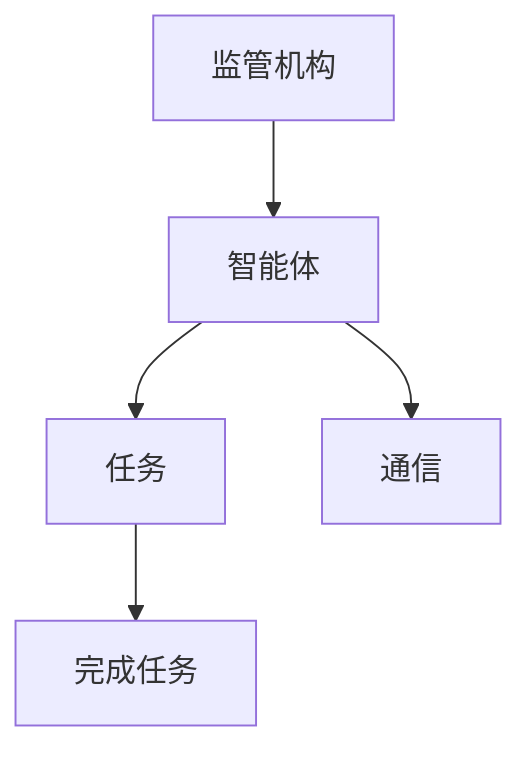
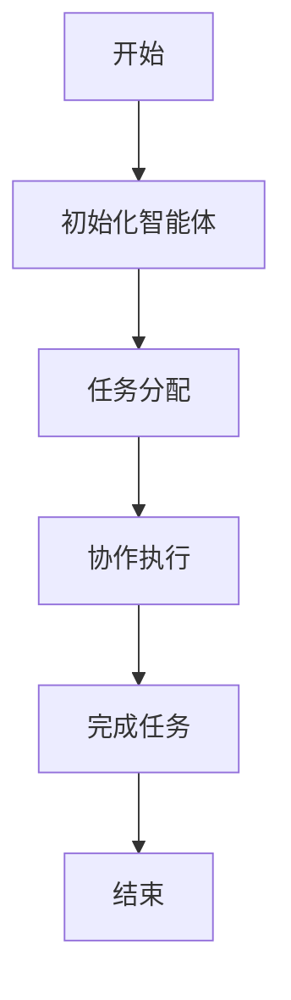
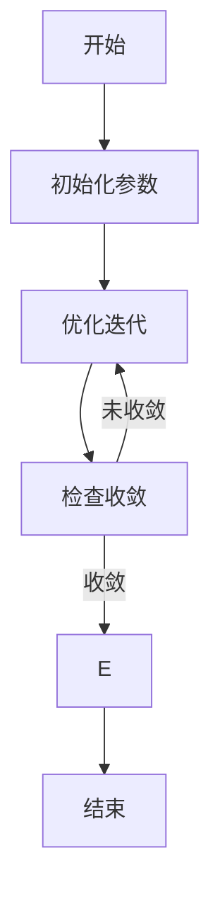
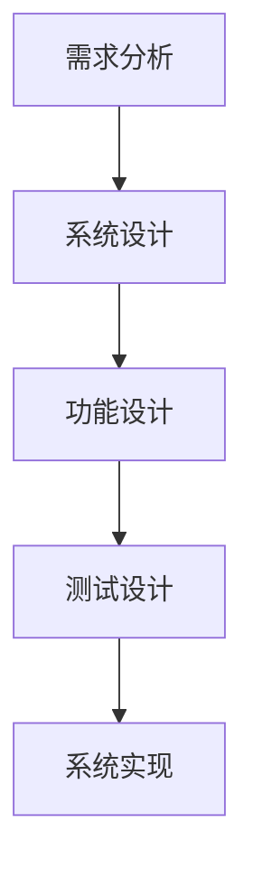
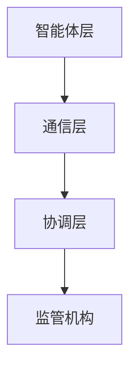
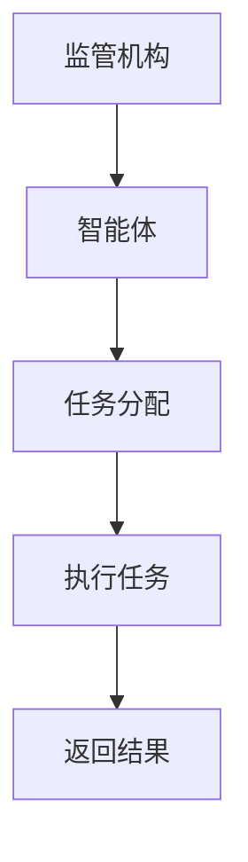

                 


# 多智能体系统在全球监管环境分析中的角色

> 关键词：多智能体系统、全球监管环境、系统分析、多智能体协作、算法实现

> 摘要：本文探讨了多智能体系统在全球监管环境中的应用角色，分析了多智能体系统的核心概念、算法原理、系统设计以及实际案例，展示了多智能体系统如何在全球监管环境中实现高效协作与优化。

---

# 第1章: 多智能体系统与全球监管环境的背景

## 1.1 多智能体系统的定义与特点

### 1.1.1 多智能体系统的定义
多智能体系统（Multi-Agent System, MAS）是由多个智能体（Agent）组成的分布式系统，这些智能体能够通过协作完成复杂的任务。智能体是指能够感知环境、自主决策并采取行动的实体。

### 1.1.2 多智能体系统的核心特点
- **分布式性**：智能体分布在不同的位置，独立运作。
- **协作性**：智能体之间通过通信和协作完成共同目标。
- **自主性**：智能体能够自主决策，无需外部干预。
- **反应性**：智能体能够根据环境变化实时调整行为。

### 1.1.3 多智能体系统与传统单智能体系统的区别
| 特性               | 多智能体系统                     | 单智能体系统                     |
|--------------------|---------------------------------|---------------------------------|
| 冗余性             | 高                             | 低                             |
| 可扩展性           | 高                             | 低                             |
| 系统复杂性         | 高                             | 低                             |

### 1.1.4 多智能体系统的ER实体关系图
```mermaid
er
actor(监管机构) -[管理]-> agent(智能体)
agent -[通信]-> message(消息)
agent -[协作]-> task(任务)
```

## 1.2 全球监管环境的复杂性

### 1.2.1 全球化监管的背景
随着全球化的发展，跨国企业的监管需求日益增加，传统的单一监管方式已难以应对复杂的全球性问题。

### 1.2.2 监管环境的多样性与挑战
- **多样性**：不同国家的监管法规和标准差异大。
- **动态性**：监管法规会随着政策变化而调整。
- **复杂性**：涉及多个利益相关者，协调难度大。

### 1.2.3 全球监管环境的系统性特征
- **多层次性**：涉及国家、地区、行业等多个层面。
- **交互性**：不同监管机构之间需要频繁交互。
- **实时性**：监管需求往往需要实时响应。

## 1.3 多智能体系统在全球监管中的作用

### 1.3.1 多智能体系统在监管中的优势
- **高效协作**：智能体之间可以快速通信和协作，提高监管效率。
- **自主性**：智能体能够自主完成任务，减少人为干预。
- **灵活性**：系统能够适应动态变化的监管需求。

### 1.3.2 多智能体系统在全球监管中的应用场景
- **跨国监管协调**：智能体可以代表不同国家的监管机构，协调跨国企业的监管事务。
- **实时监控**：智能体可以实时监控企业的行为，及时发现违规行为。
- **数据共享**：智能体可以实现跨机构的数据共享，提高监管透明度。

### 1.3.3 多智能体系统与全球监管环境的结合
多智能体系统能够通过分布式协作和自主决策，帮助监管机构高效应对复杂的全球监管环境。

---

# 第2章: 多智能体系统的核心概念与联系

## 2.1 多智能体系统的原理

### 2.1.1 多智能体系统的协作机制
协作机制是多智能体系统的核心，通过通信协议实现智能体之间的信息共享和任务分配。

### 2.1.2 多智能体系统的通信协议
通信协议定义了智能体之间如何传递信息，确保协作过程的高效性。

### 2.1.3 多智能体系统的任务分配与协调
任务分配是通过算法实现的，确保每个智能体都能高效完成任务。

## 2.2 多智能体系统的属性对比

### 2.2.1 多智能体系统的ER实体关系图
```mermaid
er
actor(监管机构) -[管理]-> agent(智能体)
agent -[通信]-> message(消息)
agent -[协作]-> task(任务)
```

### 2.2.2 多智能体系统的流程图


## 2.3 多智能体系统的数学模型

### 2.3.1 协作算法的数学模型
协作算法可以通过以下公式表示：
$$
\text{协作度} = \sum_{i=1}^{n} \frac{1}{d_i}
$$
其中，$d_i$ 是第 $i$ 个智能体的距离。

### 2.3.2 博弈论模型的数学公式
博弈论模型可以通过以下公式表示：
$$
\text{收益} = \sum_{i=1}^{n} a_i x_i
$$
其中，$a_i$ 是第 $i$ 个智能体的收益系数，$x_i$ 是其行动。

---

# 第3章: 多智能体系统的算法原理

## 3.1 多智能体系统的协作算法

### 3.1.1 协作算法的实现流程


### 3.1.2 协作算法的数学模型
协作算法的数学模型可以表示为：
$$
\text{协作度} = \sum_{i=1}^{n} \frac{1}{d_i}
$$
其中，$d_i$ 是第 $i$ 个智能体的距离。

## 3.2 多智能体系统的博弈论模型

### 3.2.1 博弈论模型的数学公式
博弈论模型可以通过以下公式表示：
$$
\text{收益} = \sum_{i=1}^{n} a_i x_i
$$
其中，$a_i$ 是第 $i$ 个智能体的收益系数，$x_i$ 是其行动。

## 3.3 多智能体系统的优化算法

### 3.3.1 优化算法的实现流程


### 3.3.2 优化算法的数学模型
优化算法的数学模型可以表示为：
$$
\text{目标函数} = \sum_{i=1}^{n} f_i(x_i)
$$
其中，$f_i(x_i)$ 是第 $i$ 个智能体的目标函数。

---

# 第4章: 多智能体系统在全球监管环境中的系统分析

## 4.1 系统分析与设计

### 4.1.1 系统分析的步骤
1. 明确监管需求
2. 分析系统功能
3. 设计系统架构
4. 实现系统功能

### 4.1.2 系统设计的流程


### 4.1.3 系统分析与设计的案例
假设我们设计一个跨国企业的监管系统，智能体分别代表不同国家的监管机构，通过通信协议实现数据共享和任务协作。

## 4.2 系统架构设计

### 4.2.1 系统架构的组成部分
- **智能体层**：负责具体任务的执行。
- **通信层**：负责智能体之间的信息传递。
- **协调层**：负责任务的分配与协调。

### 4.2.2 系统架构的实现方式


## 4.3 系统接口与交互设计

### 4.3.1 系统接口的定义
- **输入接口**：接收监管机构的指令。
- **输出接口**：返回智能体的执行结果。

### 4.3.2 系统交互的流程图


---

# 第5章: 多智能体系统在全球监管环境中的项目实战

## 5.1 项目环境与工具安装

### 5.1.1 开发环境的配置
- 操作系统：Linux
- 开发工具：Python、Git

### 5.1.2 开发工具的安装
```bash
pip install numpy
pip install matplotlib
```

## 5.2 项目核心代码实现

### 5.2.1 多智能体系统的代码实现
```python
class Agent:
    def __init__(self, id):
        self.id = id
        self.tasks = []
    
    def receive_task(self, task):
        self.tasks.append(task)
    
    def execute_task(self):
        for task in self.tasks:
            print(f"Agent {self.id} executing task {task}")
```

### 5.2.2 系统协作算法的代码实现
```python
def collaborate_agents(agents):
    for agent in agents:
        agent.receive_task(f"Task_{len(agent.tasks)+1}")
    for agent in agents:
        agent.execute_task()
```

---

# 第6章: 多智能体系统的最佳实践

## 6.1 最佳实践 tips

### 6.1.1 系统设计
- 明确智能体的职责和权限。
- 设计高效的通信协议。

### 6.1.2 系统实现
- 使用模块化设计，便于扩展和维护。

## 6.2 小结
多智能体系统在全球监管环境中的应用前景广阔，通过协作算法和博弈论模型，能够有效提高监管效率。

## 6.3 注意事项
- 确保系统的安全性和隐私性。
- 定期更新系统的算法和模型。

## 6.4 拓展阅读
- 推荐阅读《Multi-Agent Systems: Algorithm and Applications》。

---

通过以上步骤，我们可以全面了解多智能体系统在全球监管环境中的角色和应用，为实际项目提供了理论和实践的双重指导。

