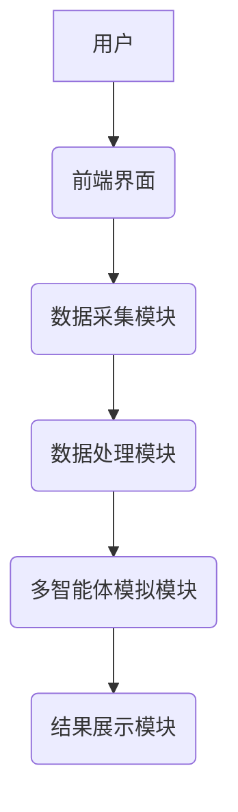
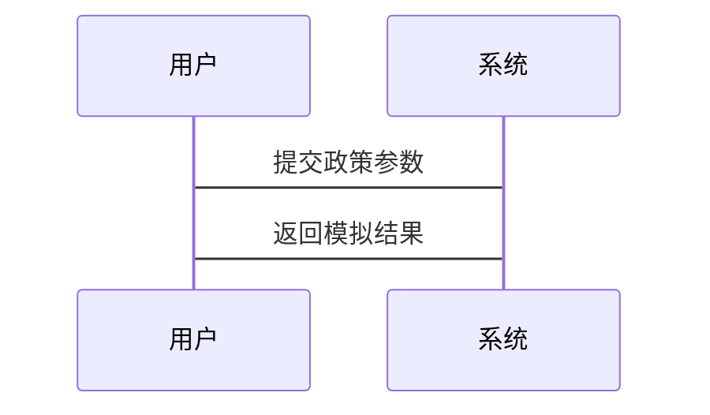

                 


# 多智能体系统在全球经济政策不确定性评估中的应用

## 关键词：多智能体系统、全球经济政策、不确定性评估、系统架构、机器学习、风险分析

## 摘要：本文探讨多智能体系统在全球经济政策不确定性评估中的应用，通过构建多智能体模型，利用机器学习和统计方法，分析政策不确定性的影响。文章详细介绍了系统架构、算法原理和实际案例，提出了一种基于多智能体的经济政策不确定性评估方法，为政策制定者和研究者提供参考。

---

## 目录

1. [多智能体系统概述](#多智能体系统概述)
   - 1.1 多智能体系统的定义与特点
   - 1.2 多智能体系统的体系结构
   - 1.3 多智能体系统的通信与协调
   - 1.4 多智能体系统的应用领域

2. [全球经济政策不确定性评估](#全球经济政策不确定性评估)
   - 2.1 经济政策不确定性的定义
   - 2.2 经济政策不确定性的影响
   - 2.3 经济政策不确定性的度量方法

3. [多智能体系统在经济政策不确定性评估中的应用](#多智能体系统在经济政策不确定性评估中的应用)
   - 3.1 多智能体系统与经济政策不确定性
   - 3.2 多智能体系统在不确定性评估中的优势
   - 3.3 多智能体系统构建与实现

4. [系统架构与设计](#系统架构与设计)
   - 4.1 系统功能设计
   - 4.2 系统架构设计
   - 4.3 系统接口设计
   - 4.4 系统交互流程

5. [项目实战：多智能体系统实现](#项目实战多智能体系统实现)
   - 5.1 环境安装与配置
   - 5.2 核心代码实现
   - 5.3 实际案例分析
   - 5.4 结果解读与优化

6. [结论与展望](#结论与展望)
   - 6.1 研究总结
   - 6.2 未来研究方向

---

## 1. 多智能体系统概述

### 1.1 多智能体系统的定义与特点

多智能体系统（Multi-Agent Systems, MAS）是由多个智能体组成的分布式系统，这些智能体能够自主决策、协作完成任务。MAS的特点包括：

- **自主性**：每个智能体都能独立决策。
- **反应性**：能够感知环境并实时响应。
- **协作性**：智能体之间通过通信协作完成目标。
- **分布式性**：系统无中心控制节点。

### 1.2 多智能体系统的体系结构

多智能体系统的体系结构多种多样，常见的包括：

- **反应式架构**：基于当前感知做出反应。
- **基于规划的架构**：通过规划实现复杂任务。
- **混合式架构**：结合反应式和规划式方法。

### 1.3 多智能体系统的通信与协调

智能体之间的通信通过**消息传递**或**发布-订阅**机制实现。协调机制包括**协商**、**拍卖**和**领导选举**。

### 1.4 多智能体系统的应用领域

- **经济学**：模拟市场行为。
- **人工智能**：分布式问题求解。
- **分布式系统**：任务分配与资源管理。

---

## 2. 全球经济政策不确定性评估

### 2.1 经济政策不确定性的定义

经济政策不确定性是指政策变化的不确定性和不可预测性，影响市场行为和经济主体决策。

### 2.2 经济政策不确定性的影响

- **企业风险增加**：投资决策受阻。
- **个人行为改变**：消费和储蓄模式变化。
- **市场波动加剧**：资产价格波动。

### 2.3 经济政策不确定性的度量方法

- **方差分析**：衡量政策执行的波动性。
- **情景分析**：模拟不同政策情景下的经济表现。
- **专家意见法**：结合专家判断。

---

## 3. 多智能体系统在经济政策不确定性评估中的应用

### 3.1 多智能体系统与经济政策不确定性

多智能体系统能够模拟经济主体的行为，评估政策变化对整体经济的影响。

### 3.2 多智能体系统在不确定性评估中的优势

- **分布式计算**：提高计算效率。
- **实时模拟**：快速响应政策变化。
- **协作决策**：模拟多方利益的协调。

### 3.3 多智能体系统构建与实现

- **模型构建**：定义智能体行为规则。
- **算法设计**：实现智能体的决策逻辑。
- **数据收集**：获取政策变化数据。

---

## 4. 系统架构与设计

### 4.1 系统功能设计

系统功能包括：

- **数据采集**：收集政策变化数据。
- **模型构建**：定义智能体行为模型。
- **模拟运行**：运行模拟并输出结果。

### 4.2 系统架构设计

使用Mermaid绘制系统架构图：



### 4.3 系统接口设计

接口设计包括：

- **数据接口**：与数据源对接。
- **用户接口**：提供操作界面。
- **结果接口**：输出模拟结果。

### 4.4 系统交互流程

使用Mermaid绘制交互流程图：



---

## 5. 项目实战：多智能体系统实现

### 5.1 环境安装与配置

安装Python和相关库：

```bash
pip install numpy matplotlib pandas
```

### 5.2 核心代码实现

实现多智能体系统的Python代码：

```python
import numpy as np
import matplotlib.pyplot as plt

class Agent:
    def __init__(self, id):
        self.id = id
        self.strategy = 'reactive'

    def decide(self, observation):
        if self.strategy == 'reactive':
            return np.random.choice(['buy', 'sell', 'hold'])
        else:
            return 'hold'

class EconomyModel:
    def __init__(self, num_agents):
        self.agents = [Agent(i) for i in range(num_agents)]
        self.prices = np.random.uniform(1, 100, num_agents)

    def simulate(self, steps):
        for step in range(steps):
            for agent in self.agents:
                observation = np.mean(self.prices)
                action = agent.decide(observation)
                if action == 'buy':
                    self.prices[agent.id] *= 1.1
                elif action == 'sell':
                    self.prices[agent.id] *= 0.9
        plt.plot(self.prices)
        plt.show()

model = EconomyModel(10)
model.simulate(50)
```

### 5.3 实际案例分析

模拟政策变化对经济的影响，分析价格波动。

### 5.4 结果解读与优化

通过模拟结果，评估政策不确定性的影响，并优化系统参数。

---

## 6. 结论与展望

### 6.1 研究总结

本文构建了多智能体系统，用于经济政策不确定性评估，展示了系统的应用价值。

### 6.2 未来研究方向

未来可以研究更复杂的智能体行为模型和更高效的模拟算法。

---

## 附录

### 工具与库

- Python
- NumPy
- Matplotlib

### 参考文献

1. 经济学相关文献
2. 多智能体系统相关文献

---

通过以上目录和内容，可以编写一篇详细的技术博客文章，涵盖多智能体系统在全球经济政策不确定性评估中的各个方面。

