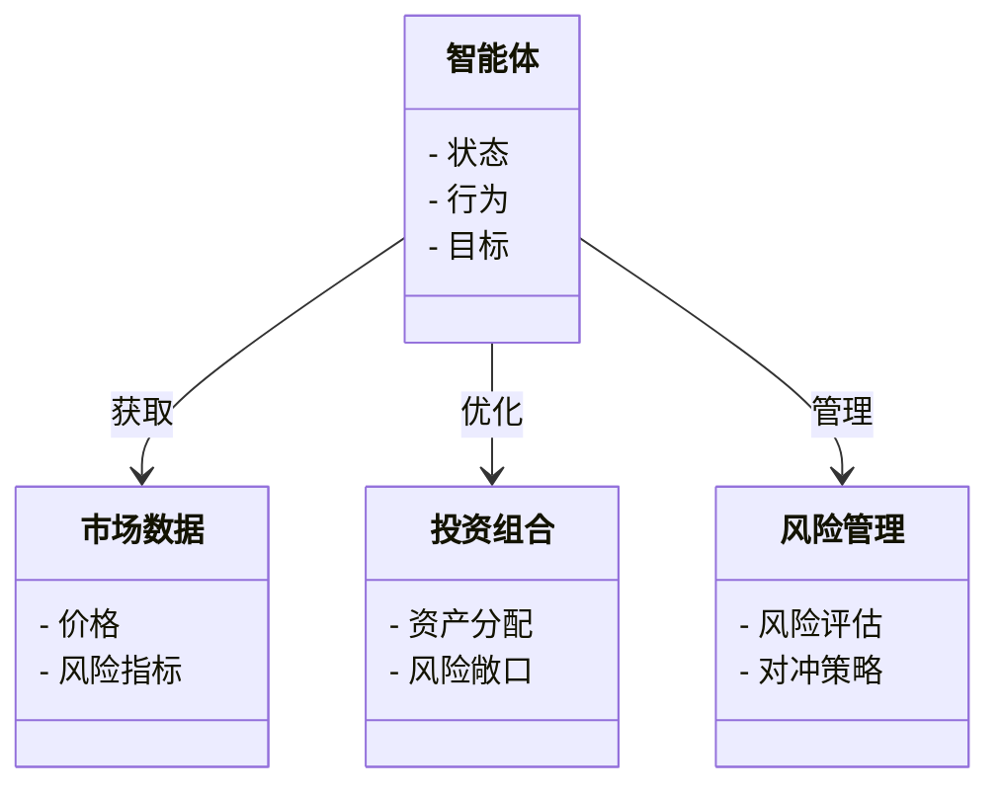

                 


```markdown
# 多智能体系统在全球资产配置中的角色

> 关键词：多智能体系统，全球资产配置，分布式计算，协作机制，博弈论，智能体协同

> 摘要：本文探讨了多智能体系统在全球资产配置中的应用，分析了其核心概念、算法原理、系统架构，并通过实际案例展示了其在优化投资组合和风险管理中的作用。文章旨在为读者提供全面的理论与实践指导，帮助理解多智能体系统在全球资产配置中的重要性与潜力。

---

## 第一部分: 多智能体系统基础

### 第1章: 多智能体系统概述

#### 1.1 多智能体系统的基本概念
多智能体系统（Multi-Agent Systems, MAS）是由多个智能体组成的分布式系统，这些智能体能够自主决策、协作和交互。与单智能体系统相比，MAS具有更高的灵活性和适应性，能够处理复杂环境中的任务。

#### 1.2 多智能体系统的分类
多智能体系统可以根据任务、智能体类型和通信机制进行分类。例如，任务驱动的MAS用于特定目标的实现，而协作型MAS强调智能体之间的协作。

#### 1.3 多智能体系统的特征
- **自主性**：智能体能够独立决策。
- **反应性**：能够感知环境并实时调整行为。
- **协作性**：智能体之间能够协同完成复杂任务。

### 第2章: 全球资产配置的背景与挑战

#### 2.1 全球资产配置的基本概念
全球资产配置是指将资金分配到不同国家和地区的资产中，以分散风险并最大化收益。

#### 2.2 全球资产配置的挑战
- **市场波动**：全球经济波动影响资产价值。
- **信息不对称**：投资者获取信息的不均衡性。
- **复杂性**：多因素影响资产价格。

#### 2.3 多智能体系统在金融中的优势
- **高效决策**：多智能体系统能够快速处理大量数据。
- **分布式协作**：多个智能体协同工作，提高决策的准确性。

---

## 第二部分: 多智能体系统的数学模型与算法

### 第3章: 多智能体系统的数学模型

#### 3.1 智能体的决策模型
- **博弈论模型**：基于纳什均衡的决策。
- **优化模型**：通过优化函数确定最优投资组合。

#### 3.2 协作模型
- **信息共享模型**：智能体之间共享信息以提高决策质量。
- **协作目标模型**：定义协作目标并优化实现。

#### 3.3 通信模型
- **通信协议**：定义智能体之间的通信规则。
- **信息传递模型**：描述信息传递的路径和方式。

### 第4章: 多智能体系统的算法原理

#### 4.1 分布式计算算法
- **分布式计算**：任务分解到多个节点，协同完成。
- **协商算法**：智能体之间通过协商确定最优策略。

#### 4.2 协作算法
- **分布式优化算法**：通过局部优化实现全局最优。
- **协商机制**：智能体通过协商达成一致。

---

## 第三部分: 系统分析与架构设计

### 第5章: 系统分析与架构设计

#### 5.1 问题场景介绍
全球资产配置涉及多个市场和资产类别，需要实时决策和协作。

#### 5.2 系统功能设计
- **数据采集**：获取实时市场数据。
- **智能体协作**：多个智能体协同优化投资组合。
- **风险管理**：实时监控并管理风险。

#### 5.3 领域模型（Mermaid 类图）


#### 5.4 系统架构设计


---

## 第四部分: 项目实战

### 第6章: 项目实战

#### 6.1 环境安装
- **工具安装**：安装Python、相关库（如NumPy、Pandas）。
- **框架选择**：选择适合的多智能体框架（如DistributedRL）。

#### 6.2 核心代码实现
```python
import numpy as np
from distributedRL import Agent

class PortfolioAgent(Agent):
    def __init__(self, target_return):
        super().__init__()
        self.target_return = target_return

    def decide_action(self, state):
        # 简单的投资组合决策
        if state['market'].mean() > self.target_return:
            return 'buy'
        else:
            return 'sell'
```

#### 6.3 代码解读与分析
- **类定义**：`PortfolioAgent`继承自`Agent`，定义了投资组合决策逻辑。
- **决策函数**：根据市场状态决定买入或卖出。

#### 6.4 实际案例分析
通过具体案例展示智能体如何协同优化投资组合，分析其在实际中的表现。

#### 6.5 项目总结
总结项目成果，分析优缺点，并提出改进建议。

---

## 第五部分: 总结与展望

### 第7章: 总结与展望

#### 7.1 总结
本文全面探讨了多智能体系统在全球资产配置中的应用，分析了其核心概念、算法原理和系统架构，并通过实际案例展示了其优势。

#### 7.2 未来展望
多智能体系统在金融领域的应用前景广阔，未来可以进一步研究其在风险管理、投资策略优化等方面的应用。

#### 7.3 最佳实践 Tips
- **数据质量**：确保数据的准确性和实时性。
- **智能体设计**：合理设计智能体的行为和协作机制。
- **系统监控**：实时监控系统运行状态，及时调整策略。

---

通过本文的分析与实践，读者可以深入了解多智能体系统在全球资产配置中的重要性，并掌握其实际应用的方法。
```

