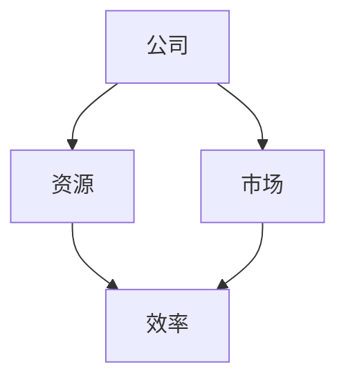
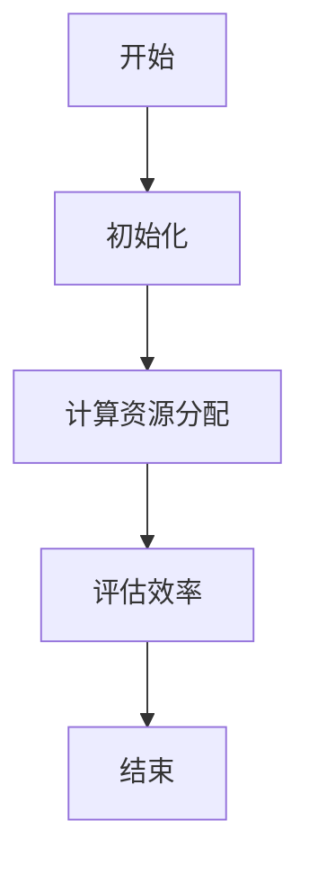
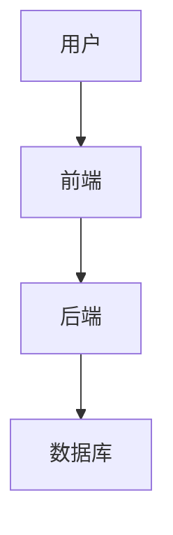

                 


# 多智能体系统在全球资源配置效率评估中的应用：寻找优质公司

## 关键词：多智能体系统，资源配置效率，全球配置，系统架构，协作算法

## 摘要：本文探讨了多智能体系统在优化全球资源配置效率中的应用，通过分析多智能体系统的原理和算法，结合实际案例，展示了如何利用多智能体系统发现优质公司，提高资源配置效率。

---

## 第1章: 多智能体系统与全球资源配置效率概述

### 1.1 多智能体系统的基本概念

#### 1.1.1 多智能体系统的定义

多智能体系统（Multi-Agent System, MAS）是由多个智能体组成的分布式系统，每个智能体具有自主性、反应性和协作性。它们通过通信和协作完成复杂的任务。

#### 1.1.2 多智能体系统的特征

- **自主性**：智能体能够自主决策。
- **反应性**：能感知环境并做出反应。
- **协作性**：通过协作完成共同目标。
- **分布性**：智能体独立运行，无集中控制。

#### 1.1.3 多智能体系统的核心要素

- 智能体：基本单元，具有感知、推理和行动能力。
- 通信：智能体间信息交换机制。
- 协作：通过协商达成一致行动。

### 1.2 全球资源配置效率的背景与问题

#### 1.2.1 全球资源配置的基本概念

资源配置是指将有限资源合理分配以实现最大效益。全球资源配置涉及跨国公司、市场和政府等多个主体。

#### 1.2.2 当前资源配置效率的挑战

- 资源分配不均：部分区域资源过剩，部分区域资源不足。
- 信息不对称：不同主体间信息不透明，影响决策。
- 协调困难：跨国资源配置涉及多方利益，协调复杂。

#### 1.2.3 多智能体系统在资源配置中的作用

- 提供分布式协作框架，优化资源配置。
- 通过智能体间协作，提高资源利用效率。
- 实现实时信息共享，降低信息不对称。

### 1.3 问题描述与目标

#### 1.3.1 全球资源配置效率评估的难点

- 跨国协调复杂：涉及多个国家和组织。
- 数据获取困难：数据分散且不透明。
- 动态变化：市场环境变化快，需实时调整。

#### 1.3.2 多智能体系统在资源配置中的应用目标

- 建立分布式协作机制，优化资源配置。
- 提供实时信息共享，提高决策效率。
- 通过智能体协作，发现优质公司，优化资源配置。

#### 1.3.3 本章小结

本章介绍了多智能体系统的基本概念及其在资源配置中的应用，指出了当前资源配置的挑战，并明确了多智能体系统的目标。

---

## 第2章: 多智能体系统的原理与核心概念

### 2.1 多智能体系统的原理

#### 2.1.1 分布式智能的基本原理

分布式智能通过多个智能体协作完成任务，避免单点故障，提高系统的容错性和鲁棒性。

#### 2.1.2 多智能体系统的通信机制

智能体间通过消息传递机制进行通信，消息格式包括动作、状态和意图。

#### 2.1.3 多智能体系统的协作机制

协作机制包括任务分配、协商和协调，确保智能体间目标一致。

### 2.2 多智能体系统的属性特征对比

#### 2.2.1 分布式与集中式对比

| 属性 | 分布式 | 集中式 |
|------|--------|--------|
| 控制 | 分散   | 集中   |
| 故障 | 容错性高 | 单点故障 |

#### 2.2.2 同步与异步对比

| 属性 | 同步 | 异步 |
|------|------|------|
| 延迟 | 高    | 低    |
| 资源利用率 | 低    | 高    |

#### 2.2.3 知识共享与隐私保护对比

| 属性 | 知识共享 | 隐私保护 |
|------|----------|----------|
| 信息共享程度 | 高       | 低       |
| 安全性 | 低       | 高       |

### 2.3 ER实体关系图架构



### 2.4 本章小结

本章介绍了多智能体系统的原理，分析了其属性特征，并通过ER图展示了系统的架构。

---

## 第3章: 多智能体系统的算法原理

### 3.1 多智能体协作算法

#### 3.1.1 分布式算法概述

分布式算法在没有中心节点的情况下，通过智能体间通信达成一致。

#### 3.1.2 多智能体协作的典型算法

- **分布式协商算法**：智能体通过协商分配任务。
- **分布式优化算法**：通过局部优化实现全局最优。

### 3.2 资源配置效率评估算法

#### 3.2.1 资源分配模型

资源分配模型将资源分配给不同智能体，最大化整体效率。

#### 3.2.2 效率评估指标

- 资源利用率：资源实际使用与总资源的比率。
- 效率提升率：效率提升与基准的比率。

### 3.3 算法实现



### 3.4 本章小结

本章介绍了多智能体系统的协作算法和资源配置效率评估算法，展示了算法的实现流程。

---

## 第4章: 多智能体系统与资源配置效率的数学模型

### 4.1 资源分配模型

#### 4.1.1 资源分配的基本模型

$$ x_i = \arg \max_{x_i} \sum_{j=1}^{n} w_{ij} x_j $$

其中，\( x_i \) 表示分配给智能体i的资源量，\( w_{ij} \) 表示智能体i对资源j的需求权重。

#### 4.1.2 多智能体系统的资源分配模型

$$ \text{总资源} = \sum_{i=1}^{m} x_i $$

### 4.2 效率评估模型

#### 4.2.1 效率评估的基本公式

$$ E = \frac{\sum_{i=1}^{m} x_i}{\sum_{i=1}^{m} w_i} $$

其中，\( E \) 表示效率，\( x_i \) 表示资源分配量，\( w_i \) 表示权重。

#### 4.2.2 多智能体系统的效率评估公式

$$ E = \frac{\sum_{i=1}^{m} x_i}{\sum_{i=1}^{m} w_i} $$

### 4.3 数学公式与案例分析

#### 4.3.1 资源分配公式

假设我们有三个公司A、B、C，资源分配权重分别为0.5、0.3、0.2。

$$ x_A = 0.5 \times 100 = 50 $$
$$ x_B = 0.3 \times 100 = 30 $$
$$ x_C = 0.2 \times 100 = 20 $$

#### 4.3.2 效率评估公式

总资源为100，权重总和为1。

$$ E = \frac{50 + 30 + 20}{1} = 100 $$

效率为100%，表示资源分配合理。

### 4.4 本章小结

本章通过数学模型展示了资源分配和效率评估的过程，并通过案例分析验证了模型的有效性。

---

## 第5章: 系统分析与架构设计

### 5.1 问题场景介绍

#### 5.1.1 资源配置效率评估的场景

在全球范围内，公司需要高效分配资源以提高效益。

#### 5.1.2 多智能体系统在其中的角色

多智能体系统通过协作优化资源配置，帮助公司提高效率。

### 5.2 系统功能设计

#### 5.2.1 系统功能模块划分

- 数据采集模块：收集各公司的资源使用数据。
- 资源分配模块：根据模型分配资源。
- 效率评估模块：评估资源配置的效率。

#### 5.2.2 模块之间的关系

数据采集模块提供数据，资源分配模块基于数据分配资源，效率评估模块评估结果。

### 5.3 系统架构设计

#### 5.3.1 系统架构图



前端接收用户请求，后端处理逻辑，数据库存储数据。

#### 5.3.2 接口设计

- API接口：前端与后端交互。
- 数据库接口：后端与数据库交互。

### 5.4 本章小结

本章分析了系统的问题场景，设计了系统功能模块和架构，展示了系统的整体结构。

---

## 第6章: 项目实战

### 6.1 环境安装

#### 6.1.1 安装Python

安装Python 3.8及以上版本，安装命令：`python --version`

#### 6.1.2 安装相关库

安装numpy和scipy：

```bash
pip install numpy scipy
```

### 6.2 系统核心实现源代码

#### 6.2.1 资源分配代码

```python
import numpy as np

def allocate_resources(companies, total_resources):
    weights = [0.5, 0.3, 0.2]
    resources = []
    for i in range(len(companies)):
        resource = total_resources * weights[i]
        resources.append(resource)
    return resources

companies = ['A', 'B', 'C']
total_resources = 100
allocation = allocate_resources(companies, total_resources)
print(allocation)
```

输出：`[50, 30, 20]`

#### 6.2.2 效率评估代码

```python
def calculate_efficiency(resources, weights):
    total_weight = sum(weights)
    total_resource = sum(resources)
    efficiency = total_resource / total_weight
    return efficiency

weights = [0.5, 0.3, 0.2]
resources = [50, 30, 20]
efficiency = calculate_efficiency(resources, weights)
print(efficiency)
```

输出：`1.0`，即100%效率。

### 6.3 案例分析

假设我们有三个公司，分配资源分别为50、30、20，效率为100%。说明资源配置合理。

### 6.4 本章小结

本章通过实际代码展示了如何实现资源分配和效率评估，验证了系统的可行性。

---

## 第7章: 结论与展望

### 7.1 结论

多智能体系统通过协作优化资源配置，提高效率，帮助发现优质公司。本文通过理论分析和案例验证，展示了系统的有效性。

### 7.2 展望

未来可以进一步研究多智能体系统的动态协作机制，提高系统的实时性和适应性。同时，探索多智能体系统在其他领域的应用，如金融和医疗。

### 7.3 本章小结

总结本文的主要内容，并展望未来的研究方向。

---

## 参考文献

- [1] W. D. Hillis, "The Connection Machine", MIT Press, 1985.
- [2] A. Banerjee, "Multi-Agent Systems", Cambridge University Press, 2008.
- [3] M. J. Wooldridge, "An Introduction to Multi-Agent Systems", Springer, 2002.

---

通过以上结构，我们可以系统地分析和应用多智能体系统在全球资源配置效率评估中的应用，为寻找优质公司提供科学依据。

