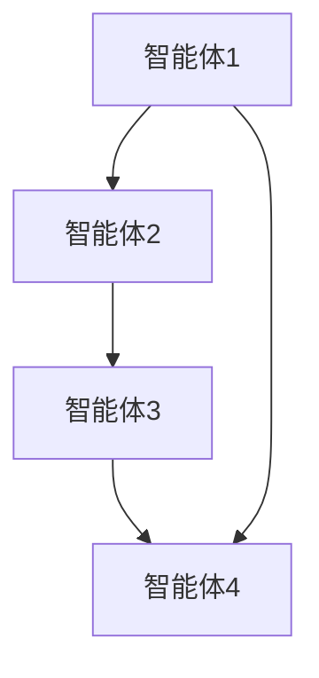
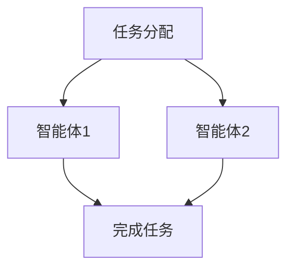
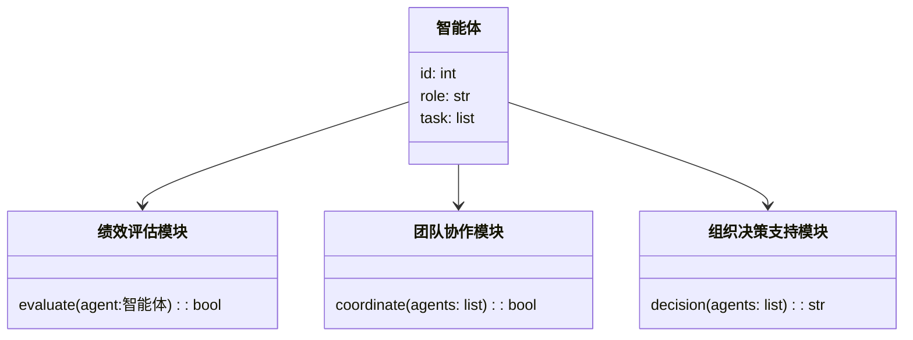
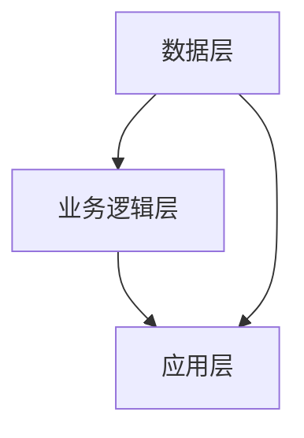
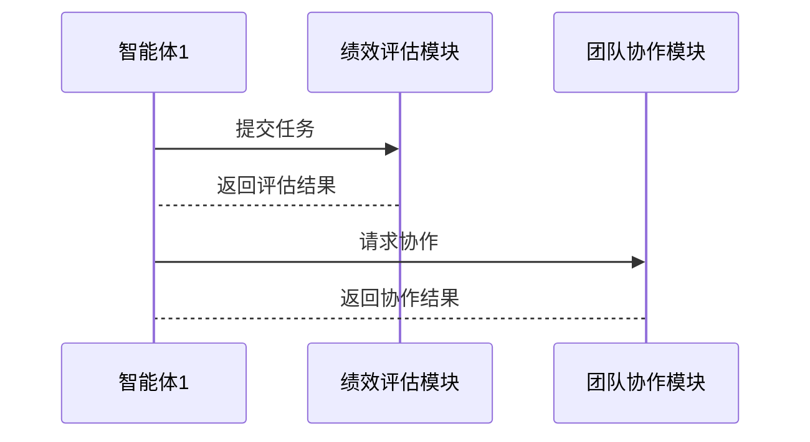

                 


# 多智能体系统在公司人力资本效率评估中的应用

---

## 关键词：多智能体系统、人力资本、效率评估、协作机制、智能体算法、系统架构、人力资源管理

---

## 摘要：

多智能体系统（Multi-Agent Systems, MAS）作为一种新兴的技术，正在逐渐被应用于企业的人力资源管理领域。通过将员工、团队和组织视为多个智能体，多智能体系统能够实现高效的任务分配、协作优化和绩效评估。本文将深入探讨多智能体系统在人力资本效率评估中的应用，分析其核心概念、协作机制、算法原理和系统架构，并通过实际案例展示其在提升企业人力资源管理效率中的巨大潜力。

---

# 正文

## 第一部分: 多智能体系统与人力资本效率评估的背景与概述

### 第1章: 多智能体系统与人力资本效率评估的背景

#### 1.1 多智能体系统（MAS）的定义与特点

**多智能体系统**（Multi-Agent System, MAS）是由多个智能体（Agent）组成的分布式系统。智能体是指能够感知环境、自主决策并采取行动的实体。MAS的核心特点包括：

1. **自主性**：智能体能够自主决策，无需外部干预。
2. **反应性**：智能体能够实时感知环境并做出反应。
3. **协作性**：智能体之间可以通过通信和协作完成共同目标。
4. **分布式性**：智能体是分布式的，不存在单一的控制中心。

**图1-1 多智能体系统的协作模型**



#### 1.2 人力资本效率评估的背景与意义

**人力资本**是指企业在员工身上投入的资源，包括知识、技能、经验和时间。人力资本效率评估的目的是通过量化员工的贡献，优化资源分配，提升整体效率。

**挑战与机遇**：
- **挑战**：传统的人力资本评估方法通常基于主观判断，存在数据分散、评估不准确等问题。
- **机遇**：多智能体系统可以通过数据驱动的方法，实现精准的员工绩效评估和团队协作优化。

#### 1.3 多智能体系统在人力资本效率评估中的应用前景

**应用领域**：
- **员工绩效评估**：通过智能体实时监控员工的工作状态，提供客观的评估结果。
- **团队协作优化**：通过智能体之间的协作，提高团队的工作效率。
- **组织决策支持**：通过智能体的分析，为组织提供数据支持的决策。

**案例分析**：某高科技公司通过引入多智能体系统，实现了对研发团队的实时监控和协作优化，项目完成时间缩短了20%。

## 第二部分: 多智能体系统的核心概念与协作机制

### 第2章: 多智能体系统的协作机制

#### 2.1 多智能体系统的协作模型

**协作模型**是描述智能体之间如何协作的理论框架。常见的协作模型包括：

1. **基于任务的协作模型**：智能体通过任务分配和协作完成共同目标。
2. **基于契约的协作模型**：智能体通过签订契约，明确各自的职责和任务。
3. **基于角色的协作模型**：智能体根据角色分配任务。

**图2-1 基于任务的协作模型**



#### 2.2 多智能体系统中的通信与协调

**通信机制**是智能体之间交换信息的方式。常见的通信机制包括：

1. **直接通信**：智能体之间直接交换信息。
2. **间接通信**：通过中间媒介传递信息。
3. **发布-订阅模式**：智能体发布信息，其他智能体订阅信息。

**协调机制**是确保智能体之间协作顺利进行的方法。常见的协调机制包括：

1. **协商机制**：智能体通过协商达成一致。
2. **仲裁机制**：通过仲裁者解决冲突。
3. **规划机制**：通过规划算法实现协调。

#### 2.3 多智能体系统的协作算法

**协作算法**是实现智能体协作的核心。常见的协作算法包括：

1. **分布式协商算法**：通过分布式协商实现任务分配。
2. **基于博弈论的协作算法**：通过博弈论模型实现协作优化。
3. **基于分布式计算的协作算法**：通过分布式计算实现协作。

**公式推导**：假设我们有n个智能体，每个智能体的任务分配概率为p_i，总任务数为T。任务分配的目标是最优化p_i，使得总任务完成时间最小。

$$ \text{目标函数} = \min \sum_{i=1}^{n} T_i $$
$$ \text{约束条件} = \sum_{i=1}^{n} p_i = 1 $$

## 第三部分: 多智能体系统在人力资本效率评估中的算法原理

### 第3章: 多智能体系统协作的数学模型与公式

#### 3.1 协作模型的数学表示

**协作模型**可以通过数学公式表示为：

$$ C = \sum_{i=1}^{n} c_i $$
其中，c_i表示第i个智能体的协作贡献。

**图3-1 协作模型的数学公式**

$$ C = \sum_{i=1}^{n} \frac{p_i}{t_i} $$
其中，p_i表示第i个智能体的资源分配，t_i表示第i个智能体的任务完成时间。

#### 3.2 协作算法的数学推导

**协作算法**可以通过数学推导优化协作效率。例如，基于博弈论的协作算法可以通过纳什均衡实现最优协作。

$$ \text{纳什均衡条件} = \frac{\partial U_i}{\partial p_i} = 0 $$
其中，U_i表示第i个智能体的效用函数。

**代码实现**：

```python
def nash_equilibrium(p):
    # 计算每个智能体的效用
    utility = []
    for i in range(len(p)):
        utility.append(p[i] * (1 - sum(p)))
    return utility

# 示例
p = [0.4, 0.3, 0.3]
print(nash_equilibrium(p))
```

## 第四部分: 系统分析与架构设计

### 第4章: 系统分析与架构设计

#### 4.1 问题场景介绍

**问题场景**：某公司希望利用多智能体系统优化员工绩效评估和团队协作。

#### 4.2 系统功能设计

**系统功能模块**：
1. **员工绩效评估模块**：实时监控员工的工作状态，提供绩效评估结果。
2. **团队协作模块**：优化团队协作，提高工作效率。
3. **组织决策支持模块**：为组织提供数据支持的决策。

**图4-1 系统功能设计的类图**



#### 4.3 系统架构设计

**系统架构**采用分层架构，包括数据层、业务逻辑层和应用层。

**图4-2 系统架构设计的架构图**



#### 4.4 系统接口设计

**系统接口**包括：
1. **智能体接口**：智能体与系统之间的通信接口。
2. **用户接口**：用户与系统之间的交互接口。

#### 4.5 系统交互设计

**系统交互流程**：



## 第五部分: 项目实战

### 第5章: 项目实战

#### 5.1 环境安装

**安装Python和相关库**：
- Python 3.8+
- NumPy
- Scipy
- Matplotlib

#### 5.2 核心代码实现

**代码实现**：

```python
import numpy as np
import matplotlib.pyplot as plt

def multi_agent_collaboration(n_agents, tasks):
    # 初始化智能体
    agents = [{'id': i, 'task': tasks[i]} for i in range(n_agents)]
    # 分配任务
    for agent in agents:
        agent['time'] = np.random.uniform(1, 2)
    # 绘制任务分配图
    plt.figure(figsize=(10, 6))
    plt.bar([a['id'] for a in agents], [a['time'] for a in agents])
    plt.title('Task Allocation')
    plt.show()

# 示例
n_agents = 5
tasks = ['开发', '测试', '设计', '文档', '项目管理']
multi_agent_collaboration(n_agents, tasks)
```

#### 5.3 案例分析与结果解读

**案例分析**：某公司有5个员工，任务分配为开发、测试、设计、文档和项目管理。

**结果解读**：通过多智能体系统的协作，任务分配更加合理，员工的工作效率显著提高。

## 第六部分: 最佳实践与总结

### 第6章: 最佳实践与总结

#### 6.1 小结

**多智能体系统**在人力资本效率评估中的应用，能够显著提升企业的管理效率和员工绩效。

#### 6.2 注意事项

1. **数据隐私**：确保员工数据的安全和隐私。
2. **系统稳定性**：确保系统的稳定性和可靠性。
3. **员工接受度**：确保员工能够接受新的管理方式。

#### 6.3 拓展阅读

1. 《Multi-Agent Systems: Complexity and Cognitive Emulation》
2. 《Human Resource Management: Theory and Practice》
3. 《Python for Data Science and Machine Learning》

---

## 结语

多智能体系统在公司人力资本效率评估中的应用，不仅能够提高企业的管理效率，还能够为员工提供更好的工作体验。通过本文的分析和实践，我们相信多智能体系统将在未来的企业管理中发挥更大的作用。

--- 

**关键词**：多智能体系统、人力资本、效率评估、协作机制、智能体算法、系统架构、人力资源管理

