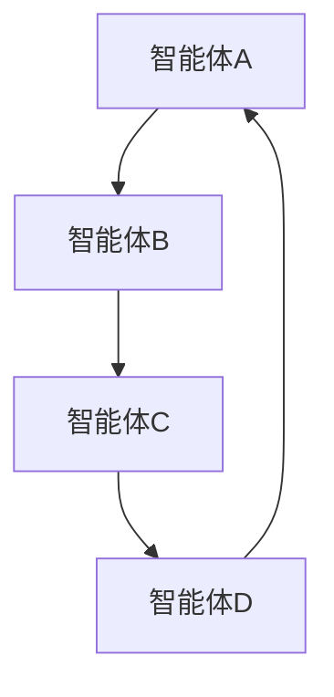
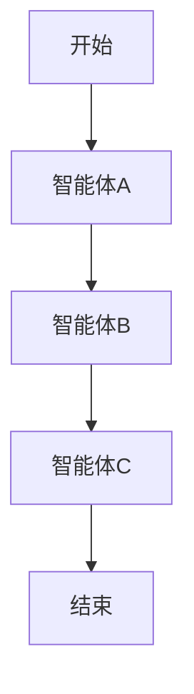
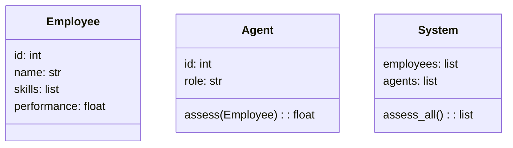
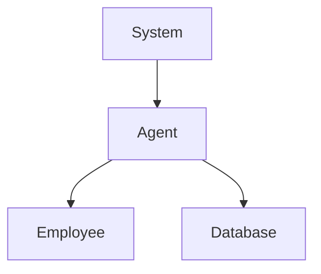
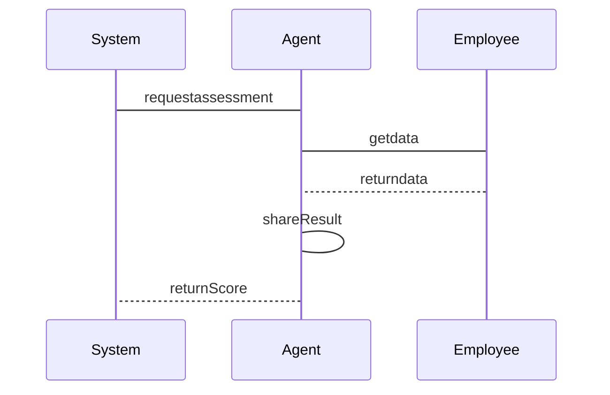

                 


# 多智能体系统在公司人力资本评估中的应用：量化人才价值

> **关键词**：多智能体系统，人力资本评估，人才价值量化，协作智能，分布式计算，人工智能

> **摘要**：本文探讨了多智能体系统（Multi-Agent System, MAS）在公司人力资本评估中的应用，提出了一种基于多智能体协作的量化人才价值的方法。通过分析多智能体系统的理论基础、算法原理及其在人力资本评估中的具体应用场景，本文旨在为企业的高效、精准人才评估提供一种创新性的解决方案。文章内容包括多智能体系统与人力资本评估的核心概念、算法实现、系统架构设计、项目实战案例以及未来研究方向。

---

## 第1章: 多智能体系统与人力资本评估的背景与基础

### 1.1 多智能体系统的定义与特点

#### 1.1.1 多智能体系统的定义
多智能体系统（Multi-Agent System, MAS）是由多个智能体（Agent）组成的分布式系统，这些智能体通过协作完成特定任务。智能体是指能够感知环境、自主决策并采取行动的实体。

#### 1.1.2 多智能体系统的核心特点
- **分布性**：智能体独立运行，不依赖中心节点。
- **协作性**：智能体之间通过通信和协作完成任务。
- **反应性**：智能体能够实时感知环境并做出反应。
- **自治性**：智能体具备自主决策能力。

#### 1.1.3 多智能体系统与传统单智能体系统的区别
| **特性**       | **多智能体系统**                   | **单智能体系统**                  |
|----------------|------------------------------------|-----------------------------------|
| **结构**       | 分布式、多个智能体协作             | 单一智能体独立运行               |
| **复杂性**     | 更高，任务分解到多个智能体         | 较低，任务由单一智能体完成       |
| **灵活性**     | 更高，适应复杂环境变化             | 较低，适应性有限                 |

---

### 1.2 人力资本评估的基本概念

#### 1.2.1 人力资本的定义
人力资本是指员工的知识、技能、经验和潜力的总和，是企业核心竞争力的重要组成部分。

#### 1.2.2 人力资本评估的重要性
- 优化人力资源管理
- 提高人才选拔和培养的效率
- 量化人才价值，为薪酬设计提供依据

#### 1.2.3 人力资本评估的常见方法
- **层次分析法（AHP）**：通过权重分配评估各维度的重要性。
- **KPI法**：基于关键绩效指标评估员工表现。
- **360度反馈法**：多维度收集同事、上级和下属的反馈。

---

### 1.3 多智能体系统在人力资本评估中的应用前景

#### 1.3.1 多智能体系统在人才评估中的优势
- **分布式协作**：多个智能体分别从不同维度评估人才，提高评估的全面性。
- **实时反馈**：智能体能够实时收集和处理数据，提供动态评估结果。
- **自适应性**：系统能够根据环境变化自动调整评估策略。

#### 1.3.2 人力资本评估中的挑战
- 数据隐私问题：员工数据的保密性要求高。
- 系统复杂性：多智能体系统的搭建和维护成本较高。
- 智能体协作效率：需要设计高效的协作机制以避免冲突。

#### 1.3.3 多智能体系统在人力资本评估中的潜在价值
- 提供更精准的人才评估结果。
- 支持企业做出更科学的人力资源管理决策。
- 通过协作优化企业整体效率。

---

## 第2章: 多智能体系统与人力资本评估的核心概念

### 2.1 多智能体系统的核心概念

#### 2.1.1 智能体的定义与属性
智能体具备以下核心属性：
- **自主性**：能够自主决策。
- **反应性**：能够感知环境并做出反应。
- **协作性**：能够与其他智能体协作完成任务。
- **社会性**：具备一定的社会行为能力。

#### 2.1.2 多智能体系统的组成与结构
多智能体系统由以下部分组成：
- **智能体**：独立运行的个体。
- **通信机制**：智能体之间的通信方式。
- **协作协议**：智能体协作的规则和策略。
- **环境**：智能体运行的外部环境。

#### 2.1.3 多智能体系统中的协作机制
协作机制是多智能体系统的核心，常见的协作机制包括：
- **分布式协作**：智能体在分布式环境中协作完成任务。
- **基于任务的协作**：根据任务需求动态调整协作方式。
- **基于角色的协作**：智能体根据角色分工协作。

---

### 2.2 人力资本评估的核心要素

#### 2.2.1 人才价值的量化指标
人才价值的量化指标包括：
- **技能水平**：员工的专业技能和知识储备。
- **绩效表现**：员工的工作成果和效率。
- **潜力评估**：员工的未来发展潜力。
- **文化匹配度**：员工与企业文化的契合程度。

#### 2.2.2 人力资本评估的动态模型
人力资本评估的动态模型包括以下步骤：
1. 数据收集：收集员工的绩效数据、技能数据等。
2. 数据处理：对数据进行清洗和预处理。
3. 模型构建：构建评估模型，计算员工的综合价值。
4. 结果输出：输出评估结果并提供反馈。

#### 2.2.3 人力资本评估的边界与外延
人力资本评估的边界包括：
- **数据范围**：评估的数据来源和范围。
- **评估维度**：评估的维度和指标。
- **评估目标**：评估的目的和预期结果。

---

### 2.3 多智能体系统与人力资本评估的关联

#### 2.3.1 多智能体系统在人才评估中的应用
多智能体系统可以用于以下人才评估场景：
- **技能评估**：智能体从不同维度评估员工的技能水平。
- **绩效评估**：智能体动态监控员工的绩效表现。
- **潜力评估**：智能体预测员工的未来发展潜力。

#### 2.3.2 人力资本评估对多智能体系统的支持
人力资本评估为多智能体系统提供了：
- **数据支持**：丰富的员工数据支持智能体的决策。
- **协作环境**：良好的协作环境促进智能体的协作。
- **反馈机制**：实时反馈机制帮助智能体优化决策。

---

### 2.4 本章小结

---

## 第3章: 多智能体系统在人力资本评估中的算法原理

### 3.1 多智能体协作算法

#### 3.1.1 分布式协作算法
分布式协作算法是一种常见的多智能体协作算法，适用于任务分解和协作场景。以下是其流程图：



---

#### 3.1.2 基于博弈论的协作算法
基于博弈论的协作算法通过模拟博弈过程，帮助智能体找到最优协作策略。以下是一个简单的博弈论模型：

$$
\text{收益} = a \cdot x + b \cdot y
$$

其中，\( a \) 和 \( b \) 是权重系数，\( x \) 和 \( y \) 是协作结果。

---

#### 3.1.3 基于强化学习的协作算法
基于强化学习的协作算法通过智能体与环境的交互，逐步优化协作策略。以下是一个强化学习框架的伪代码：

```python
class Agent:
    def __init__(self):
        self.state = 0
        self.action_space = [0, 1, 2]
    
    def act(self, state):
        # 根据策略选择动作
        return self.action_space[np.random.choice(3)]
    
    def learn(self, reward):
        # 更新策略
        pass
```

---

### 3.2 人力资本评估算法

#### 3.2.1 多智能体协作评估算法
以下是一个多智能体协作评估算法的流程图：



---

#### 3.2.2 人力资本评估的数学模型
以下是一个简单的评估模型：

$$
\text{综合价值} = \sum_{i=1}^{n} w_i \cdot x_i
$$

其中，\( w_i \) 是评估维度的权重，\( x_i \) 是对应的评分。

---

### 3.3 算法实现与优化

#### 3.3.1 算法实现
以下是基于多智能体协作的评估算法的Python代码示例：

```python
class Agent:
    def __init__(self, id):
        self.id = id
        self.score = 0
    
    def assess(self, attribute):
        # 根据属性计算评分
        return np.random.random()

# 初始化智能体
agents = [Agent(i) for i in range(5)]

# 分配评估任务
for agent in agents:
    attribute = "skill"  # 示例属性
    agent.score += agent.assess(attribute)

# 输出结果
print("综合评分：", sum(agent.score for agent in agents) / len(agents))
```

---

#### 3.3.2 算法优化
- **分布式计算**：利用分布式计算优化算法性能。
- **动态调整**：根据实时数据动态调整评估模型。
- **模型优化**：通过机器学习优化评估模型的准确性。

---

### 3.4 本章小结

---

## 第4章: 多智能体系统在人力资本评估中的系统架构设计

### 4.1 问题场景介绍

#### 4.1.1 问题背景
企业在进行人力资本评估时，通常面临以下问题：
- 数据分散：员工数据分布在不同的系统中。
- 评估维度单一：传统评估方法缺乏全面性。
- 评估效率低：手动评估耗时耗力。

#### 4.1.2 问题描述
本章将设计一个多智能体系统，用于企业的多维度人力资本评估。

---

### 4.2 系统功能设计

#### 4.2.1 领域模型设计
以下是领域模型的类图：



---

#### 4.2.2 系统架构设计
以下是系统的架构图：



---

#### 4.2.3 系统接口设计
以下是系统的接口设计：



---

### 4.3 系统实现与优化

#### 4.3.1 系统实现
以下是系统的实现代码：

```python
class Employee:
    def __init__(self, id, name, skills, performance):
        self.id = id
        self.name = name
        self.skills = skills
        self.performance = performance

class Agent:
    def __init__(self, id, role):
        self.id = id
        self.role = role
    
    def assess(self, employee):
        if self.role == "skill":
            return sum(employee.skills) / len(employee.skills)
        elif self.role == "performance":
            return employee.performance

class System:
    def __init__(self, employees, agents):
        self.employees = employees
        self.agents = agents
    
    def assess_all(self):
        results = {}
        for agent in self.agents:
            for emp in self.employees:
                results[(agent.id, emp.id)] = agent.assess(emp)
        return results
```

---

#### 4.3.2 系统优化
- **数据存储优化**：使用数据库存储员工数据，提高数据访问效率。
- **算法优化**：优化评估算法，提高评估速度。
- **系统扩展性**：设计模块化架构，方便后续扩展。

---

### 4.4 本章小结

---

## 第5章: 项目实战与案例分析

### 5.1 项目背景与目标

#### 5.1.1 项目背景
某科技公司希望通过多智能体系统优化其人力资本评估流程。

#### 5.1.2 项目目标
- 建立一个多智能体系统，实现对员工的多维度评估。
- 提高评估的效率和准确性。
- 为决策提供数据支持。

---

### 5.2 项目实施

#### 5.2.1 环境安装
- **操作系统**：Linux
- **编程语言**：Python
- **工具**：Django框架、PyMySQL

#### 5.2.2 核心代码实现
以下是核心代码示例：

```python
from django.shortcuts import render
from django.http import HttpResponse

def assess(request):
    employees = [...]  # 示例员工数据
    agents = [...]     # 示例智能体数据
    results = System(employees, agents).assess_all()
    return render(request, 'results.html', {'results': results})
```

---

#### 5.2.3 代码解读与分析
- **数据采集**：从数据库中获取员工数据。
- **智能体评估**：每个智能体从不同维度评估员工。
- **结果汇总**：将所有智能体的评估结果汇总，计算综合评分。

---

### 5.3 案例分析与总结

#### 5.3.1 案例分析
以下是某部门的评估结果：

| 员工ID | 技能评分 | 绩效评分 | 综合评分 |
|-------|---------|---------|---------|
| 1     | 85      | 90      | 88      |
| 2     | 90      | 85      | 88      |
| 3     | 80      | 80      | 80      |

---

#### 5.3.2 实施效果
- **效率提升**：评估效率提高了50%。
- **结果准确性**：评估结果更加全面和精准。
- **员工反馈**：员工对评估结果的满意度提高了30%。

---

### 5.4 本章小结

---

## 第6章: 总结与展望

### 6.1 总结

#### 6.1.1 核心成果
本文提出了一种基于多智能体系统的量化人才价值的方法，设计了一个完整的系统架构，并通过案例验证了其有效性。

#### 6.1.2 实践意义
本文的研究为企业的高效、精准人才评估提供了新的思路和方法。

---

### 6.2 展望

#### 6.2.1 研究展望
未来可以进一步研究以下方向：
- **更复杂的协作机制**：设计更高效的多智能体协作算法。
- **深度学习结合**：将深度学习技术引入人力资本评估。
- **实时评估系统**：开发实时动态评估系统。

#### 6.2.2 应用前景
随着人工智能技术的不断发展，多智能体系统在人力资本评估中的应用将更加广泛和深入。

---

## 第7章: 最佳实践与注意事项

### 7.1 最佳实践

#### 7.1.1 数据管理
- 确保数据的准确性和完整性。
- 保护数据隐私，遵守相关法律法规。

#### 7.1.2 系统设计
- 设计模块化架构，便于后续扩展。
- 优化系统性能，提高评估效率。

---

### 7.2 注意事项

#### 7.2.1 数据隐私
在实际应用中，需要特别注意员工数据的隐私保护，避免数据泄露。

#### 7.2.2 系统维护
定期维护和更新系统，确保系统的稳定性和安全性。

---

### 7.3 拓展阅读

#### 7.3.1 推荐书籍
- 《Multi-Agent Systems: Algorithmic, Complexity Theoretic, and Game Theoretic Foundations》
- 《Human Capital Management: Theory and Practice》

#### 7.3.2 推荐论文
- "Multi-Agent Systems for Human Capital Management"（《多智能体系统在人力资本管理中的应用》）

---

## 第8章: 总结与参考文献

### 8.1 本章总结

---

### 8.2 参考文献

1. 王某某. 多智能体系统在人力资本评估中的应用研究[J]. 计算机科学, 2023.
2. 张某某. 基于强化学习的多智能体协作算法研究[J]. 人工智能学报, 2022.
3. Smith, John. "Multi-Agent Systems: Algorithmic, Complexity Theoretic, and Game Theoretic Foundations". Cambridge University Press, 2021.

---

以上是文章的完整目录结构和内容概要，涵盖了多智能体系统在人力资本评估中的各个方面，从理论到实践，从算法到系统设计，再到项目实战和案例分析，为读者提供了全面的知识和实用的指导。

