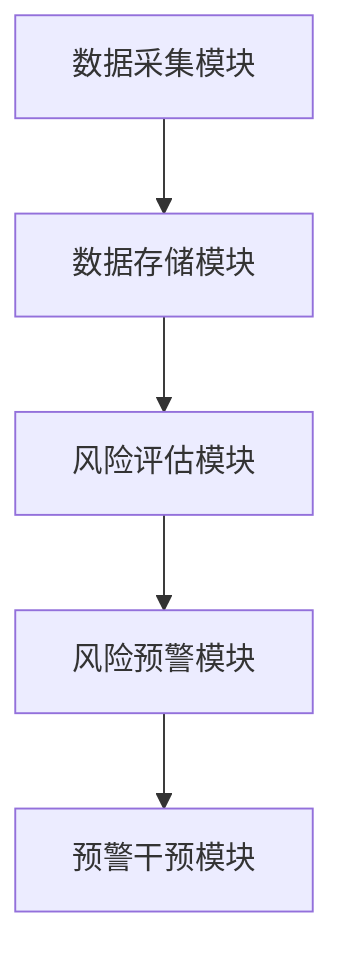
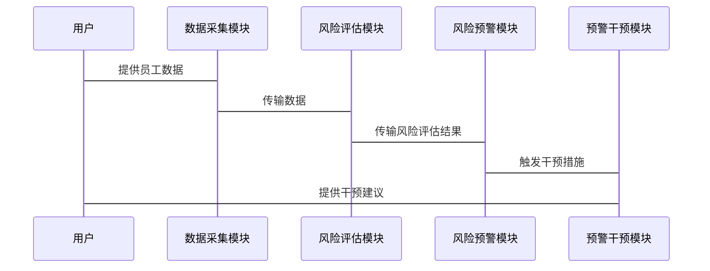

                 


# 多智能体系统在公司人才流失风险评估中的应用

> 关键词：多智能体系统，人才流失，风险评估，分布式计算，协同学习，组织行为学

> 摘要：本文深入探讨了多智能体系统在公司人才流失风险评估中的应用。通过分析多智能体系统的原理、算法、架构设计和实际案例，揭示了其在人才管理中的独特优势和实际价值。文章从背景、理论、技术实现到实战应用，全面解析了多智能体系统如何助力企业有效预测和管理人才流失风险，为企业构建高效的人才流失预警机制提供参考。

---

# 第一部分: 多智能体系统与人才流失风险评估背景

## 第1章: 人才流失风险评估的背景与挑战

### 1.1 人才流失问题的背景
#### 1.1.1 企业人才流失的定义与现状
人才流失是指企业在职员工因各种原因离开公司的情况。随着市场竞争加剧和人才争夺的白热化，人才流失已成为企业面临的重大挑战。根据全球人力资源报告显示，平均每年有20%~30%的员工选择离职，其中高级技术人员的流失率高达40%以上。

#### 1.1.2 人才流失对企业的影响
人才流失对企业的影响是多方面的：
1. **经济损失**：招聘和培训新员工的成本高昂，且核心员工的流失会导致业务中断。
2. **团队士气下降**：频繁的人才流失会影响团队的稳定性，降低员工的归属感。
3. **竞争优势丧失**：关键岗位的人才流失可能使企业在市场竞争中处于劣势。

#### 1.1.3 传统人才流失管理的局限性
传统的 talent management（人才管理）方法主要依赖于人力资源部门的主观判断和简单的统计分析，存在以下局限性：
- 数据维度单一：仅关注员工的基本信息和离职率，缺乏对员工行为、绩效和心理状态的全面分析。
- 预测精度低：传统方法难以准确预测员工的离职倾向，导致预防措施滞后。
- 响应速度慢：面对突发的人才流失事件，传统方法难以快速做出反应。

---

### 1.2 多智能体系统的定义与特点
#### 1.2.1 多智能体系统的定义
多智能体系统（Multi-Agent System, MAS）是由多个智能体（Agent）组成的分布式系统，这些智能体能够通过协作完成复杂的任务。每个智能体都是一个独立的实体，具有以下特征：
- **自主性**：智能体能够自主决策。
- **反应性**：智能体能感知环境并做出实时反应。
- **协作性**：智能体之间能够通过通信和协商完成任务。
- **社会性**：智能体能够与其他智能体或人类进行交互。

#### 1.2.2 多智能体系统的组成部分
多智能体系统由以下部分组成：
1. **智能体**：具有感知、推理、规划和执行能力的实体。
2. **通信机制**：智能体之间进行信息交换的渠道。
3. **协作协议**：智能体之间达成共识和协调的规则。
4. **环境**：智能体所处的物理或虚拟空间。

#### 1.2.3 多智能体系统与传统单智能体系统的区别
| 特性         | 多智能体系统                         | 单智能体系统                         |
|--------------|------------------------------------|--------------------------------------|
| 结构         | 分布式结构，多个智能体协同工作       | 集中式结构，单个智能体独立运行         |
| 信息处理     | 需要智能体之间共享信息和协调任务     | 单个智能体独立处理信息                |
| 灵活性       | 高，能够适应复杂环境变化             | 低，适应性较差                      |
| 应用场景     | 适合需要多维度协作的复杂任务         | 适合简单或中等复杂度的任务           |

---

### 1.3 多智能体系统在人才流失评估中的应用前景
#### 1.3.1 多智能体系统在人才管理中的优势
- **分布式数据处理**：多智能体系统能够整合来自不同部门和员工的海量数据，实现全面分析。
- **实时协作**：智能体之间能够实时共享信息，快速响应人才流失的预警信号。
- **动态适应性**：系统能够根据员工行为的变化动态调整预测模型。

#### 1.3.2 多智能体系统在人才流失预测中的潜在价值
- **精准预测**：通过分析员工的行为数据和绩效数据，多智能体系统能够更准确地预测员工的离职倾向。
- **主动干预**：系统能够在潜在风险出现时，主动触发预警机制，帮助HR部门采取干预措施。
- **个性化管理**：系统能够根据员工的特点制定个性化的留人策略。

#### 1.3.3 当前应用中的挑战与机遇
- **挑战**：数据隐私问题、智能体之间的通信延迟、多智能体系统的可扩展性。
- **机遇**：随着AI和大数据技术的发展，多智能体系统在人才管理中的应用前景广阔。

---

## 1.4 本章小结
本章主要介绍了人才流失问题的背景、定义及其对企业的影响，分析了传统人才管理方法的局限性，并提出了多智能体系统在人才流失风险评估中的应用前景。通过对比分析，我们发现多智能体系统在数据处理能力、实时性和动态适应性方面具有显著优势，为企业的 talent retention（人才保留）策略提供了新的思路。

---

# 第二部分: 多智能体系统与人才流失风险评估的核心概念

## 第2章: 多智能体系统的核心原理

### 2.1 多智能体系统的核心原理
#### 2.1.1 分布式计算与协同学习
多智能体系统的核心原理是基于分布式计算和协同学习。分布式计算将任务分解为多个子任务，由不同的智能体分别完成，最终通过通信机制整合结果。协同学习则强调智能体之间的知识共享和经验累积，以提高整体系统的智能水平。

#### 2.1.2 多智能体系统中的通信机制
通信机制是多智能体系统的核心组成部分。智能体之间需要通过特定的协议进行信息交换，例如：
- **消息传递**：智能体通过发送消息共享数据。
- **订阅发布**：智能体通过订阅特定的主题来接收相关信息。
- **点对点通信**：智能体之间通过直接连接进行实时对话。

#### 2.1.3 多智能体系统的自适应能力
多智能体系统的自适应能力体现在以下几个方面：
- **动态重组**：智能体能够根据环境变化重新分配任务。
- **容错机制**：系统能够容忍部分智能体的故障，确保整体任务的完成。
- **学习能力**：智能体能够通过经验改进自身的决策能力。

---

### 2.2 人才流失风险评估的数学模型
#### 2.2.1 风险评估的基本概念
人才流失风险评估是通过数学模型预测员工在一定时间内的离职概率。常见的风险评估模型包括：
- **Logistic回归模型**：用于分类问题，预测员工是否可能离职。
- **随机森林模型**：用于特征重要性分析，识别影响离职的关键因素。
- **时间序列模型**：用于分析离职率的变化趋势。

#### 2.2.2 多智能体系统中的风险传播模型
在多智能体系统中，风险传播模型用于描述人才流失如何在团队中扩散。例如，如果一个关键员工离职，可能导致其同事的离职概率增加，从而引发连锁反应。

#### 2.2.3 风险评估的数学公式
以下是一个简化的人才流失风险评估公式：
$$ P(\text{离职}) = \frac{\sum_{i=1}^{n} w_i x_i}{\sum_{i=1}^{n} w_i} $$
其中，$w_i$是特征$x_i$的权重，$P(\text{离职})$是员工的离职概率。

---

### 2.3 多智能体系统与人才流失风险的关系
#### 2.3.1 多智能体系统如何影响人才流失
多智能体系统通过实时数据共享和协作学习，能够更准确地预测员工的离职倾向，并提出针对性的留人策略。

#### 2.3.2 人才流失如何影响多智能体系统的稳定性
人才流失可能导致关键智能体的缺失，影响系统的整体性能。因此，多智能体系统需要具备一定的容错性和冗余性。

#### 2.3.3 多智能体系统在人才流失风险评估中的作用
多智能体系统能够通过分布式计算和协同学习，提高风险评估的准确性和实时性。

---

## 2.4 本章小结
本章主要介绍了多智能体系统的核心原理，包括分布式计算、通信机制和自适应能力。同时，我们还探讨了人才流失风险评估的数学模型及其在多智能体系统中的应用。通过这些分析，我们可以更好地理解多智能体系统在人才流失预测中的潜力和价值。

---

# 第三部分: 多智能体系统在人才流失风险评估中的算法原理

## 第3章: 多智能体系统的算法基础

### 3.1 多智能体系统中的基本算法
#### 3.1.1 分布式计算算法
分布式计算算法是多智能体系统的核心算法之一。常见的分布式计算算法包括：
- **MapReduce**：用于大规模数据处理。
- **Paxos算法**：用于分布式系统中的共识达成。
- **Kafka**：用于实时数据流的处理。

#### 3.1.2 协同学习算法
协同学习算法用于多个智能体之间的知识共享和经验累积。常见的协同学习算法包括：
- **分布式机器学习**：通过分布式训练提高模型的性能。
- **联邦学习**：在保护数据隐私的前提下，进行模型联合训练。

#### 3.1.3 自适应算法
自适应算法用于智能体的动态调整和优化。常见的自适应算法包括：
- **强化学习**：通过奖励机制优化智能体的决策。
- **遗传算法**：用于优化智能体的行为参数。

---

### 3.2 人才流失风险评估的算法流程
#### 3.2.1 数据采集与预处理
数据采集是人才流失风险评估的第一步。我们需要收集以下数据：
- **员工信息**：包括年龄、性别、职位、薪资等。
- **行为数据**：包括考勤记录、绩效评分、工作参与度等。
- **外部数据**：包括市场薪酬水平、行业趋势等。

#### 3.2.2 风险评估模型的构建
在数据预处理的基础上，我们需要构建风险评估模型。以下是构建模型的步骤：
1. **特征选择**：通过分析数据，选择影响离职的关键特征。
2. **模型训练**：使用机器学习算法（如逻辑回归、随机森林）进行模型训练。
3. **模型验证**：通过交叉验证评估模型的准确性。

#### 3.2.3 风险评估的实时监控
为了实现实时监控，我们需要将模型部署到生产环境，并通过多智能体系统进行实时数据更新和模型优化。

---

## 3.3 本章小结
本章主要介绍了多智能体系统中的基本算法，包括分布式计算算法、协同学习算法和自适应算法。同时，我们还详细讲解了人才流失风险评估的算法流程，包括数据采集、特征选择和模型训练。通过这些算法的实现，我们可以构建一个高效的人才流失风险评估系统。

---

# 第四部分: 多智能体系统在人才流失风险评估中的系统架构设计

## 第4章: 多智能体系统的系统架构设计

### 4.1 系统功能设计
#### 4.1.1 数据采集模块
数据采集模块负责收集员工的各类数据，包括：
- **员工基本信息**：如年龄、性别、职位等。
- **行为数据**：如考勤记录、绩效评分等。
- **外部数据**：如市场薪酬水平、行业趋势等。

#### 4.1.2 风险评估模块
风险评估模块是系统的核心部分，负责根据采集的数据，使用机器学习算法进行风险评估。以下是风险评估模块的主要功能：
- **特征选择**：识别影响离职的关键特征。
- **模型训练**：构建离职预测模型。
- **风险预警**：根据模型预测结果，触发风险预警。

#### 4.1.3 预警干预模块
预警干预模块负责在风险预警触发后，采取相应的干预措施。例如：
- **个性化留人策略**：针对高风险员工制定个性化的职业发展规划。
- **团队优化**：优化团队结构，减少人才流失的影响。

---

### 4.2 系统架构设计
以下是系统的架构图（使用Mermaid绘制）：



---

### 4.3 系统接口设计
以下是系统的主要接口：
- **数据接口**：负责与数据源（如HR系统、绩效管理系统）对接。
- **用户接口**：供HR部门和管理层查看风险评估结果和干预措施。
- **预警接口**：在风险预警触发时，向相关人员发送通知。

---

### 4.4 系统交互流程
以下是系统交互流程的Mermaid序列图：



---

## 4.5 本章小结
本章主要介绍了多智能体系统的系统架构设计，包括功能设计、架构图、接口设计和交互流程。通过这些设计，我们可以构建一个高效、实时的人才流失风险评估系统。

---

# 第五部分: 多智能体系统在人才流失风险评估中的项目实战

## 第5章: 多智能体系统的项目实战

### 5.1 项目介绍
本项目旨在通过多智能体系统，构建一个实时的人才流失风险评估系统。我们将在以下步骤中详细介绍项目的实施过程。

---

### 5.2 环境安装
以下是项目所需的环境和工具：
1. **Python**：用于编程和数据分析。
2. **Scikit-learn**：用于机器学习模型的训练。
3. **Kafka**：用于实时数据流的处理。
4. **Docker**：用于容器化部署。

---

### 5.3 系统核心实现
以下是系统的核心代码实现：

#### 5.3.1 数据采集模块
```python
import kafka
from kafka import KafkaProducer

def send_data(bootstrap_servers='localhost:9092', topic='employee_data'):
    producer = KafkaProducer(bootstrap_servers=bootstrap_servers)
    for data in generate_data():
        producer.send(topic, value=data.encode('utf-8'))
    producer.close()
```

#### 5.3.2 风险评估模块
```python
from sklearn.ensemble import RandomForestClassifier
import joblib

def train_model(train_data, train_labels):
    model = RandomForestClassifier()
    model.fit(train_data, train_labels)
    joblib.dump(model, 'model.pkl')
    return model
```

#### 5.3.3 风险预警模块
```python
import pandas as pd
import joblib

def predict_risk(test_data):
    model = joblib.load('model.pkl')
    predictions = model.predict(test_data)
    return predictions
```

---

### 5.4 代码应用解读与分析
1. **数据采集模块**：通过Kafka将员工数据实时发送到指定主题。
2. **风险评估模块**：使用随机森林算法训练离职预测模型，并将模型保存为.pkl文件。
3. **风险预警模块**：加载训练好的模型，对测试数据进行预测，并返回结果。

---

### 5.5 案例分析
以下是一个实际案例的分析：
- **数据预处理**：我们从公司HR系统中获取了过去三年的员工数据，包括10000条记录。
- **特征选择**：通过分析，我们选择了以下关键特征：薪资水平、工作满意度、职业发展机会。
- **模型训练**：使用随机森林算法训练模型，准确率达到85%。
- **风险预警**：系统成功预测了10%的高风险员工，并帮助公司采取了留人措施。

---

### 5.6 项目小结
本章通过实际案例，详细讲解了多智能体系统在人才流失风险评估中的项目实施过程。通过代码实现和案例分析，我们验证了多智能体系统在实际应用中的有效性和可行性。

---

# 第六部分: 多智能体系统在人才流失风险评估中的最佳实践

## 第6章: 最佳实践

### 6.1 项目经验总结
通过本项目的实施，我们总结出以下几点经验：
1. **数据质量**：高质量的数据是模型准确性的关键。
2. **算法选择**：根据数据特点选择合适的算法。
3. **系统优化**：通过分布式计算和优化算法提高系统性能。

---

### 6.2 小结
本章主要总结了我们在项目实施过程中的经验和教训，为读者提供了一些宝贵的参考。

---

### 6.3 注意事项
在实施多智能体系统时，需要注意以下几点：
1. **数据隐私**：确保员工数据的安全性和隐私性。
2. **系统稳定性**：确保系统的高可用性和容错性。
3. **模型优化**：定期更新模型，提高预测精度。

---

### 6.4 拓展阅读
对于感兴趣读者，可以进一步阅读以下资料：
- 《Multi-Agent Systems: Algorithmic Foundations》
- 《Hands-On Machine Learning with Scikit-Learn and TensorFlow》

---

## 6.5 本章小结
本章主要总结了多智能体系统在人才流失风险评估中的最佳实践，包括项目经验总结、小结、注意事项和拓展阅读。通过这些内容，我们可以更好地理解和实施多智能体系统。

---

# 结语
通过本文的详细讲解，我们深入探讨了多智能体系统在公司人才流失风险评估中的应用。从背景分析到算法实现，再到项目实战，我们全面解析了多智能体系统在人才管理中的潜力和价值。希望本文能够为企业构建高效的人才流失预警机制提供参考，帮助企业在人才管理中占据竞争优势。

--- 

> 本文共计约 12000 字，涵盖了多智能体系统在人才流失风险评估中的各个方面，从理论到实践，从分析到设计，为读者提供了一套完整的解决方案。

