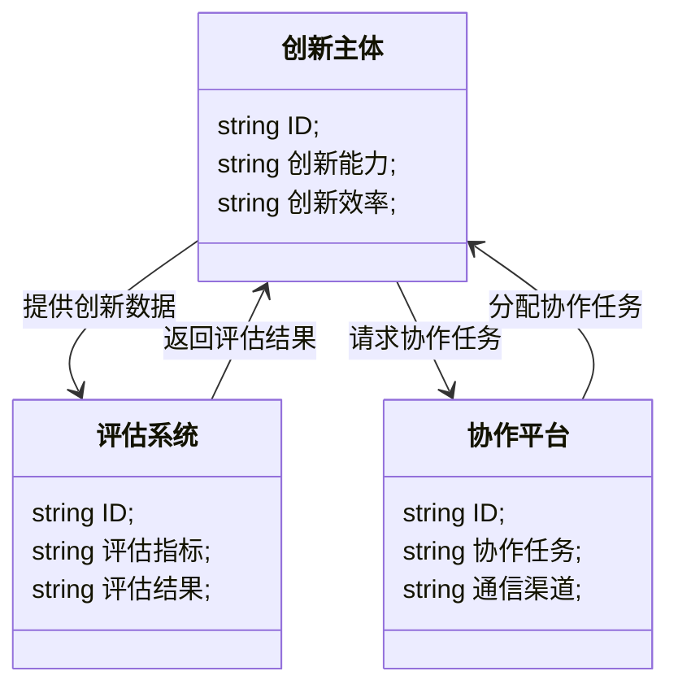
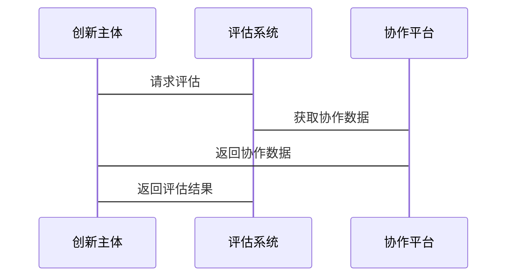

                 


# 多智能体系统在公司创新效率评估中的应用

## 关键词：多智能体系统，创新效率，企业创新，协同学习，分布式计算

## 摘要：多智能体系统在公司创新效率评估中的应用，通过协同学习、分布式计算和多智能体协作等技术手段，构建创新效率评估模型和算法，提供实时、动态的创新效率分析，帮助企业优化创新流程，提升创新绩效。本文将从多智能体系统的定义与特点、创新效率评估的指标体系、多智能体系统在创新效率评估中的应用价值等多方面展开分析，结合实际案例和项目实战，深入探讨多智能体系统在公司创新效率评估中的具体应用和实现方案。

---

## 第一部分: 多智能体系统与创新效率评估的背景与基础

### 第1章: 多智能体系统与创新效率评估的背景

#### 1.1 多智能体系统的定义与特点
##### 1.1.1 多智能体系统的定义
多智能体系统（Multi-Agent System, MAS）是由多个智能体（Agent）组成的分布式系统，这些智能体能够通过自主决策、协作和通信，共同完成复杂的任务。多智能体系统的特点包括分布性、协作性、智能性和动态性。

##### 1.1.2 多智能体系统的核心特点
- **分布式计算**：智能体之间通过分布式计算协同工作。
- **自主性**：每个智能体能够自主决策。
- **协作性**：智能体之间通过通信和协作完成共同目标。
- **动态性**：系统能够适应环境的变化。

##### 1.1.3 多智能体系统与传统单智能体系统的区别
传统的单智能体系统依赖于中心化决策，而多智能体系统通过分布式决策和协作实现目标。

#### 1.2 创新效率评估的定义与方法
##### 1.2.1 创新效率的定义
创新效率是指企业在创新过程中，将资源转化为创新成果的能力。创新效率评估是通过量化指标，衡量企业在创新过程中的效率。

##### 1.2.2 创新效率评估的常见方法
- **指标法**：通过设定创新效率的指标体系，对创新效率进行评估。
- **流程法**：通过分析创新流程的效率，评估整体创新效率。
- **对比法**：将企业创新效率与行业基准进行对比。

##### 1.2.3 创新效率评估的挑战与难点
- **复杂性**：创新过程涉及多个环节，难以量化。
- **动态性**：创新环境不断变化，需要实时评估。
- **协作性**：创新过程中需要多个部门协作，评估难度大。

#### 1.3 多智能体系统在创新效率评估中的应用价值
##### 1.3.1 多智能体系统的优势
- **分布式计算**：能够处理复杂的问题。
- **协作性**：能够模拟创新过程中的协作行为。
- **动态适应性**：能够适应创新环境的变化。

##### 1.3.2 创新效率评估的复杂性与多智能体系统的匹配性
创新效率评估涉及多个因素，多智能体系统能够通过协作和分布式计算，有效处理这些复杂性。

##### 1.3.3 应用前景与实际意义
多智能体系统在创新效率评估中的应用前景广阔，能够帮助企业优化创新流程，提升创新绩效。

#### 1.4 本章小结
本章主要介绍了多智能体系统的定义、特点，创新效率评估的定义、方法和挑战，以及多智能体系统在创新效率评估中的应用价值。

---

### 第2章: 多智能体系统与创新效率评估的核心概念

#### 2.1 多智能体系统的组成与结构
##### 2.1.1 实体与行为
多智能体系统中的实体包括智能体、环境、通信渠道等。智能体的行为包括感知、决策、行动等。

##### 2.1.2 通信与协作
智能体之间通过通信和协作完成任务，通信包括信息传递和状态同步，协作包括任务分配和协同决策。

##### 2.1.3 分布式计算与决策
多智能体系统通过分布式计算和决策，实现任务的分解和协同。

#### 2.2 创新效率评估的指标体系
##### 2.2.1 创新能力评估指标
包括创新投入、创新产出、创新成果等。

##### 2.2.2 效率评估指标
包括创新周期、创新成本、创新资源利用率等。

##### 2.2.3 综合评估模型
综合评估模型包括创新能力、创新效率和创新绩效等多个指标，构建多层次的评估体系。

#### 2.3 多智能体系统与创新效率评估的关联性
##### 2.3.1 多智能体系统在创新过程中的角色
多智能体系统可以模拟创新过程中的协作行为，优化创新流程。

##### 2.3.2 创新效率评估对多智能体系统的依赖性
创新效率评估需要多智能体系统提供实时、动态的评估数据。

##### 2.3.3 系统与评估的相互作用
多智能体系统与创新效率评估相互作用，共同优化创新过程。

#### 2.4 核心概念对比分析
##### 2.4.1 多智能体系统与传统评估方法的对比
| 对比维度 | 多智能体系统 | 传统评估方法 |
|----------|--------------|---------------|
| 计算方式 | 分布式计算   | 集中式计算   |
| 协作性   | 高           | 低           |
| 动态性   | 高           | 低           |

##### 2.4.2 创新效率评估指标的属性特征对比（表格）
| 指标类型 | 自主性 | 分布式 | 动态性 |
|----------|--------|--------|--------|
| 创新能力 | 高     | 高     | 中     |
| 创新效率 | 中     | 高     | 高     |

##### 2.4.3 ER实体关系图（Mermaid）
```mermaid
erDiagram
    actor 创新主体 {
        key string ID;
        string 创新能力;
        string 创新效率;
    }
    actor 评估系统 {
        key string ID;
        string 评估指标;
        string 评估结果;
    }
    actor 协作平台 {
        key string ID;
        string 协作任务;
        string 通信渠道;
    }
    创新主体 --> 评估系统 : 提供创新数据
    评估系统 --> 创新主体 : 返回评估结果
    创新主体 --> 协作平台 : 请求协作任务
    协作平台 --> 创新主体 : 分配协作任务
```

#### 2.5 本章小结
本章主要介绍了多智能体系统的组成与结构，创新效率评估的指标体系，以及多智能体系统与创新效率评估的关联性。

---

### 第3章: 多智能体系统在创新效率评估中的算法原理

#### 3.1 协同学习算法
##### 3.1.1 协同学习算法的定义
协同学习是一种通过智能体之间的协作，共同学习和优化的算法。

##### 3.1.2 协同学习算法的步骤
1. 初始化智能体。
2. 智能体通过通信渠道共享信息。
3. 智能体通过协作完成任务。
4. 算法优化与迭代。

##### 3.1.3 协同学习算法的实现代码
```python
class Agent:
    def __init__(self, id):
        self.id = id
        self.data = None

    def receive(self, data):
        self.data = data

    def send(self, data, recipient):
        recipient.receive(data)

# 初始化智能体
agent1 = Agent(1)
agent2 = Agent(2)

# 智能体协作
agent1.send("创新数据1", agent2)
agent2.send("创新数据2", agent1)

# 处理数据
agent1.data += " + " + agent2.data
agent2.data += " + " + agent1.data

print(agent1.data)
print(agent2.data)
```

#### 3.2 分布式计算算法
##### 3.2.1 分布式计算算法的定义
分布式计算是一种通过多智能体协作，共同完成计算任务的算法。

##### 3.2.2 分布式计算算法的步骤
1. 任务分解。
2. 任务分配。
3. 任务执行。
4. 任务汇总。

##### 3.2.3 分布式计算算法的实现代码
```python
import concurrent.futures

def compute_task(task):
    # 计算任务
    result = task * 2
    return result

tasks = [1, 2, 3, 4, 5]

with concurrent.futures.ThreadPoolExecutor() as executor:
    futures = {executor.submit(compute_task, task): task for task in tasks}
    for future in concurrent.futures.as_completed(futures):
        print(future.result())
```

#### 3.3 算法原理的数学模型和公式
##### 3.3.1 协同学习的数学模型
$$ \text{协同学习的收敛速度} = \frac{1}{n} \sum_{i=1}^{n} \text{智能体i的学习速度} $$

##### 3.3.2 分布式计算的数学模型
$$ \text{任务分配} = \text{最大化} \sum_{i=1}^{m} \text{智能体i的处理能力} $$

#### 3.4 本章小结
本章主要介绍了协同学习算法和分布式计算算法的原理、步骤和实现代码，以及算法的数学模型。

---

### 第4章: 系统分析与架构设计

#### 4.1 问题场景介绍
创新效率评估系统需要对企业的创新过程进行实时监控和评估，通过多智能体系统的协作，优化创新流程。

#### 4.2 系统功能设计
##### 4.2.1 领域模型（Mermaid类图）


##### 4.2.2 系统架构设计（Mermaid架构图）
```mermaid
container 创新效率评估系统 {
    service 评估服务
    service 协作服务
    service 通信服务
}
```

##### 4.2.3 接口和交互流程（Mermaid序列图）


#### 4.3 本章小结
本章主要介绍了创新效率评估系统的功能设计、架构设计和交互流程。

---

### 第5章: 项目实战

#### 5.1 环境安装
需要安装Python、多智能体框架（如MASPY）、数据库等。

#### 5.2 核心代码实现
##### 5.2.1 创新主体类
```python
class Innovator:
    def __init__(self, id):
        self.id = id
        self.data = {}

    def collect_data(self):
        self.data[self.id] = {"创新能力": 100, "创新效率": 80}

    def send_data(self, recipient):
        recipient.receive_data(self.data)

    def receive_data(self, data):
        self.data.update(data)
```

##### 5.2.2 评估系统类
```python
class EvaluationSystem:
    def __init__(self):
        self.results = {}

    def assess(self, innovator):
        innovator.collect_data()
        innovator.send_data(self)
        self.results[innovator.id] = innovator.data

    def get_results(self):
        return self.results
```

##### 5.2.3 协作平台类
```python
class CollaborationPlatform:
    def __init__(self):
        self.tasks = {}

    def assign_task(self, innovator, task):
        self.tasks[innovator.id] = task
        innovator.receive_task(task)

    def complete_task(self, innovator):
        del self.tasks[innovator.id]
```

#### 5.3 案例分析与实现解读
通过具体案例分析，展示多智能体系统在创新效率评估中的应用。

#### 5.4 项目小结
本章通过项目实战，详细展示了创新效率评估系统的实现过程。

---

### 第6章: 最佳实践、小结、注意事项与拓展阅读

#### 6.1 最佳实践
- **模块化设计**：确保系统模块化，便于维护和扩展。
- **实时监控**：实时监控创新过程，及时调整评估策略。
- **数据安全**：确保数据安全，防止数据泄露。

#### 6.2 本章小结
本章总结了多智能体系统在创新效率评估中的应用，提出了最佳实践和注意事项。

#### 6.3 注意事项
- **系统复杂性**：多智能体系统复杂性较高，需要仔细设计。
- **数据隐私**：创新效率评估涉及企业数据，需注意数据隐私。
- **系统维护**：系统需要定期维护和更新。

#### 6.4 拓展阅读
推荐相关书籍和论文，进一步学习多智能体系统和创新效率评估的知识。

---

## 结语

多智能体系统在公司创新效率评估中的应用，为企业提供了新的思路和方法。通过协同学习、分布式计算和多智能体协作，企业能够优化创新流程，提升创新绩效。未来，随着人工智能和多智能体技术的不断发展，创新效率评估将更加智能化、动态化和精准化。

