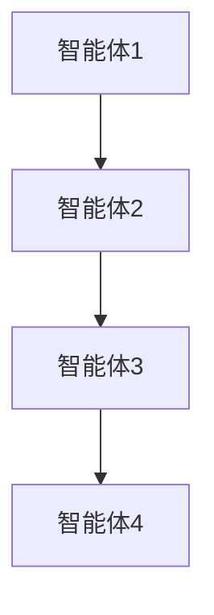
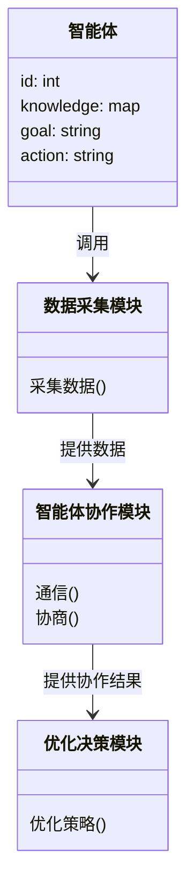
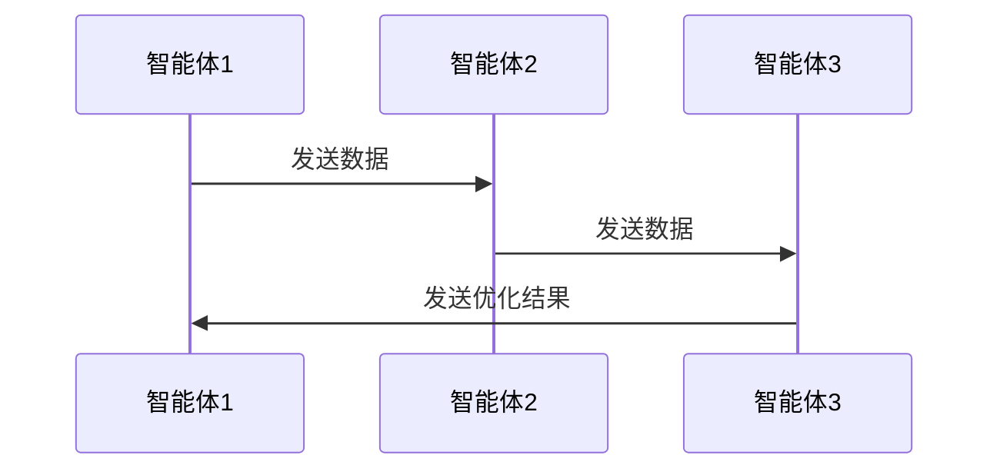

                 


# 多智能体系统在公司创新效率评估中的应用：R&D投入产出比

> 关键词：多智能体系统，R&D投入产出比，创新效率评估，分布式协作，系统建模，数据挖掘，技术经济分析

> 摘要：本文探讨了多智能体系统在公司创新效率评估中的应用，特别是R&D投入与产出比率的优化。通过分析多智能体系统的原理、算法、系统架构设计及项目实战，文章详细阐述了多智能体系统如何提升R&D效率和产出比，为企业创新效率评估提供了新的思路和方法。

---

# 第一章: 多智能体系统与R&D投入产出比的背景介绍

## 1.1 多智能体系统的定义与特点

### 1.1.1 多智能体系统的定义
多智能体系统（Multi-Agent System, MAS）是由多个相互作用的智能体组成的分布式系统，这些智能体能够通过信息交换和协作完成复杂的任务。每个智能体都是独立的实体，具有一定的知识、目标和行为能力。

**图1-1: 多智能体系统的组成结构**



### 1.1.2 多智能体系统的特点
- **分布式性**：智能体独立运行，不存在中心控制节点。
- **协作性**：通过信息共享和协作完成共同目标。
- **反应性**：能够感知环境并实时调整行为。
- **社会性**：智能体之间通过通信和协商进行互动。

### 1.1.3 多智能体系统与传统单体系统的区别
| 特性        | 多智能体系统                     | 单体系统                     |
|-------------|--------------------------------|------------------------------|
| 结构         | 分布式、去中心化               | 集中式、单中心化               |
| 协作方式     | 智能体间协作                   | 依赖单一控制中心               |
| 灵活性       | 高                            | 中等                         |

## 1.2 R&D投入产出比的定义与重要性

### 1.2.1 R&D投入的定义
R&D投入是指企业在研究与开发活动上的资金、资源和人力资源的投入，通常包括基础研究、应用研究和试验发展三个阶段。

### 1.2.2 R&D产出的定义
R&D产出是指企业在创新活动中取得的成果，包括新产品、新技术、新工艺等。

### 1.2.3 R&D投入产出比的计算公式
$$ R&D\ 投入产出比 = \frac{R&D\ 产出}{R&D\ 投入} $$

### 1.2.4 R&D投入产出比对企业创新效率的影响
- **高的投入产出比**：表明企业在R&D活动中效率较高，创新能力强。
- **低的投入产出比**：表明企业在R&D活动中可能存在资源浪费或管理不善。

## 1.3 多智能体系统与R&D投入产出比的关系

### 1.3.1 多智能体系统如何优化R&D投入
通过分布式协作，多智能体系统能够优化资源分配，提高R&D活动的效率。

### 1.3.2 多智能体系统如何提高R&D产出
智能体之间的协作能够加速创新过程，提高R&D产出的质量和数量。

### 1.3.3 多智能体系统在R&D投入产出比中的应用优势
- **实时协作**：智能体能够实时共享信息，提高决策效率。
- **分布式计算**：通过分布式计算，提高R&D活动的并行处理能力。
- **动态调整**：智能体能够根据环境变化动态调整R&D策略。

---

# 第二章: 多智能体系统的原理与模型

## 2.1 多智能体系统的原理

### 2.1.1 智能体的行为模型
智能体的行为模型通常包括感知、决策、执行三个阶段。

### 2.1.2 智能体的通信机制
智能体之间的通信可以通过消息传递、共享数据库等方式实现。

### 2.1.3 智能体的协作机制
协作机制包括任务分配、协商、协调等过程。

## 2.2 多智能体系统的数学模型

### 2.2.1 智能体的数学表示
智能体可以表示为一个函数，输入为环境信息，输出为行动。

$$ f: E \rightarrow A $$

其中，$E$表示环境状态，$A$表示智能体的动作。

### 2.2.2 多智能体系统的优化模型
$$ \max \sum_{i=1}^{n} u_i $$
$$ \text{约束条件} $$

其中，$u_i$表示智能体$i$的效用函数。

## 2.3 R&D投入产出比的数学模型

### 2.3.1 投入产出比的优化模型
$$ \max \frac{\sum_{i=1}^{n} o_i}{\sum_{i=1}^{n} c_i} $$

其中，$o_i$表示产出，$c_i$表示投入。

### 2.3.2 R&D投入产出比的影响因素
- **技术复杂度**
- **市场需求**
- **团队能力**
- **资源分配**

---

# 第三章: 系统分析与架构设计

## 3.1 项目背景介绍

### 3.1.1 项目目标
通过多智能体系统优化企业的R&D投入产出比。

### 3.1.2 项目范围
涵盖R&D活动的全生命周期。

## 3.2 系统功能设计

### 3.2.1 功能模块
- **数据采集模块**：采集R&D活动数据。
- **智能体协作模块**：实现智能体之间的协作。
- **优化决策模块**：优化R&D投入产出比。

### 3.2.2 领域模型类图



## 3.3 系统架构设计

### 3.3.1 系统架构图


### 3.3.2 接口设计
- **智能体通信接口**：支持智能体之间的消息传递。
- **数据采集接口**：支持R&D数据的采集。

## 3.4 系统交互流程

### 3.4.1 交互流程图



---

# 第四章: 项目实战

## 4.1 环境安装

### 4.1.1 安装Python
安装Python 3.8及以上版本。

### 4.1.2 安装依赖
安装`networkx`和`numpy`库：
```bash
pip install networkx numpy
```

## 4.2 核心功能实现

### 4.2.1 智能体通信代码
```python
import networkx as nx

class Agent:
    def __init__(self, id):
        self.id = id
        self.knowledge = {}
    
    def send(self, message, receiver):
        # 消息传递
        pass
    
    def receive(self, message):
        # 接收消息
        pass

# 创建智能体
agent1 = Agent(1)
agent2 = Agent(2)
agent3 = Agent(3)

# 创建通信网络
graph = nx.Graph()
graph.add_edges_from([(1,2), (2,3), (3,1)])
```

### 4.2.2 优化决策代码
```python
import numpy as np

def calculate_output(input):
    # 简单的线性回归模型
    return np.dot(input, np.array([0.5, 0.3]))
```

## 4.3 代码应用解读

### 4.3.1 数据采集与处理
通过网络爬虫采集R&D活动数据，存储在数据库中。

### 4.3.2 智能体协作
通过消息传递实现智能体之间的协作，优化R&D投入产出比。

## 4.4 实际案例分析

### 4.4.1 案例背景
某科技公司希望优化其R&D投入产出比。

### 4.4.2 实施步骤
1. 数据采集。
2. 智能体协作。
3. 优化决策。

## 4.5 项目小结

### 4.5.1 成果总结
通过多智能体系统优化了R&D投入产出比。

### 4.5.2 经验总结
- 数据质量影响优化效果。
- 智能体协作机制的设计至关重要。

---

# 第五章: 总结与展望

## 5.1 全文总结
多智能体系统在R&D投入产出比优化中具有重要应用价值。

## 5.2 未来展望
进一步研究多智能体系统的优化算法，探索其在其他领域的应用。

## 5.3 最佳实践 tips
- 重视数据质量管理。
- 合理设计智能体协作机制。
- 定期评估系统性能。

---

通过以上分析，多智能体系统在公司创新效率评估中的应用具有广阔前景，为企业优化R&D投入产出比提供了新的思路和方法。

