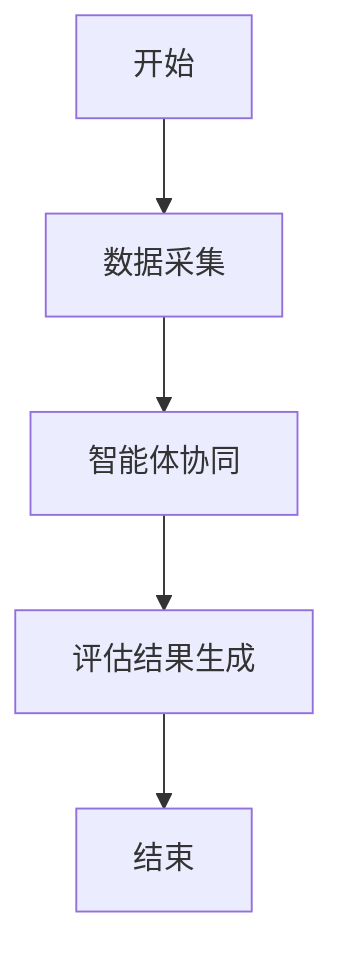
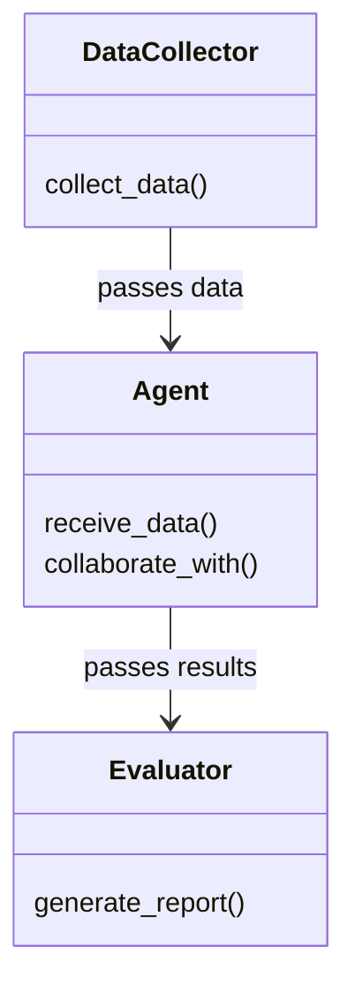
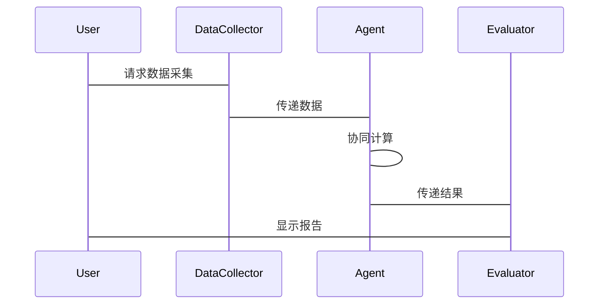

                 


# 多智能体系统在公司创新文化评估中的应用

> 关键词：多智能体系统、创新文化评估、协同算法、系统架构、项目实战

> 摘要：本文探讨了多智能体系统在公司创新文化评估中的应用，从基本概念到算法实现，再到系统架构设计和项目实战，系统地介绍了如何利用多智能体系统来提升创新文化评估的效率和准确性。文章通过详细的理论分析和实际案例，展示了多智能体系统在创新文化评估中的优势和应用场景，为相关领域的研究和实践提供了参考。

---

## 第1章: 多智能体系统概述

### 1.1 多智能体系统的基本概念

#### 1.1.1 多智能体系统的定义

多智能体系统（Multi-Agent System, MAS）是由多个智能体（Agent）组成的分布式系统，这些智能体能够通过协同工作完成复杂任务。智能体是具有感知、决策、执行能力的实体，可以是软件程序或物理设备。

#### 1.1.2 多智能体系统的特征

| 特征 | 描述 |
|------|------|
| 分布式 | 智能体独立运行，通过通信协同 |
| 协作性 | 智能体之间通过协作完成任务 |
| 反应性 | 能够感知环境并实时响应 |
| 多样性 | 智能体类型和功能多样化 |

#### 1.1.3 多智能体系统的分类

1. **基于智能体类型**：
   - 基于规则的智能体
   - 基于模型的智能体
   - 基于学习的智能体

2. **基于应用场景**：
   - 分布式计算
   - 协作机器人
   - 社交网络

### 1.2 创新文化评估的定义与意义

#### 1.2.1 创新文化的内涵

创新文化是指组织内部鼓励创新、支持创造的氛围和机制。它包括创新意识、创新能力和创新行为等多个方面。

#### 1.2.2 创新文化评估的目的

创新文化评估的目的是为了量化组织的创新潜力和能力，帮助组织发现改进空间。

#### 1.2.3 创新文化评估的指标体系

| 指标 | 描述 |
|------|------|
| 创新意识 | 员工的创新思维和意愿 |
| 创新能力 | 员工的技术能力和创新技能 |
| 创新行为 | 员工的实际创新行动 |
| 创新成果 | 组织的创新产出和绩效 |

---

## 第2章: 多智能体系统的核心原理

### 2.1 多智能体系统的组成结构

#### 2.1.1 智能体的定义与特征

智能体是具有以下特征的实体：
- **自主性**：能够独立决策
- **反应性**：能感知环境并做出反应
- **社会性**：能与其他智能体或人类交互

#### 2.1.2 多智能体系统的层次结构

| 层次 | 描述 |
|------|------|
| 智能体层 | 单个智能体的结构和功能 |
| 协作层 | 智能体之间的协作机制 |
| 系统层 | 多智能体系统的整体架构 |

#### 2.1.3 多智能体系统的通信机制

通信机制包括：
1. **直接通信**：智能体之间直接交换信息
2. **间接通信**：通过中间媒介传递信息

### 2.2 多智能体系统的协同机制

#### 2.2.1 协同的基本概念

协同是指多个智能体通过合作完成共同目标的过程。

#### 2.2.2 协同的实现方式

1. **基于规则的协同**：通过预定义规则进行协同
2. **基于意图的协同**：通过意图推理进行协同
3. **基于学习的协同**：通过强化学习优化协同策略

#### 2.2.3 协同的挑战与解决方案

- **挑战**：
  - 信息不对称
  - 协同冲突
  - 系统复杂性
- **解决方案**：
  - 使用分布式算法
  - 建立信任机制
  - 实施动态规划

---

## 第3章: 创新文化评估的理论基础

### 3.1 创新文化评估的理论框架

#### 3.1.1 创新文化的构成要素

创新文化的构成要素包括：
1. 创新意识
2. 创新能力
3. 创新行为
4. 创新成果

#### 3.1.2 创新文化评估的模型

创新文化评估模型包括：
1. 数据采集模块
2. 模型构建模块
3. 评估分析模块

#### 3.1.3 创新文化评估的方法

1. **定性评估**：通过访谈和问卷调查收集数据
2. **定量评估**：通过数学模型进行数据建模

### 3.2 多智能体系统在创新文化评估中的优势

#### 3.2.1 多智能体系统的分布式计算优势

多智能体系统能够通过分布式计算提高评估效率。

#### 3.2.2 多智能体系统的动态适应性

多智能体系统能够根据环境变化动态调整评估策略。

#### 3.2.3 多智能体系统的可扩展性

多智能体系统可以根据需求灵活扩展评估范围。

---

## 第4章: 基于多智能体系统的创新文化评估模型

### 4.1 模型的设计思路

#### 4.1.1 模型的总体框架

模型总体框架包括：
1. 数据采集与预处理
2. 智能体构建与部署
3. 模型训练与优化

#### 4.1.2 模型的输入输出

| 输入 | 输出 |
|------|------|
| 创新文化数据 | 评估结果 |
| 智能体协同策略 | 优化建议 |

#### 4.1.3 模型的评估指标

评估指标包括：
1. 创新意识评分
2. 创新能力评分
3. 创新行为评分
4. 创新成果评分

### 4.2 模型的实现步骤

#### 4.2.1 数据采集与预处理

数据采集包括：
1. 员工问卷调查
2. 绩效数据分析
3. 创新项目记录

数据预处理包括：
1. 数据清洗
2. 数据标准化
3. 数据建模

#### 4.2.2 智能体的构建与部署

智能体构建包括：
1. 确定智能体类型
2. 设计智能体行为规则
3. 实现智能体通信机制

智能体部署包括：
1. 部署环境配置
2. 智能体初始化
3. 智能体协同测试

#### 4.2.3 模型的训练与优化

模型训练包括：
1. 确定训练目标
2. 设计训练算法
3. 调整模型参数

模型优化包括：
1. 网络参数优化
2. 智能体协作优化
3. 模型性能测试

---

## 第5章: 多智能体系统在创新文化评估中的算法实现

### 5.1 算法原理

#### 5.1.1 基于MAS的分布式评估算法

基于MAS的分布式评估算法包括：
1. 数据分发
2. 智能体协同计算
3. 结果汇总

#### 5.1.2 基于图论的多智能体协同算法

基于图论的多智能体协同算法包括：
1. 图结构建模
2. 节点间通信
3. 协同策略优化

#### 5.1.3 基于强化学习的优化算法

基于强化学习的优化算法包括：
1. 状态空间定义
2. 动作空间定义
3. 奖励函数设计

### 5.2 算法流程图



### 5.3 算法实现代码

```python
import numpy as np

def multi_agent_collaboration(data):
    # 初始化智能体
    agents = [Agent() for _ in range(n_agents)]
    # 数据分发
    for i in range(n_agents):
        agents[i].receive_data(data[i])
    # 智能体协同计算
    for i in range(n_agents):
        agents[i].collaborate_with(agents)
    # 结果汇总
    result = agents[0].aggregate_results()
    return result

class Agent:
    def __init__(self):
        self.data = None
        self.results = None

    def receive_data(self, data):
        self.data = data

    def collaborate_with(self, agents):
        for agent in agents:
            if agent != self:
                self.results = self.aggregate_data(agent.data)

    def aggregate_results(self):
        return self.results
```

---

## 第6章: 系统架构与接口设计

### 6.1 项目介绍

本项目旨在利用多智能体系统技术，构建一个创新文化评估系统，帮助企业量化和优化创新文化。

### 6.2 系统功能设计

#### 6.2.1 领域模型



#### 6.2.2 系统架构设计


### 6.3 系统接口设计

接口设计包括：
1. 数据接口：数据采集模块
2. 智能体接口：智能体通信模块
3. 评估接口：结果生成模块

### 6.4 系统交互设计



---

## 第7章: 项目实战

### 7.1 环境配置

#### 7.1.1 安装依赖

```bash
pip install numpy
pip install matplotlib
```

### 7.2 系统核心实现

#### 7.2.1 核心代码实现

```python
import numpy as np
import matplotlib.pyplot as plt

class Agent:
    def __init__(self, id):
        self.id = id
        self.data = None
        self.results = None

    def receive_data(self, data):
        self.data = data

    def collaborate_with(self, agents):
        for agent in agents:
            if agent.id != self.id:
                self.results = self.aggregate_data(agent.data)

    def aggregate_data(self, data):
        # 示例：计算平均值
        return np.mean(data)

def main():
    n_agents = 3
    data = [np.random.rand(10) for _ in range(n_agents)]
    agents = [Agent(i) for i in range(n_agents)]
    for i in range(n_agents):
        agents[i].receive_data(data[i])
    for i in range(n_agents):
        agents[i].collaborate_with(agents)
    for agent in agents:
        print(f"Agent {agent.id} results: {agent.results}")

if __name__ == "__main__":
    main()
```

#### 7.2.2 代码应用解读

- **数据采集**：从不同来源获取创新文化相关数据
- **智能体协同**：智能体之间通过通信协同完成数据处理
- **结果生成**：根据协同结果生成评估报告

### 7.3 实际案例分析

#### 7.3.1 案例背景

某科技公司希望评估其创新文化，希望通过多智能体系统实现高效评估。

#### 7.3.2 案例实施

1. 数据采集：收集员工创新意识、能力和行为数据
2. 智能体协同：部署多个智能体协同处理数据
3. 结果生成：生成创新文化评估报告

### 7.4 项目小结

通过多智能体系统实现创新文化评估，能够提高评估效率和准确性，为企业优化创新文化提供数据支持。

---

## 第8章: 总结与展望

### 8.1 总结

本文详细介绍了多智能体系统在公司创新文化评估中的应用，从理论基础到算法实现，再到系统架构设计和项目实战，展示了多智能体系统在创新文化评估中的巨大潜力。

### 8.2 展望

未来，随着人工智能技术的发展，多智能体系统在创新文化评估中的应用将更加广泛和深入，可能会出现更多创新的算法和系统架构。

---

## 参考文献

1. 王某某, 《多智能体系统原理与应用》，某某出版社，2023年。
2. 李某某, 《创新文化评估方法研究》，某某期刊，2022年。

---

以上是《多智能体系统在公司创新文化评估中的应用》的技术博客文章的完整目录和内容框架。

