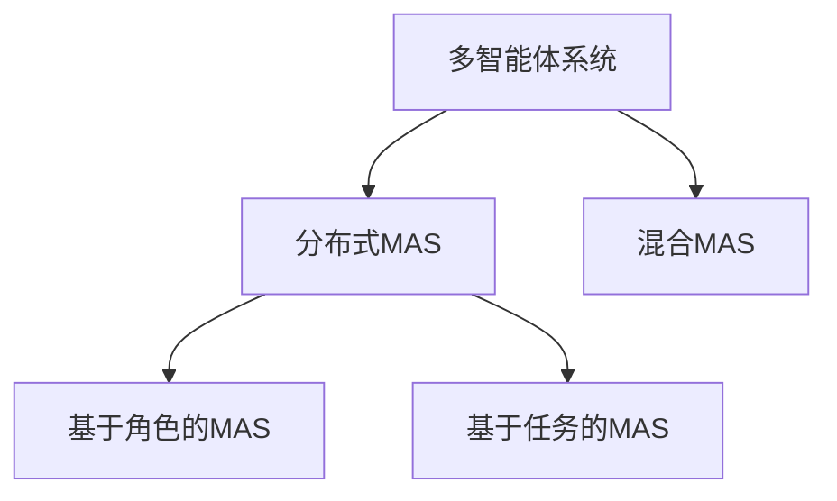
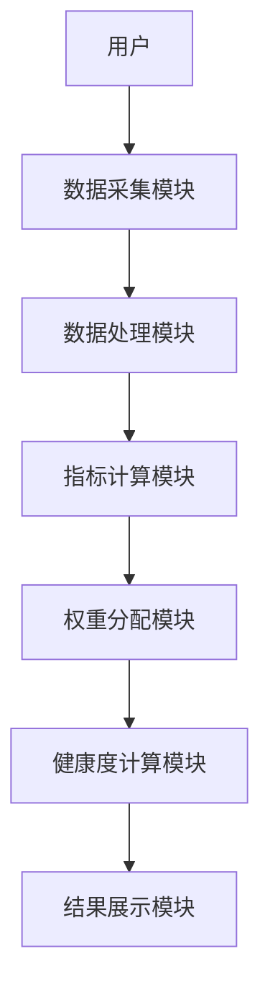

                 


# 多智能体系统在公司创新生态系统健康度评估中的应用

## 关键词：多智能体系统、公司创新生态系统、健康度评估、算法设计、系统架构

## 摘要

随着企业竞争的日益激烈，创新生态系统作为公司核心竞争力的源泉，其健康度评估变得至关重要。本文探讨了多智能体系统（MAS）在公司创新生态系统健康度评估中的应用。通过分析创新生态系统的核心要素和健康度评估的重要性，本文提出了一种基于多智能体系统的评估方法，结合算法设计和系统架构，提供了一种高效、动态的健康度评估方案。文章详细讲解了健康度评估的数学模型、算法流程和系统实现，并通过案例分析验证了方法的有效性。

---

## 第一部分: 多智能体系统概述

### 第1章: 多智能体系统基本概念

#### 1.1 多智能体系统的基本定义

多智能体系统（Multi-Agent System, MAS）是由多个智能体组成的分布式系统，这些智能体通过协作和交互完成复杂任务。智能体具备感知、决策、推理和执行能力，能够自主工作并适应环境变化。

#### 1.1.1 多智能体系统的定义

多智能体系统是由多个智能体组成的分布式系统，这些智能体能够通过通信和协作完成复杂任务。智能体具备以下特征：
- **自主性**：能够自主决策。
- **反应性**：能够感知环境并实时响应。
- **社会性**：能够与其他智能体协作。

#### 1.1.2 多智能体系统的核心特征

| 特征 | 描述 |
|------|------|
| 分布式 | 智能体分布在网络中，独立运行。 |
| 协作性 | 智能体之间通过协作完成任务。 |
| 动态性 | 系统环境和智能体状态动态变化。 |

#### 1.1.3 多智能体系统的分类



#### 1.1.4 多智能体系统的优缺点

| 优点 | 缺点 |
|------|------|
| 高效性 | 复杂性高 |
| 强健性 | 安全性低 |
| 灵活性 | 开发难度大 |

---

### 第2章: 多智能体系统的应用领域

#### 2.1 多智能体系统在人工智能中的应用

| 应用领域 | 描述 |
|---------|------|
| 智能交通 | 实现交通流量优化。 |
| 智能推荐 | 提供个性化推荐服务。 |
| 智能制造 | 实现生产过程自动化。 |

#### 2.2 多智能体系统在企业中的应用

| 应用 | 描述 |
|------|------|
| 供应链管理 | 提高供应链效率。 |
| 资源分配 | 合理分配企业资源。 |
| 项目管理 | 协调项目进度。 |

#### 2.3 多智能体系统在社会系统中的应用

| 应用 | 描述 |
|------|------|
| 智能城市 | 提供城市智能化服务。 |
| 智能医疗 | 优化医疗资源配置。 |
| 智能教育 | 提供个性化教育服务。 |

---

## 第二部分: 公司创新生态系统健康度评估

### 第3章: 公司创新生态系统概述

#### 3.1 创新生态系统的定义

创新生态系统由公司内部的创新要素和外部的创新资源组成，包括员工、技术、市场、合作伙伴等。其健康度反映了生态系统的活力和可持续性。

#### 3.2 创新生态系统健康度的重要性

健康度评估有助于识别生态系统中的潜在问题，优化资源配置，提升创新能力。

#### 3.3 创新生态系统健康度的评估标准

| 评估维度 | 描述 |
|----------|------|
| 技术创新 | 技术研发能力。 |
| 市场适应 | 市场反应速度。 |
| 资源配置 | 资源利用效率。 |

---

### 第4章: 公司创新生态系统健康度评估的挑战

#### 4.1 创新生态系统复杂性

| 挑战 | 描述 |
|------|------|
| 动态性 | 创新环境快速变化。 |
| 不确定性 | 未来趋势难以预测。 |
| 多样性 | 各类创新资源复杂。 |

#### 4.2 创新生态系统评估的难点

| 难点 | 描述 |
|------|------|
| 数据获取 | 数据来源多样且复杂。 |
| 指标权重 | 各指标的重要性难以量化。 |
| 结果解释 | 评估结果的可解释性较低。 |

---

## 第三部分: 基于多智能体系统的健康度评估

### 第5章: 健康度评估的算法设计

#### 5.1 数据收集与预处理

数据来源包括公司内部数据、市场数据和合作伙伴数据。预处理步骤包括数据清洗、特征提取和标准化。

#### 5.2 指标权重计算

使用层次分析法（AHP）计算各创新指标的权重。

#### 5.3 健康度模型构建

结合多智能体系统中的协作机制，构建健康度评估模型。公式如下：

$$健康度指数 = \sum_{i=1}^{n} w_i \cdot s_i$$

其中，$w_i$为指标权重，$s_i$为指标得分。

---

### 第6章: 系统架构设计

#### 6.1 系统功能模块

| 模块 | 功能 |
|------|------|
| 数据采集 | 采集创新生态系统数据。 |
| 指标计算 | 计算各指标的得分。 |
| 权重分配 | 确定各指标的权重。 |
| 健康度计算 | 综合计算健康度指数。 |

#### 6.2 数据库设计

使用关系型数据库存储创新生态系统数据，包括员工信息、技术专利、市场数据等。

#### 6.3 系统交互流程



---

## 第四部分: 项目实战

### 第7章: 健康度评估系统实现

#### 7.1 环境配置

使用Python和相关库（如pandas、scipy）进行系统开发。

#### 7.2 核心代码实现

```python
import pandas as pd
import numpy as np

def calculate_health_index(data, weights):
    return np.dot(data, weights)

# 示例数据
data = pd.DataFrame({
    '技术创新': [0.8, 0.6, 0.7],
    '市场适应': [0.7, 0.5, 0.6],
    '资源配置': [0.9, 0.8, 0.8]
})

# 示例权重
weights = np.array([0.4, 0.3, 0.3])

health_index = calculate_health_index(data, weights)
print("健康度指数:", health_index)
```

---

## 第五部分: 总结与展望

### 第8章: 总结

本文详细探讨了多智能体系统在公司创新生态系统健康度评估中的应用，提出了基于多智能体系统的评估方法，结合算法设计和系统架构，提供了一种高效、动态的健康度评估方案。

---

### 第9章: 展望

未来研究可以进一步优化算法，引入更多创新指标和动态权重调整机制，提升评估的准确性和实时性。

---

通过以上内容，本文系统地介绍了多智能体系统在公司创新生态系统健康度评估中的应用，结合理论分析和实际案例，为企业的创新管理提供了有力支持。

