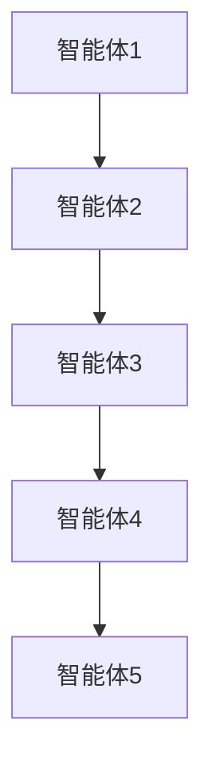
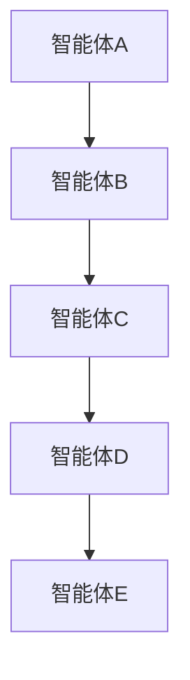
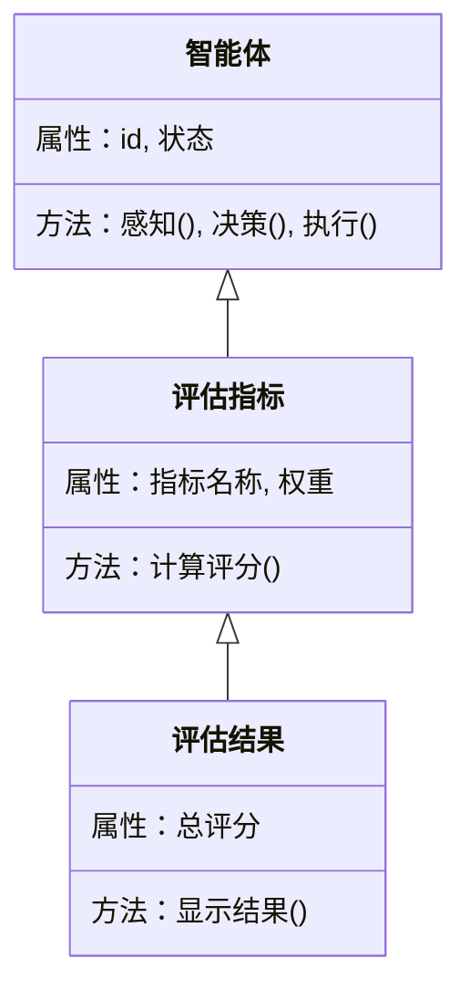
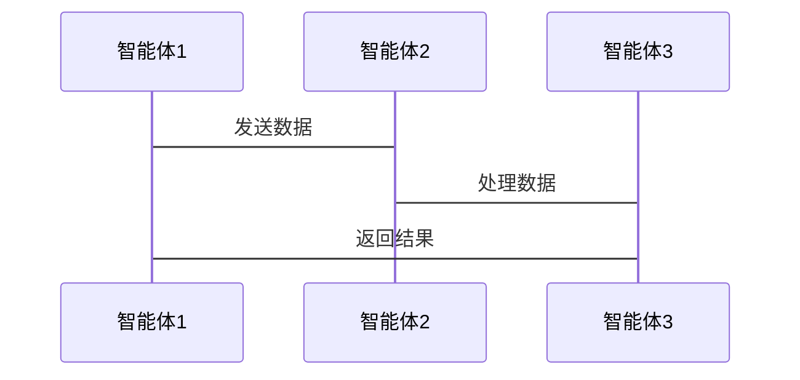

                 


# 多智能体系统在公司创新生态系统评估中的应用

> 关键词：多智能体系统, 创新生态系统, 评估模型, 协同算法, 系统架构

> 摘要：随着企业竞争的加剧，创新生态系统评估的重要性日益凸显。多智能体系统作为一种新兴的技术手段，能够有效提升创新生态系统评估的效率和准确性。本文从多智能体系统的基本概念出发，探讨其在公司创新生态系统评估中的应用，分析其核心概念与算法原理，并结合实际案例，详细阐述多智能体系统在创新生态系统评估中的系统架构设计与项目实现过程。通过本文的分析，读者可以全面了解多智能体系统在创新生态系统评估中的重要作用，并掌握其具体实施方法。

---

## 第一部分: 多智能体系统与公司创新生态系统概述

### 第1章: 多智能体系统的基本概念

#### 1.1 多智能体系统的基本概念

##### 1.1.1 多智能体系统的定义

多智能体系统（Multi-Agent System, 简称MAS）是由多个智能体（Agent）组成的复杂系统，这些智能体通过协同工作完成特定任务。智能体是具有感知、决策和执行能力的实体，可以是软件程序、硬件设备或其他形式的智能体。

##### 1.1.2 多智能体系统的特征

| 特征 | 描述 |
|------|------|
| 分布式 | 智能体分布在不同的物理位置，独立运行 |
| 协作性 | 智能体之间通过协作完成共同目标 |
| 反应性 | 系统能够实时感知环境变化并做出响应 |
| 自主性 | 智能体具有自主决策能力 |

##### 1.1.3 多智能体系统与传统单智能体系统的区别

| 对比维度 | 多智能体系统 | 单智能体系统 |
|----------|--------------|---------------|
| 系统结构 | 分布式结构     | 集中式结构     |
| 协作性   | 高度依赖协作   | 单一决策主体   |
| 应用场景 | 适用于复杂任务 | 适用于简单任务 |

#### 1.2 公司创新生态系统的基本概念

##### 1.2.1 创新生态系统的定义

创新生态系统是指由企业、合作伙伴、客户、供应商等多方参与者共同构成的生态系统，这些参与者通过协作和竞争推动创新。

##### 1.2.2 创新生态系统的核心要素

| 要素 | 描述 |
|------|------|
| 企业 | 核心创新主体 |
| 合作伙伴 | 提供技术支持或资源 |
| 客户 | 提供需求反馈 |
| 供应商 | 提供原材料或服务 |

#### 1.3 多智能体系统在公司创新生态系统中的应用背景

##### 1.3.1 公司创新生态系统评估的重要性

创新生态系统评估是企业制定战略决策的重要依据。通过评估可以发现生态系统的优劣势，优化资源配置，提升创新能力。

##### 1.3.2 多智能体系统在创新生态系统评估中的优势

| 优势 | 描述 |
|------|------|
| 分布式计算 | 可以同时处理大规模数据 |
| 高度协作 | 能够模拟复杂的协作关系 |
| 实时反馈 | 可以快速响应环境变化 |

##### 1.3.3 当前应用现状与挑战

当前，多智能体系统在创新生态系统评估中的应用仍处于起步阶段。主要挑战包括数据获取困难、智能体协同复杂性高、算法优化难度大等。

---

### 第2章: 多智能体系统与公司创新生态系统的联系

#### 2.1 多智能体系统的协同机制

##### 2.1.1 多智能体系统的协同原理

多智能体系统的协同基于分布式计算和通信机制。智能体之间通过消息传递进行协作，完成共同目标。

##### 2.1.2 多智能体系统中的通信与协调机制

| 机制 | 描述 |
|------|------|
| 消息传递 | 智能体之间通过消息传递信息 |
| 一致性协议 | 确保系统状态一致性 |
| 分布式决策 | 智能体独立决策并协同执行 |

##### 2.1.3 多智能体系统中的冲突解决策略

| 策略 | 描述 |
|------|------|
| 基于规则的冲突解决 | 使用预定义规则处理冲突 |
| 基于协商的冲突解决 | 智能体通过协商达成一致 |
| 基于优先级的冲突解决 | 根据优先级处理冲突 |

#### 2.2 公司创新生态系统中的多智能体角色

##### 2.2.1 创新生态系统中的主要角色分析

| 角色 | 描述 |
|------|------|
| 企业 | 创新主体，推动核心产品开发 |
| 合作伙伴 | 提供技术、资金支持 |
| 客户 | 提供需求反馈，推动产品优化 |
| 供应商 | 提供原材料或服务 |

##### 2.2.2 多智能体系统在创新生态系统中的角色分配

| 角色 | 多智能体系统中的对应 |
|------|------|
| 企业 | 核心智能体 |
| 合作伙伴 | 支持智能体 |
| 客户 | 反馈智能体 |
| 供应商 | 资源提供智能体 |

##### 2.2.3 多智能体系统与创新生态系统目标的匹配

多智能体系统的协同机制与创新生态系统的协作需求高度匹配，能够有效推动创新生态系统的优化。

#### 2.3 多智能体系统在创新生态系统评估中的作用

##### 2.3.1 多智能体系统在数据采集与处理中的作用

| 作用 | 描述 |
|------|------|
| 数据采集 | 智能体实时采集生态系统数据 |
| 数据处理 | 智能体协同处理数据，提取有用信息 |
| 数据分析 | 智能体通过算法分析数据，提供评估结果 |

##### 2.3.2 多智能体系统在评估指标计算中的应用

| 应用 | 描述 |
|------|------|
| 指标权重计算 | 智能体协同计算各评估指标的权重 |
| 综合评分 | 智能体协同计算生态系统综合评分 |
| 指标优化 | 智能体通过协作优化评估指标 |

##### 2.3.3 多智能体系统在评估结果优化中的价值

| 价值 | 描述 |
|------|------|
| 提高评估效率 | 多智能体协同工作，提高数据处理速度 |
| 优化评估结果 | 通过智能体协作，提升评估结果的准确性 |
| 实时反馈 | 智能体实时反馈评估结果，优化生态系统 |

---

## 第3章: 多智能体系统在公司创新生态系统评估中的核心概念

### 3.1 多智能体系统的协同算法

#### 3.1.1 分布式计算与多智能体协同

分布式计算是多智能体系统的核心，通过分布式计算实现智能体之间的协同。以下是分布式计算的流程图：



#### 3.1.2 基于博弈论的多智能体协同模型

基于博弈论的多智能体协同模型通过智能体之间的博弈关系实现协同。以下是博弈论模型的流程图：



#### 3.1.3 基于强化学习的多智能体协同策略

基于强化学习的多智能体协同策略通过智能体的学习和记忆实现协同。以下是强化学习模型的流程图：


### 3.2 公司创新生态系统评估的数学模型

#### 3.2.1 创新生态系统评估的指标体系

创新生态系统评估的指标体系包括以下几个方面：

| 指标 | 描述 |
|------|------|
| 创新能力 | 企业的技术创新能力 |
| 合作能力 | 企业与合作伙伴的合作能力 |
| 市场表现 | 企业的市场占有率 |
| 产品性能 | 产品的技术性能和用户满意度 |

#### 3.2.2 多智能体协同的数学表达

多智能体协同的数学表达如下：

$$
\text{总评分} = \sum_{i=1}^{n} w_i \cdot x_i
$$

其中，\( w_i \) 是第 \( i \) 个指标的权重，\( x_i \) 是第 \( i \) 个指标的评分。

#### 3.2.3 评估模型的构建与优化

评估模型的构建与优化需要考虑以下因素：

- 数据的准确性
- 指标的权重分配
- 模型的可解释性
- 模型的可扩展性

### 3.3 多智能体系统与创新生态系统评估的结合

#### 3.3.1 多智能体系统在创新生态系统评估中的应用场景

多智能体系统在创新生态系统评估中的应用场景包括：

- 数据采集与处理
- 指标计算与优化
- 评估结果的实时反馈

#### 3.3.2 多智能体系统与创新生态系统评估的结合方式

多智能体系统与创新生态系统评估的结合方式包括：

- 数据共享与协同处理
- 指标计算与优化
- 评估结果的实时反馈

#### 3.3.3 结合中的关键问题与解决方案

结合中的关键问题包括：

- 数据孤岛问题：通过数据共享机制解决
- 智能体协同问题：通过分布式计算和通信机制解决
- 模型优化问题：通过强化学习和博弈论模型解决

---

## 第4章: 多智能体系统在公司创新生态系统评估中的算法原理

### 4.1 多智能体协同算法的原理

#### 4.1.1 分布式计算的基本原理

分布式计算的基本原理是通过多智能体协同完成任务。以下是分布式计算的流程图：


#### 4.1.2 基于博弈论的协同算法

基于博弈论的协同算法通过智能体之间的博弈关系实现协同。以下是博弈论模型的流程图：


#### 4.1.3 基于强化学习的协同策略

基于强化学习的协同策略通过智能体的学习和记忆实现协同。以下是强化学习模型的流程图：


### 4.2 多智能体系统在创新生态系统评估中的算法实现

#### 4.2.1 算法实现的基本步骤

1. 数据采集与预处理
2. 指标计算与优化
3. 评估结果的实时反馈

#### 4.2.2 算法实现的关键技术

- 分布式计算技术
- 博弈论模型
- 强化学习算法

#### 4.2.3 算法实

---

## 第5章: 系统分析与架构设计

### 5.1 问题场景介绍

公司创新生态系统评估需要考虑多个因素，包括企业的创新能力、合作能力、市场表现和产品性能。通过多智能体系统的协同，可以实现对创新生态系统的全面评估。

### 5.2 项目介绍

本项目旨在通过多智能体系统实现公司创新生态系统评估，优化企业的创新能力。

### 5.3 系统功能设计

#### 5.3.1 领域模型（Mermaid 类图）



#### 5.3.2 系统架构设计（Mermaid 架构图）


#### 5.3.3 系统接口设计

- 数据接口：智能体之间的数据交互接口
- 控制接口：系统的控制接口
- 显示接口：评估结果的显示接口

#### 5.3.4 系统交互（Mermaid 序列图）



---

## 第6章: 项目实战

### 6.1 环境安装

1. 安装Python
2. 安装必要的库（如numpy、pandas、scikit-learn）
3. 安装Mermaid工具

### 6.2 系统核心实现源代码

```python
class Agent:
    def __init__(self, id):
        self.id = id
        self.state = "idle"
    
    def感知(self):
        pass
    
    def 决策(self):
        pass
    
    def 执行(self):
        pass

class 评估指标:
    def __init__(self, 名称, 权重):
        self.名称 = 名称
        self.权重 = 权重
    
    def 计算评分(self):
        pass

class 评估结果:
    def __init__(self, 总评分):
        self.总评分 = 总评分
    
    def 显示结果(self):
        print(f"总评分为：{self.总评分}")
```

### 6.3 代码应用解读与分析

1. Agent类：表示智能体，具有感知、决策和执行方法。
2. 评估指标类：表示评估指标，具有计算评分方法。
3. 评估结果类：表示评估结果，具有显示结果方法。

### 6.4 实际案例分析

假设我们有5个智能体，每个智能体负责不同的评估指标。通过协同工作，智能体计算总评分并显示结果。

### 6.5 项目小结

通过本项目，我们实现了多智能体系统在公司创新生态系统评估中的应用，优化了企业的创新能力。

---

## 第7章: 最佳实践

### 7.1 小结

多智能体系统在公司创新生态系统评估中的应用具有重要意义。通过多智能体系统的协同，可以实现对创新生态系统的全面评估。

### 7.2 注意事项

- 数据的准确性和完整性
- 智能体的协同与通信
- 算法的优化与调整

### 7.3 拓展阅读

- 多智能体系统的理论与应用
- 创新生态系统评估的方法与技术
- 人工智能在企业管理中的应用

---

## 结语

多智能体系统在公司创新生态系统评估中的应用前景广阔。随着技术的不断发展，多智能体系统将在企业管理中发挥越来越重要的作用。

