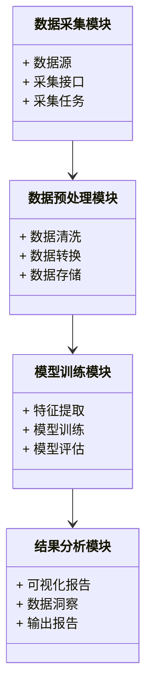

                 


## 第二部分: 多智能体系统在品牌忠诚度分析中的核心算法与系统架构

### # 第4章: 多智能体系统的协同算法与品牌忠诚度预测

#### ## 4.1 协同过滤算法在品牌忠诚度分析中的应用

##### ### 4.1.1 协同过滤算法的基本原理
协同过滤算法通过分析用户之间的相似性来推荐产品或服务。在品牌忠诚度分析中，我们可以将用户的行为数据（如购买记录、评分等）输入协同过滤算法，以预测用户对品牌的忠诚度。以下是协同过滤算法的基本步骤：

1. **数据收集**：收集用户的行为数据，包括购买记录、评分、点击流数据等。
2. **相似性计算**：计算用户之间的相似性，通常使用余弦相似度或皮尔逊相关系数。
3. **推荐生成**：基于相似用户的偏好，预测目标用户的忠诚度。

##### ### 4.1.2 协同过滤算法的实现代码
以下是协同过滤算法的一个简单实现：

```python
import numpy as np

def cosine_similarity(matrix):
    # 计算余弦相似度
    numerator = np.dot(matrix, matrix.T)
    denominator = np.outer(np.linalg.norm(matrix, axis=1), np.linalg.norm(matrix, axis=1))
    return numerator / denominator

def collaborative_filtering(pivot_matrix):
    # pivot_matrix 是用户-项目的评分矩阵
    # 计算用户之间的相似度矩阵
    user_similarity = cosine_similarity(pivot_matrix)
    # 生成推荐评分
    user_recommendations = np.zeros_like(pivot_matrix)
    for i in range(pivot_matrix.shape[0]):
        for j in range(pivot_matrix.shape[1]):
            if pivot_matrix[i, j] == 0:
                user_recommendations[i, j] = np.sum(user_similarity[i, :] * pivot_matrix[:, j])
    return user_recommendations
```

##### ### 4.1.3 协同过滤算法的数学模型
协同过滤的数学模型可以用以下公式表示：

$$
\text{推荐评分}(i,j) = \sum_{k=1}^{n} w_{i,k} \times \text{评分}(k,j)
$$

其中，\( w_{i,k} \) 是用户 \( i \) 和 \( k \) 之间的相似度权重。

#### ## 4.2 基于聚类的算法在品牌忠诚度分析中的应用

##### ### 4.2.1 基于聚类分析的品牌忠诚度预测
聚类分析是一种无监督学习方法，可以将用户分成不同的群体，每个群体代表一种品牌忠诚度类型。以下是聚类分析的步骤：

1. **数据预处理**：对数据进行归一化处理，确保各个特征的权重一致。
2. **选择聚类算法**：选择合适的聚类算法，如K-means、DBSCAN等。
3. **模型训练**：训练聚类模型，将用户分成不同的群体。
4. **结果分析**：分析每个群体的品牌忠诚度特征。

##### ### 4.2.2 基于聚类的忠诚度预测实现代码
以下是K-means聚类算法的实现代码：

```python
from sklearn.cluster import KMeans
from sklearn.preprocessing import StandardScaler

def clustering_based_recommendation(matrix):
    # 数据标准化
    scaler = StandardScaler()
    normalized_matrix = scaler.fit_transform(matrix)
    # 训练K-means模型
    kmeans = KMeans(n_clusters=5, random_state=42)
    kmeans.fit(normalized_matrix)
    # 获取聚类结果
    clusters = kmeans.labels_
    return clusters
```

##### ### 4.2.3 聚类分析的数学模型
K-means算法的目标是最小化所有点到其簇中心的平方距离之和：

$$
\text{目标函数} = \sum_{i=1}^{n} \sum_{j=1}^{k} (x_i - c_j)^2
$$

其中，\( c_j \) 是第 \( j \) 个簇的中心，\( x_i \) 是第 \( i \) 个数据点。

### # 第5章: 多智能体系统的架构设计与品牌忠诚度分析系统实现

#### ## 5.1 系统功能设计

##### ### 5.1.1 系统功能模块划分
品牌忠诚度分析系统的功能模块包括：
- 数据采集模块：负责收集用户行为数据。
- 数据预处理模块：对数据进行清洗和转换。
- 模型训练模块：训练品牌忠诚度分析模型。
- 结果分析模块：生成品牌忠诚度分析报告。

##### ### 5.1.2 系统功能模块的mermaid类图
以下是系统功能模块的类图：



#### ## 5.2 系统架构设计

##### ### 5.2.1 系统架构设计的mermaid架构图
以下是系统架构设计的架构图：


##### ### 5.2.2 系统接口设计
系统接口设计包括：
- 数据采集接口：负责接收外部数据源的数据。
- 数据预处理接口：负责对数据进行清洗和转换。
- 模型训练接口：负责训练品牌忠诚度分析模型。
- 结果分析接口：负责生成品牌忠诚度分析报告。

##### ### 5.2.3 系统交互设计
系统交互设计包括：
1. 用户通过客户端提交数据采集任务。
2. 数据采集模块接收数据并进行初步处理。
3. 数据预处理模块对数据进行清洗和转换。
4. 模型训练模块训练品牌忠诚度分析模型。
5. 结果分析模块生成报告并返回给客户端。

### 第三部分: 项目实战与品牌忠诚度分析系统实现

### # 第6章: 项目实战——基于多智能体系统的品牌忠诚度分析系统

#### ## 6.1 环境搭建与数据准备

##### ### 6.1.1 环境安装
安装所需的库和工具：
- Python 3.8+
- scikit-learn
- numpy
- pandas
- mermaid
- matplotlib

##### ### 6.1.2 数据集准备
数据集包括用户行为数据，如购买记录、评分、点击流数据等。数据集格式如下：

| 用户ID | 时间戳 | 品牌ID | 行为类型 | 行为值 |
|-------|--------|--------|----------|-------|
| 1     | 2023-10-01 | A | 购买 | 1 |
| 2     | 2023-10-02 | B | 购买 | 1 |
| ...   | ...     | ... | ... | ... |

#### ## 6.2 系统核心实现

##### ### 6.2.1 数据预处理
数据预处理代码如下：

```python
import pandas as pd
from sklearn.preprocessing import StandardScaler

# 读取数据集
data = pd.read_csv('user_behavior.csv')

# 删除缺失值
data = data.dropna()

# 标准化处理
scaler = StandardScaler()
scaled_data = scaler.fit_transform(data[['购买记录', '评分', '点击流数据']])
```

##### ### 6.2.2 模型训练
模型训练代码如下：

```python
from sklearn.cluster import KMeans

# 训练K-means模型
kmeans = KMeans(n_clusters=5, random_state=42)
kmeans.fit(scaled_data)

# 获取聚类结果
clusters = kmeans.labels_
```

##### ### 6.2.3 结果分析
结果分析代码如下：

```python
from sklearn.metrics import silhouette_score
import matplotlib.pyplot as plt

# 计算 silhouette 分数
score = silhouette_score(scaled_data, clusters)
print(f"Silhouette Score: {score}")

# 绘制聚类结果
plt.figure(figsize=(10, 6))
plt.scatter(data['购买记录'], data['评分'], c=clusters, cmap='viridis')
plt.xlabel('购买记录')
plt.ylabel('评分')
plt.title('品牌忠诚度聚类结果')
plt.show()
```

#### ## 6.3 项目总结与优化建议

##### ### 6.3.1 项目总结
本项目实现了基于多智能体系统的品牌忠诚度分析系统，通过协同过滤和聚类分析算法，成功地将用户分成不同的忠诚度群体，并生成了可视化报告。

##### ### 6.3.2 优化建议
- **特征工程**：引入更多特征，如用户 demographic 数据、产品属性等，以提高模型的准确性。
- **模型优化**：尝试不同的聚类算法，如DBSCAN、层次聚类等，以找到最适合数据的算法。
- **实时分析**：将系统部署为实时分析系统，能够实时监控用户的忠诚度变化。

### # 第7章: 总结与展望

#### ## 7.1 系统总结
本章对整个系统的实现过程进行了总结，回顾了多智能体系统在品牌忠诚度分析中的应用，包括数据预处理、模型训练和结果分析。

#### ## 7.2 未来展望
未来的研究方向包括：
- **实时分析**：开发实时品牌忠诚度分析系统，能够实时监控用户的忠诚度变化。
- **动态调整**：引入动态调整机制，能够根据市场变化自动调整品牌忠诚度分析模型。
- **多模态数据**：结合文本、图像等多种数据源，提高品牌忠诚度分析的准确性。

#### ## 7.3 最佳实践 tips
- 在进行品牌忠诚度分析时，建议先进行数据清洗和特征工程，以提高模型的准确性。
- 在选择算法时，建议进行多次实验，比较不同算法的性能，选择最适合数据的算法。
- 在系统部署时，建议采用微服务架构，能够更好地实现模块化管理和扩展。

#### ## 7.4 小结
多智能体系统在品牌忠诚度分析中的应用前景广阔，随着技术的发展，未来会有更多的创新和突破。

---

# 结语

通过本文的详细讲解，我们了解了多智能体系统在品牌忠诚度分析中的应用，从理论到实践，从算法到系统架构，全面地探讨了这一领域的核心问题。希望本文能够为相关领域的研究者和实践者提供有价值的参考和启示。

---

关键词：多智能体系统，品牌忠诚度，协同过滤，聚类分析，系统架构

摘要：本文详细探讨了多智能体系统在公司品牌忠诚度分析中的应用，从核心概念、算法原理到系统架构和项目实战，全面分析了多智能体系统在品牌忠诚度分析中的优势和实现方法。通过协同过滤和聚类分析等算法，结合系统架构设计，本文提出了一种基于多智能体系统的品牌忠诚度分析解决方案，并通过实际案例展示了该方案的可行性和有效性。

