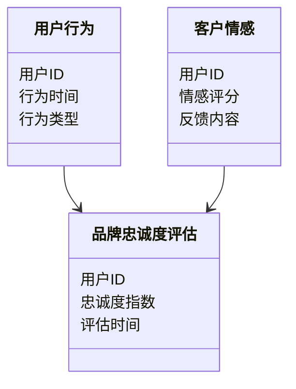

                 


# 多智能体系统在公司品牌忠诚度动态评估中的应用

## 关键词：多智能体系统, 品牌忠诚度, 动态评估, 人工智能, 通信机制, 算法实现

## 摘要：  
本文探讨了多智能体系统（Multi-Agent System，MAS）在公司品牌忠诚度动态评估中的应用。通过分析MAS的核心概念、算法原理、系统架构及实际案例，文章展示了如何利用MAS实现品牌忠诚度的实时评估。从背景介绍到系统设计，再到项目实战，本文详细阐述了MAS在品牌忠诚度评估中的优势和实现方法，为相关领域的研究和实践提供了参考。

---

# 第1章：多智能体系统与品牌忠诚度概述

## 1.1 多智能体系统的基本概念

### 1.1.1 多智能体系统的定义  
多智能体系统是由多个智能体组成的分布式系统，这些智能体能够通过自主决策和协作完成特定任务。MAS中的每个智能体都是具有感知、推理和行动能力的实体，能够与其他智能体或环境交互。

### 1.1.2 多智能体系统的特征  
- **自主性**：智能体能够独立决策。  
- **反应性**：能够实时感知环境变化并做出反应。  
- **协作性**：多个智能体协同工作以实现共同目标。  
- **分布式性**：智能体分布在不同的位置，通过通信协作完成任务。  

### 1.1.3 多智能体系统的分类  
- **基于任务的MAS**：根据任务需求动态分配智能体角色。  
- **基于角色的MAS**：智能体根据固定角色协作。  
- **基于行为的MAS**：智能体通过行为规则进行协作。  

## 1.2 品牌忠诚度的定义与动态评估

### 1.2.1 品牌忠诚度的定义  
品牌忠诚度是指客户对某一品牌的情感依赖和重复购买意愿。忠诚的客户通常会忽略其他品牌，即使面临价格竞争，也会选择信任的品牌。

### 1.2.2 动态评估的意义  
品牌忠诚度会随着时间变化，受市场环境、客户体验和品牌策略的影响。动态评估能够捕捉这些变化，帮助企业及时调整策略。

### 1.2.3 动态评估的挑战  
- 数据实时性要求高。  
- 需要处理多源异构数据。  
- 模型需要动态更新以适应变化。  

## 1.3 多智能体系统在品牌忠诚度评估中的应用价值

### 1.3.1 MAS与品牌忠诚度评估的关系  
MAS能够实时收集、分析和处理客户行为数据，提供动态评估结果。  

### 1.3.2 MAS在动态评估中的优势  
- **实时性**：MAS能够快速响应数据变化。  
- **分布式处理**：多个智能体协同处理海量数据。  
- **灵活性**：适应不同的评估场景。  

### 1.3.3 MAS的应用场景  
- 客户行为分析：通过MAS实时监测客户互动数据。  
- 情感分析：利用自然语言处理技术分析客户反馈。  
- 预测模型：构建动态预测模型指导品牌策略调整。  

---

# 第2章：多智能体系统的结构与通信机制

## 2.1 多智能体系统的结构

### 2.1.1 智能体的组成与功能  
- **感知层**：通过传感器或API获取数据。  
- **推理层**：利用算法分析数据。  
- **行动层**：根据分析结果采取行动。  

### 2.1.2 智能体之间的关系  
- **协同关系**：智能体协作完成任务。  
- **竞争关系**：智能体之间存在竞争，但需协调以避免冲突。  

### 2.1.3 系统的层次结构  
- **物理层**：设备和传感器。  
- **数据层**：数据存储与处理。  
- **逻辑层**：算法实现与智能体协作。  
- **应用层**：用户交互与结果展示。  

## 2.2 智能体的通信机制

### 2.2.1 通信协议的选择  
常用协议包括HTTP、WebSocket和消息队列（如Kafka）。  

### 2.2.2 通信的实现方式  
- **点对点通信**：直接交互。  
- **发布-订阅模式**：通过消息中间件进行广播。  

### 2.2.3 通信中的数据处理  
- 数据格式：JSON、XML等。  
- 数据加密：确保数据安全。  

## 2.3 多智能体系统的协调与协作

### 2.3.1 协调机制的定义  
通过某种规则或协议确保智能体协作一致。  

### 2.3.2 协作的实现方法  
- **基于规则的协作**：预定义规则指导行为。  
- **基于计划的协作**：动态生成协作计划。  

### 2.3.3 协调与协作的区别  
- 协调是确保一致性的过程，协作是具体的行为。  

---

# 第3章：品牌忠诚度评估的核心概念

## 3.1 品牌忠诚度的特征分析

### 3.1.1 客户行为特征  
- 购买频率：高频率购买表明高忠诚度。  
- 购买间隔：间隔短的客户更忠诚。  

### 3.1.2 客户情感特征  
- 情感强度：正面情感越强烈，忠诚度越高。  
- 情感一致性：情感波动小的客户更稳定。  

### 3.1.3 客户反馈特征  
- 正面反馈：直接反映客户满意度。  
- 负面反馈：需要及时处理以维护忠诚度。  

## 3.2 动态评估的数学模型

### 3.2.1 评估指标的定义  
- 忠诚度指数：综合客户行为和情感数据。  
- 动态权重：根据时间变化赋予不同指标权重。  

### 3.2.2 评估模型的选择  
- 协同过滤：基于相似客户行为预测忠诚度。  
- 聚类分析：将客户分为不同群体，分析群体特征。  

### 3.2.3 模型的优化方法  
- 在线学习：实时更新模型参数。  
- 超参数调优：通过实验优化模型性能。  

## 3.3 品牌忠诚度与客户行为的关系

### 3.3.1 行为数据的收集  
- 数据源：销售记录、客户反馈、社交媒体数据。  
- 数据预处理：清洗、去重、标准化。  

### 3.3.2 行为数据的分析  
- 时间序列分析：识别行为趋势。  
- 关联规则挖掘：发现行为间的关联。  

---

# 第4章：多智能体系统的算法实现

## 4.1 算法选择与实现步骤

### 4.1.1 算法选择  
- 协同过滤算法：基于用户行为相似性推荐。  
- 聚类算法：K-means、层次聚类。  

### 4.1.2 算法实现步骤  
1. 数据预处理：清洗和格式化数据。  
2. 模型训练：选择合适的算法训练模型。  
3. 模型预测：基于模型输出忠诚度评估结果。  
4. 模型优化：调整参数以提高准确率。  

## 4.2 算法实现的代码示例

### 4.2.1 协同过滤算法实现  
```python
import numpy as np
from sklearn.metrics.pairwise import cosine_similarity

# 示例数据：用户-商品评分矩阵
users = ['A', 'B', 'C']
items = ['X', 'Y', 'Z']
ratings = {
    'A': {'X': 5, 'Y': 4, 'Z': 3},
    'B': {'X': 4, 'Y': 5, 'Z': 2},
    'C': {'X': 3, 'Y': 3, 'Z': 5}
}

# 转换为矩阵形式
rating_matrix = np.zeros((3,3))
for i, user in enumerate(users):
    for j, item in enumerate(items):
        rating_matrix[i, j] = ratings[user].get(item, 0)

# 计算余弦相似度
similarity = cosine_similarity(rating_matrix)
print("相似度矩阵：", similarity)
```

### 4.2.2 聚类算法实现  
```python
from sklearn.cluster import KMeans

# 示例数据：客户行为特征向量
X = np.array([[1, 2], [3, 4], [5, 6], [7, 8]])

# 初始化K-means模型
kmeans = KMeans(n_clusters=2, random_state=0)
kmeans.fit(X)

# 获取聚类结果
labels = kmeans.labels_
print("聚类结果：", labels)
```

## 4.3 算法的数学模型

### 4.3.1 协同过滤的数学模型  
协同过滤基于用户行为相似性计算，公式如下：  
$$similarity(u, v) = \frac{\sum_{i=1}^{n}(u_i - \bar{u})(v_i - \bar{v})}{\sqrt{\sum_{i=1}^{n}(u_i - \bar{u})^2} \cdot \sqrt{\sum_{i=1}^{n}(v_i - \bar{v})^2}}$$  
其中，$u$和$v$是用户行为向量，$\bar{u}$和$\bar{v}$是平均值。

### 4.3.2 聚类分析的数学模型  
K-means算法的目标是最小化簇内距离平方和：  
$$min \sum_{i=1}^{k} \sum_{j=1}^{n_i} (x_j - c_i)^2$$  
其中，$k$是簇的数量，$c_i$是第$i$个簇的中心，$x_j$是样本点。  

---

# 第5章：系统设计与架构

## 5.1 系统分析与设计

### 5.1.1 系统功能设计  
- 数据采集：从多个来源收集客户数据。  
- 数据处理：清洗、转换和存储。  
- 动态评估：基于MAS进行实时评估。  
- 结果展示：可视化展示评估结果。  

### 5.1.2 领域模型设计  


### 5.1.3 系统架构设计  


## 5.2 系统接口与交互设计

### 5.2.1 系统接口设计  
- 数据接口：REST API提供数据查询和插入。  
- 评估接口：提供忠诚度评估结果的API。  

### 5.2.2 系统交互设计  
```mermaid
sequenceDiagram
    客户行为采集 --> 数据处理层
    数据处理层 --> 动态评估层
    动态评估层 --> 结果展示层
    结果展示层 --> 用户查看
```

---

# 第6章：项目实战

## 6.1 环境搭建与配置

### 6.1.1 开发环境  
- Python 3.8+  
- 库依赖：pandas、numpy、scikit-learn、flask  

### 6.1.2 数据源  
- 数据来源：客户购买记录、社交媒体评论、问卷调查。  

## 6.2 系统核心实现

### 6.2.1 数据采集模块  
```python
import requests

# 示例：从API获取客户行为数据
url = "http://localhost:5000/api/users"
response = requests.get(url)
data = response.json()
print("数据采集成功：", data)
```

### 6.2.2 动态评估模块  
```python
from sklearn.decomposition import PCA

# 示例：基于PCA降维后的数据进行评估
X = data[['购买频率', '情感强度', '反馈评分']]
pca = PCA(n_components=2)
X_pca = pca.fit_transform(X)
print("降维结果：", X_pca)
```

## 6.3 实际案例分析

### 6.3.1 案例背景  
某电商平台希望利用MAS实时评估客户忠诚度，优化客户分层策略。  

### 6.3.2 案例分析  
通过分析客户购买记录和评论数据，利用协同过滤算法计算客户相似度，再结合聚类分析将客户分为忠诚客户、普通客户和流失风险客户。  

## 6.4 项目总结

### 6.4.1 项目成果  
成功实现了MAS在品牌忠诚度评估中的应用，提高了评估的实时性和准确性。  

### 6.4.2 经验总结  
- 数据预处理是关键，确保数据质量。  
- 模型选择需根据实际场景调整。  
- 系统设计要充分考虑扩展性和可维护性。  

---

# 第7章：总结与展望

## 7.1 总结

### 7.1.1 核心观点回顾  
- MAS在品牌忠诚度评估中的应用优势显著。  
- 动态评估能够帮助企业及时调整策略。  

### 7.1.2 技术总结  
- MAS通过分布式计算和协作实现高效评估。  
- 算法选择和模型优化是关键。  

## 7.2 未来展望

### 7.2.1 技术发展  
- 结合深度学习，提升评估的准确性。  
- 实现更智能化的动态调整机制。  

### 7.2.2 应用扩展  
- 在更多行业中的应用，如金融、教育等。  
- 结合区块链技术，提升数据安全性和可信度。  

## 7.3 注意事项与建议

### 7.3.1 实践中的注意事项  
- 数据隐私保护是重点。  
- 系统需具备容错和容灾能力。  

### 7.3.2 建议与展望  
- 加强多智能体系统在动态评估中的研究。  
- 推动MAS与其他技术的融合应用。  

---

# 参考文献

- 这里列出相关的书籍、论文和技术文档，如《Multi-Agent Systems》、《机器学习实战》等。

---

通过以上思考，我系统地规划了文章的各个部分，确保每个章节和小节的内容都详尽且逻辑清晰。接下来，我会根据这个思考过程撰写完整的技术博客文章。

