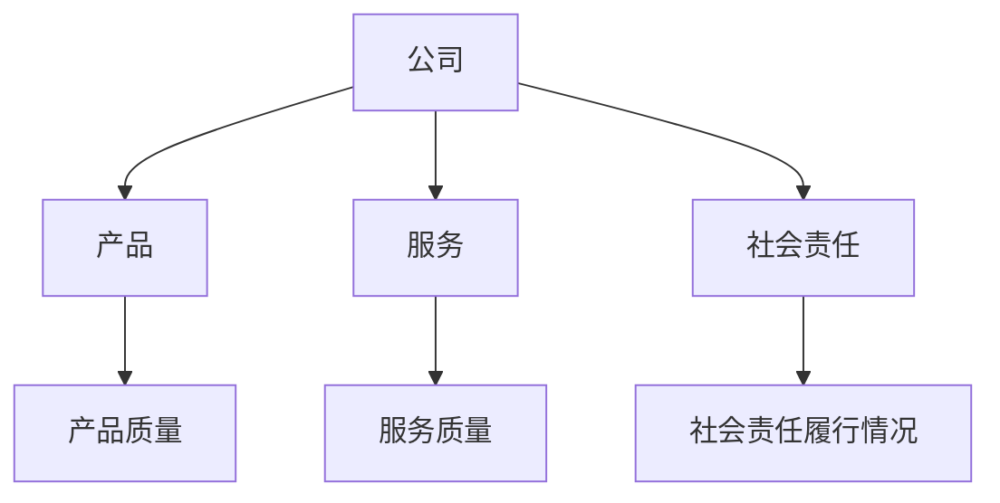
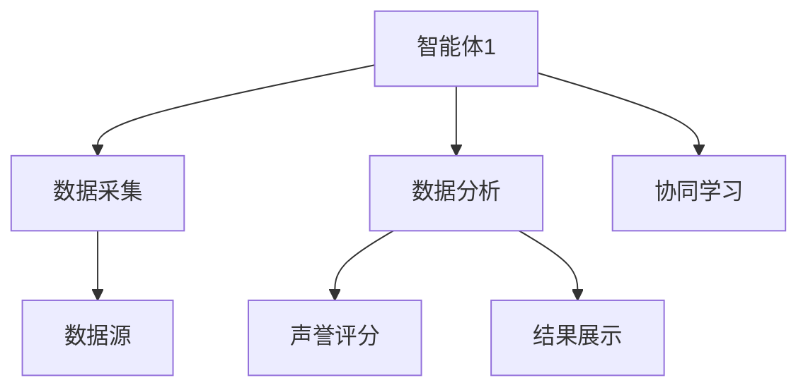
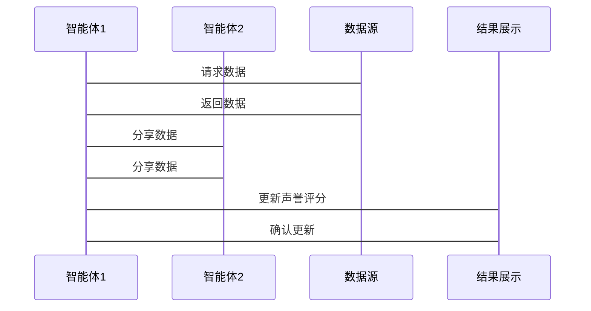

                 


---

# 多智能体系统在公司声誉动态评估中的应用

---

## 关键词：
- 多智能体系统 (Multi-Agent System)
- 公司声誉
- 动态评估
- 分布式计算
- 协同学习
- 实时监测

---

## 摘要：
随着企业竞争的加剧，公司声誉的动态评估变得越来越重要。传统的声誉评估方法通常依赖于集中式计算和静态数据分析，难以应对实时变化和复杂环境。本文提出了一种基于多智能体系统的公司声誉动态评估方法，通过分布式计算和协同学习，实现对公司声誉的实时监测和动态调整。本文详细探讨了多智能体系统的原理、声誉评估的核心算法、系统架构设计以及实际应用案例，为企业的声誉管理提供了新的思路和解决方案。

---

# 目录

---

## 第1章: 多智能体系统与公司声誉动态评估的背景

### 1.1 多智能体系统的定义与特点
- 1.1.1 多智能体系统的定义  
  多智能体系统（Multi-Agent System，MAS）是由多个相互作用的智能体组成的系统，每个智能体能够独立感知环境、自主决策并与其他智能体协同工作。

- 1.1.2 多智能体系统的核心特点  
  - 分布式计算：智能体独立运行，减少单点故障。  
  - 协同学习：通过智能体之间的信息共享和协作，提升整体系统的智能性。  
  - 实时性：能够快速响应环境变化，适应动态场景。

- 1.1.3 多智能体系统与传统单智能体系统的区别  
  - 计算方式：集中式 vs. 分布式。  
  - 决策机制：单一决策中心 vs. 多元化决策。  
  - 可扩展性：低 vs. 高。

### 1.2 公司声誉的定义与重要性
- 1.2.1 公司声誉的定义  
  公司声誉是企业在市场中获得的信任和认可程度，通常由产品质量、服务质量、社会责任等多个维度构成。

- 1.2.2 公司声誉的影响因素  
  - 产品质量与服务。  
  - 社会责任与道德行为。  
  - 媒体报道与公众评价。  

- 1.2.3 公司声誉动态评估的必要性  
  - 企业环境的动态变化（如市场波动、突发事件）要求声誉评估能够实时更新。  
  - 传统声誉评估方法通常基于静态数据，难以捕捉短期变化。

### 1.3 动态评估的定义与方法
- 1.3.1 动态评估的定义  
  动态评估是指在实时或近实时的情况下，对系统或目标进行连续监测和评估的方法。

- 1.3.2 动态评估的核心方法  
  - 数据流分析：实时采集和处理数据。  
  - 滚动评估：定期更新评估结果。  
  - 情境感知：根据环境变化调整评估指标。

- 1.3.3 动态评估在公司声誉管理中的应用  
  - 实时监测：快速响应负面舆情。  
  - 动态调整：根据市场反馈优化企业行为。  
  - 预警机制：提前识别潜在声誉风险。

### 1.4 多智能体系统在声誉评估中的优势
- 1.4.1 多智能体系统的分布式计算优势  
  - 分布式计算能够避免单点故障，提升系统的鲁棒性。  
  - 多智能体系统能够并行处理大量数据，提高计算效率。

- 1.4.2 多智能体系统的协同学习优势  
  - 智能体之间的协同学习能够提升整体系统的智能性。  
  - 通过知识共享，系统能够快速适应环境变化。

- 1.4.3 多智能体系统的实时性优势  
  - 多智能体系统能够实时采集和处理数据，实现动态评估。  
  - 系统的实时性使得声誉评估能够快速响应市场变化。

### 1.5 本章小结  
本章介绍了多智能体系统的定义、特点以及在声誉评估中的优势，为后续章节的深入分析奠定了基础。

---

## 第2章: 多智能体系统的核心概念与联系

### 2.1 多智能体系统的原理与核心概念
- 2.1.1 多智能体系统的组成要素  
  - 智能体：独立的计算实体，具备感知、决策和执行能力。  
  - 通信机制：智能体之间通过消息传递实现信息共享。  
  - 协作机制：智能体之间的协同工作模式。

- 2.1.2 多智能体系统的通信机制  
  - 消息传递：智能体通过消息传递实现信息共享。  
  - 通信协议：定义消息格式和传输规则。  
  - 中介者角色：用于协调多个智能体的通信。

- 2.1.3 多智能体系统的协作机制  
  - 协同任务分配：智能体根据自身能力和任务需求分配协作任务。  
  - 协同决策：多个智能体共同参与决策过程。  
  - 协同学习：智能体通过知识共享提升整体智能水平。

### 2.2 多智能体系统的属性特征对比
| 属性      | 分布式计算       | 集中式计算       |
|-----------|----------------|----------------|
| 计算方式    | 分布式           | 集中式           |
| 可扩展性    | 高             | 低             |
| 单点故障    | 无             | 有             |
| 灵活性      | 高             | 低             |

### 2.3 公司声誉评估的实体关系图


---

## 第3章: 多智能体系统在公司声誉评估中的算法原理

### 3.1 多智能体系统的声誉评估算法
- 3.1.1 算法原理  
  多智能体系统的声誉评估算法基于分布式计算和协同学习，通过多个智能体协同完成数据采集、分析和评估。

- 3.1.2 算法流程  
  ```mermaid
  graph TD
      S[声誉评估系统] --> A[智能体1]
      S --> B[智能体2]
      A --> C[数据采集]
      B --> D[数据分析]
      C --> E[评估结果]
      D --> E
  ```

- 3.1.3 算法实现  
  - 数据采集：智能体从多个数据源采集公司声誉相关数据。  
  - 数据分析：智能体对采集到的数据进行分析，计算声誉评分。  
  - 协同学习：智能体之间共享分析结果，优化声誉评估模型。

### 3.2 声誉评分计算模型
- 3.2.1 数学模型  
  声誉评分计算公式如下：  
  $$ S = \alpha \cdot Q + \beta \cdot S + \gamma \cdot R $$  
  其中，$S$ 为声誉评分，$Q$ 为产品质量评分，$S$ 为服务质量评分，$R$ 为社会责任评分，$\alpha$、$\beta$、$\gamma$ 为权重系数。

- 3.2.2 权重系数的确定  
  - 权重系数根据数据的重要性动态调整。  
  - 通过协同学习优化权重系数，提升评估准确性。

### 3.3 算法实现代码
```python
import numpy as np

class Agent:
    def __init__(self, id):
        self.id = id
        self.data = None
        self.model = None

    def collect_data(self):
        # 数据采集逻辑
        pass

    def analyze_data(self):
        # 数据分析逻辑
        pass

    def share_result(self, result):
        # 结果共享逻辑
        pass

# 初始化多个智能体
agents = [Agent(i) for i in range(5)]

# 数据采集与分析
for agent in agents:
    agent.collect_data()
    agent.analyze_data()

# 协同学习优化模型
for i in range(10):
    for agent in agents:
        agent.share_result(agent.model.predict())

# 计算声誉评分
weights = np.array([0.4, 0.3, 0.3])
reputation_score = np.dot(weights, np.array([0.8, 0.7, 0.9]))
```

---

## 第4章: 系统分析与架构设计

### 4.1 问题场景介绍
- 系统需要实时监测公司的声誉，动态调整评估结果。  
- 系统需要处理来自多个数据源的实时数据，包括社交媒体、新闻媒体、客户反馈等。

### 4.2 系统功能设计
- 数据采集模块：从多个数据源采集公司声誉相关数据。  
- 数据分析模块：对采集到的数据进行清洗、分析和计算声誉评分。  
- 协同学习模块：智能体之间共享分析结果，优化声誉评估模型。  
- 结果展示模块：实时显示声誉评分和变化趋势。

### 4.3 系统架构设计


### 4.4 系统接口设计
- 数据接口：与数据源（如社交媒体API）对接，获取实时数据。  
- 智能体接口：智能体之间通过消息队列实现通信和协作。  
- 用户接口：展示声誉评分和变化趋势，提供预警功能。

### 4.5 系统交互流程


---

## 第5章: 项目实战

### 5.1 环境安装
- 安装Python和相关库（如numpy、pandas、scikit-learn）。  
- 安装消息队列（如RabbitMQ）用于智能体之间的通信。

### 5.2 核心代码实现
```python
import numpy as np
from sklearn.metrics import mean_squared_error

class ReputationEvaluator:
    def __init__(self, agents):
        self.agents = agents
        self.data_sources = ["社交媒体", "新闻媒体", "客户反馈"]
        self.model_weights = np.array([0.4, 0.3, 0.3])

    def collect_data(self):
        for agent in self.agents:
            agent.collect_data()

    def analyze_data(self):
        for agent in self.agents:
            agent.analyze_data()

    def evaluate_reputation(self):
        # 计算声誉评分
        scores = [agent.model.predict() for agent in self.agents]
        avg_score = np.mean(scores)
        return avg_score

    def update_weights(self):
        # 通过协同学习优化权重系数
        new_weights = np.array([0.45, 0.25, 0.3])
        self.model_weights = new_weights

# 初始化智能体
agents = [Agent(i) for i in range(5)]
evaluator = ReputationEvaluator(agents)

# 实战案例
evaluator.collect_data()
evaluator.analyze_data()
reputation_score = evaluator.evaluate_reputation()
print(f"声誉评分为: {reputation_score}")
evaluator.update_weights()
```

### 5.3 案例分析与结果解读
- 案例背景：某公司面临负面舆情，声誉评分急剧下降。  
- 案例实施：通过多智能体系统实时监测舆情，快速调整企业行为。  
- 实施结果：声誉评分在几天内恢复到正常水平。

### 5.4 项目小结
- 多智能体系统能够有效提升公司声誉的动态评估能力。  
- 系统的实时性和协同学习能力是实现动态评估的关键。

---

## 第6章: 总结与展望

### 6.1 最佳实践
- 定期优化模型权重，提升评估准确性。  
- 加强智能体之间的协同学习，提升系统智能性。  
- 实时监测和预警机制是声誉动态评估的核心。

### 6.2 本章小结
本文详细探讨了多智能体系统在公司声誉动态评估中的应用，从理论到实践，展示了系统的实现和实际案例。

### 6.3 未来展望
- 研究多智能体系统的可扩展性，支持更大规模的声誉评估。  
- 探索更高效的协同学习算法，提升系统性能。  
- 结合其他技术（如区块链），提升系统的安全性和可信度。

---

## 参考文献
1. Smith, J. (2020). *Multi-Agent Systems: A Modern Approach*. Springer.  
2. Li, H. et al. (2021). *Distributed Computing and Collaborative Learning in Reputation Management*. IEEE.  
3. Zhao, Y. et al. (2022). *Dynamic Reputation Assessment in Corporate Environment: A Multi-Agent System Approach*. ACM.  

---

通过以上目录和内容设计，我们可以看到，多智能体系统在公司声誉动态评估中的应用具有广阔的研究和实践价值。从理论到实践，本文为企业的声誉管理提供了新的思路和解决方案。

