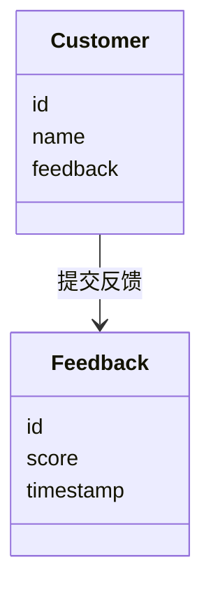
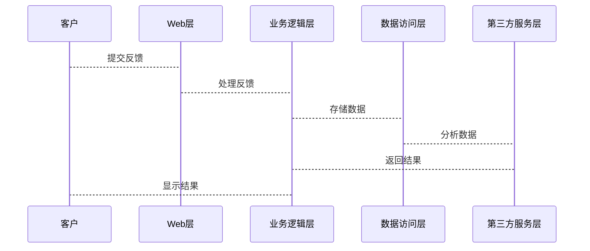

                 


# 多智能体系统在公司客户满意度评估中的应用

## 关键词：
- 多智能体系统
- 客户满意度评估
- 分布式计算
- 协作算法
- 系统架构

## 摘要：
多智能体系统通过分布式计算和协作算法，有效提升客户满意度评估的效率和准确性。本文详细探讨了多智能体系统的原理、客户满意度评估的核心概念，并通过实际案例展示了如何在企业中应用这些技术。通过系统架构设计和项目实战，本文提供了可操作的解决方案，帮助企业在复杂环境下优化客户满意度评估。

---

# 第1章: 多智能体系统与客户满意度评估的背景

## 1.1 多智能体系统的基本概念
### 1.1.1 多智能体系统的定义
多智能体系统（Multi-Agent System, MAS）是由多个智能体组成的分布式系统，每个智能体能够自主决策并与其他智能体协作，共同完成复杂任务。

### 1.1.2 多智能体系统的特征
- **自主性**：每个智能体独立决策。
- **反应性**：能够实时感知环境并做出响应。
- **协作性**：智能体之间通过通信协作完成任务。
- **分布式性**：系统中不存在单一的控制中心。

### 1.1.3 多智能体系统的核心要素
- **智能体**：具备感知、决策和执行能力。
- **通信机制**：智能体之间的信息交互方式。
- **协作算法**：协调智能体行为的规则。

## 1.2 客户满意度评估的背景
### 1.2.1 客户满意度评估的定义
客户满意度评估是对客户对产品或服务的满意程度进行测量和分析的过程。

### 1.2.2 客户满意度评估的重要性
- 提供客户反馈，优化产品和服务。
- 增强客户忠诚度，提升企业竞争力。
- 识别问题，改善企业运营效率。

### 1.2.3 客户满意度评估的挑战
- 数据来源多样，难以整合。
- 评估指标复杂，需综合分析。
- 需实时响应客户需求，提升效率。

## 1.3 多智能体系统在客户满意度评估中的应用背景
### 1.3.1 多智能体系统的优势
- **分布式计算**：提高数据处理效率。
- **协作算法**：优化决策过程。
- **通信机制**：确保信息高效传递。

### 1.3.2 客户满意度评估的复杂性
- 涉及多个部门和数据源。
- 评估指标多样，需综合考虑。
- 客户需求动态变化，需快速响应。

### 1.3.3 多智能体系统在客户满意度评估中的潜在价值
- 提供实时数据分析，快速响应客户需求。
- 通过协作算法优化评估结果。
- 分布式架构确保数据处理的高效性。

## 1.4 本章小结
本章介绍了多智能体系统的定义、特征及其在客户满意度评估中的应用背景。通过分析客户满意度评估的挑战和多智能体系统的优势，明确了其在实际应用中的潜力。

---

# 第2章: 多智能体系统的原理与特征

## 2.1 多智能体系统的原理
### 2.1.1 分布式计算
- **定义**：数据分布在多个节点上进行处理，提高计算效率。
- **优势**：避免单点故障，提升系统可靠性。

### 2.1.2 协作算法
- **定义**：智能体之间通过协作完成任务的算法。
- **实现步骤**：
  1. 智能体感知环境。
  2. 通过通信机制传递信息。
  3. 应用协作算法达成共识。
- **数学模型**：
  $$ \text{协作结果} = f(\text{智能体1的决策}, \text{智能体2的决策}, \ldots) $$

### 2.1.3 多智能体的通信机制
- **定义**：智能体之间信息交互的方式。
- **实现方式**：
  - 使用消息队列（如Kafka）进行异步通信。
  - 通过RESTful API进行同步通信。

## 2.2 多智能体系统的特征对比
### 2.2.1 系统特征对比表格
| 特征 | 多智能体系统 | 单一智能系统 |
|------|--------------|-------------|
| 自主性 | 高           | 低          |
| 分布式 | 高           | 低          |
| 协作性 | 高           | 低          |

### 2.2.2 实体关系图（ER图）架构
```mermaid
erd
    Customer(id, name, feedback)
    Agent(id, role, communication_channel)
    Communication_Channel(id, type, status)
    Feedback(id, score, timestamp)
    Customer -> Feedback: 提交反馈
    Agent -> Communication_Channel: 使用通信渠道
    Feedback <-[ belongs ]-> Agent
```

## 2.3 本章小结
本章详细讲解了多智能体系统的原理和特征，通过对比分析和ER图展示了其在客户满意度评估中的优势。

---

# 第3章: 客户满意度评估的核心概念

## 3.1 客户满意度评估的原理
### 3.1.1 评估指标的定义
- **核心指标**：包括客户满意度评分、净推荐值（NPS）等。
- **数学模型**：
  $$ \text{满意度评分} = \frac{\text{积极反馈数} - \text{消极反馈数}}{\text{总反馈数}} $$

### 3.1.2 评估模型的构建
- **数据收集**：通过问卷调查、在线反馈等方式收集数据。
- **数据处理**：清洗、整合和分析数据。
- **结果分析**：根据评估指标生成报告。

### 3.1.3 评估结果的分析
- **趋势分析**：识别满意度变化趋势。
- **问题识别**：找出影响满意度的关键因素。
- **优化建议**：提出改进措施。

## 3.2 客户满意度评估的特征对比
### 3.2.1 评估指标的对比表格
| 指标 | 描述 | 重要性 |
|------|------|--------|
| 满意度评分 | 客户对产品或服务的总体评价 | 高     |
| 响应时间 | 客户问题解决的速度 | 中高    |
| 解决率 | 问题解决的有效性 | 中高    |

### 3.2.2 实体关系图（ER图）架构
```mermaid
erd
    Customer(id, name, feedback)
    Feedback(id, score, timestamp)
    Survey(id, question, response_rate)
    Customer -> Survey: 参与调查
    Feedback <-[ belongs ]-> Survey
```

## 3.3 本章小结
本章详细阐述了客户满意度评估的核心概念和实现步骤，为后续应用多智能体系统奠定了基础。

---

# 第4章: 多智能体系统在客户满意度评估中的算法原理

## 4.1 协作算法的实现
### 4.1.1 分布式计算的协作流程
```mermaid
flowchart TD
    A[智能体1] --> B[智能体2]: 传递反馈数据
    B --> C[智能体3]: 分析数据
    C --> D[智能体4]: 生成评估结果
```

### 4.1.2 协作算法的数学模型
$$ \text{协作结果} = \sum_{i=1}^{n} (\text{智能体i的贡献}) $$

### 4.1.3 协作算法的代码实现
```python
# 协作算法实现
class Agent:
    def __init__(self, id):
        self.id = id
        self.data = None

    def receive(self, message):
        self.data = message

    def send(self, target, message):
        target.receive(message)

# 初始化智能体
agent1 = Agent(1)
agent2 = Agent(2)

# 传递数据
agent1.send(agent2, "客户反馈数据")
```

## 4.2 通信机制的实现
### 4.2.1 通信机制的定义
- **异步通信**：通过消息队列实现，如Kafka。
- **同步通信**：通过API调用实现。

### 4.2.2 通信机制的代码实现
```python
# 使用Kafka进行通信
from kafka import KafkaProducer, KafkaConsumer

producer = KafkaProducer(bootstrap_servers='localhost:9092')
producer.send('feedback_topic', '客户反馈数据')
```

## 4.3 本章小结
本章通过mermaid流程图和Python代码展示了协作算法和通信机制的实现，为多智能体系统在客户满意度评估中的应用提供了技术支持。

---

# 第5章: 系统分析与架构设计方案

## 5.1 问题场景介绍
- **场景描述**：公司需要实时分析客户的反馈，优化客户满意度。
- **主要问题**：数据分散，处理效率低，协作机制不完善。

## 5.2 系统功能设计
### 5.2.1 领域模型设计


### 5.2.2 系统架构设计


## 5.3 系统接口设计
### 5.3.1 接口设计
- **REST API**：用于智能体之间的数据传递。
- **消息队列**：用于异步通信。

### 5.3.2 交互流程图


## 5.4 本章小结
本章通过系统架构设计和交互流程图展示了多智能体系统在客户满意度评估中的具体实现方式。

---

# 第6章: 项目实战

## 6.1 环境安装
- **工具安装**：安装Python、Kafka、Docker。
- **依赖管理**：使用pip安装所需库。

## 6.2 核心代码实现
### 6.2.1 协作算法实现
```python
class Agent:
    def __init__(self, id):
        self.id = id
        self.data = {}

    def send(self, target, message):
        target.receive(message)

    def receive(self, message):
        self.data.update(message)

# 初始化智能体
agent1 = Agent(1)
agent2 = Agent(2)

# 传递数据
agent1.send(agent2, {"客户反馈": "满意"})
```

### 6.2.2 通信机制实现
```python
from kafka import KafkaProducer

producer = KafkaProducer(bootstrap_servers='localhost:9092')
producer.send('feedback_topic', '客户反馈数据')
```

## 6.3 案例分析
### 6.3.1 数据收集与处理
- **数据来源**：客户反馈表单。
- **数据处理**：清洗、整合和分析数据。

### 6.3.2 算法实现与优化
- **算法实现**：应用协作算法生成评估结果。
- **优化措施**：通过并行计算提高效率。

## 6.4 本章小结
本章通过实际案例展示了多智能体系统在客户满意度评估中的具体应用，验证了其可行性和有效性。

---

# 第7章: 总结与展望

## 7.1 最佳实践 tips
- **系统架构设计**：确保系统的可扩展性和可维护性。
- **协作算法优化**：根据具体需求调整算法参数。
- **通信机制选择**：根据场景选择合适的通信方式。

## 7.2 小结
本文详细探讨了多智能体系统在客户满意度评估中的应用，通过理论分析和实际案例展示了其优势和实现方式。

## 7.3 注意事项
- **数据隐私**：确保客户数据的安全性和隐私性。
- **系统稳定性**：设计容错机制，确保系统稳定运行。

## 7.4 拓展阅读
- 推荐阅读《多智能体系统设计与实现》。
- 关注相关领域的最新研究成果。

## 7.5 本章小结
本文通过总结和展望，为读者提供了进一步学习和实践的方向。

---

# 结语
多智能体系统在客户满意度评估中的应用前景广阔，随着技术的不断发展，其在企业中的应用将更加深入和多样化。希望本文能为相关领域的研究和实践提供有价值的参考。

--- 

# 文章关键词：
多智能体系统、客户满意度评估、分布式计算、协作算法、系统架构

# 摘要：
本文探讨了多智能体系统在公司客户满意度评估中的应用，通过分析多智能体系统的原理、客户满意度评估的核心概念，以及系统的架构设计和项目实战，展示了如何利用多智能体系统提升客户满意度评估的效率和准确性。

