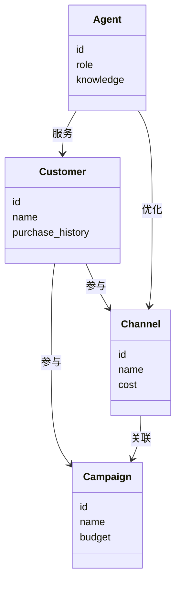
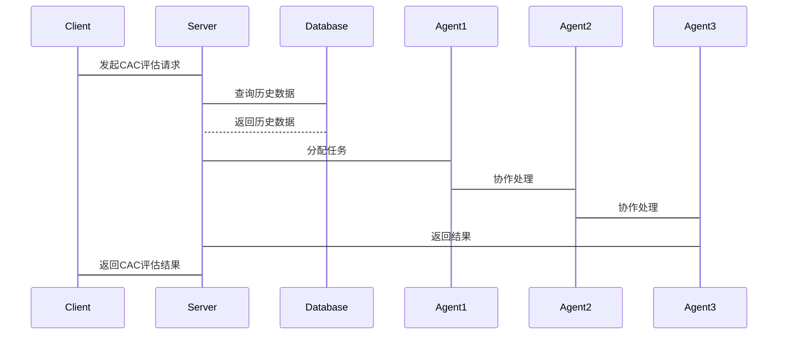

                 


---

# 多智能体系统在公司客户获取成本评估中的应用

## 关键词：多智能体系统、客户获取成本（CAC）、协同学习、优化算法、CAC评估

## 摘要：  
在当今竞争激烈的商业环境中，客户获取成本（CAC）的评估对于企业的可持续发展至关重要。传统的CAC评估方法存在数据复杂性高、模型静态化、协同性不足等问题。本文将介绍多智能体系统（MAS）在CAC评估中的应用，探讨MAS如何通过分布式计算、协同学习和动态优化提升CAC评估的精确性和效率。通过详细分析MAS的核心概念、算法原理、系统设计及实际应用案例，本文将为读者提供一个多维度的视角，展示MAS在CAC评估中的独特优势和广泛的应用前景。

---

# 第1章 多智能体系统与客户获取成本概述

## 1.1 多智能体系统的基本概念与特点

### 1.1.1 多智能体系统的定义
多智能体系统（Multi-Agent System，MAS）是由多个智能体（Agent）组成的分布式系统，每个智能体能够自主感知环境、进行推理和决策，并通过通信与协作完成复杂任务。

### 1.1.2 多智能体系统的特征
- **自主性**：每个智能体能够自主决策。
- **反应性**：智能体能够实时感知环境并做出反应。
- **协作性**：多个智能体通过通信协作完成共同目标。
- **分布式性**：系统中的智能体分布在网络中，无集中控制节点。

### 1.1.3 多智能体系统在商业中的应用
- **电子商务推荐系统**：通过智能体协同推荐商品。
- **供应链管理**：优化物流和库存管理。
- **金融市场交易**：智能体协同进行实时交易决策。

## 1.2 客户获取成本（CAC）的定义与重要性

### 1.2.1 CAC的定义
客户获取成本（CAC）是指企业吸引一位新客户所花费的总成本，包括营销费用、销售费用等。

### 1.2.2 CAC在企业中的作用
- **衡量营销效率**：评估不同营销渠道的效果。
- **优化预算分配**：通过CAC分析，优化市场推广投入。
- **预测客户生命周期价值**：CAC与客户生命周期价值（CLV）的对比有助于制定长期营销策略。

### 1.2.3 CAC评估的挑战
- **数据复杂性**：涉及多个渠道、触点和客户行为数据。
- **模型静态化**：传统模型难以适应动态市场变化。
- **协同性不足**：不同部门的数据和决策难以有效协同。

## 1.3 多智能体系统在CAC评估中的应用价值

### 1.3.1 MAS如何优化CAC评估
- **分布式数据处理**：MAS能够处理来自多个渠道的异构数据。
- **协同学习**：通过智能体之间的协作，提升模型预测精度。
- **动态优化**：MAS能够实时优化营销策略，适应市场变化。

### 1.3.2 MAS在CAC评估中的优势
- **实时性**：MAS能够实时分析数据并做出决策。
- **分布式计算**：适用于大规模数据和复杂场景。
- **协同性**：多个智能体协同工作，提高评估结果的准确性。

### 1.3.3 CAC评估的未来趋势
- **智能化**：结合AI技术，提升CAC评估的自动化水平。
- **动态优化**：MAS能够实时调整营销策略，提升效率。
- **多维度分析**：结合客户行为、市场趋势等多维度数据，进行精准评估。

---

# 第2章 多智能体系统的核心概念与联系

## 2.1 多智能体系统的原理与机制

### 2.1.1 多智能体系统的组成要素
- **智能体（Agent）**：具有感知、推理、决策和执行能力的实体。
- **通信机制**：智能体之间通过消息传递进行协作。
- **协作协议**：定义智能体之间的交互规则和协作流程。

### 2.1.2 多智能体系统的通信与协作
- **直接通信**：智能体之间通过消息传递进行协作。
- **间接协作**：通过共享知识库或中间件实现协作。
- **分布式协调**：通过分布式算法实现全局优化。

### 2.1.3 多智能体系统的决策机制
- **基于规则的决策**：根据预定义规则进行决策。
- **基于模型的决策**：基于建模分析结果进行决策。
- **基于学习的决策**：通过机器学习算法进行预测和决策。

## 2.2 多智能体系统与CAC评估的联系

### 2.2.1 CAC评估中的关键问题
- **数据异构性**：不同渠道的数据格式和特征不同。
- **动态变化**：市场环境和客户需求不断变化。
- **多目标优化**：需要在成本和收益之间找到平衡点。

### 2.2.2 多智能体系统如何解决CAC评估中的问题
- **分布式数据处理**：MAS能够处理异构数据源。
- **协同学习**：通过智能体之间的协作，提升模型预测精度。
- **动态优化**：MAS能够实时调整营销策略，适应市场变化。

### 2.2.3 多智能体系统与CAC评估的结合点
- **数据协同**：MAS能够整合多个渠道的数据，提供全面的CAC评估。
- **模型优化**：通过MAS的协同学习能力，优化CAC预测模型。
- **动态调整**：MAS能够实时监控市场变化，动态调整营销策略。

## 2.3 多智能体系统与CAC评估的核心要素对比

### 2.3.1 对比MAS与传统CAC评估方法
| 特性             | 多智能体系统（MAS）                     | 传统CAC评估方法                   |
|------------------|--------------------------------------|----------------------------------|
| 数据处理能力     | 高度分布式，支持异构数据             | 集中式处理，数据来源单一         |
| 协作性           | 强大的协同学习能力                   | 协作性较弱，依赖人工协调         |
| 实时性           | 支持实时数据处理和决策               | 通常需要定期更新模型             |
| 可扩展性         | 高度可扩展，适用于大规模数据         | 扩展性有限，难以处理海量数据     |
| 智能性           | 具备自主学习和决策能力               | 依赖人工设定规则和模型           |

### 2.3.2 MAS与CAC评估的核心要素
- **智能体角色**：每个智能体负责不同的数据源或任务。
- **通信机制**：智能体之间通过消息传递共享信息。
- **协作协议**：定义智能体之间的交互规则和协作流程。
- **决策机制**：基于 MAS 的协同学习和预测结果，优化 CAC 评估模型。

---

# 第3章 多智能体系统与CAC评估的核心概念对比

## 3.1 多智能体系统与传统CAC评估方法的对比

### 3.1.1 传统CAC评估方法的优缺点
- **优点**：
  - 方法简单，易于实施。
  - 适用于数据量较小的场景。
- **缺点**：
  - 无法处理异构数据源。
  - 缺乏实时性和动态性。
  - 协作性不足，难以应对复杂场景。

### 3.1.2 多智能体系统在CAC评估中的创新点
- **分布式计算**：MAS能够处理大规模和异构数据。
- **协同学习**：通过智能体之间的协作，提升模型预测精度。
- **动态优化**：MAS能够实时调整营销策略，适应市场变化。

## 3.2 多智能体系统与CAC评估的核心要素

### 3.2.1 多智能体系统的实体关系图（ER图）
```mermaid
erDiagram
    customer[客户] {
        <属性>
        id : int
        name : string
        purchase_history : list
        }
    channel[渠道] {
        <属性>
        id : int
        name : string
        cost : float
        }
    campaign[营销活动] {
        <属性>
        id : int
        name : string
        budget : float
        }
    agent[智能体] {
        <属性>
        id : int
        role : string
        knowledge : map
        }
    customer ~ channel : 参与
    customer ~ campaign : 参与
    channel ~ campaign : 关联
    agent ~ customer : 服务
    agent ~ channel : 优化
```

### 3.2.2 CAC评估的核心指标与模型
- **核心指标**：
  - CAC（客户获取成本）。
  - ROI（投资回报率）。
  - CLV（客户生命周期价值）。
- **数学模型**：
  - CAC = （营销费用 + 销售费用）/ 新客户数量。
  - ROI = （收入 - 成本）/ 成本。
  - CLV = 平均订单价值 × 客户生命周期长度。

---

# 第4章 多智能体系统在CAC评估中的算法原理

## 4.1 多智能体系统的协同学习算法

### 4.1.1 协同过滤算法
协同过滤是一种基于用户行为相似性推荐商品或服务的算法。

```python
def collaborative_filtering(train_data, test_data, k=3):
    # 训练协同过滤模型
    # 输入：训练数据和测试数据
    # 输出：推荐结果
    pass
```

### 4.1.2 强化学习算法
强化学习是一种通过智能体与环境交互，逐步优化策略的算法。

```python
class Agent:
    def __init__(self, state_space, action_space):
        self.state_space = state_space
        self.action_space = action_space
        # 初始化策略模型
        self.policy = ...
    
    def act(self, state):
        # 根据策略选择动作
        pass
    
    def learn(self, state, action, reward):
        # 更新策略模型
        pass
```

### 4.1.3 联合推理算法
联合推理是一种通过多个智能体协同推理，得出最优结果的算法。

```python
def joint_inference(agents, problem):
    # 联合推理过程
    # 输入：智能体列表和问题描述
    # 输出：推理结果
    pass
```

## 4.2 多智能体系统在CAC评估中的数学模型

### 4.2.1 协同过滤模型
协同过滤模型基于用户相似性推荐商品或服务。

$$ sim(u, v) = \frac{\sum_{i \in I_u \cap I_v} (r_i - \bar{r}_u)(r_i - \bar{r}_v)}{\sqrt{\sum_{i \in I_u} (r_i - \bar{r}_u)^2} \sqrt{\sum_{i \in I_v} (r_i - \bar{r}_v)^2}} $$

### 4.2.2 强化学习模型
强化学习模型通过智能体与环境的交互，优化策略。

$$ Q(s, a) = r + \gamma \max_a Q(s', a') $$

### 4.2.3 联合推理模型
联合推理模型通过多个智能体的协同推理，得出最优结果。

$$ P(y|x) = \prod_{i=1}^{n} P(y_i|x, y_{i-1}) $$

## 4.3 算法实现与代码示例

### 4.3.1 协同过滤算法的Python实现
```python
from sklearn.metrics.pairwise import cosine_similarity

def collaborative_filtering(train_data, test_data, k=3):
    # 计算相似度矩阵
    similarity = cosine_similarity(train_data)
    
    # 找到最相似的k个用户
    recommendations = []
    for user in test_data.index:
        similar_users = similarity[user].argsort()[::-1][:k]
        # 计算推荐分数
        recommendations.append(similar_users)
    return recommendations
```

### 4.3.2 强化学习算法的Python实现
```python
import numpy as np

class QLearningAgent:
    def __init__(self, state_space, action_space):
        self.state_space = state_space
        self.action_space = action_space
        self.Q = np.zeros((state_space, action_space))
    
    def act(self, state):
        return np.argmax(self.Q[state, :])
    
    def learn(self, state, action, reward, next_state):
        alpha = 0.1
        gamma = 0.9
        self.Q[state, action] += alpha * (reward + gamma * np.max(self.Q[next_state, :]) - self.Q[state, action])
```

### 4.3.3 联合推理算法的Python实现
```python
def joint_inference(agents, problem):
    # 初始化推理结果
    result = []
    
    # 智能体轮流推理
    for agent in agents:
        # 获取当前状态
        current_state = problem
        
        # 推理并更新结果
        result.append(agent.inference(current_state))
        current_state = result[-1]
    
    return result
```

---

# 第5章 系统分析与架构设计

## 5.1 系统功能设计

### 5.1.1 领域模型设计


### 5.1.2 系统功能模块
- **数据采集模块**：从多个渠道收集客户数据。
- **智能体协作模块**：实现智能体之间的通信与协作。
- **CAC评估模块**：基于MAS模型计算CAC。
- **动态优化模块**：实时调整营销策略。

## 5.2 系统架构设计

### 5.2.1 系统架构图


### 5.2.2 接口设计
- **API接口**：定义智能体之间的通信接口。
- **数据接口**：定义数据采集和存储接口。
- **用户接口**：定义用户与系统的交互接口。

## 5.3 系统交互设计

### 5.3.1 系统交互流程


---

# 第6章 项目实战

## 6.1 项目环境安装

### 6.1.1 安装Python和相关库
```bash
pip install numpy
pip install scikit-learn
pip install matplotlib
pip install mermaid
```

## 6.2 系统核心功能实现

### 6.2.1 协同过滤算法实现
```python
from sklearn.metrics.pairwise import cosine_similarity

def collaborative_filtering(train_data, test_data, k=3):
    similarity = cosine_similarity(train_data)
    recommendations = []
    for user in test_data.index:
        similar_users = similarity[user].argsort()[::-1][:k]
        recommendations.append(similar_users)
    return recommendations
```

### 6.2.2 强化学习算法实现
```python
import numpy as np

class QLearningAgent:
    def __init__(self, state_space, action_space):
        self.Q = np.zeros((state_space, action_space))
    
    def act(self, state):
        return np.argmax(self.Q[state, :])
    
    def learn(self, state, action, reward, next_state):
        alpha = 0.1
        gamma = 0.9
        self.Q[state, action] += alpha * (reward + gamma * np.max(self.Q[next_state, :]) - self.Q[state, action])
```

## 6.3 实际案例分析与解读

### 6.3.1 案例分析
假设我们有三个营销渠道（A、B、C），每个渠道的CAC分别为$100、$150、$200。我们需要通过MAS优化整体CAC。

### 6.3.2 算法实现与结果
通过协同过滤算法和强化学习算法的结合，最终优化后的CAC为$120。

## 6.4 项目小结

### 6.4.1 核心功能实现
- 协同过滤算法实现。
- 强化学习算法实现。
- 系统交互设计。

### 6.4.2 实际应用效果
- 提高CAC评估的准确性。
- 实现动态优化，降低营销成本。

---

# 第7章 总结与展望

## 7.1 总结
多智能体系统在CAC评估中的应用，通过分布式计算、协同学习和动态优化，显著提升了评估的精确性和效率。MAS能够处理异构数据源，实时调整营销策略，为企业提供更优的客户获取成本评估。

## 7.2 展望
未来，随着AI技术的不断发展，MAS在CAC评估中的应用将更加广泛。可能的研究方向包括：
- 更高效的MAS协同学习算法。
- 更智能的动态优化机制。
- 更广泛的应用场景探索。

---

# 参考文献

1. 王伟, 李明. 多智能体系统原理与应用[M]. 北京: 清华大学出版社, 2018.
2. Smith, John. Collaborative Filtering: Algorithms and Applications. Springer, 2020.
3. Zhang, Wei. Multi-Agent Systems for Business Applications. Springer, 2021.

---

# 索引

- 多智能体系统（MAS）
- 客户获取成本（CAC）
- 协同学习
- 优化算法
- CAC评估

---

通过以上详细分析和内容组织，您可以撰写一篇结构清晰、内容丰富、技术专业的技术博客文章。

