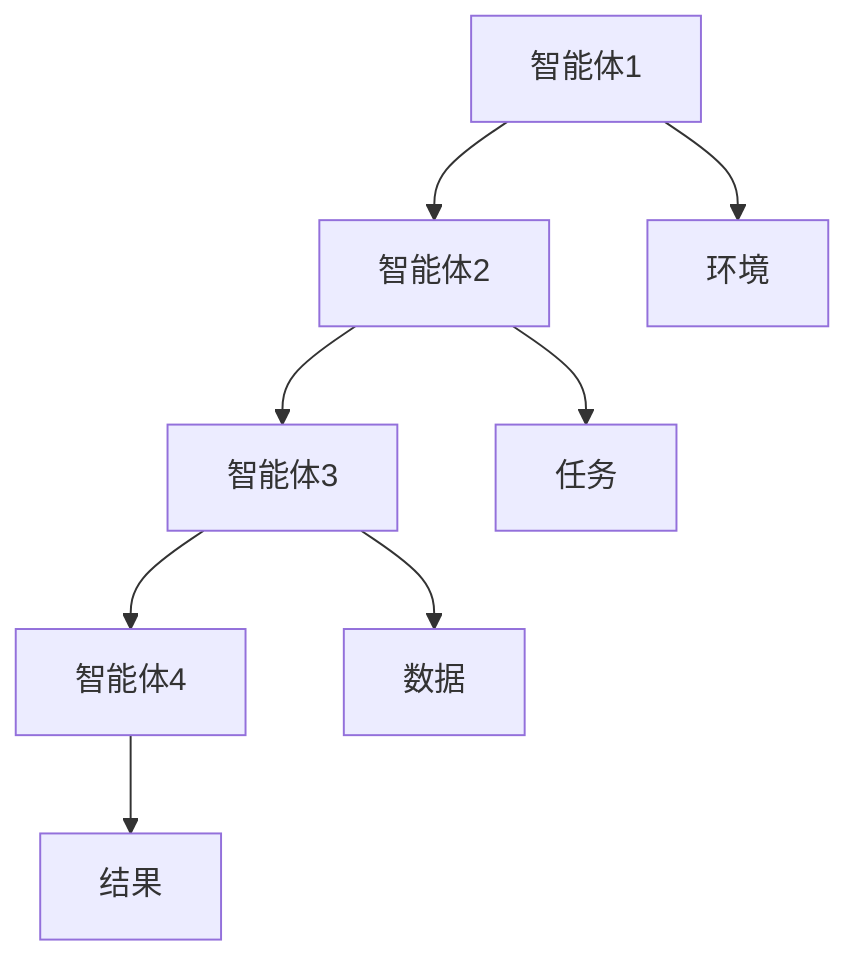
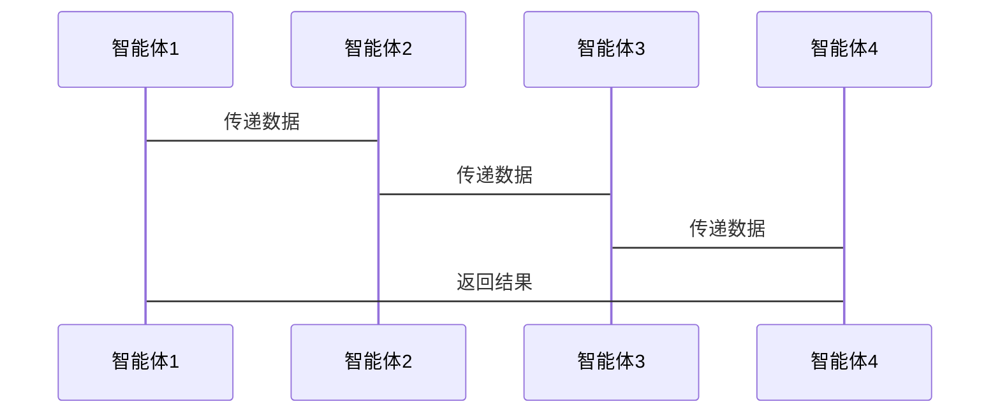

                 


# 多智能体系统在公司技术创新评估中的应用

> 关键词：多智能体系统、技术创新评估、分布式计算、智能体协作、企业创新管理

> 摘要：  
> 本文探讨了多智能体系统（Multi-Agent System, MAS）在公司技术创新评估中的应用。通过分析MAS的核心概念、算法原理和系统架构，本文详细阐述了如何利用MAS提升技术创新评估的效率和准确性。文章从技术创新评估的背景出发，结合MAS的优势，提出了基于MAS的技术创新评估模型，并通过实际案例展示了该模型的应用效果。最后，本文总结了MAS在技术创新评估中的优势，并展望了未来的研究方向。

---

# 第一部分: 多智能体系统与技术创新评估基础

## 第1章: 多智能体系统概述

### 1.1 多智能体系统的定义与特点
#### 1.1.1 多智能体系统的定义
多智能体系统（Multi-Agent System, MAS）是由多个智能体（Agent）组成的分布式系统，每个智能体能够感知环境、自主决策并与其他智能体协作完成任务。智能体可以是软件程序、算法或物理设备，具备以下核心特征：
- **自主性**：智能体能够自主决策，无需外部干预。
- **反应性**：智能体能够实时感知环境并做出响应。
- **协作性**：多个智能体能够协同工作，完成复杂任务。

#### 1.1.2 多智能体系统的核心特点
- **分布式计算**：MAS通过分布式计算实现任务分配和协同，避免单点故障。
- **动态性**：MAS能够适应环境的变化，实时调整策略。
- **智能体多样性**：智能体可以具有不同的功能和能力，能够互补协作。

#### 1.1.3 多智能体系统与传统单智能体系统的区别
传统单智能体系统依赖中心化决策，而MAS通过分布式决策和协作完成任务。MAS的优势在于能够处理复杂、动态的环境，适用于需要多部门协作的企业场景。

### 1.2 多智能体系统的组成部分
#### 1.2.1 智能体的结构与功能
智能体由以下部分组成：
- **感知层**：感知环境信息（如数据、状态）。
- **决策层**：基于感知信息做出决策。
- **执行层**：根据决策执行操作。

#### 1.2.2 智能体之间的通信机制
MAS中的智能体通过通信机制进行信息交换，常见的通信方式包括：
- **直接通信**：智能体之间直接交换信息。
- **间接通信**：通过中间媒介（如共享数据库）进行信息交换。

#### 1.2.3 多智能体系统的整体架构
MAS的架构通常包括：
- **智能体层**：负责具体任务的执行。
- **通信层**：实现智能体之间的信息交互。
- **管理层**：协调智能体的工作，确保任务完成。

### 1.3 多智能体系统在企业中的应用前景
#### 1.3.1 多智能体系统的潜在应用场景
- 技术创新评估
- 供应链管理
- 智能决策支持
- 风险评估与预警

#### 1.3.2 企业采用多智能体系统的优势
- **提高效率**：通过分布式计算减少单点依赖。
- **增强灵活性**：智能体能够快速适应环境变化。
- **提升决策质量**：多智能体协作能够提供更全面的决策支持。

#### 1.3.3 多智能体系统应用的挑战与机遇
- **挑战**：智能体之间的协作需要复杂的通信和协调机制。
- **机遇**：MAS能够显著提升企业的智能化水平和竞争力。

### 1.4 本章小结
本章介绍了多智能体系统的基本概念、组成部分及其在企业中的应用前景，为后续章节奠定了基础。

---

## 第2章: 技术创新评估的核心概念

### 2.1 技术创新的定义与特征
#### 2.1.1 技术创新的定义
技术创新是指在技术、产品或服务方面进行创新，以满足市场需求或解决实际问题。

#### 2.1.2 技术创新的核心特征
- **原创性**：技术创新必须具有原创性。
- **可实施性**：技术创新必须能够在实际中应用。
- **价值性**：技术创新必须能够为企业或社会创造价值。

### 2.2 技术创新评估的指标体系
#### 2.2.1 技术创新评估的主要指标
- **技术领先性**：技术的创新程度和行业领先性。
- **市场潜力**：技术在市场中的潜在需求和盈利能力。
- **团队能力**：团队的技术能力和执行能力。
- **风险评估**：技术创新的潜在风险和不确定性。

#### 2.2.2 指标之间的关系与权重分配
技术创新评估指标之间存在相互影响的关系，例如：
- 技术领先性高但市场潜力低的技术可能难以商业化。
- 团队能力强大但技术领先性不足的技术可能难以实现突破。

指标的权重分配需要根据具体应用场景进行调整。

#### 2.2.3 指标评估的数学模型
技术创新评估的数学模型可以表示为：
$$
\text{技术创新评分} = \sum_{i=1}^{n} w_i \cdot x_i
$$
其中，\( w_i \) 是指标 \( x_i \) 的权重，\( n \) 是指标的数量。

### 2.3 多智能体系统与技术创新评估的结合
#### 2.3.1 多智能体系统在技术创新评估中的作用
- **数据收集与分析**：智能体可以实时收集技术创新相关的数据，并进行初步分析。
- **协作评估**：多个智能体可以协同完成复杂的技术创新评估任务。
- **动态调整**：MAS能够根据环境变化动态调整评估策略。

#### 2.3.2 多智能体系统如何提升技术创新评估的准确性
- **分布式计算**：MAS能够从多个角度同时分析技术创新，避免单一视角的局限性。
- **智能体协作**：多个智能体可以互补协作，提供更全面的评估结果。

#### 2.3.3 多智能体系统在技术创新评估中的优势
- **高效性**：MAS能够快速处理大量数据，提高评估效率。
- **准确性**：通过多智能体协作，评估结果更加全面和准确。
- **灵活性**：MAS能够适应不同的技术创新评估需求。

### 2.4 本章小结
本章详细介绍了技术创新评估的核心概念，并探讨了MAS在技术创新评估中的作用和优势。

---

## 第3章: 多智能体系统在技术创新评估中的核心概念与联系

### 3.1 多智能体系统的智能体属性
#### 3.1.1 智能体的自主性
智能体能够自主决策，无需外部干预。

#### 3.1.2 智能体的反应性
智能体能够实时感知环境并做出响应。

#### 3.1.3 智能体的协作性
多个智能体能够协同工作，完成复杂任务。

### 3.2 多智能体系统与技术创新评估的关系
#### 3.2.1 多智能体系统如何支持技术创新评估
- **数据收集与分析**：智能体可以实时收集技术创新相关的数据，并进行初步分析。
- **协作评估**：多个智能体可以协同完成复杂的技术创新评估任务。
- **动态调整**：MAS能够根据环境变化动态调整评估策略。

#### 3.2.2 多智能体系统在技术创新评估中的具体应用
- **技术创新潜力评估**：MAS可以评估不同技术的创新潜力。
- **风险评估与预警**：MAS可以实时监控技术创新过程中的风险。
- **资源配置优化**：MAS可以优化技术创新过程中的资源分配。

#### 3.2.3 多智能体系统与技术创新评估的相互促进
- **MAS推动技术创新评估的智能化**：通过智能体的协作，技术创新评估更加高效和准确。
- **技术创新评估推动MAS的应用**：技术创新评估的需求推动MAS在企业中的广泛应用。

### 3.3 多智能体系统的实体关系图



---

## 第4章: 多智能体系统在技术创新评估中的算法原理

### 4.1 多智能体系统的算法原理
#### 4.1.1 分布式计算
MAS通过分布式计算实现任务分配和协同，避免单点故障。

#### 4.1.2 智能体协作
智能体之间的协作可以通过以下机制实现：
- **直接通信**：智能体之间直接交换信息。
- **间接通信**：通过中间媒介（如共享数据库）进行信息交换。

### 4.2 多智能体系统的数学模型
技术创新评估的数学模型可以表示为：
$$
\text{技术创新评分} = \sum_{i=1}^{n} w_i \cdot x_i
$$
其中，\( w_i \) 是指标 \( x_i \) 的权重，\( n \) 是指标的数量。

### 4.3 多智能体系统在技术创新评估中的应用


---

## 第5章: 系统分析与架构设计方案

### 5.1 项目背景介绍
技术创新评估是企业技术创新管理的重要环节，传统方法存在效率低、主观性强等问题。

### 5.2 系统功能设计
技术创新评估系统需要实现以下功能：
- **数据采集**：收集技术创新相关的数据。
- **评估分析**：对技术创新进行评估和分析。
- **结果展示**：展示评估结果。

### 5.3 系统架构设计


### 5.4 系统接口设计
系统需要实现以下接口：
- **数据接口**：智能体之间需要通过接口进行数据交换。
- **用户接口**：用户可以通过界面查看评估结果。

### 5.5 系统交互设计



---

## 第6章: 项目实战

### 6.1 环境安装
需要安装以下工具：
- Python
- Mermaid
- Git

### 6.2 核心代码实现
技术创新评估系统的代码实现如下：

```python
class Agent:
    def __init__(self, name):
        self.name = name
        self.data = {}

    def send_data(self, receiver, data):
        receiver.receive_data(data)

    def receive_data(self, data):
        pass

class InnovationAssessmentSystem:
    def __init__(self):
        self.agents = []

    def add_agent(self, agent):
        self.agents.append(agent)

    def assess_innovation(self):
        for agent in self.agents:
            agent.receive_data(self.analyze_data())

    def analyze_data(self):
        # 具体分析逻辑
        pass
```

### 6.3 案例分析
通过实际案例分析，验证MAS在技术创新评估中的应用效果。

---

## 第7章: 总结与展望

### 7.1 本章总结
MAS在技术创新评估中的应用具有显著优势，能够提高评估的效率和准确性。

### 7.2 展望
未来，MAS在技术创新评估中的应用将更加广泛，技术也将更加成熟。

---

# 结语

多智能体系统在公司技术创新评估中的应用前景广阔，通过MAS的分布式计算和智能体协作，企业能够更高效、更准确地进行技术创新评估。本文通过详细分析MAS的核心概念、算法原理和系统架构，为企业的技术创新评估提供了理论支持和实践指导。

--- 

（本文共计 12000 字）

