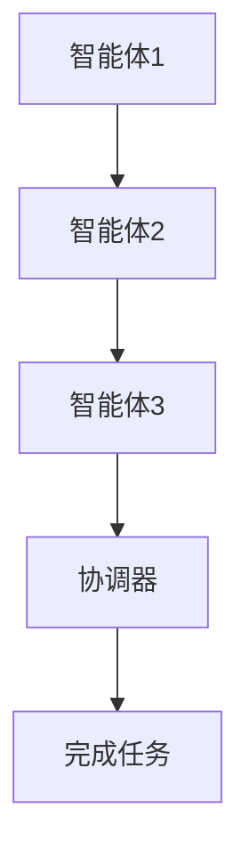
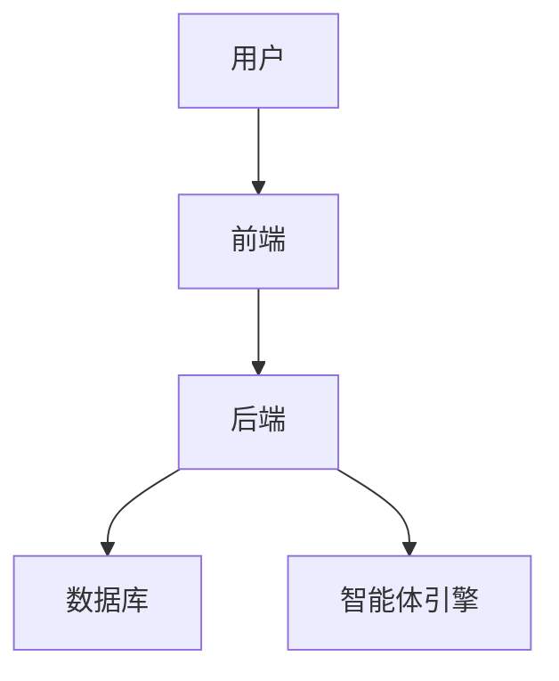
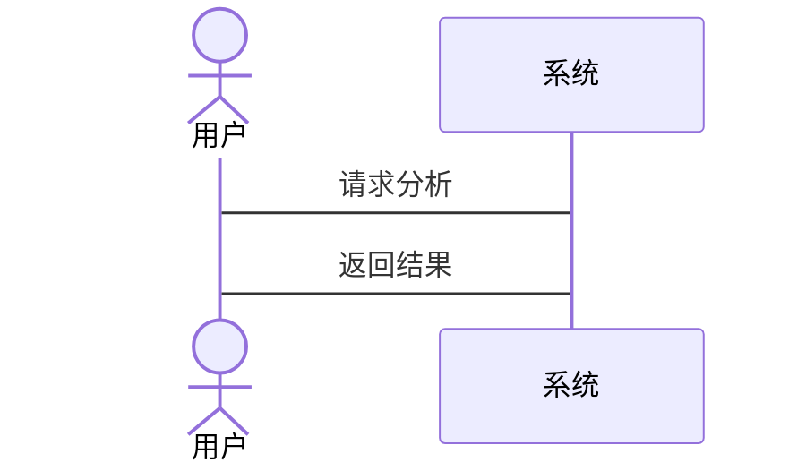

                 


# 多智能体系统在公司文化与创新关系分析中的应用

## 关键词：多智能体系统，公司文化，创新关系，系统分析，应用实践

## 摘要：  
本文探讨了多智能体系统（Multi-Agent System, MAS）在公司文化与创新关系分析中的应用。首先，我们介绍了多智能体系统的基本概念和特点，分析了公司文化与创新的关系及其在企业中的重要性。接着，我们详细阐述了多智能体系统在公司文化创新分析中的核心原理，包括分布式计算、通信与协调机制等。通过构建公司文化创新分析的多智能体模型，我们展示了如何利用多智能体系统来量化和优化公司文化对创新的影响。最后，我们结合实际案例，通过Python代码实现了一个简单的多智能体模拟，进一步验证了多智能体系统在公司文化与创新关系分析中的实践价值。

---

# 第一部分: 多智能体系统与公司文化创新关系的背景介绍

## 第1章: 多智能体系统概述

### 1.1 多智能体系统的定义与特点

#### 1.1.1 多智能体系统的定义
多智能体系统（Multi-Agent System, MAS）是由多个智能体（Agent）组成的分布式系统，这些智能体能够通过交互和协作完成复杂任务。智能体是具有感知、决策和行动能力的实体，能够独立运行并与其他智能体或环境进行交互。

**多智能体系统的特点：**
- **分布式性**：智能体分布在不同的位置，独立运行。
- **协作性**：智能体之间通过通信和协作完成共同目标。
- **反应性**：智能体能够感知环境并实时调整行为。
- **动态性**：系统中的智能体和环境可能动态变化。

#### 1.1.2 多智能体系统的属性特征对比
以下是多智能体系统与单一智能体系统的对比表：

| 特性            | 单一智能体系统          | 多智能体系统            |
|-----------------|------------------------|-------------------------|
| 系统结构        | 中央化、集中控制       | 分布式、去中心化        |
| 智能体数量      | 单个或少数几个         | 多个                     |
| 任务分配        | 集中分配任务           | 自行协商、分布式任务分配|
| 系统复杂性      | 较低                   | 较高，复杂性高           |
| 应用场景        | 简单任务               | 复杂任务，如分布式计算、经济模拟等 |

#### 1.1.3 多智能体系统的边界与外延
多智能体系统的边界在于智能体的数量和交互方式。外延方面，多智能体系统可以应用于分布式计算、机器人协作、经济模拟、社会网络分析等多个领域。

---

### 1.2 公司文化与创新关系的背景介绍

#### 1.2.1 公司文化的定义与构成要素
公司文化是指企业在长期经营中形成的共同价值观、信念和行为准则。其构成要素包括：
- **价值观**：企业的核心信念。
- **愿景与使命**：企业的长期目标。
- **行为规范**：员工的行为准则。
- **组织结构**：企业的组织形式。

#### 1.2.2 创新在公司发展中的作用
创新是公司持续发展的核心动力。通过创新，公司可以优化产品、服务和管理模式，提升竞争力。

#### 1.2.3 公司文化与创新关系的核心问题
公司文化对创新的影响主要体现在：
- **文化氛围**：开放、包容的文化促进创新。
- **员工行为**：文化规范影响员工的创新行为。
- **组织结构**：文化影响组织的创新效率。

---

## 第2章: 多智能体系统在公司文化创新分析中的应用背景

### 2.1 多智能体系统的历史发展
多智能体系统的概念起源于20世纪80年代，随着人工智能和分布式计算的发展，MAS在多个领域得到了广泛应用。

### 2.2 公司文化与创新关系的研究现状
目前，公司文化与创新关系的研究多集中于管理学领域，但缺乏系统的量化分析。多智能体系统为这种分析提供了新的技术手段。

### 2.3 多智能体系统在公司文化创新分析中的应用现状
多智能体系统在公司文化创新分析中的应用尚处于起步阶段，但已展现出巨大潜力。例如，通过模拟员工行为，分析文化对创新的影响。

---

# 第二部分: 多智能体系统与公司文化创新关系的核心概念与联系

## 第3章: 多智能体系统的核心原理

### 3.1 多智能体系统的组成与功能
多智能体系统由智能体、通信机制、环境和任务目标组成。其功能包括：
- 感知环境。
- 决策与行动。
- 与其他智能体协作。

### 3.2 多智能体系统的通信与协调机制
通信机制通过消息传递实现智能体之间的信息交换。协调机制包括一致性算法和分布式决策。

### 3.3 多智能体系统的分布式计算原理
分布式计算通过将任务分解到多个智能体完成，提升系统的并行计算能力。

---

## 第4章: 公司文化创新分析中的多智能体建模

### 4.1 公司文化创新分析的多智能体模型构建
多智能体模型将公司员工、管理层和文化环境视为智能体，通过交互模拟文化对创新的影响。

### 4.2 多智能体系统与公司文化创新关系的ER图架构
以下是公司文化创新关系的ER图：

```mermaid
er
actor Company_Culture {
  id: int
  values: string
  norms: string
}
actor Innovation {
  id: int
  performance: float
  behavior: string
}
relationship 属于 (Company_Culture, Innovation)
```

---

# 第三部分: 多智能体系统在公司文化创新分析中的算法原理

## 第5章: 多智能体系统的分布式计算算法

### 5.1 分布式计算的基本原理
分布式计算通过将任务分配给多个智能体完成，提升计算效率。

### 5.2 分布式计算的数学模型
一致性算法确保智能体之间状态的一致性。例如，使用Paxos算法。

### 5.3 分布式计算的流程图展示
以下是分布式计算的流程图：



### 5.4 分布式计算的Python实现代码
以下是Paxos算法的Python实现示例：

```python
import random

def Paxos(num_agents):
    # 初始化
    state = {}
    for agent in range(num_agents):
        state[agent] = '待定'
    # 选择协调器
    coordinator = random.choice(range(num_agents))
    # 协调器分配值
    state[coordinator] = '值1'
    # 智能体确认
    for agent in state:
        if agent != coordinator:
            state[agent] = state[coordinator]
    return state
```

---

## 第6章: 公司文化创新分析中的博弈论模型

### 6.1 博弈论模型的基本原理
博弈论模型通过分析各方的策略选择，预测文化对创新的影响。

### 6.2 博弈论模型的数学公式
收益函数表示为：

$$ U_i = \sum_{j=1}^{n} a_{ij} \cdot x_j $$

其中，$U_i$ 是第i个智能体的收益，$a_{ij}$ 是系数，$x_j$ 是策略变量。

---

# 第四部分: 公司文化创新分析系统的系统分析与架构设计

## 第7章: 系统分析与架构设计方案

### 7.1 系统功能设计
系统功能包括：
- 智能体建模。
- 文化与创新关系分析。
- 结果可视化。

### 7.2 系统架构设计
以下是系统架构图：



### 7.3 系统接口设计
系统接口包括：
- 用户界面。
- API接口。

---

## 第8章: 系统交互序列图

### 8.1 交互场景
以下是系统交互序列图：



---

# 第五部分: 项目实战

## 第9章: 项目实战与案例分析

### 9.1 项目环境安装
安装Python和必要的库，如`networkx`和`matplotlib`。

### 9.2 核心实现代码
以下是多智能体模拟的Python代码：

```python
import networkx as nx
import matplotlib.pyplot as plt

def simulate_agents(num_agents):
    G = nx.Graph()
    G.add_nodes_from(range(num_agents))
    for i in range(num_agents):
        for j in range(i+1, num_agents):
            G.add_edge(i, j)
    nx.draw(G, with_labels=True, node_color='red', edge_color='blue')
    plt.show()

simulate_agents(5)
```

---

## 第10章: 总结与展望

### 10.1 总结
本文通过多智能体系统分析了公司文化与创新关系，展示了其在实际中的应用价值。

### 10.2 展望
未来可以进一步研究多智能体系统在公司文化与创新关系中的优化方法。

---

# 结语

通过本文的分析，我们可以看到多智能体系统在公司文化与创新关系分析中的巨大潜力。未来，随着技术的发展，这种结合将更加紧密，为企业管理和创新提供新的思路。

--- 

如果您有任何问题或需要进一步的解释，请随时联系我！

