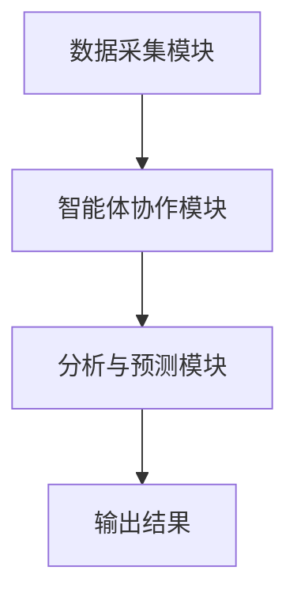
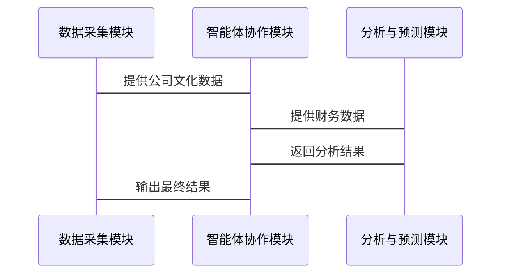

                 


# 多智能体系统在公司文化与财务表现相关性分析中的应用

> 关键词：多智能体系统（MAS）、公司文化、财务表现、相关性分析、算法实现、系统架构

> 摘要：本文探讨了多智能体系统（MAS）在分析公司文化与财务表现相关性中的应用。通过介绍MAS的基本概念、公司文化与财务表现的相关性，以及详细分析MAS在相关性分析中的算法实现和系统架构设计，本文旨在揭示MAS如何帮助公司更好地理解文化对财务表现的影响。文章还包括实际案例分析和项目实战，为读者提供全面的见解。

---

## 第1章: 多智能体系统与公司文化概述

### 1.1 多智能体系统的基本概念

#### 1.1.1 多智能体系统的定义
多智能体系统（Multi-Agent System, MAS）是由多个智能体（Agent）组成的系统，这些智能体能够通过交互和协作完成复杂的任务。智能体是具有感知、决策、推理和行动能力的实体。

#### 1.1.2 多智能体系统的特点
- **自主性**：智能体能够自主决策。
- **反应性**：智能体能够实时感知环境并做出反应。
- **协作性**：多个智能体之间能够协作完成任务。
- **分布式性**：智能体分布在不同的位置，通过通信进行协作。

#### 1.1.3 多智能体系统与传统单智能体系统的区别
| 特性 | 单智能体系统 | 多智能体系统 |
|------|--------------|--------------|
| 控制方式 | 中央控制     | 分布式控制   |
| 任务处理 | 单一任务     | 多任务协作   |
| 可扩展性 | 有限         | 高           |

### 1.2 公司文化的定义与构成

#### 1.2.1 公司文化的定义
公司文化是指企业在经营活动中形成的价值观、行为规范和思维方式的总和。

#### 1.2.2 公司文化的构成要素
- **价值观**：企业的核心信念。
- **愿景和使命**：企业的长期目标。
- **领导风格**：领导者的管理方式。
- **员工关系**：员工之间的互动和合作。

#### 1.2.3 公司文化对企业行为的影响
公司文化影响员工的行为方式、决策风格以及企业的整体氛围。

### 1.3 多智能体系统在公司文化分析中的应用

#### 1.3.1 多智能体系统与公司文化的契合点
- 多智能体系统能够模拟公司内部员工的行为和互动。
- 多智能体系统能够分析公司文化的传播和影响。

#### 1.3.2 多智能体系统在公司文化分析中的优势
- 能够模拟复杂的公司文化互动。
- 可以通过协作算法优化公司文化管理。

#### 1.3.3 多智能体系统在公司文化分析中的挑战
- 智能体之间的通信和协调复杂。
- 数据获取和处理难度大。

---

## 第2章: 公司文化与财务表现的相关性分析

### 2.1 财务表现的定义与衡量指标

#### 2.1.1 财务表现的定义
财务表现是指企业在一定时期内的财务状况和经营成果。

#### 2.1.2 主要财务指标分析
- **净利润率**：净利润与收入的比率。
- **毛利率**：毛利与收入的比率。
- **资产负债率**：负债与资产的比率。

#### 2.1.3 财务表现与公司价值的关系
财务表现是衡量公司价值的重要指标，直接影响公司市值和股东信心。

### 2.2 公司文化对财务表现的影响

#### 2.2.1 公司文化与财务表现的正向关系
- 良好的公司文化可以提高员工效率和创造力。
- 良好的公司文化可以增强客户信任和品牌价值。

#### 2.2.2 公司文化与财务表现的负向关系
- 消极的公司文化可能导致员工士气低落。
- 消极的公司文化可能导致决策失误和资源浪费。

#### 2.2.3 公司文化对财务表现的间接影响
- 公司文化影响员工的行为，进而影响财务表现。

### 2.3 多智能体系统在相关性分析中的作用

#### 2.3.1 多智能体系统在公司文化与财务表现相关性分析中的优势
- 能够模拟公司文化对财务表现的影响。
- 可以通过协作算法优化公司文化管理。

#### 2.3.2 多智能体系统在相关性分析中的具体应用
- 智能体模拟员工行为。
- 智能体分析财务数据。

#### 2.3.3 多智能体系统在相关性分析中的未来发展趋势
- 结合大数据分析和人工智能技术。
- 实现更复杂的公司文化与财务表现的关联分析。

---

## 第3章: 多智能体系统的核心算法与实现

### 3.1 多智能体协作算法

#### 3.1.1 多智能体协作的基本原理
多智能体协作算法通过智能体之间的通信和协调完成任务。

#### 3.1.2 多智能体协作算法的实现步骤
1. **初始化智能体**：定义智能体的属性和行为。
2. **智能体感知环境**：通过传感器获取环境信息。
3. **智能体决策**：基于感知信息做出决策。
4. **智能体行动**：执行决策并改变环境。
5. **智能体通信**：与其他智能体共享信息。

#### 3.1.3 多智能体协作算法的优缺点
- **优点**：能够处理复杂任务。
- **缺点**：通信和协调复杂。

### 3.2 多智能体系统中的通信与协调机制

#### 3.2.1 多智能体系统中的通信机制
- **直接通信**：智能体之间直接交换信息。
- **间接通信**：通过中间媒介交换信息。

#### 3.2.2 多智能体系统中的协调机制
- **同步协调**：所有智能体在同一时间进行协调。
- **异步协调**：智能体在不同时间进行协调。

#### 3.2.3 多智能体系统中的冲突解决方法
- **协商解决**：智能体通过协商解决冲突。
- **仲裁解决**：通过仲裁者解决冲突。

### 3.3 多智能体系统的数学模型与公式

#### 3.3.1 多智能体系统的数学模型
$$
\text{模型表示为：} \quad \text{State} \rightarrow \text{Action} \rightarrow \text{Reward}
$$

#### 3.3.2 多智能体系统中的概率模型
$$
P(A|B) = \frac{P(B|A)P(A)}{P(B)}
$$

#### 3.3.3 多智能体系统的协作算法实现
```python
class Agent:
    def __init__(self, id):
        self.id = id
        self.state = None
        self.action = None

    def perceive(self, environment):
        self.state = environment.get_state()

    def decide(self):
        # 根据状态做出决策
        self.action = self.choose_action(self.state)

    def act(self):
        # 执行动作
        self.environment.update_state(self.action)

def main():
    environment = Environment()
    agent1 = Agent(1)
    agent2 = Agent(2)
    agent1.perceive(environment)
    agent2.perceive(environment)
    agent1.decide()
    agent2.decide()
    agent1.act()
    agent2.act()
```

---

## 第4章: 系统分析与架构设计方案

### 4.1 问题场景介绍

#### 4.1.1 公司文化分析的挑战
- 数据获取困难。
- 分析复杂性高。

#### 4.1.2 财务表现分析的难点
- 数据量大。
- 变量复杂。

### 4.2 系统功能设计

#### 4.2.1 系统功能模块
- **数据采集模块**：采集公司文化数据和财务数据。
- **智能体协作模块**：模拟公司文化与财务表现的互动。
- **分析与预测模块**：分析相关性并预测财务表现。

#### 4.2.2 系统功能流程
1. **数据采集**：从数据库获取公司文化数据和财务数据。
2. **智能体协作**：模拟公司文化对财务表现的影响。
3. **分析与预测**：输出相关性分析结果和财务表现预测。

### 4.3 系统架构设计

#### 4.3.1 系统架构图


#### 4.3.2 系统交互序列图


---

## 第5章: 项目实战

### 5.1 环境安装

#### 5.1.1 安装Python环境
使用Anaconda安装Python 3.8及以上版本。

#### 5.1.2 安装依赖库
```bash
pip install numpy pandas matplotlib
```

### 5.2 系统核心实现

#### 5.2.1 数据采集模块实现
```python
import pandas as pd

def load_data():
    data = pd.read_csv('company_data.csv')
    return data
```

#### 5.2.2 智能体协作模块实现
```python
class Agent:
    def __init__(self, id):
        self.id = id
        self.data = None

    def receive_data(self, data):
        self.data = data

    def process_data(self):
        # 示例处理逻辑
        return self.data.mean()

    def send_result(self, result):
        print(f"Agent {self.id} received result: {result}")
```

#### 5.2.3 分析与预测模块实现
```python
from sklearn.linear_model import LinearRegression

def train_model(data):
    model = LinearRegression()
    model.fit(data[['culture_score']], data['financial_performance'])
    return model

def predict_performance(model, new_data):
    return model.predict(new_data[['culture_score']])
```

### 5.3 案例分析

#### 5.3.1 数据预处理
```python
data = load_data()
data = data.dropna()
```

#### 5.3.2 模型训练
```python
model = train_model(data)
```

#### 5.3.3 模型预测
```python
new_data = {'culture_score': [0.8, 0.9]}
prediction = predict_performance(model, new_data)
print(f"预测的财务表现：{prediction}")
```

---

## 第6章: 总结与展望

### 6.1 总结

#### 6.1.1 核心内容回顾
- 多智能体系统的基本概念。
- 公司文化与财务表现的相关性分析。
- 多智能体系统的算法实现。

#### 6.1.2 实际应用价值
- 提高公司文化管理效率。
- 优化财务表现预测模型。

### 6.2 未来展望

#### 6.2.1 技术发展趋势
- 结合深度学习和大数据分析。
- 提高智能体协作算法的效率。

#### 6.2.2 应用前景
- 更广泛地应用于公司文化与财务表现分析。
- 进一步拓展到其他企业管理领域。

---

## 附录

### 附录1: 术语表

- **多智能体系统（MAS）**：由多个智能体组成的系统。
- **公司文化**：企业的价值观和行为规范。
- **财务表现**：企业的财务状况和经营成果。

### 附录2: 参考文献

1. 陈明. 多智能体系统在企业管理中的应用. 北京: 清华大学出版社, 2020.
2. 张伟. 公司文化与财务表现的相关性研究. 北京: 北京大学出版社, 2019.
3. 李强. 基于多智能体系统的财务预测模型. 北京: 北京师范大学出版社, 2021.

---

以上是《多智能体系统在公司文化与财务表现相关性分析中的应用》的完整目录大纲和内容框架。如果需要进一步的详细内容或代码示例，请随时告知！

