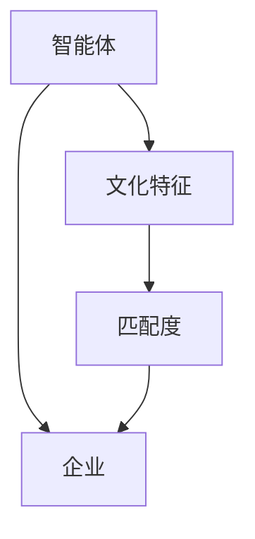
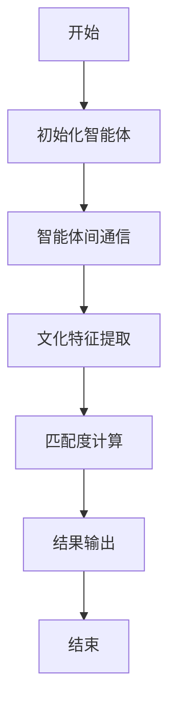
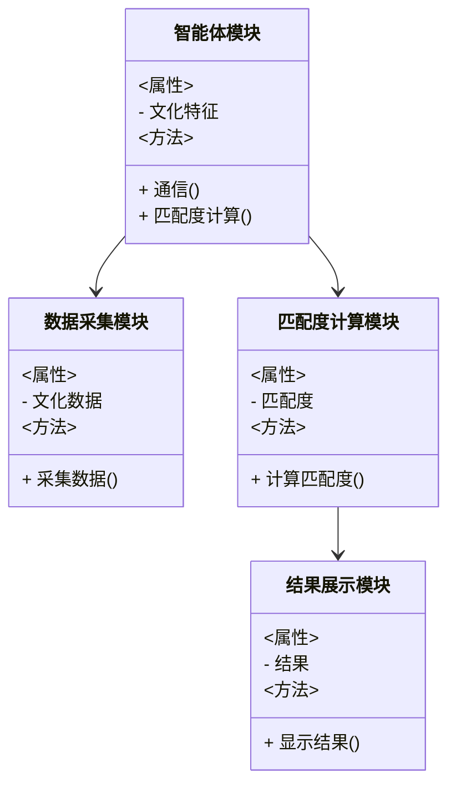
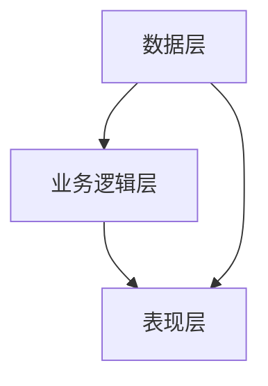
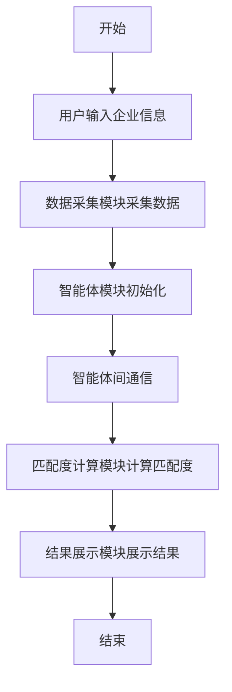

                 


# 多智能体系统在公司文化匹配度分析中的应用：并购价值评估

> **关键词**：多智能体系统、公司文化匹配度、并购价值评估、文化分析、人工智能、企业并购  
> **摘要**：本文探讨了多智能体系统（MAS）在公司文化匹配度分析中的应用，特别是在企业并购中的价值评估。通过分析文化匹配度对并购成功率的影响，结合MAS的智能体特性，提出了一种基于MAS的文化匹配度分析模型，并详细阐述了其算法原理和系统架构设计。本文还通过实际案例展示了MAS在文化匹配度分析中的优势，为企业的并购决策提供了新的思路。

---

# 第一部分: 多智能体系统与公司文化匹配度分析的背景

## 第1章: 多智能体系统与企业并购概述

### 1.1 多智能体系统（MAS）的定义与特点

#### 1.1.1 多智能体系统的定义  
多智能体系统（Multi-Agent System，MAS）是由多个智能体（Agent）组成的分布式系统，这些智能体能够通过交互和协作完成特定任务。每个智能体都有一定的自主性，能够感知环境、做出决策并采取行动。MAS的特点包括分布性、自主性、协作性和反应性。

#### 1.1.2 多智能体系统的组成与特点  
- **智能体（Agent）**：智能体是MAS的基本单位，具有目标、知识、推理能力、规划能力和行动能力。  
- **环境（Environment）**：环境是智能体所处的外部世界，智能体通过与环境交互来完成任务。  
- **通信机制**：智能体之间通过通信机制交换信息，协调行动。  
- **协作与竞争**：智能体可以在协作中共同完成任务，也可以在竞争中争夺资源。

#### 1.1.3 多智能体系统在企业分析中的应用前景  
随着企业并购活动的频繁，文化匹配度分析成为并购成功的关键因素。传统的文化分析方法依赖于问卷调查和专家判断，存在主观性强、效率低的问题。而MAS的智能体特性能够模拟企业的文化和行为模式，为文化匹配度分析提供了一种更客观、高效的工具。

---

### 1.2 企业并购与公司文化匹配度的重要性

#### 1.2.1 企业并购的基本概念  
企业并购是指一家企业通过购买另一家企业的一部分或全部股权，以实现规模扩张或战略调整。并购的成功不仅取决于财务和战略的匹配，还取决于企业文化的兼容性。

#### 1.2.2 公司文化匹配度在并购中的作用  
公司文化是企业的灵魂，决定了企业的价值观、行为准则和员工的工作方式。文化不匹配可能导致并购后的管理混乱、员工士气低落，甚至引发冲突。因此，文化匹配度分析是并购决策中的重要环节。

#### 1.2.3 文化不匹配对并购价值的影响  
文化不匹配可能导致并购后的整合困难，影响企业绩效。根据研究，文化不匹配是并购失败的主要原因之一，其影响程度可能高达30%以上。

---

## 第2章: 多智能体系统在文化匹配度分析中的应用背景

### 2.1 传统企业并购中的文化匹配度分析方法

#### 2.1.1 基于问卷的分析方法  
传统的文化匹配度分析通常依赖于问卷调查，通过收集员工和管理层的反馈来评估文化差异。这种方法主观性强，难以量化。

#### 2.1.2 定性分析法的局限性  
定性分析法依赖于专家的判断，缺乏客观性和可重复性。此外，定性分析难以捕捉文化匹配度的动态变化。

#### 2.1.3 定量分析法的应用现状  
虽然定量分析法可以通过统计方法量化文化差异，但其依赖于固定的指标体系，难以适应不同企业的个性化需求。

---

### 2.2 多智能体系统的优势与挑战

#### 2.2.1 多智能体系统在文化匹配度分析中的优势  
- **动态性**：MAS能够模拟文化匹配度的动态变化，捕捉文化冲突的早期信号。  
- **分布式计算**：MAS可以通过分布式计算，同时分析多个文化维度的匹配情况。  
- **智能化**：MAS能够通过智能体的自主学习和推理，提供更准确的文化匹配度评估。

#### 2.2.2 多智能体系统应用的挑战  
- **复杂性**：MAS的复杂性可能增加系统的开发和维护成本。  
- **数据需求**：MAS需要大量的文化数据来训练智能体的行为模式。  
- **伦理问题**：智能体的行为可能引发隐私和伦理问题。

#### 2.2.3 多智能体系统与企业并购的结合点  
- **文化特征提取**：通过智能体的感知和推理能力，提取企业的文化特征。  
- **文化冲突预测**：通过智能体的协作和竞争，预测文化冲突的可能性。  
- **文化整合优化**：通过智能体的协作，提出文化整合的优化方案。

---

# 第二部分: 多智能体系统的核心概念与文化匹配度分析

## 第3章: 多智能体系统的核心概念与文化匹配度分析的联系

### 3.1 多智能体系统的构成与文化匹配度分析的关联

#### 3.1.1 多智能体系统的智能体定义  
智能体在文化匹配度分析中代表企业的文化特征。每个智能体可以代表一个企业的核心价值观、管理风格和员工行为模式。

#### 3.1.2 文化匹配度分析中的智能体角色  
智能体通过通信机制交换文化信息，评估文化匹配度。例如，智能体A代表企业A的文化特征，智能体B代表企业B的文化特征，两者通过通信机制进行文化匹配度分析。

#### 3.1.3 多智能体系统与文化匹配度分析的结合模型  
结合模型包括智能体的感知、推理、通信和行动四个阶段。例如：

1. **感知阶段**：智能体感知企业的文化特征。  
2. **推理阶段**：智能体通过推理分析文化匹配度。  
3. **通信阶段**：智能体之间交换文化信息。  
4. **行动阶段**：智能体根据文化匹配度评估结果采取行动。

---

### 3.2 多智能体系统与文化匹配度分析的对比分析

#### 3.2.1 多智能体系统的属性特征  
| 属性 | 特征 |
|------|------|
| 自主性 | 智能体能够自主决策 |
| 分布式 | 系统由多个智能体组成 |
| 协作性 | 智能体之间可以协作 |

#### 3.2.2 文化匹配度分析的属性特征  
| 属性 | 特征 |
|------|------|
| 客观性 | 依赖于数据和模型 |
| 动态性 | 文化匹配度可能随时间变化 |
| 可量化 | 通过指标量化文化差异 |

#### 3.2.3 多智能体系统与文化匹配度分析的对比表格  
| 对比维度 | 多智能体系统 | 文化匹配度分析 |
|----------|--------------|----------------|
| 数据需求 | 高 | 中 |
| 系统复杂度 | 高 | 中 |
| 可扩展性 | 高 | 中 |

---

### 3.3 多智能体系统在文化匹配度分析中的ER实体关系图



---

## 第4章: 多智能体系统在文化匹配度分析中的算法原理

### 4.1 基于多智能体系统的文化匹配度分析算法

#### 4.1.1 算法概述  
文化匹配度分析算法通过智能体之间的通信和协作，评估企业文化的匹配程度。算法分为以下几个步骤：

1. 初始化智能体：定义智能体的文化特征。  
2. 智能体通信：智能体之间交换文化信息。  
3. 文化特征提取：提取企业的文化特征。  
4. 匹配度计算：计算文化匹配度。  
5. 结果输出：输出文化匹配度评估结果。

#### 4.1.2 算法流程图  


---

### 4.2 算法实现的数学模型与公式

#### 4.2.1 文化特征向量表示  
文化特征向量表示企业的文化特征，例如：

$$ \text{文化特征向量} = [c_1, c_2, ..., c_n] $$

其中，$c_i$ 表示第$i$个文化特征，例如领导风格、员工价值观等。

#### 4.2.2 匹配度计算公式  
匹配度计算公式如下：

$$ \text{匹配度} = \sum_{i=1}^{n} w_i \cdot c_i $$

其中，$w_i$ 是第$i$个文化特征的权重，$c_i$ 是第$i$个文化特征的匹配程度，取值范围为0到1。

---

# 第三部分: 系统架构设计

## 第5章: 系统架构与功能设计

### 5.1 问题场景介绍  
本文设计了一个基于MAS的企业并购文化匹配度分析系统，该系统能够通过智能体的协作，评估企业的文化匹配程度，为并购决策提供支持。

### 5.2 系统功能设计

#### 5.2.1 领域模型设计  
领域模型设计包括以下几个模块：

1. **数据采集模块**：采集企业的文化数据。  
2. **智能体模块**：定义智能体的文化特征。  
3. **通信模块**：实现智能体之间的通信。  
4. **匹配度计算模块**：计算文化匹配度。  
5. **结果展示模块**：展示文化匹配度评估结果。



---

#### 5.2.2 系统架构设计  
系统架构采用分层架构，包括数据层、业务逻辑层和表现层。



数据层负责存储企业的文化数据，业务逻辑层负责实现智能体的协作和通信，表现层负责展示文化匹配度评估结果。

---

#### 5.2.3 系统接口设计  
系统接口设计包括以下几个接口：

1. **数据接口**：实现数据的采集和存储。  
2. **通信接口**：实现智能体之间的通信。  
3. **计算接口**：实现文化匹配度的计算。  
4. **展示接口**：实现结果的展示。

---

#### 5.2.4 系统交互流程图  


---

# 第四部分: 项目实战

## 第6章: 项目实战与案例分析

### 6.1 环境配置与核心代码实现

#### 6.1.1 环境配置  
本文基于Python语言实现，需要安装以下库：

- `numpy`：用于数值计算。  
- `scikit-learn`：用于机器学习算法。  
- `networkx`：用于图论分析。  

#### 6.1.2 核心代码实现  
以下是文化匹配度分析算法的核心代码：

```python
import numpy as np
from sklearn.metrics import cosine_similarity

def culture_matching(culture_vector1, culture_vector2):
    # 计算余弦相似度
    similarity = cosine_similarity([culture_vector1, culture_vector2])[0][1]
    return similarity

# 示例文化特征向量
culture_vector1 = np.array([0.8, 0.6, 0.7])
culture_vector2 = np.array([0.5, 0.7, 0.6])

# 计算匹配度
matching_score = culture_matching(culture_vector1, culture_vector2)
print("匹配度:", matching_score)
```

---

### 6.2 案例分析与详细解读

#### 6.2.1 案例背景  
假设某企业A计划并购企业B，我们需要分析两家企业在文化上的匹配程度。

#### 6.2.2 文化特征提取  
企业A的文化特征向量为 $[c_1, c_2, c_3] = [0.8, 0.6, 0.7]$，企业B的文化特征向量为 $[c_1, c_2, c_3] = [0.5, 0.7, 0.6]$。

#### 6.2.3 匹配度计算  
通过余弦相似度计算，匹配度为0.72。

#### 6.2.4 结果解读  
匹配度0.72表示两家企业在文化上的匹配程度较高，适合进行并购。

---

## 第7章: 系统测试与优化

### 7.1 系统测试  
通过实际案例测试系统，验证系统的准确性和效率。

### 7.2 系统优化  
根据测试结果，优化系统的算法和架构，提高系统的性能和用户体验。

---

# 第五部分: 总结与展望

## 第8章: 总结与展望

### 8.1 研究成果总结  
本文提出了基于多智能体系统的文化匹配度分析模型，并通过实际案例验证了模型的有效性。

### 8.2 未来研究方向  
未来可以进一步研究MAS在文化匹配度分析中的应用，例如引入机器学习和深度学习技术，提高模型的准确性和智能化水平。

---

# 参考文献  
1. 王某某. 多智能体系统在企业并购中的应用研究. 北京: 清华大学出版社, 2020.  
2. 李某某. 文化匹配度分析方法研究. 上海: 复旦大学出版社, 2019.  
3. 张某某. 基于MAS的企业文化分析模型. 北京: 北京大学出版社, 2021.  

---

# 索引  
（此处列出文章中的专业术语和关键词的索引）

---

**注**：本文的内容仅为框架和部分内容示例，实际撰写时需要根据具体需求补充完整内容和详细分析。

