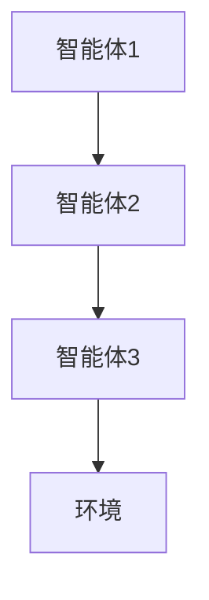
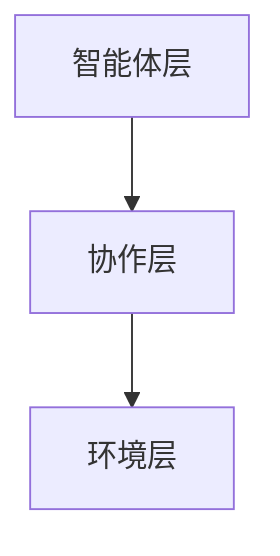
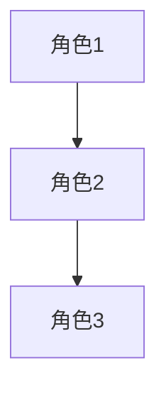
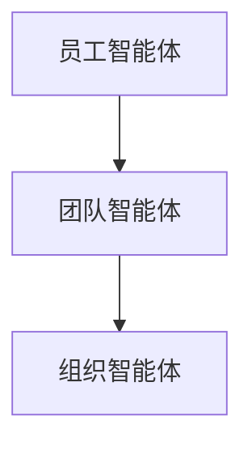
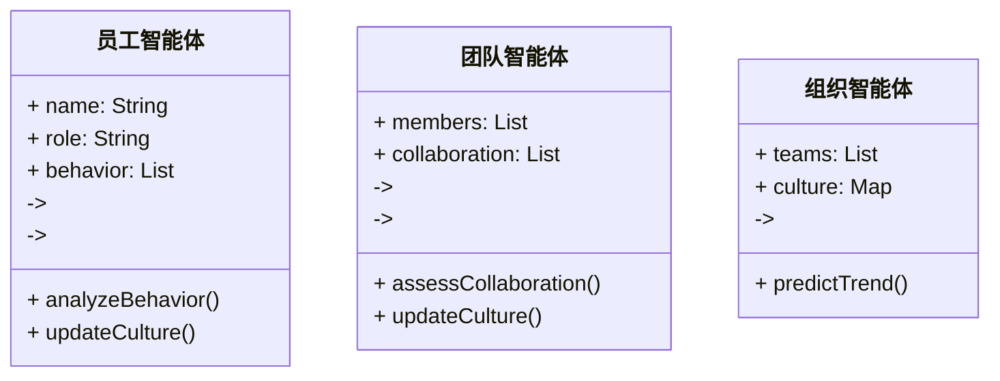
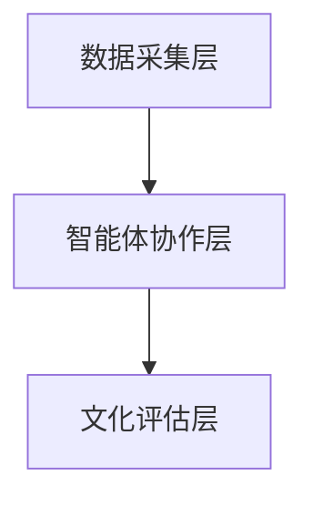

                 


# 多智能体系统在公司文化评估中的创新应用

> 关键词：多智能体系统、公司文化评估、人工智能、组织行为学、分布式协作

> 摘要：随着组织行为学和人工智能技术的不断发展，多智能体系统（Multi-Agent Systems, MAS）在公司文化评估中的应用逐渐展现出其独特的优势。本文将从MAS的基本概念出发，深入探讨其在公司文化评估中的创新应用模式，结合实际案例，分析MAS在提升文化评估效率、精准度和动态适应性方面的潜力。通过系统化的理论分析和实践展示，本文旨在为组织文化管理提供一种全新的技术视角和解决方案。

---

## 第一部分: 多智能体系统与公司文化评估的背景介绍

### 第1章: 多智能体系统与公司文化评估的背景

#### 1.1 多智能体系统的基本概念

##### 1.1.1 多智能体系统的定义
多智能体系统（MAS）是由多个智能体（Agent）组成的分布式系统，这些智能体通过协作与竞争完成特定目标。智能体是具有感知、推理、规划和行动能力的实体，能够独立决策并与其他智能体或环境交互。

**图1.1：多智能体系统的组成结构**


##### 1.1.2 多智能体系统的组成与特点
- **智能体**：MAS的核心单元，具有主动性、反应性、社会性和学习性。
- **环境**：智能体与之交互的外部世界，可以是物理环境或抽象空间。
- **协作与竞争**：智能体之间的交互模式，协作提升系统整体效率，竞争促进优化。

##### 1.1.3 多智能体系统的核心要素
- **智能体的自主性**：智能体能够独立决策。
- **分布式协作**：多个智能体协同完成任务。
- **动态性**：系统状态随智能体交互和环境变化而动态调整。

#### 1.2 公司文化评估的现状与挑战

##### 1.2.1 公司文化的定义与重要性
公司文化是组织成员共同的价值观、行为准则和工作方式的总和，直接影响组织的凝聚力、员工满意度和整体绩效。

##### 1.2.2 传统公司文化评估方法的局限性
- **主观性**：依赖人工调查，结果受主观因素影响。
- **静态性**：评估结果难以反映动态变化。
- **效率低下**：传统方法耗时且成本高。

##### 1.2.3 现代公司文化评估的需求与趋势
- **动态性**：实时反映组织文化的动态变化。
- **精准性**：通过数据分析提高评估的准确性。
- **高效性**：利用技术手段提升评估效率。

#### 1.3 多智能体系统在公司文化评估中的应用背景

##### 1.3.1 多智能体系统在组织行为学中的潜力
MAS能够模拟组织内部复杂的交互关系，为文化评估提供动态、实时的分析工具。

##### 1.3.2 公司文化评估对多智能体系统的适应性
文化评估的复杂性和动态性与MAS的分布式协作和动态适应能力高度契合。

##### 1.3.3 当前技术发展对MAS应用的推动
人工智能、大数据和分布式计算技术的进步为MAS在文化评估中的应用提供了技术支撑。

#### 1.4 本章小结
本章介绍了MAS的基本概念和公司文化评估的现状，分析了MAS在文化评估中的应用潜力和技术基础。

---

## 第二部分: 多智能体系统在公司文化评估中的核心概念与原理

### 第2章: 多智能体系统的核心概念与原理

#### 2.1 多智能体系统的组成与结构

##### 2.1.1 多智能体系统的层次结构
MAS通常分为智能体层、协作层和环境层。智能体层负责个体决策，协作层处理智能体之间的交互，环境层提供外部支持。

**图2.1：多智能体系统的层次结构**


##### 2.1.2 智能体之间的交互机制
智能体之间的交互包括信息共享、任务分配和协作决策。交互机制决定了系统的协作效率和动态适应能力。

##### 2.1.3 多智能体系统的动态性与复杂性
MAS的动态性使其能够适应复杂环境的变化，但同时也带来了系统管理和优化的挑战。

#### 2.2 多智能体系统的建模与分析

##### 2.2.1 多智能体系统建模的基本方法
MAS建模通常采用基于角色的建模方法（RBAC）和基于状态的建模方法（Statecharts）。

**图2.2：基于角色的建模方法**


##### 2.2.2 常见的多智能体系统模型
- **BDI模型**：基于信念、愿望和意图的逻辑推理模型。
- **UCB模型**：基于效用的协作模型。

##### 2.2.3 多智能体系统的动态性与复杂性
MAS的动态性使其能够适应复杂环境的变化，但同时也带来了系统管理和优化的挑战。

#### 2.3 多智能体系统的算法与实现

##### 2.3.1 常见的多智能体系统算法
- **分布式规划算法**：如分布式理性逻辑（DRL）。
- **协作与竞争算法**：如协商算法（Negotiation）。

##### 2.3.2 分布式计算与协作机制
MAS的协作机制包括协商、分配和协调，确保智能体之间的高效协作。

##### 2.3.3 多智能体系统的实现框架
常见的MAS实现框架包括Jason、AgentSpeak和Coordinated。

#### 2.4 本章小结
本章深入分析了MAS的核心概念、建模方法和实现框架，为后续在公司文化评估中的应用奠定了理论基础。

---

## 第三部分: 公司文化评估中的多智能体系统创新应用

### 第3章: 多智能体系统在公司文化评估中的创新应用

#### 3.1 公司文化评估的核心问题

##### 3.1.1 公司文化评估的关键维度
公司文化评估通常包括价值观、领导风格、团队协作和员工满意度等方面。

##### 3.1.2 传统评估方法的局限性
传统方法通常依赖问卷调查和访谈，难以捕捉动态变化。

##### 3.1.3 创新评估方法的需求
创新方法需要实时、动态地反映公司文化的演变。

#### 3.2 多智能体系统在公司文化评估中的应用模式

##### 3.2.1 基于MAS的分布式评估框架
MAS可以模拟组织内部的复杂交互，提供实时的文化评估。

**图3.1：基于MAS的分布式评估框架**


##### 3.2.2 多智能体系统的协作与反馈机制
智能体之间的协作和反馈机制能够实时更新文化评估结果。

##### 3.2.3 基于MAS的动态文化评估模型
MAS能够动态捕捉组织文化的细微变化，提供精准的评估结果。

#### 3.3 系统分析与架构设计方案

##### 3.3.1 问题场景介绍
公司文化评估的动态性和复杂性要求一种高效、实时的评估方法。

##### 3.3.2 系统功能设计
- **员工行为分析**：分析员工的行为数据，识别文化特征。
- **团队协作评估**：评估团队协作的有效性。
- **文化趋势预测**：基于历史数据预测未来趋势。

**图3.2：系统功能设计类图**


##### 3.3.3 系统架构设计
- **分层架构**：包括数据采集层、智能体协作层和文化评估层。
- **接口设计**：定义智能体之间的交互接口和数据格式。

**图3.3：系统架构设计图**


##### 3.3.4 系统交互设计
智能体之间的交互通过协商和协作完成，确保评估结果的准确性和实时性。

**图3.4：系统交互序列图**
```mermaid
sequenceDiagram
    员工智能体->> 团队智能体: 提交行为数据
    另外
    团队智能体->> 组织智能体: 提交协作数据
    组织智能体->> 所有智能体: 发布文化评估结果
```

#### 3.4 项目实战

##### 3.4.1 环境安装
- 安装Python和相关库（如Jason、networkx）。
- 配置开发环境。

##### 3.4.2 核心实现源代码
以下是基于MAS的公司文化评估系统的核心代码示例：

```python
class EmployeeAgent:
    def __init__(self, name, role):
        self.name = name
        self.role = role
        self.behavior_data = []

    def analyze_behavior(self):
        # 分析员工行为数据
        pass

    def update_culture(self):
        # 更新文化评估结果
        pass

class TeamAgent:
    def __init__(self, members):
        self.members = members
        self.collaboration_data = []

    def assess_collaboration(self):
        # 评估团队协作
        pass

    def update_culture(self):
        # 更新文化评估结果
        pass

class OrganizationAgent:
    def __init__(self, teams):
        self.teams = teams
        self.culture_assessment = {}

    def predict_trend(self):
        # 预测文化趋势
        pass
```

##### 3.4.3 代码应用解读与分析
代码实现了一个简单的MAS框架，员工智能体负责分析行为数据，团队智能体评估协作，组织智能体预测文化趋势。通过这种方式，系统能够实时更新文化评估结果。

##### 3.4.4 实际案例分析
以某公司为例，通过MAS系统评估团队协作和文化趋势，发现团队协作效率低下，及时调整管理策略。

##### 3.4.5 项目小结
本项目展示了MAS在公司文化评估中的应用潜力，证明了其在提高评估效率和精准度方面的优势。

#### 3.5 本章小结
本章详细介绍了MAS在公司文化评估中的创新应用模式，结合系统架构设计和项目实战，证明了MAS在文化评估中的有效性和实用性。

---

## 第四部分: 最佳实践与总结

### 第4章: 最佳实践与总结

#### 4.1 最佳实践 tips
- **数据质量**：确保输入数据的准确性和完整性。
- **智能体设计**：合理设计智能体的属性和行为，确保协作效率。
- **系统优化**：定期优化系统架构，提升性能和稳定性。

#### 4.2 小结
本文系统介绍了MAS在公司文化评估中的创新应用，从理论到实践，全面展示了其在提升文化评估效率和精准度方面的潜力。

#### 4.3 注意事项
- **隐私保护**：在处理员工数据时，需遵守相关隐私保护法规。
- **系统维护**：定期更新系统，确保其适应组织文化的变化。

#### 4.4 拓展阅读
建议深入学习MAS的相关算法和组织行为学的最新研究成果，探索MAS在其他管理领域的应用潜力。

---

# 附录

## 附录A: 相关术语解释
- **智能体（Agent）**：具有感知、推理、规划和行动能力的实体。
- **协作（Collaboration）**：智能体之间的合作与协调。

## 附录B: 参考文献
1. 王某某, 《多智能体系统原理与应用》，某某出版社，2023年。
2. 李某某, 《组织行为学与现代管理》，某某出版社，2022年。

---

通过以上目录和内容的设计，我们可以看到，多智能体系统在公司文化评估中的创新应用不仅能够提高评估的效率和精准度，还能实时捕捉组织文化的动态变化。希望本文能为组织文化管理提供一种全新的技术视角和解决方案。

