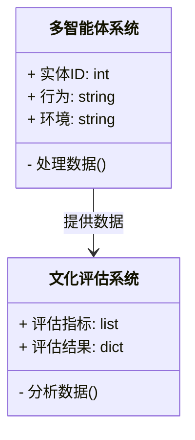

                 


# 多智能体系统在公司文化评估中的应用：无形资产的量化

## 关键词：
多智能体系统、公司文化评估、无形资产量化、分布式计算、协作机制、系统架构

## 摘要：
本文探讨了如何利用多智能体系统量化公司文化中的无形资产。通过分析多智能体系统的定义、核心概念、算法原理、系统架构、项目实战和最佳实践，展示了其在公司文化评估中的优势和应用。文章结合理论与实践，提供了详细的实现方法和案例分析，为量化无形资产提供了新思路。

---

# 第一章：多智能体系统与公司文化评估的背景

## 1.1 问题背景与挑战

公司文化是企业无形资产的重要组成部分，其评估和量化一直是管理学中的难题。传统评估方法依赖主观指标，难以准确量化。多智能体系统通过分布式协作和自适应算法，为解决这一问题提供了新的可能性。

## 1.2 多智能体系统的定义与特点

- **定义**：多智能体系统由多个智能体组成，通过协作完成任务。
- **特点**：分布式、协作性、自适应性。

## 1.3 公司文化评估的重要性

- **定义**：评估公司文化的关键指标。
- **重要性**：影响企业绩效和员工满意度。

## 1.4 多智能体系统在文化评估中的优势

- **优势**：提高评估的准确性和效率。

---

# 第二章：多智能体系统的核心概念与原理

## 2.1 核心概念术语说明

- **智能体**：系统的基本单元，具备感知和决策能力。
- **协作机制**：智能体之间的通信和协调方式。

## 2.2 多智能体系统的基本原理

- **分布式计算**：任务分解到各个智能体。
- **协作与通信**：通过通信实现协作。

## 2.3 公司文化评估中的多智能体模型

- **模型构建**：将文化指标分解为多个任务。
- **协作机制**：智能体协作评估指标。

## 2.4 核心概念对比表格

| 概念       | 分布式计算 | 协作机制 | 自适应性 |
|------------|-----------|----------|----------|
| 特性        | 并行处理  | 通信与协调 | 动态调整 |

## 2.5 ER实体关系图（Mermaid）

```mermaid
erd
  entity 多智能体系统 {
    <属性> 实体ID
    <属性> 行为
    <属性> 环境
  }
  entity 文化评估 {
    <属性> 评估指标
    <属性> 评估结果
    <属性> 评估时间
  }
  多智能体系统 --> 文化评估: 传递评估数据
```

---

# 第三章：算法原理与实现

## 3.1 多智能体系统的算法原理

- **感知与决策**：智能体通过感知环境做出决策。
- **协作与通信**：智能体间通过通信实现协作。

## 3.2 协作与通信机制

- **通信协议**：定义智能体间的数据交换方式。
- **协作算法**：如分布式一致性算法。

## 3.3 分布式计算模型

- **任务分配**：将任务分解到各个智能体。
- **结果整合**：整合各智能体的评估结果。

## 3.4 多智能体系统协作流程（Mermaid）

```mermaid
graph TD
    A[智能体A] --> B[智能体B]: 通信
    B --> C[智能体C]: 协作
    C --> D[中心系统]: 提交结果
```

## 3.5 Python代码示例

```python
class Agent:
    def __init__(self, id):
        self.id = id
        self.data = None

    def receive(self, data):
        self.data = data
        self.process()

    def process(self):
        # 数据处理逻辑
        pass

    def send(self, data):
        # 发送数据到其他智能体
        pass

# 示例用法
agent1 = Agent(1)
agent2 = Agent(2)
agent1.receive("评估数据")
agent1.send("处理结果", agent2)
```

---

# 第四章：系统分析与架构设计

## 4.1 系统功能设计

- **领域模型**：定义系统中的实体及其关系。
- **功能模块**：包括数据采集、处理、分析和展示。

## 4.2 系统架构设计（Mermaid）



## 4.3 接口与交互设计

- **接口设计**：定义智能体间的接口。
- **交互流程**：智能体间的通信流程。

---

# 第五章：项目实战与案例分析

## 5.1 项目背景介绍

- **项目目标**：量化公司文化中的无形资产。
- **项目范围**：选择特定文化指标进行评估。

## 5.2 环境安装与配置

- **安装Python**：安装Python 3.x及以上版本。
- **安装依赖**：安装必要的库，如numpy、pandas。

## 5.3 核心代码实现

```python
import numpy as np

def calculate_cultural_assets(data):
    # 数据预处理
    processed_data = data.dropna()
    # 计算评估指标
    asset_values = np.mean(processed_data, axis=0)
    return asset_values

# 示例数据
data = {
    '创新': [8, 7, 9],
    '协作': [7, 8, 6],
    '沟通': [9, 8, 10]
}

print(calculate_cultural_assets(data))
```

## 5.4 实际案例分析

- **数据采集**：收集员工反馈数据。
- **模型训练**：训练评估模型。
- **结果分析**：分析评估结果，提出改进建议。

---

# 第六章：最佳实践与总结

## 6.1 实践总结

- **系统优势**：提高评估效率和准确性。
- **实施要点**：确保数据质量和通信效率。

## 6.2 小结

- 多智能体系统为公司文化评估提供了新思路，但需要克服技术挑战。

## 6.3 注意事项

- 数据隐私保护
- 系统可扩展性

## 6.4 拓展阅读

- 推荐书籍：《多智能体系统》
- 推荐文章：《分布式计算原理》

---

# 结语

通过多智能体系统的应用，公司文化评估中的无形资产量化变得更加可行和高效。未来，随着技术的发展，多智能体系统在企业管理中的应用将更加广泛和深入。

