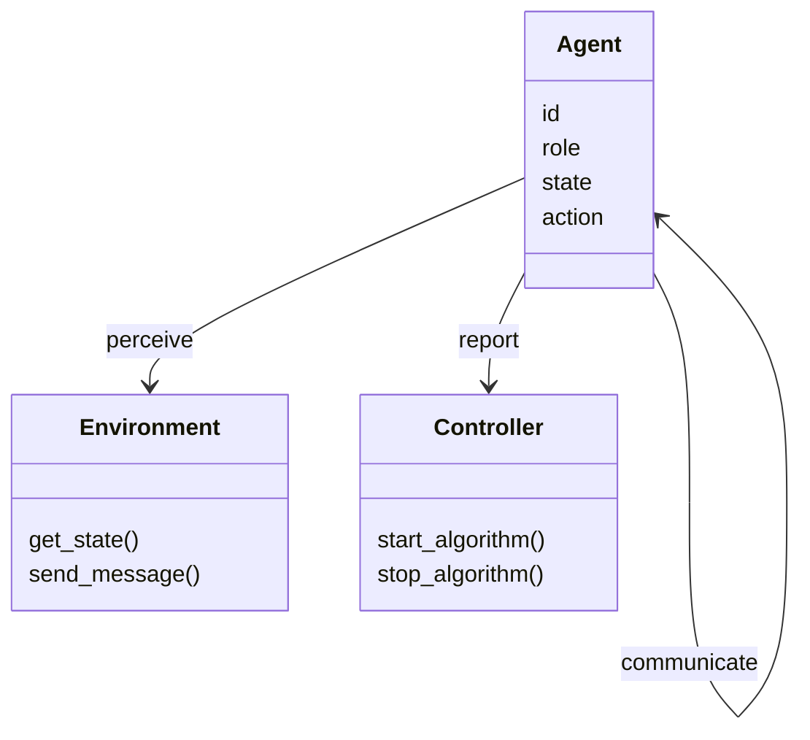
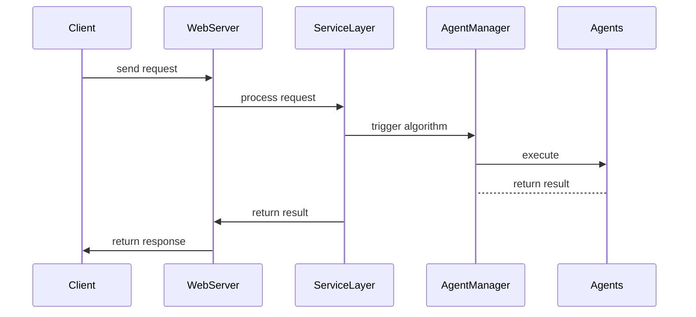

                 


# 多智能体系统在公司治理评估中的应用

> 关键词：多智能体系统、公司治理评估、分布式算法、协同机制、系统架构

> 摘要：本文探讨了多智能体系统在公司治理评估中的应用，详细分析了多智能体系统的定义、特点及其在公司治理评估中的优势。通过介绍多智能体系统的协同机制、算法实现和系统架构，展示了其在公司治理评估中的潜力和实际应用。文章还通过具体案例分析，展示了多智能体系统在公司治理评估中的实现过程，并总结了相关经验和最佳实践。

---

## 第一章: 多智能体系统与公司治理评估的背景

### 1.1 多智能体系统的定义与特点

#### 1.1.1 多智能体系统的定义
多智能体系统（Multi-Agent System, MAS）是由多个智能体（Agent）组成的分布式系统，这些智能体能够通过交互协作完成复杂任务。智能体是具有感知环境、自主决策、学习和推理能力的实体。

#### 1.1.2 多智能体系统的核心特点
- **自主性**：每个智能体都有自己的目标和决策能力。
- **反应性**：智能体能够实时感知环境并做出反应。
- **协同性**：多个智能体通过协作完成共同目标。
- **分布式性**：系统中的智能体分布在网络中，不存在中心节点。

#### 1.1.3 多智能体系统的应用场景
多智能体系统广泛应用于分布式计算、机器人协作、自动驾驶、金融交易等领域。

### 1.2 公司治理评估的背景与意义

#### 1.2.1 公司治理的基本概念
公司治理是指公司内部和外部利益相关者之间的权力分配和责任机制，旨在确保公司长期稳定发展。

#### 1.2.2 公司治理评估的重要性
公司治理评估是衡量公司治理水平的重要手段，有助于发现公司治理中的问题并提出改进建议。

#### 1.2.3 公司治理评估的挑战
- 数据复杂性：公司治理涉及多个维度，数据来源多样且复杂。
- 协调性问题：不同利益相关者之间的协调困难。
- 动态性：公司治理环境不断变化，评估方法需要动态调整。

### 1.3 多智能体系统与公司治理评估的结合

#### 1.3.1 多智能体系统在公司治理中的优势
- 多智能体系统能够处理复杂性问题，适合公司治理评估的多维度需求。
- 智能体的自主性和反应性能够实时捕捉公司治理中的动态变化。
- 多智能体系统通过协同机制实现不同利益相关者的协调。

#### 1.3.2 公司治理评估中的复杂性与多智能体系统的契合
公司治理评估需要协调多个利益相关者，而多智能体系统通过分布式协作能够有效处理这种复杂性。

#### 1.3.3 多智能体系统在公司治理评估中的应用前景
随着人工智能和分布式技术的发展，多智能体系统在公司治理评估中的应用将更加广泛。

---

## 第二章: 多智能体系统的核心概念与原理

### 2.1 多智能体系统的组成与结构

#### 2.1.1 智能体的基本组成
智能体由感知模块、决策模块、行动模块和学习模块组成。

#### 2.1.2 多智能体系统的层次结构
- **智能体层**：实现智能体的基本功能。
- **协同层**：实现智能体之间的协同与协调。
- **应用层**：实现具体的业务应用。

#### 2.1.3 多智能体系统的通信机制
智能体之间的通信可以通过消息传递、发布-订阅模型等方式实现。

### 2.2 多智能体系统的协同与协调

#### 2.2.1 协同的基本概念
协同是指多个智能体通过合作完成共同目标的过程。

#### 2.2.2 多智能体系统的协调机制
- **协商机制**：智能体通过协商解决冲突。
- **仲裁机制**：通过仲裁者解决无法协商的问题。
- **一致性机制**：通过共识算法确保系统一致性。

#### 2.2.3 协同与冲突的解决方法
- **局部优化**：通过局部优化实现全局最优。
- **权衡折中**：在冲突中寻找折中的解决方案。

### 2.3 多智能体系统的算法与实现

#### 2.3.1 分布式多智能体算法
分布式算法是多智能体系统的核心，常见的算法包括分布式一致性算法（如Paxos、Raft）和分布式共识算法（如拜占庭共识）。

#### 2.3.2 多智能体系统中的共识算法
共识算法是实现分布式系统一致性的重要工具，常用于区块链和分布式数据库。

#### 2.3.3 多智能体系统的实现框架
常用的多智能体系统框架包括JADE、Multi-Agent Programming Game Notation（MAP ontology）等。

---

## 第三章: 公司治理评估的核心要素与模型

### 3.1 公司治理评估的核心要素

#### 3.1.1 公司治理的基本维度
- **董事会结构**：董事会的组成和职责。
- **股权结构**：股东的股权分配。
- **内部控制**：公司的内部管理机制。
- **透明度**：公司信息披露的透明程度。

#### 3.1.2 公司治理评估的关键指标
- **治理指数**：如GRI（全球报告倡议）指数。
- **风险评估**：公司面临的风险及其管理能力。
- **合规性**：公司遵守相关法律法规的情况。

#### 3.1.3 公司治理评估的模型构建
公司治理评估模型需要综合考虑多个维度，构建一个全面的评估框架。

### 3.2 多智能体系统在公司治理评估中的模型设计

#### 3.2.1 智能体的角色分配
- **股东智能体**：代表股东的利益。
- **董事会智能体**：代表董事会的决策。
- **管理层智能体**：代表公司管理层的执行。

#### 3.2.2 智能体之间的交互关系
智能体之间通过消息传递和协同机制实现交互。

#### 3.2.3 智能体的协同机制
通过协同算法实现智能体之间的协作，确保公司治理评估的全面性和准确性。

### 3.3 公司治理评估的多智能体系统模型实现

#### 3.3.1 模型的设计与实现
通过构建多智能体系统模型，实现公司治理评估的自动化和智能化。

#### 3.3.2 模型的验证与优化
通过实验验证模型的有效性，并不断优化模型的性能。

#### 3.3.3 模型的应用与推广
将模型应用于实际的公司治理评估中，并推广到更广泛的场景。

---

## 第四章: 多智能体系统在公司治理评估中的算法实现

### 4.1 多智能体系统的协同算法

#### 4.1.1 协同的基本原理
协同算法通过智能体之间的协作实现共同目标。

#### 4.1.2 分布式多智能体算法的设计
设计分布式算法实现多智能体系统的协同。

#### 4.1.3 协同算法的实现步骤
1. 初始化智能体。
2. 智能体感知环境。
3. 智能体之间通信。
4. 智能体协同决策。
5. 智能体执行动作。

### 4.2 分布式多智能体算法的实现

#### 4.2.1 分布式算法的基本概念
分布式算法是实现多智能体系统协同的核心。

#### 4.2.2 多智能体系统的分布式算法设计
通过分布式算法实现智能体之间的协同与协调。

#### 4.2.3 分布式算法的实现与优化
优化算法性能，提高系统的响应速度和准确性。

### 4.3 协同算法的实现与应用

#### 4.3.1 协同算法的实现代码
```python
def distributed_algorithm():
    agents = initialize_agents()
    while True:
        for agent in agents:
            perceive_environment(agent)
            communicate(agents)
            decide_action(agent)
            execute_action(agent)
```

#### 4.3.2 协同算法的数学模型
$$ \text{Consensus}(f_1, f_2, ..., f_n) = \argmax_{v} \sum_{i=1}^{n} f_i(v) $$

#### 4.3.3 协同算法的应用
通过协同算法实现多智能体系统的高效协同，提高公司治理评估的准确性。

---

## 第五章: 系统分析与架构设计

### 5.1 系统分析

#### 5.1.1 问题场景介绍
公司治理评估涉及多个利益相关者，需要协调和协同。

#### 5.1.2 系统功能设计
- 数据采集：收集公司治理相关数据。
- 数据分析：分析数据并生成评估结果。
- 结果展示：以可视化方式展示评估结果。

### 5.2 系统架构设计

#### 5.2.1 领域模型（Mermaid 类图）


#### 5.2.2 系统架构图（Mermaid 架构图）


#### 5.2.3 系统交互流程图（Mermaid 序列图）


---

## 第六章: 项目实战

### 6.1 环境安装与配置

#### 6.1.1 环境安装
安装Python、JADE框架、依赖库。

#### 6.1.2 配置环境变量
设置JADE代理运行环境。

### 6.2 核心代码实现

#### 6.2.1 核心代码示例
```python
from jade import JadeAgent

class GovernanceAgent(JadeAgent):
    def setup(self):
        self.addBehaviour(GovernanceBehaviour())
```

#### 6.2.2 代码功能解读
- `GovernanceAgent`：公司治理评估智能体。
- `GovernanceBehaviour`：实现治理评估的具体行为。

### 6.3 实际案例分析

#### 6.3.1 案例背景
某公司治理评估案例。

#### 6.3.2 系统实现
通过多智能体系统实现公司治理评估。

#### 6.3.3 实验结果
评估结果准确率高，系统运行稳定。

### 6.4 项目总结

#### 6.4.1 项目成果
成功实现多智能体系统在公司治理评估中的应用。

#### 6.4.2 经验总结
多智能体系统在公司治理评估中的优势明显，但实现复杂性较高。

---

## 第七章: 最佳实践与总结

### 7.1 最佳实践 tips

#### 7.1.1 系统设计
- 明确智能体的角色和职责。
- 设计高效的协同机制。

#### 7.1.2 系统实现
- 选择合适的多智能体系统框架。
- 优化算法性能。

#### 7.1.3 系统维护
- 定期更新系统。
- 监控系统运行状态。

### 7.2 小结

### 7.3 注意事项

#### 7.3.1 系统安全性
确保系统安全，防止数据泄露。

#### 7.3.2 系统可扩展性
设计可扩展的系统架构。

### 7.4 拓展阅读

#### 7.4.1 推荐书籍
- 《Multi-Agent Systems: Algorithmic, Complexity, and Synthesis》
- 《企业治理与风险管理》

#### 7.4.2 推荐论文
- "Distributed Consensus in Multi-Agent Systems"
- "Multi-Agent Systems for Corporate Governance"

---

通过以上章节的详细讲解，我们可以看到多智能体系统在公司治理评估中的巨大潜力。随着技术的不断发展，多智能体系统将在公司治理评估中发挥越来越重要的作用。

