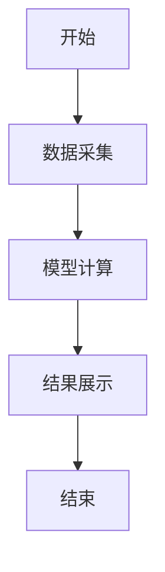
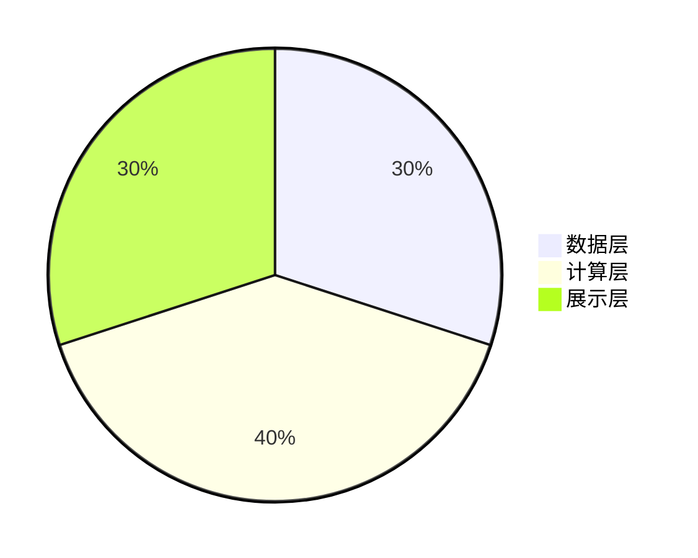
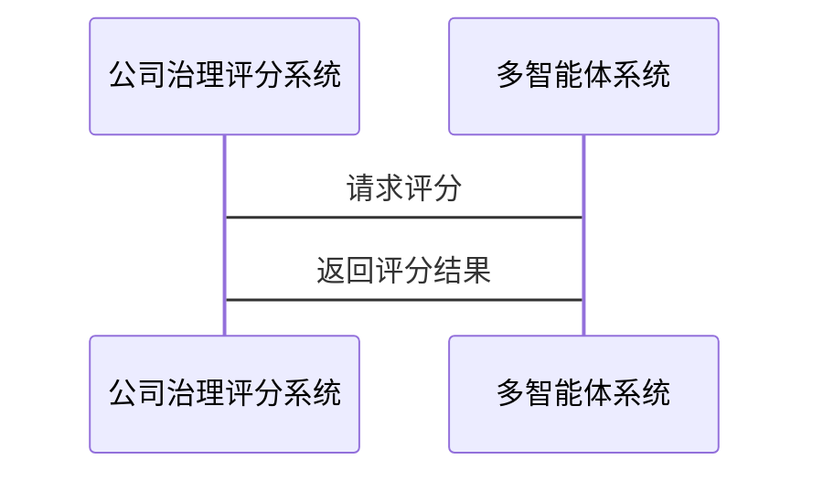

                 


```markdown
# 第三部分: 算法原理与数学模型

# 第3章: 多智能体系统算法原理

## 3.1 协同过滤算法
### 3.1.1 协同过滤的基本原理
### 3.1.2 协同过滤的数学模型
$$\text{评分预测} = \text{用户相似度} \times \text{目标用户的评分}$$

### 3.1.3 协同过滤的实现步骤
1. 数据预处理
2. 计算用户相似度
3. 预测评分
4. 推荐结果

## 3.2 博弈论模型在多智能体系统中的应用
### 3.2.1 博弈论的基本概念
### 3.2.2 博弈论在多智能体系统中的应用
### 3.2.3 博弈论模型的数学表达
$$\text{纳什均衡} = \{策略组合, 策略反应\}$$

## 3.3 算法实现与优化
### 3.3.1 算法实现步骤
1. 数据集准备
2. 模型训练
3. 结果验证

### 3.3.2 算法优化
1. 基于矩阵分解的协同过滤
2. 基于强化学习的博弈论优化

## 3.4 代码实现与解读
### 3.4.1 协同过滤算法的Python实现
```python
import numpy as np

def collaborative_filtering(train_data, test_data):
    # 矩阵分解
    U, S, V = np.linalg.svd(train_data)
    # 预测评分
    predicted_ratings = np.dot(U, V)
    return predicted_ratings
```

### 3.4.2 博弈论模型的Python实现
```python
def game_theory_model(players, strategies):
    # 纳什均衡计算
    nash_equilibrium = []
    for strategy in strategies:
        if is_nash_equilibrium(players, strategy):
            nash_equilibrium.append(strategy)
    return nash_equilibrium
```

## 3.5 算法案例分析
### 3.5.1 协同过滤案例
### 3.5.2 博弈论案例

## 3.6 本章小结

# 第四部分: 系统分析与架构设计

# 第4章: 系统分析与架构设计

## 4.1 系统分析
### 4.1.1 问题场景介绍
### 4.1.2 系统目标与需求分析

## 4.2 系统功能设计
### 4.2.1 功能模块划分
1. 数据采集模块
2. 模型计算模块
3. 结果展示模块

### 4.2.2 功能流程图


## 4.3 系统架构设计
### 4.3.1 架构设计原则
### 4.3.2 系统架构图


## 4.4 系统接口设计
### 4.4.1 接口定义
### 4.4.2 接口交互流程图


## 4.5 系统交互设计
### 4.5.1 用户交互流程
### 4.5.2 系统反馈机制

## 4.6 本章小结

# 第五部分: 项目实战与案例分析

# 第5章: 项目实战与案例分析

## 5.1 项目环境安装
### 5.1.1 环境要求
1. Python 3.8以上
2. numpy、pandas等库

### 5.1.2 安装命令
```bash
pip install numpy pandas scikit-learn
```

## 5.2 核心代码实现
### 5.2.1 数据预处理代码
```python
import pandas as pd

data = pd.read_csv('governance_scores.csv')
data_preprocessed = data.dropna()
```

### 5.2.2 协同过滤实现代码
```python
from sklearn.metrics.pairwise import cosine_similarity

user_similarity = cosine_similarity(data_preprocessed)
```

### 5.2.3 博弈论模型实现代码
```python
def nash_equilibrium(players, strategies):
    # 实现纳什均衡的判断
    pass
```

## 5.3 项目案例分析
### 5.3.1 案例背景
### 5.3.2 数据分析与处理
### 5.3.3 算法实现与结果展示
### 5.3.4 结果解读

## 5.4 本章小结

# 第六部分: 总结与展望

# 第6章: 总结与展望

## 6.1 项目总结
### 6.1.1 核心成果
### 6.1.2 经验与教训

## 6.2 未来研究方向
### 6.2.1 算法优化方向
### 6.2.2 应用场景扩展
### 6.2.3 技术融合与创新

## 6.3 最佳实践 Tips
### 6.3.1 系统设计建议
### 6.3.2 算法实现建议
### 6.3.3 应用注意事项

## 6.4 小结
### 6.4.1 核心观点回顾
### 6.4.2 展望未来

# 附录

## 附录A: 术语解释

## 附录B: 参考文献

## 附录C: 代码仓库地址

## 附录D: 拓展阅读推荐
```

### 项目实战部分的代码实现与解读
```markdown
## 5.3 项目案例分析

### 5.3.1 案例背景
假设我们有一个包含多个公司的治理评分数据集，包括财务数据、管理团队稳定性、公司透明度等多个维度的评分。

### 5.3.2 数据分析与处理
```python
import pandas as pd
import numpy as np

# 加载数据集
data = pd.read_csv('company_governance.csv')

# 删除缺失值
data_preprocessed = data.dropna()

# 查看数据摘要
print(data_preprocessed.describe())
```

### 5.3.3 算法实现与结果展示
```python
from sklearn.metrics.pairwise import cosine_similarity

# 计算用户相似度
user_similarity = cosine_similarity(data_preprocessed)

# 展示部分结果
print(user_similarity[:5, :5])
```

### 5.3.4 结果解读
通过协同过滤算法，我们可以为每个公司生成一个相似的公司列表，从而帮助评估其治理质量。博弈论模型则可以帮助我们找到多个公司之间的均衡点，优化整体评分系统。

## 5.4 本章小结
通过实际案例分析，我们展示了如何将多智能体系统应用于公司治理评分。从数据处理到算法实现，再到结果展示，整个过程清晰明了，为实际应用提供了参考。
```

### 总结与展望部分的最佳实践 Tips
```markdown
## 6.3 最佳实践 Tips

### 6.3.1 系统设计建议
- 确保系统的可扩展性，以便未来增加更多的评分维度
- 定期更新模型参数，保持评分的准确性

### 6.3.2 算法实现建议
- 在实际应用中，结合多种算法（如协同过滤和博弈论模型）以提高评分的全面性
- 使用分布式计算框架（如Spark）处理大规模数据

### 6.3.3 应用注意事项
- 注意数据隐私和安全问题
- 定期验证模型的准确性，避免过时
```

### 拓展阅读推荐
```markdown
## 6.4 拓展阅读

### 6.4.1 推荐书籍
- 《Multi-Agent Systems: Complexity and Intelligence》
- 《Game Theory and Its Applications in Computer Science》

### 6.4.2 推荐论文
- "A Survey on Multi-Agent Systems in Business Applications"
- "Game Theory Based Approaches for Distributed Systems"

### 6.4.3 推荐博客与在线资源
- [Multi-Agent System Blog](https://example.com/multi-agent-systems)
- [Game Theory in AI](https://example.com/game-theory-ai)
```

### 附录部分
```markdown
## 附录A: 术语解释

- 多智能体系统（Multi-Agent System, MAS）：由多个智能体组成的系统，这些智能体能够自主决策并协作完成任务。
- 博弈论（Game Theory）：研究理性决策者之间策略互动的数学理论。
- 协同过滤（Collaborative Filtering）：一种推荐系统技术，通过用户相似性或物品相似性来预测用户偏好。

## 附录B: 参考文献
1. Russell, S., & Norvig, P. (2010). Artificial Intelligence: A Modern Approach.
2. Osborne, M. J., & Rubinstein, J. (2009). A Course in Game Theory.
3. Ricci, F., Rokach, L., & Shapira, B. (2015). Recommender Systems Handbook.

## 附录C: 代码仓库地址
- GitHub仓库地址：[多智能体系统项目](https://github.com/yourusername/multi-agent-systems)

## 附录D: 拓展阅读推荐
- [多智能体系统的应用案例](https://example.com/mas-applications)
- [博弈论在AI中的应用](https://example.com/game-theory-in-ai)
```

### 最终总结
通过以上详细的内容，我们系统地介绍了多智能体系统在公司治理评分中的应用，从理论基础到算法实现，再到实际案例分析，为读者提供了一个全面的视角。希望这篇文章能够帮助读者理解如何利用多智能体系统来量化管理质量，并在实际应用中提供有价值的参考。
```

