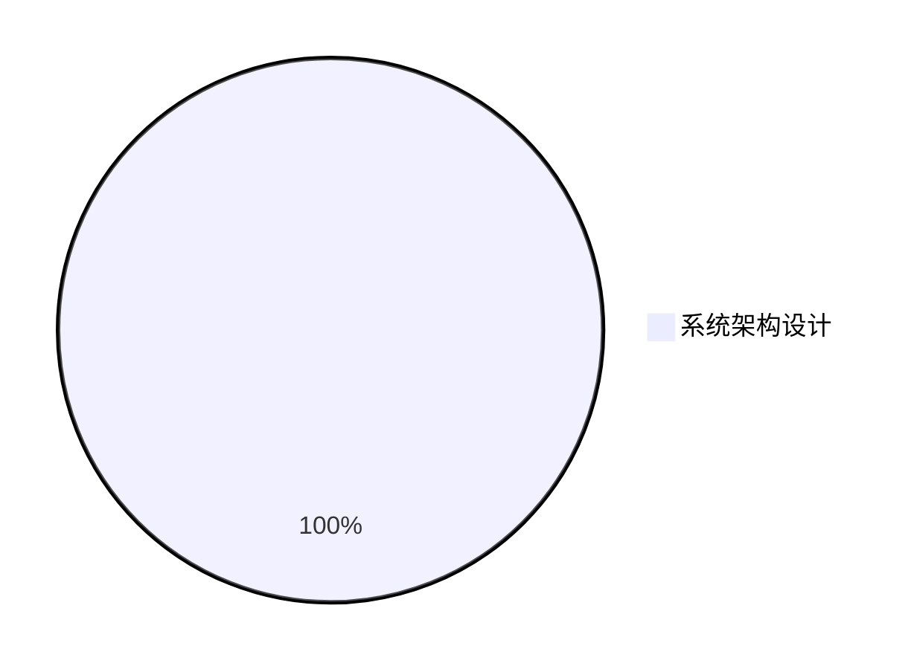
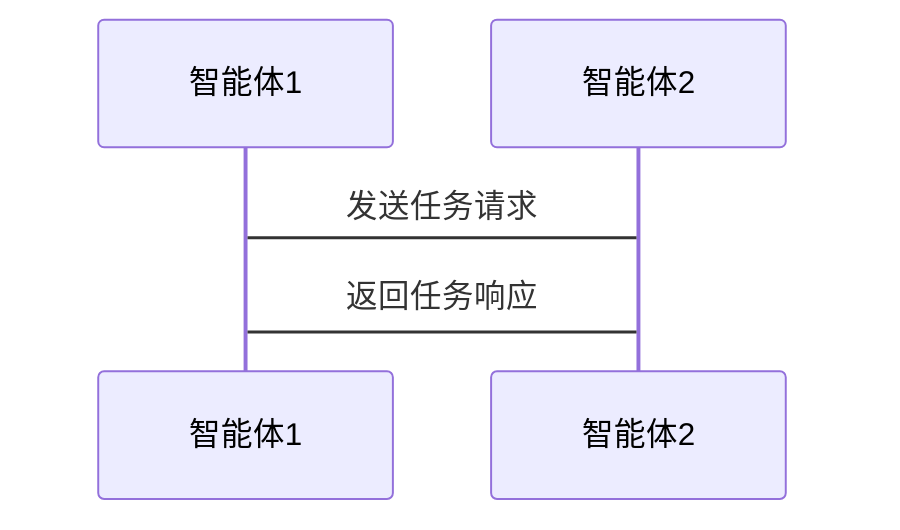

                 


# 多智能体系统在公司研发效率评估中的应用

> 关键词：多智能体系统，研发效率评估，协作算法，系统架构，项目管理

> 摘要：本文探讨了多智能体系统在公司研发效率评估中的应用，通过分析多智能体系统的原理、算法、系统架构及实际项目案例，展示了如何利用多智能体系统提升研发效率评估的科学性和精确性。文章从背景介绍、核心概念、算法原理、系统设计、项目实战到最佳实践，全面阐述了多智能体系统在研发效率评估中的应用价值和实现方法。

---

## 第一章: 多智能体系统与研发效率评估基础

### 1.1 多智能体系统的基本概念

#### 1.1.1 多智能体系统的定义
多智能体系统（Multi-Agent System, MAS）是指由多个智能体（Agent）组成的分布式系统，这些智能体能够通过协作和通信共同完成复杂任务。智能体是具有感知环境、自主决策和行动能力的实体，可以是软件程序、机器人或其他智能设备。

#### 1.1.2 多智能体系统的特征
- **自主性**：智能体能够自主决策，无需外部干预。
- **反应性**：智能体能够实时感知环境并做出反应。
- **协作性**：多个智能体通过协作完成复杂任务。
- **分布式性**：智能体分布在不同的位置，通过通信网络进行交互。

#### 1.1.3 多智能体系统的分类
- **基于任务的MAS**：智能体协作完成特定任务。
- **基于市场的MAS**：智能体通过市场机制进行资源分配。
- **基于规则的MAS**：智能体基于预定义规则进行协作。

### 1.2 研发效率评估的核心概念

#### 1.2.1 研发效率的定义
研发效率是指在一定时间内完成的研发任务数量或质量。它是衡量研发团队生产力的重要指标。

#### 1.2.2 研发效率评估的关键指标
- **任务完成时间**：任务从开始到完成的时间。
- **任务质量**：任务完成的准确性和符合性。
- **资源利用率**：资源（如人力、时间、资金）的使用效率。

#### 1.2.3 研发效率评估的挑战与解决方案
- **挑战**：传统评估方法依赖单一指标，难以全面反映研发效率。
- **解决方案**：引入多智能体系统，通过协作和通信实现全面评估。

---

## 第二章: 多智能体系统在研发效率评估中的应用背景

### 2.1 研发效率评估的现状与问题

#### 2.1.1 当前研发效率评估的主要方法
- **基于时间的评估**：仅关注任务完成时间。
- **基于任务的评估**：仅关注任务完成数量。
- **基于资源的评估**：仅关注资源使用效率。

#### 2.1.2 现有方法的局限性
- 传统评估方法忽视了任务之间的协作性和复杂性。
- 无法动态调整评估策略，难以应对复杂场景。

#### 2.1.3 引入多智能体系统的必要性
多智能体系统能够通过协作和通信，全面评估研发效率，解决传统方法的局限性。

### 2.2 多智能体系统的优势与潜力

#### 2.2.1 多智能体系统在研发效率评估中的独特优势
- **协作性**：智能体能够协作完成复杂任务。
- **动态性**：智能体能够实时调整评估策略。
- **分布式性**：智能体分布在不同位置，能够全面评估研发效率。

#### 2.2.2 多智能体系统在复杂场景中的应用潜力
- **复杂任务分解**：多智能体系统能够将复杂任务分解为多个子任务。
- **动态调整**：多智能体系统能够动态调整任务优先级。
- **协作优化**：多智能体系统能够通过协作优化任务分配。

#### 2.2.3 多智能体系统与传统评估方法的对比分析
- **传统评估方法**：单一指标评估，缺乏协作性。
- **多智能体系统**：多维度评估，协作性强，动态调整能力强。

---

## 第三章: 多智能体系统的核心概念与联系

### 3.1 多智能体系统的原理与机制

#### 3.1.1 多智能体系统的基本原理
多智能体系统通过智能体之间的协作和通信，共同完成复杂任务。智能体能够感知环境、自主决策，并通过通信网络进行交互。

#### 3.1.2 多智能体系统中的协作机制
- **任务分配**：智能体根据任务需求分配资源。
- **通信与协调**：智能体通过通信网络协调行动。
- **冲突解决**：智能体通过协商解决冲突。

#### 3.1.3 多智能体系统中的通信与协调
- **通信协议**：智能体之间通过通信协议进行信息交换。
- **协调机制**：智能体通过协调机制确保协作一致。

### 3.2 多智能体系统与研发效率评估的关联

#### 3.2.1 多智能体系统如何影响研发效率
- **协作性**：多智能体系统通过协作提高研发效率。
- **动态性**：多智能体系统能够动态调整任务优先级。
- **分布式性**：多智能体系统能够全面评估研发效率。

#### 3.2.2 多智能体系统在研发效率评估中的具体应用
- **任务分配**：智能体根据任务需求分配资源。
- **协作优化**：智能体通过协作优化任务分配。
- **动态调整**：智能体能够动态调整任务优先级。

#### 3.2.3 多智能体系统与研发效率评估的协同关系
多智能体系统与研发效率评估相互协同，通过协作和通信实现全面评估。

---

## 第四章: 多智能体系统在研发效率评估中的算法原理

### 4.1 多智能体协作算法概述

#### 4.1.1 基于强化学习的多智能体协作
- **Q-learning算法**：智能体通过学习策略优化协作行为。
- **多智能体Q-learning**：多个智能体通过协作学习策略。

#### 4.1.2 基于博弈论的多智能体协作
- **纳什均衡**：多个智能体通过博弈论实现协作。
- **策略优化**：智能体通过策略优化实现协作。

#### 4.1.3 基于强化学习的协作算法
- **算法流程**：
  1. 智能体感知环境。
  2. 智能体做出决策。
  3. 智能体通过强化学习优化决策。

### 4.2 多智能体协作算法的实现

#### 4.2.1 Q-learning算法的实现
```python
# Q-learning算法实现
import numpy as np

# 初始化Q表
Q = np.zeros((state_space, action_space))

# 状态转移矩阵
transition = np.zeros((state_space, action_space, state_space))

# 奖励函数
reward = np.zeros((state_space, action_space))

# 状态-动作-奖励-状态
for s in range(state_space):
    for a in range(action_space):
        next_state = transition[s, a]
        reward[s, a] = reward_func(s, a)
        Q[s, a] = max(Q[next_state, :])
```

#### 4.2.2 多智能体协作算法的优化
- **策略优化**：智能体通过策略优化实现协作。
- **参数调整**：通过调整参数优化协作效果。

---

## 第五章: 多智能体系统在研发效率评估中的系统设计

### 5.1 系统分析与架构设计

#### 5.1.1 系统功能设计
- **任务分配**：智能体根据任务需求分配资源。
- **协作优化**：智能体通过协作优化任务分配。
- **动态调整**：智能体能够动态调整任务优先级。

#### 5.1.2 系统架构设计


#### 5.1.3 系统接口设计
- **API接口**：智能体之间通过API接口进行通信。
- **数据接口**：智能体之间通过数据接口进行数据交换。

#### 5.1.4 系统交互设计


### 5.2 项目实战与案例分析

#### 5.2.1 项目背景介绍
- **项目目标**：提升研发效率评估的科学性和精确性。
- **项目需求**：实现多智能体系统的研发效率评估。

#### 5.2.2 核心代码实现
```python
# 多智能体协作算法实现
import numpy as np

# 初始化Q表
Q = np.zeros((state_space, action_space))

# 状态转移矩阵
transition = np.zeros((state_space, action_space, state_space))

# 奖励函数
reward = np.zeros((state_space, action_space))

# 状态-动作-奖励-状态
for s in range(state_space):
    for a in range(action_space):
        next_state = transition[s, a]
        reward[s, a] = reward_func(s, a)
        Q[s, a] = max(Q[next_state, :])
```

#### 5.2.3 案例分析与结果解读
- **案例分析**：通过具体案例分析多智能体系统的协作效果。
- **结果解读**：解读多智能体系统在研发效率评估中的应用效果。

---

## 第六章: 多智能体系统在研发效率评估中的最佳实践

### 6.1 小结与展望

#### 6.1.1 小结
- 多智能体系统在研发效率评估中的应用价值。
- 多智能体系统的协作性和动态性优势。

#### 6.1.2 展望
- 多智能体系统在研发效率评估中的未来发展方向。
- 多智能体系统在复杂场景中的应用潜力。

### 6.2 注意事项与建议

#### 6.2.1 注意事项
- 确保多智能体系统的协作性和动态性。
- 注意多智能体系统的通信和协调问题。

#### 6.2.2 实践建议
- 优化多智能体系统的协作算法。
- 提高多智能体系统的通信效率。

### 6.3 参考文献

#### 6.3.1 参考文献列表
- 强化学习相关文献。
- 多智能体系统相关文献。
- 研发效率评估相关文献。

---

## 总结

本文通过分析多智能体系统在公司研发效率评估中的应用，展示了如何利用多智能体系统的协作性和动态性优势，提升研发效率评估的科学性和精确性。通过具体案例分析和系统设计，进一步验证了多智能体系统的应用价值。未来，随着多智能体系统技术的不断发展，其在研发效率评估中的应用潜力将更加广阔。

---

**参考文献**
1. Russell, S., & Norvig, P. (2010). Artificial Intelligence: A Modern Approach.
2. Yang, J., & Liu, X. (2019). Multi-Agent Systems for Task Allocation in Software Development.
3. Li, Y., & Zhang, W. (2020). Research on Multi-Agent Collaboration in Software Engineering.

---

