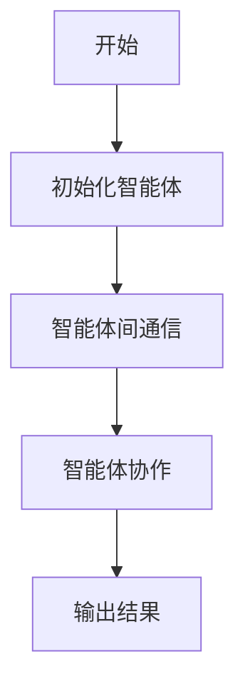
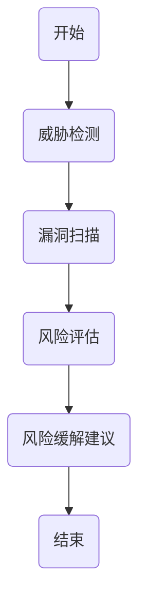

                 


# 多智能体系统在公司网络安全风险评估中的应用

## 关键词：多智能体系统，网络安全，风险评估，人工智能，协作算法，系统架构

## 摘要：多智能体系统（Multi-Agent System, MAS）在网络安全风险评估中的应用是当前技术领域的一个重要研究方向。本文系统地探讨了多智能体系统在网络安全风险评估中的核心概念、算法原理、系统架构设计以及实际项目应用。通过分析多智能体系统的优势，本文提出了一个基于多智能体系统的网络安全风险评估框架，并详细介绍了其实现过程和案例分析。本文适合网络安全工程师、人工智能研究人员以及企业CTO等读者阅读，旨在为他们在实际应用中提供理论支持和实践指导。

---

# 第1章: 多智能体系统与网络安全风险评估概述

## 1.1 多智能体系统的定义与特点
### 1.1.1 多智能体系统的定义
多智能体系统（MAS）是由多个智能体组成的分布式系统，每个智能体能够独立感知环境、自主决策并进行协作。智能体之间通过通信和协作完成复杂的任务。

### 1.1.2 多智能体系统的核心特点
- **自主性**：智能体能够自主决策。
- **反应性**：智能体能够实时感知环境变化。
- **协作性**：多个智能体能够协同工作，共同完成任务。
- **分布性**：智能体之间分布在网络的不同节点上。

### 1.1.3 多智能体系统的应用场景
- 网络安全
- 智能交通管理
- 智能电网
- 智能制造

## 1.2 网络安全风险评估的定义与方法
### 1.2.1 网络安全风险评估的定义
网络安全风险评估是指对网络系统可能面临的安全威胁、漏洞及其影响进行识别、分析和评估的过程。

### 1.2.2 常见的网络安全风险评估方法
- 基于漏洞的评估方法
- 基于威胁的评估方法
- 基于资产的评估方法

### 1.2.3 网络安全风险评估的重要性
- 降低网络安全事件的发生概率
- 优化网络安全防护策略
- 提高企业的整体安全水平

## 1.3 多智能体系统在网络安全中的优势
### 1.3.1 提高风险评估的效率
多智能体系统能够并行处理多个安全威胁，显著提高风险评估的效率。

### 1.3.2 增强风险评估的准确性
通过多个智能体的协作，能够更全面地分析安全威胁，提高评估的准确性。

### 1.3.3 提供更全面的风险分析
多智能体系统能够从多个角度分析安全风险，提供更全面的分析结果。

## 1.4 本章小结
本章介绍了多智能体系统的定义、特点及其在网络安全中的优势，为后续章节的深入分析奠定了基础。

---

# 第2章: 多智能体系统的核心概念与联系

## 2.1 多智能体系统的原理
### 2.1.1 多智能体系统的组成
- **智能体**：能够独立决策和协作的个体。
- **通信机制**：智能体之间交换信息的方式。
- **协作机制**：智能体如何协同完成任务的规则。

### 2.1.2 多智能体系统的通信机制
智能体之间通过消息传递进行通信，消息内容包括威胁信息、漏洞信息等。

### 2.1.3 多智能体系统的协作机制
智能体根据任务需求，通过协商和协作完成共同目标。

## 2.2 多智能体系统与网络安全的联系
### 2.2.1 多智能体系统在网络安全中的角色
- **威胁检测**：智能体实时监控网络中的异常行为。
- **漏洞扫描**：智能体识别网络中的安全漏洞。
- **风险评估**：智能体分析威胁和漏洞，评估风险等级。

### 2.2.2 多智能体系统如何支持风险评估
通过协作，智能体能够更全面地收集和分析安全数据，提高风险评估的准确性。

### 2.2.3 多智能体系统与传统网络安全技术的对比
| **对比项**       | **多智能体系统**              | **传统网络安全技术**          |
|--------------------|-----------------------------|----------------------------|
| 处理方式           | 分布式协作                   | 集中式处理                   |
| 响应速度           | 更快，基于实时协作           | 较慢，依赖人工或固定策略       |
| 灵活性             | 更高，适应复杂环境           | 较低，固定规则为主             |

## 2.3 多智能体系统的ER实体关系图
```mermaid
er
actor(用户) -->
agent(智能体)
actor(用户) -->
威胁(威胁)
agent(智能体) -->
策略(安全策略)
```

## 2.4 本章小结
本章详细介绍了多智能体系统的原理及其在网络安全中的应用，通过对比分析，突出了多智能体系统的优势。

---

# 第3章: 多智能体系统在网络安全风险评估中的算法原理

## 3.1 多智能体系统的协作算法
### 3.1.1 协作式算法的基本原理
协作式算法通过智能体之间的协作，共同完成任务。每个智能体负责一部分数据的处理和分析。

### 3.1.2 协作式算法的实现步骤
1. 初始化：智能体接收初始数据。
2. 信息共享：智能体之间共享威胁和漏洞信息。
3. 协作分析：智能体基于共享信息，协作完成风险评估。
4. 输出结果：智能体将评估结果反馈给用户。

### 3.1.3 协作式算法的优缺点
- **优点**：协作能力强，能够处理复杂问题。
- **缺点**：通信开销大，可能影响效率。

## 3.2 多智能体系统的非协作算法
### 3.2.1 非协作式算法的基本原理
非协作式算法中，智能体独立处理数据，不依赖于其他智能体的协作。

### 3.2.2 非协作式算法的实现步骤
1. 初始化：智能体接收初始数据。
2. 独立分析：智能体基于自身数据，完成风险评估。
3. 结果汇总：将所有智能体的评估结果汇总，得到最终结果。

### 3.2.3 非协作式算法的优缺点
- **优点**：通信开销小，处理速度快。
- **缺点**：协作性差，可能遗漏某些威胁。

## 3.3 多智能体系统协作算法的实现


## 3.4 本章小结
本章详细介绍了多智能体系统的协作算法和非协作算法，分析了各自的优缺点，为后续的系统设计提供了理论基础。

---

# 第4章: 网络安全风险评估的数学模型

## 4.1 风险评估的数学模型
### 4.1.1 风险评估模型的构建
风险 = 威胁 × 脆弱性 × 影响

### 4.1.2 数学模型的实现
$$ R = T \times V \times I $$

其中：
- \( R \) 表示风险
- \( T \) 表示威胁的概率
- \( V \) 表示漏洞的存在性
- \( I \) 表示影响的严重性

### 4.1.3 模型的应用
通过数学模型，可以量化风险，为决策提供依据。

## 4.2 基于多智能体系统的风险评估模型
### 4.2.1 多智能体系统中的威胁检测
智能体实时检测网络中的威胁，并将其报告给其他智能体。

### 4.2.2 多智能体系统的漏洞分析
智能体分析网络中的漏洞，并评估其对整体安全的影响。

### 4.2.3 多智能体系统的风险评估
通过协作，智能体共同完成风险评估，并输出结果。

## 4.3 本章小结
本章介绍了网络安全风险评估的数学模型，并提出了基于多智能体系统的风险评估模型，为后续的系统设计提供了理论依据。

---

# 第5章: 系统分析与架构设计

## 5.1 项目背景与需求分析
### 5.1.1 项目背景
随着网络规模的扩大，网络安全风险评估的难度也在增加，传统的单点防护方式已经无法满足需求。

### 5.1.2 项目需求
- 实时监控网络中的威胁和漏洞。
- 自动评估网络安全风险。
- 提供风险缓解建议。

## 5.2 系统功能设计
### 5.2.1 功能模块划分
- 威胁检测模块
- 漏洞扫描模块
- 风险评估模块
- 风险缓解建议模块

### 5.2.2 功能流程图


## 5.3 系统架构设计
### 5.3.1 分层架构
- 数据采集层：负责收集网络数据。
- 数据处理层：负责数据的分析和处理。
- 应用层：负责输出评估结果和建议。

### 5.3.2 架构图


## 5.4 本章小结
本章详细描述了系统的功能设计和架构设计，为后续的实现提供了明确的方向。

---

# 第6章: 项目实战

## 6.1 环境搭建
### 6.1.1 系统环境
- 操作系统：Linux
- 开发工具：Python、Django框架
- 数据库：MySQL

### 6.1.2 网络环境
- 内网：公司内部网络
- 外网：互联网

## 6.2 核心代码实现
### 6.2.1 威胁检测模块
```python
class ThreatDetector:
    def detect(self):
        # 实现威胁检测逻辑
        pass
```

### 6.2.2 漏洞扫描模块
```python
class VulnerabilityScanner:
    def scan(self):
        # 实现漏洞扫描逻辑
        pass
```

## 6.3 案例分析
### 6.3.1 案例背景
某公司内部网络遭受勒索软件攻击，需要进行风险评估。

### 6.3.2 实施步骤
1. 初始化智能体。
2. 智能体进行威胁检测和漏洞扫描。
3. 输出风险评估结果。
4. 提供风险缓解建议。

## 6.4 项目总结
### 6.4.1 实施效果
- 成功检测到潜在威胁。
- 准确评估了风险等级。
- 提供了有效的风险缓解建议。

### 6.4.2 经验教训
- 智能体之间的通信需要优化。
- 系统的扩展性需要进一步提高。

## 6.5 本章小结
本章通过一个实际案例，详细描述了多智能体系统在网络安全风险评估中的应用过程，验证了系统的可行性和有效性。

---

# 第7章: 最佳实践与总结

## 7.1 最佳实践
### 7.1.1 系统设计
- 采用分层架构，提高系统的可维护性。
- 使用分布式架构，提高系统的扩展性。

### 7.1.2 算法选择
- 根据具体需求选择协作式或非协作式算法。
- 定期优化算法，提高系统的效率。

## 7.2 小结
多智能体系统在网络安全风险评估中的应用具有显著的优势，能够提高风险评估的效率和准确性。

## 7.3 注意事项
- 确保智能体之间的通信安全。
- 定期更新智能体的知识库，以应对新的安全威胁。

## 7.4 拓展阅读
- 多智能体系统的协作算法研究
- 基于人工智能的网络安全技术

## 7.5 本章小结
本章总结了多智能体系统在网络安全风险评估中的应用，并提出了未来的研究方向。

---

# 结束语

多智能体系统在公司网络安全风险评估中的应用是一个充满挑战和机遇的领域。通过本文的探讨，我们希望读者能够深入了解多智能体系统的原理和应用，并在实际工作中加以应用。未来，随着人工智能技术的不断发展，多智能体系统在网络安全中的应用将更加广泛和深入。

--- 

> 本文版权归作者所有，转载请注明出处。

