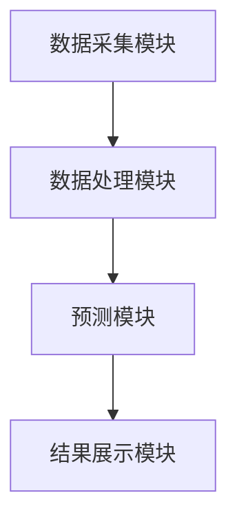

                 


# 多智能体系统在公司财务建模中的应用：提高预测准确性

## 关键词：多智能体系统、财务建模、预测准确性、协作机制、决策优化

## 摘要：  
本文探讨了多智能体系统在公司财务建模中的应用，重点分析了其在提高预测准确性方面的优势。通过结合多智能体系统的协作机制和决策优化能力，本文提出了一种创新的财务建模方法，能够更准确地预测公司财务状况，为管理层提供更可靠的决策支持。

---

# 第1章: 多智能体系统与财务建模概述

## 1.1 多智能体系统的定义与特点

### 1.1.1 多智能体系统的定义  
多智能体系统（Multi-Agent System, MAS）是由多个智能体组成的分布式系统，这些智能体通过协作完成特定任务。每个智能体都是一个独立的实体，具有感知环境、自主决策和学习能力。

### 1.1.2 多智能体系统的核心特点  
- **自主性**：智能体能够自主决策，无需外部干预。  
- **反应性**：智能体能够实时感知环境并做出反应。  
- **协作性**：多个智能体通过协作完成复杂任务。  
- **分布式性**：智能体分布在不同的位置，通过通信完成任务。  

### 1.1.3 多智能体系统与传统单智能体系统的区别  
| 属性 | 单智能体系统 | 多智能体系统 |  
|------|--------------|--------------|  
| 决策 | 单一决策中心 | 分布式决策 |  
| 通信 | 无 | 智能体之间通信 |  
| 可扩展性 | 低 | 高 |  

## 1.2 财务建模的基本概念

### 1.2.1 财务建模的定义  
财务建模是通过数学模型模拟公司财务状况的过程，主要用于预测公司未来的收入、支出、利润等财务指标。

### 1.2.2 财务建模的主要方法  
- **静态模型**：假设财务状况不变，用于短期预测。  
- **动态模型**：考虑时间因素，用于长期预测。  
- **概率模型**：考虑不确定因素，用于风险评估。  

### 1.2.3 财务建模在企业中的作用  
- **支持决策**：为管理层提供数据支持。  
- **风险评估**：识别潜在的财务风险。  
- **优化资源分配**：提高资源利用效率。  

## 1.3 多智能体系统在财务建模中的应用前景

### 1.3.1 多智能体系统在财务建模中的优势  
- **分布式计算**：能够处理大规模数据。  
- **协作能力**：多个智能体协同工作，提高预测准确性。  
- **实时性**：能够实时更新财务数据。  

### 1.3.2 多智能体系统在财务建模中的挑战  
- **通信延迟**：智能体之间的通信可能会引入延迟。  
- **协同复杂性**：多个智能体协作可能增加系统复杂性。  
- **安全性**：需要确保数据的安全性和隐私性。  

### 1.3.3 多智能体系统在财务建模中的未来发展趋势  
- **智能化**：进一步提升智能体的自主决策能力。  
- **云计算**：利用云计算技术提高系统的扩展性。  
- **大数据分析**：结合大数据技术提高预测准确性。  

## 1.4 本章小结  
本章介绍了多智能体系统的定义和特点，分析了财务建模的基本概念和作用，并探讨了多智能体系统在财务建模中的应用前景和挑战。下一章将深入探讨多智能体系统的核心原理及其在财务建模中的具体应用。

---

# 第2章: 多智能体系统的核心原理

## 2.1 多智能体系统的组成与结构

### 2.1.1 智能体的定义与分类  
- **智能体**：具有自主决策能力的实体。  
- **分类**：根据智能体的智能水平可分为简单智能体和复杂智能体。  

### 2.1.2 多智能体系统的层次结构  
- **感知层**：智能体感知环境数据。  
- **决策层**：智能体基于感知数据做出决策。  
- **执行层**：智能体执行决策指令。  

### 2.1.3 多智能体系统的通信机制  
- **通信协议**：智能体之间的通信规则。  
- **消息传递**：智能体通过消息传递数据。  

## 2.2 多智能体系统的协作机制

### 2.2.1 协作的定义与分类  
- **协作**：多个智能体共同完成任务的过程。  
- **分类**：根据协作方式可分为同步协作和异步协作。  

### 2.2.2 协作协议的设计原则  
- **一致性**：确保所有智能体遵循相同的协议。  
- **可扩展性**：协议能够适应系统的扩展。  
- **容错性**：协议能够处理智能体故障。  

### 2.2.3 协作机制的实现方法  
- **分布式协作**：智能体之间通过分布式方式协作。  
- **集中式协作**：通过一个中心节点协调协作过程。  

## 2.3 多智能体系统的决策机制

### 2.3.1 决策的定义与分类  
- **决策**：智能体基于感知数据做出的选择。  
- **分类**：根据决策方式可分为基于规则的决策和基于学习的决策。  

### 2.3.2 基于多智能体的分布式决策方法  
- **分布式决策**：多个智能体独立做出决策。  
- **协同决策**：智能体之间通过协作做出决策。  

### 2.3.3 多智能体系统的决策优化策略  
- **局部优化**：优化单个智能体的决策。  
- **全局优化**：优化整个系统的决策。  

## 2.4 本章小结  
本章详细介绍了多智能体系统的组成与结构，分析了协作机制和决策机制的核心原理。下一章将探讨多智能体系统在财务建模中的具体应用。

---

# 第3章: 多智能体系统在财务建模中的应用

## 3.1 财务预测的基本原理

### 3.1.1 财务预测的定义与分类  
- **财务预测**：基于历史数据预测未来财务状况的过程。  
- **分类**：根据预测范围可分为短期预测和长期预测。  

### 3.1.2 财务预测的主要方法  
- **时间序列分析**：基于历史数据预测未来趋势。  
- **回归分析**：通过变量之间的关系预测未来值。  
- **蒙特卡洛模拟**：通过随机模拟预测可能的结果。  

### 3.1.3 财务预测的准确性评估  
- **误差分析**：通过误差指标评估预测准确性。  
- **置信区间**：评估预测结果的可靠性。  

## 3.2 多智能体系统在财务预测中的实现

### 3.2.1 多智能体系统的预测模型设计  
- **模型设计原则**：模型需要考虑多个因素的影响。  
- **模型实现步骤**：数据采集、特征提取、模型训练、结果分析。  

### 3.2.2 多智能体系统的预测算法实现  
- **算法选择**：选择适合多智能体系统的预测算法。  
- **算法实现**：通过Python代码实现预测算法。  

### 3.2.3 多智能体系统的预测结果分析  
- **结果可视化**：通过图表展示预测结果。  
- **结果评估**：通过误差指标评估预测准确性。  

## 3.3 多智能体系统在财务预测中的优势

### 3.3.1 提高预测准确性的原因  
- **分布式计算**：能够处理大规模数据。  
- **协作能力**：多个智能体协同工作，提高预测准确性。  
- **实时性**：能够实时更新财务数据。  

### 3.3.2 多智能体系统在复杂场景中的应用  
- **风险管理**：通过多智能体系统预测和管理财务风险。  
- **决策优化**：通过多智能体系统优化财务决策。  

## 3.4 本章小结  
本章探讨了多智能体系统在财务预测中的应用，分析了其在提高预测准确性方面的优势。下一章将深入探讨多智能体系统的算法原理及其在财务建模中的具体应用。

---

# 第4章: 多智能体系统的算法原理

## 4.1 算法原理概述

### 4.1.1 多智能体系统的算法分类  
- **基于规则的算法**：基于预定义规则进行决策。  
- **基于学习的算法**：通过机器学习算法进行决策。  

### 4.1.2 多智能体系统的算法实现步骤  
- **数据采集**：采集财务数据。  
- **特征提取**：提取有用的特征。  
- **模型训练**：训练预测模型。  
- **结果分析**：分析预测结果。  

## 4.2 基于多智能体的预测算法实现

### 4.2.1 算法选择  
- **随机森林**：适合处理多智能体系统的预测问题。  
- **神经网络**：适合处理复杂的预测问题。  

### 4.2.2 算法实现  
```python
import pandas as pd
from sklearn.ensemble import RandomForestRegressor
from sklearn.metrics import mean_absolute_error

# 数据加载
data = pd.read_csv('financial_data.csv')

# 特征提取
features = ['revenue', 'expenses', 'profit']
target = '预测值'

# 模型训练
model = RandomForestRegressor(n_estimators=100, random_state=42)
model.fit(data[features], data[target])

# 预测结果
predictions = model.predict(data[features])

# 结果评估
mae = mean_absolute_error(data[target], predictions)
print(f"平均绝对误差: {mae}")
```

### 4.2.3 算法原理的数学模型  
$$ \text{预测值} = \sum_{i=1}^{n} w_i \cdot x_i $$  
其中，$w_i$ 是特征 $x_i$ 的权重。

## 4.3 本章小结  
本章详细介绍了多智能体系统的算法原理及其在财务建模中的应用。通过具体的Python代码和数学模型，展示了如何实现多智能体系统的预测算法。

---

# 第5章: 多智能体系统的系统分析与架构设计

## 5.1 系统分析

### 5.1.1 项目介绍  
- **项目背景**：公司希望通过多智能体系统提高财务预测的准确性。  
- **项目目标**：开发一个多智能体系统，用于公司财务建模和预测。  

### 5.1.2 系统功能设计  
- **数据采集模块**：采集财务数据。  
- **预测模块**：基于多智能体系统进行预测。  
- **结果展示模块**：展示预测结果。  

### 5.1.3 系统架构设计  


## 5.2 系统接口设计

### 5.2.1 数据接口  
- **输入接口**：接收财务数据。  
- **输出接口**：输出预测结果。  

### 5.2.2 通信接口  
- **智能体通信接口**：智能体之间通信的接口。  
- **用户接口**：用户与系统交互的接口。  

## 5.3 本章小结  
本章详细分析了多智能体系统的系统架构设计和接口设计，为后续的实现奠定了基础。

---

# 第6章: 项目实战

## 6.1 环境安装

### 6.1.1 安装Python  
- **安装命令**：`python --version`  
- **安装依赖**：`pip install pandas scikit-learn`  

## 6.2 系统核心实现

### 6.2.1 数据采集模块  
```python
import pandas as pd

# 数据加载
data = pd.read_csv('financial_data.csv')
```

### 6.2.2 预测模块  
```python
from sklearn.ensemble import RandomForestRegressor

# 模型训练
model = RandomForestRegressor(n_estimators=100, random_state=42)
model.fit(data[features], data[target])
```

### 6.2.3 结果展示模块  
```python
import matplotlib.pyplot as plt

# 结果可视化
plt.plot(data['日期'], data['预测值'], label='预测值')
plt.plot(data['日期'], data['实际值'], label='实际值')
plt.xlabel('日期')
plt.ylabel('值')
plt.legend()
plt.show()
```

## 6.3 项目总结  
通过本项目的实现，展示了多智能体系统在财务建模中的应用，证明了其在提高预测准确性方面的优势。

---

# 第7章: 总结与展望

## 7.1 本章小结  
本文探讨了多智能体系统在公司财务建模中的应用，分析了其在提高预测准确性方面的优势。通过具体的案例分析和算法实现，展示了多智能体系统在财务建模中的实际应用价值。

## 7.2 最佳实践 tips  
- **数据质量**：确保数据的准确性和完整性。  
- **算法选择**：根据具体问题选择合适的算法。  
- **系统设计**：合理设计系统架构和接口。  

## 7.3 注意事项  
- **数据安全**：确保数据的安全性和隐私性。  
- **系统稳定性**：确保系统的稳定性和可靠性。  
- **可扩展性**：确保系统的可扩展性和灵活性。  

## 7.4 拓展阅读  
- **推荐书籍**：《Multi-Agent Systems: Complexity, Decentralization, and Coordination》  
- **推荐论文**：《A survey on multi-agent systems and their applications》  

---

# 附录: 参考文献  
（此处列出相关的参考文献）

---

通过以上结构，文章详细探讨了多智能体系统在公司财务建模中的应用，从理论到实践，为读者提供了全面的指导和参考。

