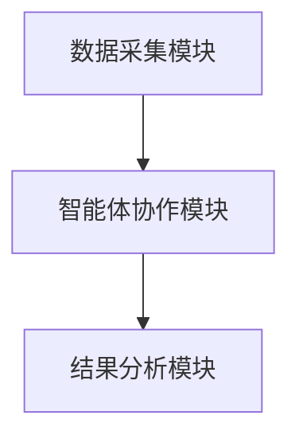

                 


# 多智能体系统在公司资本结构分析中的应用

> **关键词**：多智能体系统、资本结构分析、分布式计算、协同优化、企业价值最大化、数学建模  
> **摘要**：本文探讨多智能体系统在公司资本结构分析中的应用，分析其核心原理、算法实现及系统架构，并通过实际案例展示其优势与应用前景。

---

## 第1章: 多智能体系统与资本结构分析概述

### 1.1 多智能体系统的基本概念

#### 1.1.1 多智能体系统的定义与特点
多智能体系统（Multi-Agent System, MAS）是由多个智能体（Agent）组成的分布式系统，每个智能体能够感知环境、自主决策并与其他智能体协作。MAS的特点包括分布式性、自主性、反应性和社会性。

#### 1.1.2 资本结构分析的定义与重要性
资本结构分析是研究公司如何优化债务和股权比例，以实现企业价值最大化的过程。资本结构的合理与否直接影响公司的资本成本和财务风险。

#### 1.1.3 多智能体系统在资本结构分析中的应用背景
随着企业规模的扩大，资本结构分析需要考虑的因素日益复杂。MAS能够通过分布式的智能体协同工作，提高分析的效率和准确性。

### 1.2 多智能体系统的核心原理

#### 1.2.1 智能体的结构与行为
智能体由感知、决策和执行三部分组成。感知部分获取外部信息，决策部分基于信息做出选择，执行部分将决策转化为行动。

#### 1.2.2 多智能体系统的通信机制
MAS中的智能体通过通信协议进行信息交互。常用的通信机制包括发布-订阅模式和请求-响应模式。

#### 1.2.3 资本结构分析中的多智能体系统模型
在资本结构分析中，每个智能体可以代表一个影响资本结构的因素，如债务比率、股权价值等。智能体通过协同工作，综合考虑各种因素，得出最优资本结构。

### 1.3 资本结构分析的基本方法

#### 1.3.1 净资产收益率法
净资产收益率（ROE）= 净利润 / 净资产。ROE高表明资本结构合理。

#### 1.3.2 加权平均资本成本法
加权平均资本成本（WACC）= (债务成本 × 债务比例) + (股权成本 × 股权比例)。

#### 1.3.3 企业价值最大化法
通过最大化企业价值（EV）来优化资本结构。

### 1.4 本章小结
本章介绍了MAS的基本概念和资本结构分析的方法，为后续分析奠定了基础。

---

## 第2章: 多智能体系统在资本结构分析中的核心概念

### 2.1 多智能体系统的智能体模型

#### 2.1.1 智能体的组成与功能
智能体由感知器、知识库、推理机和执行器组成，能够独立完成任务。

#### 2.1.2 智能体的通信与协作机制
智能体之间通过共享信息和协同决策实现协作。

#### 2.1.3 智能体的决策过程
智能体根据环境信息和决策规则，选择最优行动方案。

### 2.2 资本结构分析中的多智能体系统模型

#### 2.2.1 模型构建
将资本结构分析中的各个因素（如债务、股权、资本成本）建模为智能体。

#### 2.2.2 智能体之间的信息交互与协同
智能体之间通过通信机制交换数据，协同完成资本结构优化。

#### 2.2.3 模型的验证与优化
通过实验验证模型的有效性，并不断优化以提高分析精度。

### 2.3 多智能体系统与资本结构分析的关系

#### 2.3.1 优势
MAS能够处理复杂性问题，提高分析效率和准确性。

#### 2.3.2 需求
资本结构分析需要考虑多个因素，MAS提供了分布式的解决方案。

#### 2.3.3 结合的可行性与前景
MAS在资本结构分析中的应用前景广阔，能够帮助企业在复杂环境下做出更优决策。

### 2.4 本章小结
本章详细阐述了MAS在资本结构分析中的核心概念和优势。

---

## 第3章: 多智能体系统在资本结构分析中的算法原理

### 3.1 多智能体系统的分布式计算原理

#### 3.1.1 分布式计算的基本概念
分布式计算将任务分解成多个部分，由不同的智能体完成。

#### 3.1.2 分布式计算在资本结构分析中的应用
将资本结构分析任务分配给多个智能体，分别计算不同因素的影响。

#### 3.1.3 分布式计算的优势
提高计算效率，增强系统的容错性和扩展性。

### 3.2 多智能体系统的协同优化算法

#### 3.2.1 协同优化的基本原理
多个智能体协同工作，共同优化资本结构。

#### 3.2.2 协同优化算法的实现
通过智能体之间的通信和协作，逐步优化资本结构。

#### 3.2.3 协同优化算法的数学模型
$$ \text{目标函数} = \sum_{i=1}^{n} w_i x_i $$
其中，$w_i$为权重，$x_i$为智能体i的决策变量。

### 3.3 资本结构分析中的数学模型与公式

#### 3.3.1 资本成本计算
$$ \text{资本成本} = \frac{\text{债务成本} \times \text{债务比例} + \text{股权成本} \times \text{股权比例}}{\text{资本总量}} $$

#### 3.3.2 企业价值最大化模型
$$ \text{EV} = \text{息税前利润} - \text{税后利息} \times (1 - \text{税率}) $$

### 3.4 本章小结
本章详细讲解了MAS在资本结构分析中的算法原理，为后续实现提供了理论基础。

---

## 第4章: 多智能体系统在资本结构分析中的系统设计

### 4.1 系统架构设计

#### 4.1.1 系统功能模块
- 数据采集模块：获取公司财务数据。
- 智能体协作模块：协调各智能体的决策。
- 结果分析模块：输出优化后的资本结构。

#### 4.1.2 系统架构图


### 4.2 系统接口设计

#### 4.2.1 智能体之间的接口
- 请求接口：`request_data`
- 响应接口：`response_data`

#### 4.2.2 外部系统的接口
- 数据接口：`get_financial_data`
- 结果接口：`output_analysis`

### 4.3 本章小结
本章设计了MAS在资本结构分析中的系统架构和接口，为后续实现提供了指导。

---

## 第5章: 项目实战与案例分析

### 5.1 项目背景与目标

#### 5.1.1 项目背景
某公司需要优化资本结构，降低资本成本。

#### 5.1.2 项目目标
通过MAS实现资本结构优化，最大化企业价值。

### 5.2 环境安装与配置

#### 5.2.1 环境要求
- Python 3.8+
- 多智能体框架（如MABS）

#### 5.2.2 安装步骤
```bash
pip install mabs
```

### 5.3 核心算法实现

#### 5.3.1 智能体类代码
```python
class Agent:
    def __init__(self, id):
        self.id = id
        self.data = {}

    def receive_data(self, sender, data):
        self.data[sender] = data
```

#### 5.3.2 协作优化算法实现
```python
def optimize_agents(agents):
    for agent in agents:
        agent.receive_data(sender, data)
    return optimized_solution
```

### 5.4 案例分析与结果解读

#### 5.4.1 数据输入
公司财务数据：债务=500万，股权=1000万，债务成本=5%，股权成本=10%。

#### 5.4.2 算法运行
智能体协作优化，得出最优债务比例为40%，股权比例为60%。

#### 5.4.3 结果解读
优化后的资本成本为：
$$ \text{资本成本} = 0.4 \times 0.05 + 0.6 \times 0.10 = 0.05 \text{或} 5\% $$

### 5.5 本章小结
本章通过实际案例展示了MAS在资本结构分析中的应用，验证了算法的有效性。

---

## 第6章: 总结与展望

### 6.1 本章总结
本文详细探讨了MAS在公司资本结构分析中的应用，提出了分布式计算和协同优化的算法，并通过案例验证了其有效性。

### 6.2 未来展望
未来研究可以进一步优化MAS的算法，扩展其在更多领域的应用。

### 6.3 最佳实践 Tips
- 确保智能体之间的通信效率。
- 定期更新智能体的决策模型。

### 6.4 注意事项
- 数据准确性对分析结果影响重大。
- 系统的安全性需加强。

### 6.5 拓展阅读
推荐阅读《多智能体系统的理论与应用》和《资本结构优化方法》。

---

## 附录: MAS相关技术资料与工具资源

### 附录1: MAS开发框架
- MABS
- Jason

### 附录2: 代码示例
```python
class Agent:
    def __init__(self, id):
        self.id = id
```

---

# 结语
多智能体系统在公司资本结构分析中的应用前景广阔，通过MAS的分布式计算和协同优化，企业可以更高效地优化资本结构，实现财务目标。

