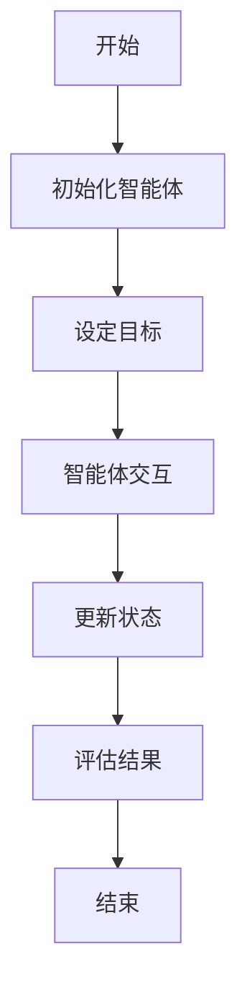
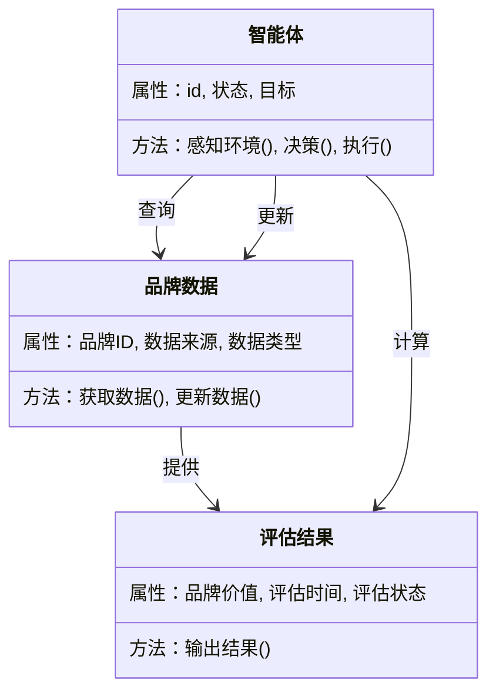
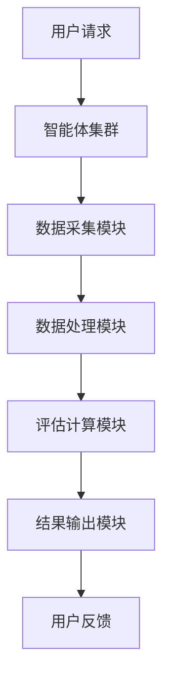
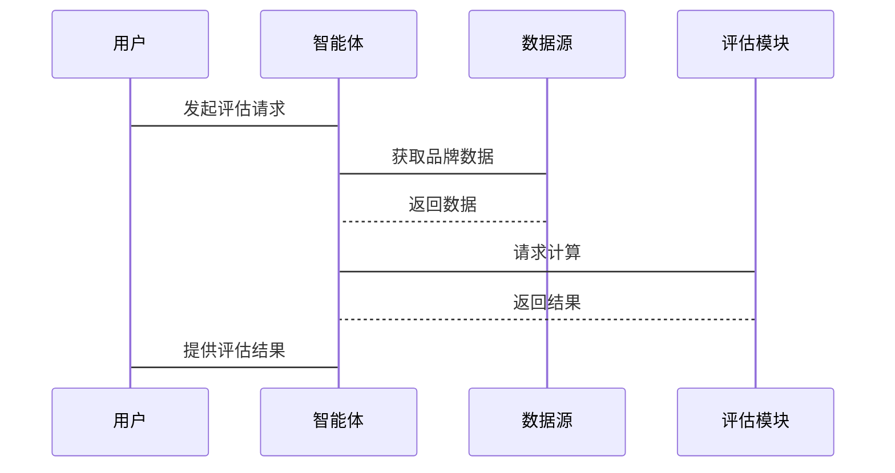

                 


# 多智能体系统在品牌价值动态评估中的应用

> 关键词：多智能体系统, 品牌价值, 动态评估, 分布式计算, 人工智能, 算法设计

> 摘要：本文探讨了多智能体系统在品牌价值动态评估中的应用，分析了其核心概念、算法原理、系统设计及实际案例，旨在为品牌价值的动态评估提供一种高效、实时的解决方案。

---

# 第一部分: 多智能体系统与品牌价值评估的背景介绍

## 第1章: 多智能体系统概述

### 1.1 多智能体系统的基本概念

#### 1.1.1 多智能体系统的定义

多智能体系统（Multi-Agent System, MAS）是由多个相互作用的智能体组成的系统，这些智能体能够感知环境、自主决策并协作完成复杂任务。MAS的核心在于智能体之间的分布式计算与协作。

#### 1.1.2 多智能体系统的特征

| 特征 | 描述 |
|------|------|
| 分布式 | 智能体独立运行，通过通信协作完成任务 |
| 自主性 | 智能体能够自主决策 |
| 社会性 | 智能体之间通过交互实现系统目标 |
| 反应性 | 智能体能实时感知环境变化并做出响应 |

#### 1.1.3 多智能体系统的分类

1. **基于智能体结构**：
   - 单层MAS
   - 分层MAS
   - 网络MAS

2. **基于智能体类型**：
   - 判断智能体
   - 规则智能体
   - 学习智能体

### 1.2 品牌价值的动态评估

#### 1.2.1 品牌价值的定义与影响因素

品牌价值是品牌在市场上的综合表现，包括品牌知名度、美誉度、忠诚度等。影响因素包括产品质量、市场表现、消费者反馈等。

#### 1.2.2 动态评估的必要性

市场环境动态变化，品牌价值也随之波动。动态评估能够实时捕捉市场变化，提供及时反馈。

#### 1.2.3 多智能体系统在品牌价值评估中的优势

1. 分布式计算：处理多源数据，提高评估效率。
2. 实时响应：快速适应市场变化。
3. 协作机制：整合多方数据，提升评估准确性。

---

## 第2章: 多智能体系统的核心概念与联系

### 2.1 多智能体系统的原理

#### 2.1.1 个体智能体的行为规则

智能体通过感知环境、设定目标、制定策略、执行动作和反馈学习，实现自主决策。

#### 2.1.2 智能体之间的交互机制

1. **通信机制**：智能体之间通过消息传递进行信息共享。
2. **协作机制**：通过协商达成一致行动。
3. **竞争机制**：在竞争中优化决策。

#### 2.1.3 系统整体目标的实现

通过智能体的协作，实现系统整体目标，如品牌价值最大化。

### 2.2 品牌价值评估的核心要素

#### 2.2.1 品牌认知度

消费者对品牌的了解程度，影响品牌价值。

#### 2.2.2 品牌忠诚度

消费者对品牌的忠诚程度，决定品牌价值的稳定性。

#### 2.2.3 品牌影响力

品牌在市场中的影响力，反映品牌价值的高低。

### 2.3 多智能体系统与品牌价值评估的关联

#### 2.3.1 多智能体系统的动态性与品牌价值的动态评估

MAS的动态适应性与品牌价值的实时更新相契合。

#### 2.3.2 多智能体系统的分布式计算与品牌数据的分布式处理

MAS的分布式架构适合处理多源分散的数据。

#### 2.3.3 多智能体系统的协作机制与品牌价值的协同优化

通过协作， MAS能够整合多方数据，优化品牌价值评估。

---

## 第3章: 多智能体系统的算法原理

### 3.1 多智能体系统的算法概述

#### 3.1.1 分布式算法

1. **分布式计算**：任务分解到多个智能体完成。
2. **分布式协调**：通过通信协商完成任务。

#### 3.1.2 协作算法

1. **协商算法**：智能体通过协商达成一致。
2. **共识算法**：如拜占庭共识，确保数据一致性。

#### 3.1.3 学习算法

1. **强化学习**：智能体通过奖励机制优化决策。
2. **监督学习**：基于历史数据训练模型。

### 3.2 品牌价值评估的数学模型

#### 3.2.1 品牌价值的计算公式

$$ V = \sum_{i=1}^{n} w_i \cdot f_i $$

其中，\( V \) 表示品牌价值，\( w_i \) 表示第 \( i \) 个因素的权重，\( f_i \) 表示第 \( i \) 个因素的评估值。

#### 3.2.2 多智能体系统的状态空间

状态空间包括品牌相关指标，如市场占有率、消费者满意度等。

#### 3.2.3 品牌价值的动态更新机制

1. **实时更新**：根据最新数据更新品牌价值。
2. **反馈机制**：利用历史数据优化评估模型。

### 3.3 算法流程图



---

## 第4章: 数学模型与公式

### 4.1 品牌价值评估的数学模型

#### 4.1.1 品牌价值的计算公式

$$ V = \sum_{i=1}^{n} w_i \cdot f_i $$

其中，\( w_i \) 是第 \( i \) 个因素的权重，\( f_i \) 是第 \( i \) 个因素的评分。

#### 4.1.2 品牌价值的变化率

$$ \Delta V = \sum_{i=1}^{n} \Delta w_i \cdot f_i + w_i \cdot \Delta f_i $$

---

# 第二部分: 系统设计与架构方案

## 第5章: 系统设计与架构方案

### 5.1 系统设计背景与目标

系统目标是实时动态评估品牌价值，提供精准的决策支持。

### 5.2 系统功能设计

#### 5.2.1 领域模型设计



### 5.3 系统架构设计



### 5.4 系统接口设计

1. **智能体接口**：
   - 输入：感知数据
   - 输出：决策指令
2. **数据接口**：
   - 输入：品牌ID
   - 输出：品牌数据

### 5.5 系统交互设计



---

## 第6章: 项目实战

### 6.1 环境配置

1. **工具安装**：
   - Python 3.8+
   - pip install multi-agent-system
2. **依赖库安装**：
   - numpy
   - matplotlib
   - pandas

### 6.2 核心代码实现

```python
class Agent:
    def __init__(self, id, target):
        self.id = id
        self.target = target
        self.data = {}

    def perceive(self, environment):
        self.data = environment.request_data(self.id)

    def decide(self):
        return self.target.update(self.data)

class Environment:
    def __init__(self):
        self.agents = []
        self.data_source = {}

    def add_agent(self, agent):
        self.agents.append(agent)

    def request_data(self, agent_id):
        return self.data_source.get(agent_id, {})

# 示例环境数据
env = Environment()
env.data_source = {
    'agent1': {'brand_id': 1, 'metrics': {'认知度': 85, '忠诚度': 75}},
    'agent2': {'brand_id': 1, 'metrics': {'影响力': 90}}
}

agent1 = Agent(1, target='评估品牌价值')
agent1.perceive(env)
agent1.decide()
```

### 6.3 案例分析

假设评估某品牌在市场上的认知度、忠诚度和影响力，分别由三个智能体负责数据采集。通过MAS的协作，整合数据，计算品牌价值。

---

## 第7章: 总结与展望

### 7.1 总结

本文详细介绍了多智能体系统在品牌价值动态评估中的应用，从理论到实践，展示了其高效性和实时性。

### 7.2 展望

未来，MAS在品牌价值评估中将更加智能化，结合大数据和AI技术，实现更精准的评估。

---

## 附录: 数学公式推导

### 附录A: 品牌价值评估公式

$$ V = \sum_{i=1}^{n} w_i \cdot f_i $$

其中，\( w_i \) 是第 \( i \) 个因素的权重，\( f_i \) 是第 \( i \) 个因素的评分。

### 附录B: 动态更新公式

$$ \Delta V = \sum_{i=1}^{n} \Delta w_i \cdot f_i + w_i \cdot \Delta f_i $$

---

通过以上内容，本文全面阐述了多智能体系统在品牌价值动态评估中的应用，从理论到实践，为品牌价值的高效评估提供了新的思路。

