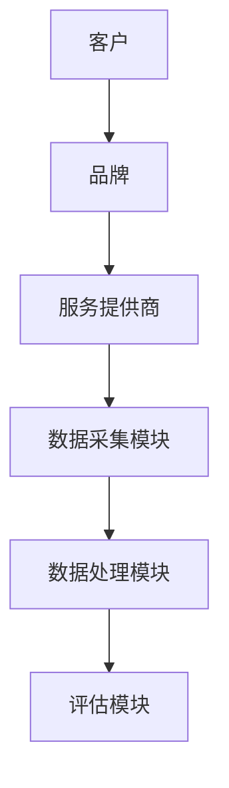
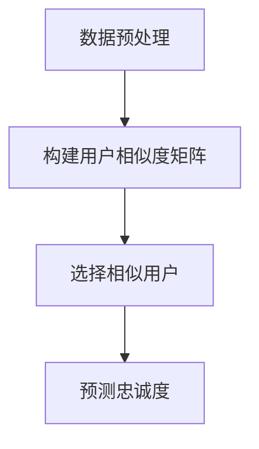
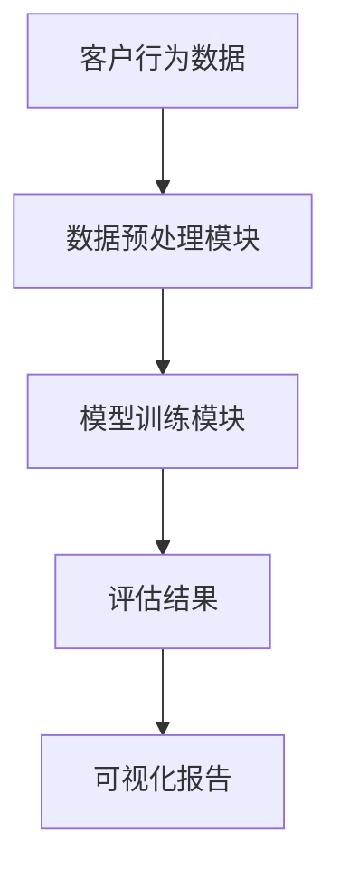
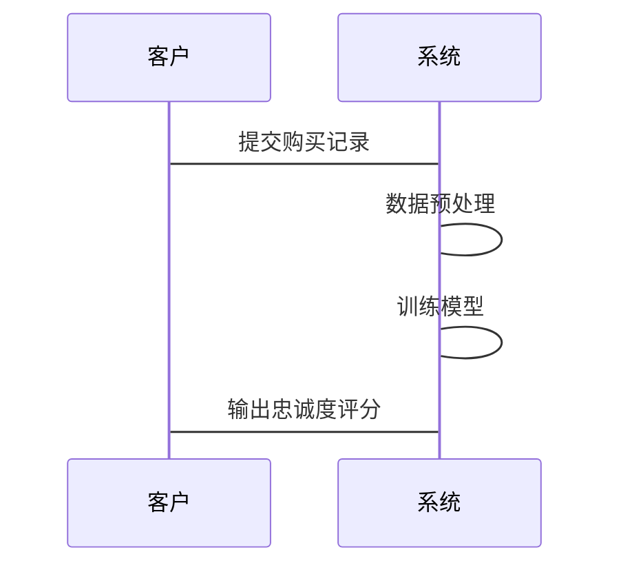

                 


# 多智能体系统在品牌忠诚度评估中的应用：客户价值量化

> 关键词：多智能体系统，品牌忠诚度，客户价值，数据挖掘，机器学习，人工智能

> 摘要：本文探讨了多智能体系统在品牌忠诚度评估中的应用，详细介绍了如何利用多智能体系统量化客户价值，分析客户行为模式，优化品牌忠诚度评估过程。通过结合数据挖掘和机器学习算法，构建高效的多智能体协同模型，为企业提供精准的客户价值评估和个性化服务策略。

---

# 第一部分: 多智能体系统与品牌忠诚度评估基础

## 第1章: 多智能体系统概述

### 1.1 多智能体系统的基本概念

#### 1.1.1 多智能体系统的定义
多智能体系统（Multi-Agent System, MAS）是指由多个智能体（Agent）组成的分布式系统，这些智能体能够通过协同工作完成特定任务。每个智能体都是一个独立的实体，具备感知环境、自主决策和执行任务的能力。

#### 1.1.2 多智能体系统的特征
- **自主性**：智能体能够自主决策，无需外部干预。
- **反应性**：智能体能实时感知环境变化并做出响应。
- **协作性**：多个智能体协同工作，共同完成任务。
- **分布性**：系统中的智能体分布于不同的位置，通过通信和协作完成目标。

#### 1.1.3 多智能体系统与单智能体系统的区别
单智能体系统依赖中心化的决策机制，而多智能体系统通过去中心化的协作实现任务目标，具备更高的灵活性和容错性。

### 1.2 品牌忠诚度评估的重要性

#### 1.2.1 品牌忠诚度的定义
品牌忠诚度是指客户对某一品牌产品的偏好程度和持续购买意愿。忠诚的客户通常会重复购买同一品牌的产品或服务，并在面对竞争对手时表现出更强的抵抗力。

#### 1.2.2 品牌忠诚度对企业价值的影响
- 提高客户保留率，降低获取新客户的成本。
- 通过忠诚客户获取更多的推荐和口碑效应，增强品牌影响力。
- 忠诚客户通常愿意支付更高的价格，为企业带来更高的利润。

#### 1.2.3 传统品牌忠诚度评估方法的局限性
传统方法主要依赖问卷调查和客户满意度分析，存在数据片面、评估周期长、难以实时更新等问题，难以满足现代企业对精准评估的需求。

### 1.3 客户价值量化的基本概念

#### 1.3.1 客户价值的定义
客户价值是指客户为企业带来的整体价值，包括直接收益（如销售额）和间接收益（如品牌影响力）。

#### 1.3.2 客户价值的评估方法
- **生命周期价值（CLV）**：预测客户在未来一段时间内的总贡献。
- **购买频率**：客户在一定时间内的购买次数。
- **客户满意度**：客户对产品或服务的满意程度。

#### 1.3.3 客户价值与品牌忠诚度的关系
客户价值高的客户通常也是品牌忠诚度高的客户，他们为企业创造更多的价值，同时也是企业长期发展的核心资源。

---

## 第2章: 多智能体系统在品牌忠诚度评估中的应用背景

### 2.1 问题背景与问题描述

#### 2.1.1 当前品牌忠诚度评估的挑战
传统评估方法存在以下问题：
- 数据来源单一，难以全面反映客户行为。
- 评估结果缺乏动态性，无法实时更新。
- 难以识别客户行为模式，难以制定个性化服务策略。

#### 2.1.2 多智能体系统如何解决这些问题
多智能体系统通过分布式计算和协同学习，能够实时分析客户的多维度数据，提供动态的品牌忠诚度评估结果。

#### 2.1.3 应用场景的边界与外延
- **边界**：专注于客户行为数据的分析，不涉及产品设计和市场推广。
- **外延**：可以扩展到客户细分、精准营销和个性化服务等领域。

### 2.2 核心概念与联系

#### 2.2.1 多智能体系统与品牌忠诚度评估的核心要素
- **客户行为数据**：包括购买记录、浏览行为、反馈评价等。
- **智能体协同**：通过多智能体协同分析，全面评估客户的忠诚度。

#### 2.2.2 实体关系图（ER图）展示各实体之间的关系
```mermaid
er
actor: 客户
actor: 品牌
actor: 服务提供商
```

#### 2.2.3 系统架构图展示多智能体系统的整体架构


### 2.3 核心概念的原理与特征

#### 2.3.1 多智能体系统的协同机制
通过智能体之间的通信和协作，实现数据的共享和任务的分配，确保系统高效运行。

#### 2.3.2 品牌忠诚度评估的多维度分析
从客户行为、购买频率、满意度等多个维度进行综合评估，确保评估结果的全面性。

#### 2.3.3 客户价值量化的关键指标
包括客户生命周期价值（CLV）、客户满意度评分（CSAT）和客户保留率等。

---

## 第3章: 基于多智能体系统的品牌忠诚度评估算法

### 3.1 协同过滤算法

#### 3.1.1 算法原理
协同过滤算法通过分析客户的购买记录和行为数据，找到相似的客户群体，预测客户的忠诚度。

#### 3.1.2 算法步骤


#### 3.1.3 Python代码实现
```python
import numpy as np
from sklearn.metrics.pairwise import cosine_similarity

# 示例数据：客户购买记录矩阵
X = np.array([[5, 3, 0], [0, 2, 4], [1, 0, 2]])

# 计算余弦相似度
similarity = cosine_similarity(X)
print(similarity)
```

### 3.2 算法原理的数学模型

#### 3.2.1 余弦相似度公式
$$\text{余弦相似度} = \frac{\vec{A} \cdot \vec{B}}{|\vec{A}| |\vec{B}|}$$

#### 3.2.2 预测忠诚度的公式
$$\text{忠诚度预测} = \sum_{i=1}^{n} w_i \times \text{相似度}_i$$

---

## 第4章: 系统分析与架构设计

### 4.1 应用场景分析

#### 4.1.1 线上购物平台
通过分析客户的购买记录和浏览行为，评估客户的忠诚度，提供个性化推荐服务。

### 4.2 系统功能设计

#### 4.2.1 数据预处理模块
负责清洗和标准化客户数据，确保数据质量。

#### 4.2.2 模型训练模块
基于协同过滤算法训练忠诚度评估模型。

#### 4.2.3 结果分析模块
输出评估结果，并提供可视化报告。

### 4.3 系统架构设计

#### 4.3.1 系统架构图


### 4.4 系统交互设计

#### 4.4.1 客户与系统交互流程


---

## 第5章: 项目实战与实现

### 5.1 环境安装

#### 5.1.1 安装Python和相关库
```bash
pip install numpy scikit-learn
```

### 5.2 核心代码实现

#### 5.2.1 数据预处理代码
```python
import pandas as pd
from sklearn.preprocessing import StandardScaler

data = pd.read_csv('customer_data.csv')
scaler = StandardScaler()
scaled_data = scaler.fit_transform(data)
```

#### 5.2.2 模型训练代码
```python
from sklearn.cluster import KMeans

kmeans = KMeans(n_clusters=3)
clusters = kmeans.fit_predict(scaled_data)
```

### 5.3 项目总结

#### 5.3.1 成功的关键点
- 数据预处理的准确性
- 算法选择的合理性
- 模型评估的客观性

#### 5.3.2 改进建议
- 引入实时数据流处理
- 增加客户反馈机制

---

## 第6章: 总结与展望

### 6.1 总结
本文详细探讨了多智能体系统在品牌忠诚度评估中的应用，通过协同过滤算法和系统架构设计，为企业提供了客户价值量化的新思路。

### 6.2 展望
未来的研究可以进一步探索多智能体系统的动态协作机制，结合深度学习技术，提升品牌忠诚度评估的准确性和实时性。

---

# 结语
通过多智能体系统的应用，企业能够更精准地评估客户忠诚度，制定更有效的客户管理策略，从而在竞争激烈的市场中占据优势。

