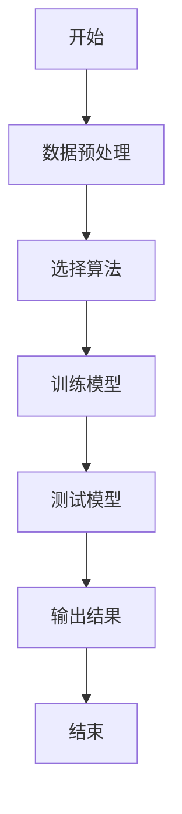
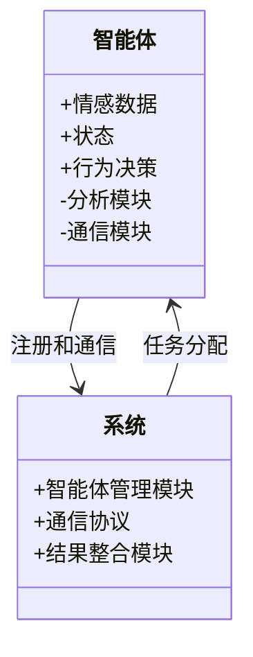

                 


```markdown
# 多智能体系统在品牌情感联系评估中的应用：超越财务指标

> 关键词：多智能体系统，品牌情感联系，情感计算，情感传播模型，分布式协作

> 摘要：在当今竞争激烈的市场环境中，品牌价值不仅仅取决于财务指标，消费者与品牌之间的情感联系同样重要。本文探讨如何利用多智能体系统（MAS）来评估品牌情感联系，超越传统的财务指标，提供更全面的品牌评估方法。通过详细分析多智能体系统的协作机制、情感计算的原理，以及实际应用案例，本文为品牌管理者提供了一种创新的品牌评估策略。

---

## 第一部分: 多智能体系统与品牌情感联系的背景与基础

### 第1章: 问题背景与概念

#### 1.1 传统品牌评估的局限性
##### 1.1.1 财务指标的不足
传统的品牌评估主要依赖财务指标，如销售额、市场份额等。然而，这些指标仅反映了品牌的市场表现，无法衡量消费者与品牌之间的情感联系。例如，两个品牌可能拥有相同的财务指标，但消费者的忠诚度和情感投入可能截然不同。

##### 1.1.2 情感联系的重要性
品牌与消费者之间的情感联系是品牌忠诚度和长期成功的关键因素。消费者对品牌的喜爱、信任和情感投入直接影响其购买行为和口碑传播。因此，品牌评估需要引入情感因素，以更全面地反映品牌价值。

#### 1.2 品牌情感联系的定义与特征
##### 1.2.1 情感联系的核心要素
品牌情感联系包括消费者的情感状态、情感强度、情感类型（正面、负面、中性）以及情感传播能力。这些要素共同构成了品牌与消费者之间的情感互动。

##### 1.2.2 情感联系与品牌忠诚度的关系
研究表明，强烈的情感联系与品牌忠诚度呈正相关。消费者对品牌的深厚情感投入使其更可能在面对竞争时保持忠诚，从而为品牌带来长期的市场优势。

#### 1.3 多智能体系统的概念
##### 1.3.1 多智能体系统的定义
多智能体系统（MAS）是由多个智能体组成的分布式系统，每个智能体能够独立感知环境、自主决策并与其他智能体协作。MAS在品牌情感联系评估中的应用，能够模拟消费者与品牌之间的复杂情感互动。

##### 1.3.2 多智能体系统的特征
- **自主性**：每个智能体独立决策。
- **反应性**：能够实时感知环境变化并做出反应。
- **协作性**：通过通信协议实现智能体之间的协作。
- **分布式计算**：任务分解和资源分配基于分布式计算。

##### 1.3.3 多智能体系统与品牌评估的结合
MAS能够模拟消费者群体的行为模式，分析情感传播路径，评估品牌影响力。通过MAS，品牌管理者可以更准确地预测市场反应，优化品牌策略。

---

### 第2章: 情感计算与多智能体系统基础

#### 2.1 情感计算的原理
##### 2.1.1 情感数据的获取与处理
情感数据主要来自消费者评论、社交媒体互动和问卷调查。这些数据需要进行清洗、标注和特征提取，以便后续分析。

##### 2.1.2 情感分析的算法基础
情感分析算法包括基于规则的方法、统计学习方法和深度学习方法。例如，使用词袋模型或词嵌入模型（如Word2Vec）进行情感分类。

#### 2.2 多智能体系统的构成
##### 2.2.1 智能体的定义与分类
智能体可以分为简单反射型、基于模型的反射型和目标驱动型。在品牌情感评估中，目标驱动型智能体更适合模拟消费者的决策过程。

##### 2.2.2 多智能体系统的协作机制
协作机制包括任务分解、通信协议和结果整合。例如，每个智能体负责分析一部分情感数据，然后通过通信协议将结果整合，形成整体评估报告。

##### 2.2.3 多智能体系统的通信协议
通信协议定义了智能体之间的信息交换规则。例如，使用JSON格式传递情感分析结果，或使用RESTful API进行实时通信。

#### 2.3 情感计算与多智能体系统的联系
##### 2.3.1 情感数据在多智能体系统中的应用
情感数据用于初始化智能体的状态，驱动智能体的行为决策。例如，消费者的情感评分可以作为智能体的初始输入。

##### 2.3.2 多智能体系统在情感计算中的优势
MAS能够模拟大规模消费者群体的行为，捕捉情感传播的动态变化。与传统统计方法相比，MAS提供了更高的实时性和准确性。

---

## 第二部分: 多智能体系统在品牌情感联系评估中的核心概念与联系

### 第3章: 核心概念与原理

#### 3.1 情感计算的数学模型
##### 3.1.1 情感极性计算模型
情感极性计算模型将情感分为正面、负面和中性。通过训练好的情感分析模型，可以计算每个评论的情感极性。

##### 3.1.2 情感强度计算模型
情感强度反映了情感的强烈程度，通常使用情感评分（如1到5分）表示。强度计算模型可以基于词频分析或情感词典。

##### 3.1.3 情感传播模型
情感传播模型描述了情感在消费者群体中的传播过程。例如，使用图模型表示消费者之间的关系，分析情感传播路径。

#### 3.2 多智能体系统的协作机制
##### 3.2.1 分布式协作原理
分布式协作基于智能体之间的协作协议，每个智能体负责一部分任务。例如，智能体A负责分析社交媒体评论，智能体B负责分析问卷调查数据。

##### 3.2.2 协作任务分解方法
任务分解可以通过划分数据范围或分配不同的分析维度实现。例如，将评论按情感类型分解给不同智能体处理。

##### 3.2.3 协作结果的整合方法
整合方法包括简单的汇总和复杂的融合。例如，使用加权平均法整合不同智能体的分析结果。

#### 3.3 情感计算与多智能体系统的结合模型
##### 3.3.1 模型的构建过程
1. 收集情感数据。
2. 初始化智能体状态。
3. 智能体协作分析数据。
4. 整合结果，形成评估报告。

##### 3.3.2 模型的输入输出关系
- 输入：消费者评论、社交媒体数据、问卷调查结果。
- 输出：品牌情感评分、情感传播路径、品牌忠诚度预测。

##### 3.3.3 模型的优化方法
通过机器学习优化情感分析模型，改进智能体协作算法，提高评估精度。

---

### 第4章: 核心概念的对比与ER实体关系图

#### 4.1 情感计算与传统统计方法的对比
##### 对比表格
| 对比维度       | 情感计算       | 传统统计方法   |
|----------------|---------------|----------------|
| 数据来源       | 消费者评论、社交媒体 | 销售数据、市场份额 |
| 分析内容       | 情感状态、强度   | 数量、比例       |
| 优势           | 高实时性、准确性 | 简单易懂         |
| 局限性         | 数据依赖性强    | 无法反映情感因素 |

#### 4.2 实体关系图
```mermaid
erd
  entity 品牌
    品牌ID (PK)
    品牌名称
    品牌描述
  entity 消费者
    消费者ID (PK)
    消费者名称
    消费者属性
  entity 情感数据
    情感数据ID (PK)
    情感评分
    情感类型
    情感时间
  entity 情感传播
    传播路径
    传播时间
    传播影响
  品牌 -| 情感数据：品牌ID (FK)
  消费者 -| 情感数据：消费者ID (FK)
  情感数据 -| 情感传播：情感数据ID (FK)
```

---

## 第三部分: 算法原理

### 第5章: 情感分析算法

#### 5.1 情感分析的流程


#### 5.2 基于深度学习的情感分析模型
```python
import tensorflow as tf
from tensorflow.keras import layers

model = tf.keras.Sequential()
model.add(layers.Embedding(input_dim=10000, output_dim=16))
model.add(layers.SimpleRNN(units=16))
model.add(layers.Dense(1, activation='sigmoid'))
model.compile(optimizer='adam', loss='binary_crossentropy', metrics=['accuracy'])
```

#### 5.3 情感传播模型
情感传播模型可以表示为：
$$
I(t+1) = I(t) \cdot \beta + (1 - \beta) \cdot S(t)
$$
其中，$I(t)$ 表示第 $t$ 时刻的感染率，$\beta$ 是传播系数，$S(t)$ 是源节点的情感状态。

---

## 第四部分: 系统分析与架构设计

### 第6章: 系统分析与架构设计

#### 6.1 系统功能设计


#### 6.2 系统架构设计


#### 6.3 系统接口设计
接口设计包括：
- 数据输入接口：接收消费者评论和社交媒体数据。
- 通信接口：智能体之间的信息交换。
- 输出接口：提供情感评估报告。

---

## 第五部分: 项目实战

### 第7章: 项目实战

#### 7.1 环境安装
安装必要的库：
```bash
pip install numpy pandas scikit-learn tensorflow
```

#### 7.2 系统核心实现源代码
```python
class Agent:
    def __init__(self, agent_id):
        self.agent_id = agent_id
        self.data = []
    
    def analyze(self):
        # 情感分析算法
        pass

class System:
    def __init__(self, agents):
        self.agents = agents
        self.communication_protocol = 'json'
    
    def process_data(self):
        for agent in self.agents:
            agent.analyze()

# 示例用法
agent1 = Agent(1)
agent2 = Agent(2)
system = System([agent1, agent2])
system.process_data()
```

#### 7.3 实际案例分析
分析一个具体品牌的情感数据，展示系统如何处理数据、分析情感，并生成评估报告。

---

## 第六部分: 总结与展望

### 第8章: 总结与展望

#### 8.1 总结
本文详细探讨了多智能体系统在品牌情感联系评估中的应用，提出了超越财务指标的创新评估方法。通过情感计算和分布式协作，MAS能够更准确地反映品牌价值。

#### 8.2 未来研究方向
未来可以研究以下方向：
- 更复杂的智能体协作算法。
- 高效的情感传播模型。
- 多模态情感分析（结合文本、图像、视频等）。

#### 8.3 最佳实践 Tips
- 数据质量直接影响评估结果，需确保数据的多样性和代表性。
- 定期更新模型，以适应市场变化和消费者行为的演变。
- 结合传统财务指标，实现全面的品牌评估。

---

通过以上步骤，我们系统地分析了多智能体系统在品牌情感联系评估中的应用，展示了其在超越财务指标方面的优势。希望本文能够为品牌管理者和技术开发者提供有价值的参考和启发。
```

