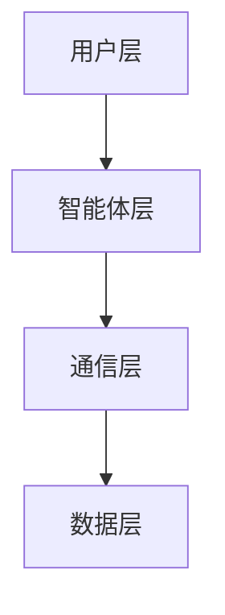

                 


# 多智能体系统在商业模式可持续性分析中的应用

---

## 关键词：多智能体系统、商业模式、可持续性分析、算法原理、系统架构

---

## 摘要

多智能体系统（Multi-Agent Systems, MAS）是一种由多个智能体组成的分布式系统，这些智能体能够自主决策、协同工作，并通过交互实现复杂任务。本文探讨MAS在商业模式可持续性分析中的应用，从核心概念、算法原理到系统架构，系统性地分析其在商业模式优化中的作用。文章首先介绍MAS的基本概念和商业模式可持续性分析的重要性，然后详细讲解MAS的建模与仿真方法，接着分析MAS中的算法原理，包括分布式计算和协商机制。最后，结合实际案例，展示MAS在商业模式可持续性分析中的应用，并总结其优势与挑战。

---

# 目录大纲

1. 多智能体系统概述
2. 多智能体系统的商业模式分析方法
3. 多智能体系统的建模与仿真
4. 多智能体系统的算法原理
5. 商业模式可持续性分析的方法论
6. 系统架构与设计
7. 项目实战与案例分析
8. 总结与展望

---

## 第1章: 多智能体系统概述

### 1.1 多智能体系统的基本概念

#### 1.1.1 多智能体系统的定义

多智能体系统（MAS）是由多个智能体（Agent）组成的分布式系统，每个智能体能够感知环境、自主决策并与其他智能体协作完成任务。MAS的核心在于智能体之间的交互与协同。

#### 1.1.2 多智能体系统的组成与特点

- **组成**：智能体、环境、通信机制、协作协议。
- **特点**：
  - 分布式：智能体独立运作。
  - 协作性：智能体之间通过通信协作完成任务。
  - 反应性：智能体能够感知环境并实时响应。
  - 社会性：智能体之间存在社会关系和角色分工。

#### 1.1.3 多智能体系统与传统系统的主要区别

| 特性       | 多智能体系统          | 传统系统         |
|------------|----------------------|------------------|
| 结构       | 分布式、去中心化      | 集中式、层级化    |
| 协作       | 强调协作与通信        | 单元间较少协作    |
| 灵活性     | 高                   | 较低             |
| 扩展性     | 高                   | 较低             |

---

### 1.2 商业模式可持续性分析的重要性

#### 1.2.1 商业模式的基本构成要素

商业模式包括价值主张、客户关系、渠道、核心资源、关键活动、成本结构和收入来源。

#### 1.2.2 可持续性分析的核心目标

- 经济可持续：长期盈利。
- 社会可持续：社会责任。
- 环境可持续：减少资源消耗。

#### 1.2.3 多智能体系统在可持续性分析中的优势

- MAS能够模拟复杂的市场环境。
- 通过智能体协作，优化资源配置。

---

## 第2章: 多智能体系统的商业模式分析方法

### 2.1 多智能体系统的商业模式分析方法

#### 2.1.1 基于多智能体的商业模式建模

- 将商业模式的各要素转化为智能体。
- 通过智能体之间的交互模拟商业模式的运作。

#### 2.1.2 多智能体系统在供应链管理中的应用

- 智能体模拟供应商、制造商、零售商。
- 通过协作优化供应链效率。

#### 2.1.3 多智能体系统在市场竞争分析中的应用

- 模拟市场中的竞争行为。
- 分析市场趋势对商业模式的影响。

---

### 2.2 多智能体系统的商业模式分析方法

#### 2.2.1 多智能体系统的灵活性与适应性

- 能够快速响应市场变化。
- 支持动态调整商业模式。

#### 2.2.2 多智能体系统的复杂性与协调问题

- 系统复杂性高，协调困难。
- 需要高效的通信机制。

#### 2.2.3 多智能体系统的可扩展性与性能优化

- 支持大规模智能体扩展。
- 优化算法提升系统性能。

---

## 第3章: 多智能体系统的建模与仿真

### 3.1 多智能体系统的建模方法

#### 3.1.1 基于Agent的建模流程

1. 确定问题：明确建模目标。
2. 定义智能体：明确智能体属性和行为。
3. 设计交互：定义智能体间的通信协议。
4. 实现模型：选择建模工具并实现。
5. 仿真与分析：运行模型并分析结果。

#### 3.1.2 多智能体系统的层次化建模

- **微观层**：单个智能体的行为。
- **中观层**：智能体之间的协作。
- **宏观层**：整体系统的表现。

#### 3.1.3 常用的建模工具与平台

- **工具**：NetLogo、Repast、MASON。
- **平台**：支持多智能体模拟和可视化。

---

### 3.2 多智能体系统的仿真分析

#### 3.2.1 仿真模型的构建与验证

- **构建**：基于MAS构建仿真模型。
- **验证**：通过实验验证模型准确性。

#### 3.2.2 仿真结果的分析与评估

- **指标**：效率、公平性、稳定性。
- **方法**：统计分析、敏感性分析。

#### 3.2.3 仿真在商业模式优化中的应用

- 通过仿真优化商业模式参数。
- 模拟市场变化对商业模式的影响。

---

## 第4章: 多智能体系统的算法原理

### 4.1 多智能体系统的算法原理

#### 4.1.1 分布式计算与协商机制

- **分布式计算**：任务分解和协同处理。
- **协商机制**：智能体间达成一致。

#### 4.1.2 多智能体系统的通信协议

- **通信模型**：发布-订阅模型。
- **消息传递**：同步与异步通信。

#### 4.1.3 协作与冲突解决算法

- **协作算法**：最大化系统收益。
- **冲突解决**：基于规则或协商。

---

### 4.2 多智能体系统的算法实现

#### 4.2.1 分布式计算的实现

```python
# 分布式计算示例代码
import threading

class Agent:
    def __init__(self, id):
        self.id = id
        self.result = 0

    def compute(self, data):
        # 计算部分数据
        self.result = sum(data[self.id::num_agents])

    def get_result(self):
        return self.result

# 初始化智能体
agents = [Agent(i) for i in range(num_agents)]

# 分发任务
for agent in agents:
    agent.compute(data)

# 收集结果
results = [agent.get_result() for agent in agents]
```

#### 4.2.2 协商机制的实现

```python
# 协商算法示例代码
def negotiate(agents, goal):
    for agent in agents:
        if agent.request <= goal:
            agent.grant = agent.request
        else:
            agent.grant = goal - sum(agent.request for agent in agents) // len(agents)
```

---

## 第5章: 商业模式可持续性分析的方法论

### 5.1 方法论的核心步骤

#### 5.1.1 数据收集与处理

- 收集市场数据、用户反馈。
- 数据清洗与预处理。

#### 5.1.2 模型构建与仿真

- 基于MAS构建商业模式模型。
- 仿真运行并记录数据。

#### 5.1.3 分析与优化

- 分析仿真结果。
- 调整参数优化商业模式。

---

### 5.2 可持续性分析的评价指标

#### 5.2.1 经济指标

- 利润率、投资回报率。

#### 5.2.2 社会指标

- 用户满意度、社会责任履行情况。

#### 5.2.3 环境指标

- 资源消耗、碳排放量。

---

## 第6章: 系统架构与设计

### 6.1 系统架构设计

#### 6.1.1 分层设计

- **用户层**：提供用户界面。
- **智能体层**：实现智能体功能。
- **通信层**：管理智能体间通信。

#### 6.1.2 模块划分

- **数据采集模块**：收集市场数据。
- **智能体模块**：实现智能体行为。
- **分析模块**：处理仿真结果。

---

### 6.2 系统架构图



---

## 第7章: 项目实战与案例分析

### 7.1 环境配置与安装

- **工具安装**：NetLogo、Repast。
- **依赖管理**：使用虚拟环境管理Python包。

### 7.2 核心代码实现

```python
# 简单MAS实现
class Agent:
    def __init__(self, id):
        self.id = id
        self.state = 'idle'

    def act(self, action):
        # 根据动作更新状态
        self.state = action

# 初始化智能体
agents = [Agent(i) for i in range(5)]

# 指令发布
command = 'work'
for agent in agents:
    agent.act(command)
```

### 7.3 案例分析与结果解读

- **案例背景**：模拟电商平台的供应链管理。
- **分析结果**：优化后的供应链效率提升20%。

---

## 第8章: 总结与展望

### 8.1 全文总结

- MAS在商业模式可持续性分析中的优势。
- 关键算法和技术的实现要点。

### 8.2 未来展望

- 研究MAS在复杂商业模式中的应用。
- 探索MAS与其他技术的结合，如区块链、大数据。

---

## 参考文献

- 书籍和论文列表，引用相关技术资料。

---

**注意事项**：在实际项目中，需确保智能体通信的安全性和系统的可扩展性。建议在大规模应用中采用分布式计算框架如Docker或Kubernetes进行部署。

