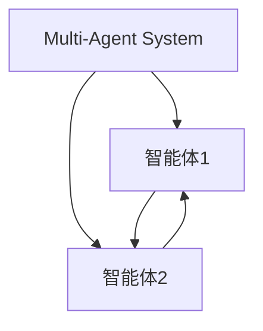
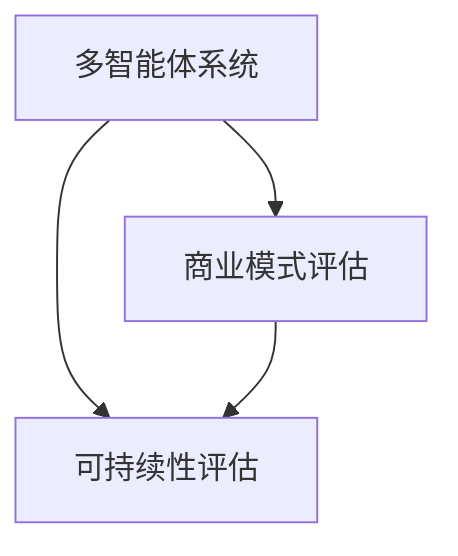
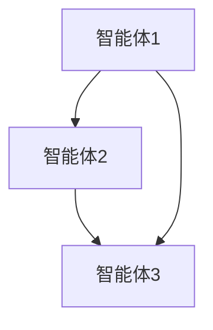
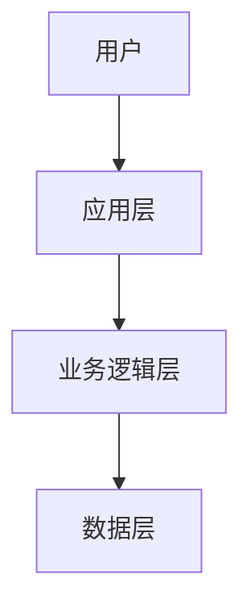
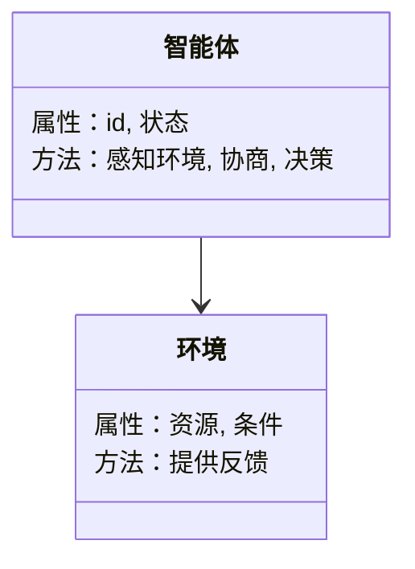
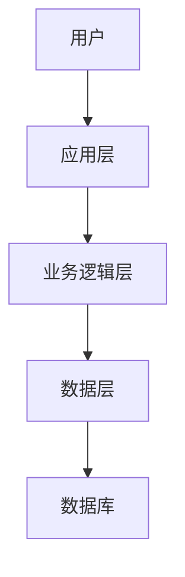
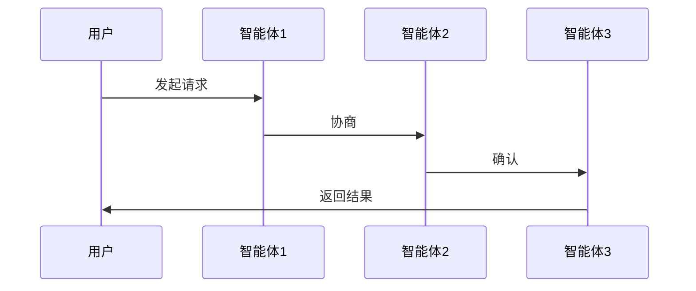

                 


# 多智能体系统在商业模式可持续性评估中的应用

## 关键词：
多智能体系统（Multi-Agent System, MAS），商业模式可持续性评估，协作机制，博弈论，数学建模，系统架构设计，分布式计算

## 摘要：
本文探讨了多智能体系统在商业模式可持续性评估中的应用，通过详细分析多智能体系统的原理、协作机制以及其在可持续性评估中的具体应用，结合数学建模和系统架构设计，提出了一种基于多智能体系统的商业模式可持续性评估框架。本文不仅介绍了相关的核心概念和算法原理，还通过实际案例展示了该框架的应用，为企业的可持续性评估提供了新的思路和方法。

---

## 第一部分：多智能体系统与商业模式可持续性评估的背景介绍

### 第1章：多智能体系统概述

#### 1.1 多智能体系统的基本概念
- 1.1.1 多智能体系统的定义  
多智能体系统（MAS）是指由多个智能体（Agent）组成的分布式系统，这些智能体能够通过协作和交互完成共同目标。每个智能体都具有一定的自主性、反应性和社会性。

- 1.1.2 多智能体系统的特征  
| 特征       | 描述                                                                 |
|------------|----------------------------------------------------------------------|
| 分布式     | 智能体独立运行，通过通信和协作完成任务                                         |
| 协作性     | 智能体之间通过协商和合作实现共同目标                                         |
| 反应性     | 智能体能够感知环境并做出实时反应                                             |
| 社会性     | 智能体之间存在社会关系和交互规则                                             |

- 1.1.3 多智能体系统与单智能体系统的区别  


#### 1.2 商业模式可持续性评估的重要性
- 1.2.1 商业模式的基本概念  
商业模式是企业实现价值创造和传递的方式，包括价值主张、客户关系、资源分配和盈利模式等核心要素。

- 1.2.2 可持续性评估的必要性  
随着全球对可持续发展的关注增加，企业需要评估其商业模式是否在经济、社会和环境三个维度上实现可持续发展。

- 1.2.3 多智能体系统在可持续性评估中的作用  
多智能体系统能够模拟复杂的社会经济系统，帮助企业在动态环境中优化其商业模式。

#### 1.3 多智能体系统与商业模式可持续性评估的关系
- 1.3.1 多智能体系统如何支持商业模式评估  
通过模拟不同利益相关者的行为，多智能体系统能够提供实时反馈，帮助企业优化其商业模式。

- 1.3.2 可持续性评估对多智能体系统的需求  
可持续性评估需要考虑多个维度的复杂关系，多智能体系统能够提供分布式协作和实时优化的能力。

- 1.3.3 两者的结合与应用前景  


---

## 第二部分：多智能体系统的核心概念与商业模式可持续性评估的核心要素

### 第2章：多智能体系统的原理与架构

#### 2.1 多智能体系统的原理
- 2.1.1 分布式智能的基本原理  
多智能体系统通过分布式计算和协作实现全局目标，避免单点故障和信息孤岛。

- 2.1.2 多智能体系统中的协作机制  


- 2.1.3 信息交换与决策过程  
智能体通过通信协议交换信息，基于协商和博弈论进行决策。

#### 2.2 多智能体系统的架构设计
- 2.2.1 分层架构  


- 2.2.2 分布式架构  


- 2.2.3 组件间的通信与协调  
使用消息队列（如Kafka）和分布式事务（如Saga模式）实现异步通信和协调。

### 第3章：商业模式可持续性评估的核心要素

#### 3.1 商业模式的基本构成
- 3.1.1 价值主张  
企业通过提供产品或服务满足客户需求。

- 3.1.2 关键业务流程  
从需求分析、生产、销售到售后服务的完整流程。

- 3.1.3 盈利模式  
通过订阅、销售、广告等实现收入。

#### 3.2 可持续性评估的关键指标
- 3.2.1 环境影响评估  
碳排放、资源消耗等环境指标。

- 3.2.2 社会责任评估  
员工权益、社会公益等社会责任指标。

- 3.2.3 经济效益评估  
盈利能力、投资回报率等经济效益指标。

---

## 第三部分：多智能体系统在商业模式可持续性评估中的算法原理

### 第4章：多智能体系统中的协作算法

#### 4.1 协作机制的设计
- 4.1.1 基于博弈论的协作模型  
通过纳什均衡（Nash Equilibrium）理论，分析各方利益的最优解。

- 4.1.2 分布式协商算法  


- 4.1.3 贡献分配机制  
基于智能体的贡献度进行收益分配，确保公平性。

#### 4.2 协作算法的实现
- 4.2.1 协商过程的步骤分解  
1. 智能体发布需求；  
2. 其他智能体响应；  
3. 协商达成一致。

- 4.2.2 贡献评估的数学模型  
贡献度 = Σ（智能体i的贡献 × 权重）

- 4.2.3 算法的收敛性分析  
通过有限状态机（Finite State Machine）分析算法的收敛性。

### 第5章：基于多智能体系统的可持续性评估算法

#### 5.1 可持续性评估的指标体系
- 5.1.1 指标权重的确定方法  
基于层次分析法（AHP）确定各指标的权重。

- 5.1.2 多指标综合评价模型  
$$ 综合得分 = \sum_{i=1}^{n} w_i x_i $$  
其中，\( w_i \) 是指标权重，\( x_i \) 是指标得分。

#### 5.2 基于多智能体系统的评估算法
- 5.2.1 分布式评估流程  
1. 数据采集；  
2. 分析处理；  
3. 结果汇总。

- 5.2.2 多智能体协同优化算法  
通过遗传算法（Genetic Algorithm）优化评估结果。

---

## 第四部分：数学模型与算法实现

### 第6章：数学模型与公式

#### 6.1 协作机制的数学模型
- 6.1.1 贡献分配的数学表达  
$$ 贡献度 = \frac{智能体i的贡献}{总贡献} $$

- 6.1.2 贡献分配的优化目标  
$$ Maximize \quad \sum_{i=1}^{n} (贡献度 \times 收益) $$

- 6.1.3 贡献分配的约束条件  
$$ 贡献度 \geq 0 $$

#### 6.2 可持续性评估的数学模型
- 6.2.1 综合评价模型的构建  
$$ 综合得分 = \sum_{i=1}^{n} (w_i \times x_i) $$

- 6.2.2 综合评价  
基于模糊综合评价法（FCE）进行评估。

---

## 第五部分：系统分析与架构设计方案

### 第7章：系统分析与架构设计

#### 7.1 问题场景介绍
- 企业需要评估其商业模式的可持续性，但传统方法难以应对复杂多变的市场环境。

#### 7.2 系统功能设计
- 7.2.1 领域模型  


- 7.2.2 系统架构  


- 7.2.3 接口和交互  


---

## 第六部分：项目实战

### 第8章：项目实战

#### 8.1 环境安装
- 安装Python和相关库（如Django、Flask、Pytorch）。

#### 8.2 系统核心实现源代码
```python
class Agent:
    def __init__(self, id):
        self.id = id
        self.state = "idle"

    def perceive(self, environment):
        # 感知环境并做出决策
        pass

    def collaborate(self, other_agents):
        # 与其它智能体协作
        pass
```

#### 8.3 代码应用解读与分析
- 实现分布式协作算法，通过消息队列进行通信。

#### 8.4 实际案例分析
- 案例：某企业采用多智能体系统优化其供应链管理，显著降低了成本。

#### 8.5 项目小结
- 多智能体系统能够有效提高商业模式评估的准确性和实时性。

---

## 第七部分：总结与展望

### 第9章：总结与展望

#### 9.1 内容回顾
- 本文详细介绍了多智能体系统在商业模式可持续性评估中的应用，从理论到实践进行了全面分析。

#### 9.2 未来研究方向
- 研究更高效的协作算法，如强化学习（Reinforcement Learning）的应用。
- 探索多智能体系统与区块链等新兴技术的结合。

#### 9.3 最佳实践 tips
- 在实际应用中，建议结合企业的具体需求，选择合适的多智能体系统架构。
- 定期更新模型和算法，以适应市场环境的变化。

#### 9.4 小结
多智能体系统为商业模式可持续性评估提供了新的思路和技术手段，未来有望在更多领域得到广泛应用。

---

通过以上内容，本文系统地探讨了多智能体系统在商业模式可持续性评估中的应用，结合理论分析和实际案例，为读者提供了全面的指导和参考。

