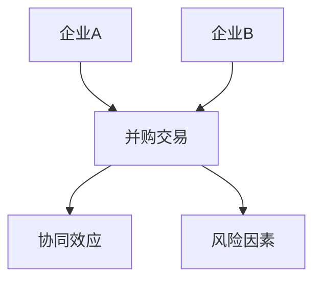
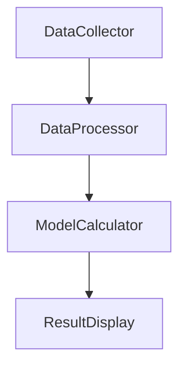

                 


# 多智能体系统在并购分析中的应用：评估长期价值创造

## 关键词：多智能体系统，并购分析，长期价值创造，协同效应，风险评估，算法原理

## 摘要：  
本文探讨了多智能体系统在并购分析中的应用，重点分析了其在评估长期价值创造中的作用。通过介绍多智能体系统的核心概念、算法原理和系统架构设计，展示了其如何在并购分析中实现协同效应和风险评估。结合实际案例和项目实战，本文详细讲解了多智能体系统在并购分析中的优势和应用方法，为相关领域提供了有价值的参考。

---

## 第1章: 多智能体系统与并购分析的背景与基础

### 1.1 多智能体系统的基本概念

#### 1.1.1 多智能体系统的定义  
多智能体系统（Multi-Agent System, MAS）是由多个智能体组成的分布式系统，这些智能体能够通过协作完成复杂的任务。智能体具有自主性、反应性、社会性和学习性等特征。

#### 1.1.2 多智能体系统的特征  
- **自主性**：智能体能够自主决策。
- **反应性**：智能体能够感知环境并实时响应。
- **社会性**：智能体之间可以通信和协作。
- **分布性**：任务分布在多个智能体之间，避免单点故障。

#### 1.1.3 多智能体系统与传统单智能体系统的区别  
| 特性       | 多智能体系统               | 单智能体系统           |
|------------|----------------------------|-----------------------|
| 决策中心化 | 去中心化，每个智能体决策 | 中心化，单个决策者     |
| 任务分配   | 分布式任务分配           | 单一任务分配           |
| 效率       | 高，利用分布式计算优势   | 较低，依赖单个计算节点 |

### 1.2 并购分析的基本概念

#### 1.2.1 并购的定义与类型  
并购是指企业之间通过购买股权或资产进行合并的行为。常见类型包括：
- **横向并购**：同一行业内的并购。
- **纵向并购**：产业链上下游的并购。
- **混合并购**：与主业无关的并购。

#### 1.2.2 并购分析的核心问题  
- 评估目标企业价值。
- 识别并购协同效应。
- 量化并购风险。

#### 1.2.3 并购分析的挑战与难点  
- 数据复杂性：涉及财务、市场、管理等多方面数据。
- 不确定性：未来市场变化难以预测。
- 协同效应量化：难以准确衡量协同效应的大小。

### 1.3 多智能体系统在并购分析中的应用意义

#### 1.3.1 多智能体系统的优势  
- **分布式计算**：多智能体系统能够同时处理大量数据，提高计算效率。
- **协作学习**：智能体之间可以共享信息，提高决策的准确性。
- **适应性**：系统能够根据环境变化动态调整策略。

#### 1.3.2 并购分析中的复杂性与不确定性  
并购涉及多方面的利益相关者和复杂的风险因素，传统方法难以全面评估长期价值。

#### 1.3.3 多智能体系统在长期价值创造中的作用  
多智能体系统可以通过协同学习和分布式计算，帮助企业在并购中更好地识别协同效应和降低风险，从而实现长期价值创造。

---

## 第2章: 多智能体系统的核心概念与联系

### 2.1 多智能体系统的原理

#### 2.1.1 实体关系图（ER图）



#### 2.1.2 多智能体系统的协作机制  
协作机制包括通信协议、任务分配和协调机制。

#### 2.1.3 多智能体系统的通信协议  
通信协议定义了智能体之间的信息传递方式和格式。

### 2.2 并购分析中的核心要素

#### 2.2.1 企业价值评估模型  
企业价值 = 净资产 + 未来现金流的现值。

#### 2.2.2 并购协同效应的衡量  
协同效应 = 并购后的企业价值 - 单独价值之和。

#### 2.2.3 并购风险的评估  
风险因素包括市场风险、操作风险和法律风险。

### 2.3 多智能体系统与并购分析的实体关系图


---

## 第3章: 多智能体系统在并购分析中的算法原理

### 3.1 多智能体协同学习的算法流程

#### 3.1.1 算法流程图

```mermaid
graph TD
    Start --> Initialize agents
    Initialize agents --> Gather data
    Gather data --> Compute协同效应
    Compute协同效应 --> Evaluate风险
    Evaluate风险 --> Output结果
    Output结果 --> End
```

#### 3.1.2 算法的输入与输出  
- 输入：企业数据、市场数据。
- 输出：协同效应、风险评估。

#### 3.1.3 算法的实现步骤  
1. 初始化智能体。
2. 采集数据。
3. 计算协同效应。
4. 评估风险。
5. 输出结果。

### 3.2 并购价值评估的数学模型

#### 3.2.1 企业价值公式  
$$企业价值 = 净资产 + \sum_{t=1}^{n} \frac{CF_t}{(1 + r)^t}$$

#### 3.2.2 协同效应的计算公式  
$$协同效应 = V_{post} - (V_{pre} + V_{target})$$

#### 3.2.3 并购风险的评估公式  
$$风险 = \sum_{i=1}^{m} P_i \times I_i$$

### 3.3 算法的Python实现

#### 3.3.1 环境安装与配置  
```bash
pip install numpy pandas scikit-learn
```

#### 3.3.2 核心算法代码示例  

```python
import numpy as np
import pandas as pd

def calculate_synergy(firm_value_before, target_value):
    return firm_value_before + target_value

def assess_risk(firm_risk, market_risk):
    return firm_risk + market_risk

# 示例数据
firm_value_before = 100
target_value = 50
synergy = calculate_synergy(firm_value_before, target_value)
risk = assess_risk(0.2, 0.3)

print(f"协同效应：{synergy}")
print(f"风险：{risk}")
```

#### 3.3.3 代码的功能与实现细节  
代码实现协同效应和风险的计算，具体功能包括数据输入、计算和输出。

---

## 第4章: 并购分析的系统架构与设计

### 4.1 系统功能模块设计

#### 4.1.1 数据采集模块  
- 负责收集企业数据和市场数据。

#### 4.1.2 数据处理模块  
- 数据清洗和特征提取。

#### 4.1.3 模型计算模块  
- 协同效应和风险计算。

#### 4.1.4 结果展示模块  
- 可视化展示结果。

### 4.2 系统架构设计图



### 4.3 系统接口设计  
- 数据接口：RESTful API。
- 模型接口：Python函数调用。

---

## 第5章: 项目实战

### 5.1 环境安装与代码实现

#### 5.1.1 环境安装  
```bash
pip install numpy pandas matplotlib
```

#### 5.1.2 核心代码实现  

```python
import numpy as np
import pandas as pd
import matplotlib.pyplot as plt

# 示例数据
data = {'企业A': [100, 80, 90], '企业B': [70, 60, 75]}
df = pd.DataFrame(data)

# 计算协同效应
synergy = df['企业A'] + df['企业B']
print(synergy)

# 可视化
plt.plot(synergy, 'b-')
plt.title('协同效应变化')
plt.xlabel('时间')
plt.ylabel('协同效应')
plt.show()
```

### 5.2 案例分析与结果解读  
以具体案例为例，展示系统的应用和结果。

### 5.3 项目小结  
总结项目实现的关键点和经验教训。

---

## 第6章: 总结与展望

### 6.1 总结  
本文详细介绍了多智能体系统在并购分析中的应用，展示了其在长期价值创造中的优势。

### 6.2 展望  
未来的研究方向包括动态适应性问题和算法的扩展性，同时可以结合区块链等技术进一步增强系统的可信度。

---

通过以上内容，我们全面探讨了多智能体系统在并购分析中的应用，从理论到实践，为实现长期价值创造提供了有力的技术支持。

