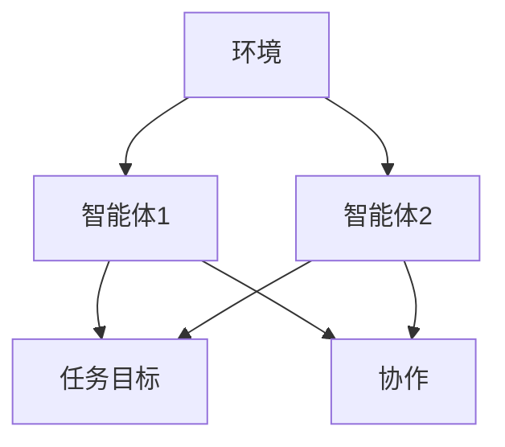
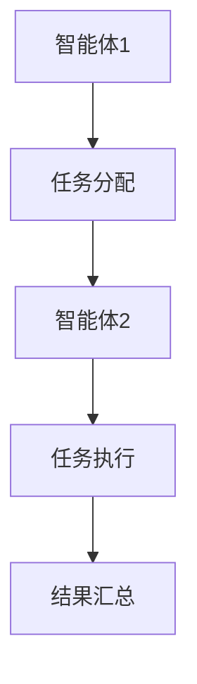
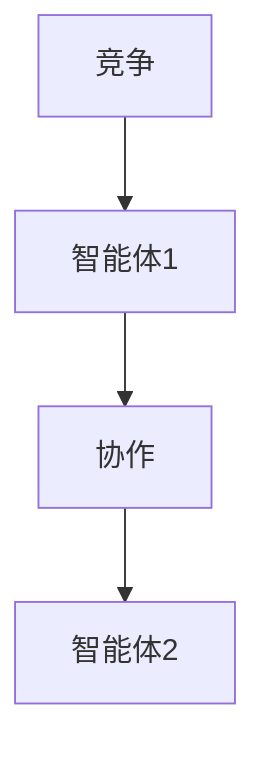
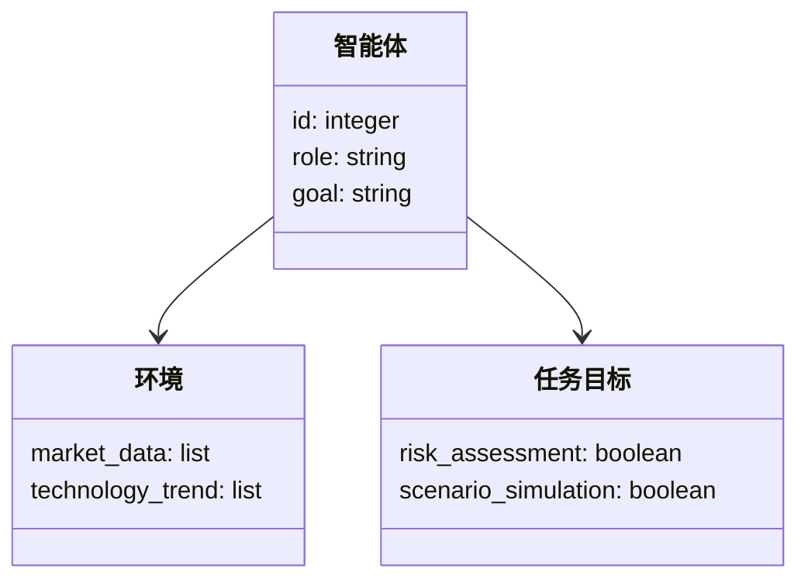
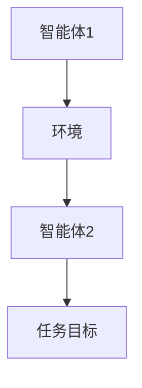

                 


# 多智能体系统在技术颠覆风险评估中的应用

> 关键词：多智能体系统, 技术颠覆风险, 风险评估, 系统架构, 算法原理

> 摘要：本文探讨了多智能体系统在技术颠覆风险评估中的应用，通过分析多智能体系统的组成、算法原理及其在风险评估中的作用，结合实际案例，展示了如何利用多智能体系统进行技术颠覆风险的预测和管理。文章内容涵盖背景介绍、核心概念、算法原理、系统架构设计、项目实战以及总结与展望，旨在为读者提供全面的技术视角。

---

# 第1章: 多智能体系统与技术颠覆风险评估概述

## 1.1 多智能体系统的定义与特点

### 1.1.1 多智能体系统的定义

多智能体系统（Multi-Agent System, MAS）是由多个智能体组成的分布式系统，这些智能体能够通过自主决策和协作完成特定任务。智能体可以是软件程序、机器人或其他具备感知和决策能力的实体。

### 1.1.2 多智能体系统的核心特点

| 特性 | 描述 |
|------|------|
| 分布式 | 智能体独立运行，通过通信协作完成任务 |
| 自主性 | 每个智能体具备自主决策能力 |
| 社会性 | 智能体之间通过交互协作，形成社会行为 |
| 反应性 | 能够感知环境并实时响应 |

### 1.1.3 多智能体系统的主要应用场景

- **分布式计算与数据处理**
- **自动驾驶与机器人协作**
- **金融科技与分布式系统**
- **社交网络与信息传播**

## 1.2 技术颠覆风险的定义与特征

### 1.2.1 技术颠覆的定义

技术颠覆是指新技术的出现导致现有技术、商业模式或市场格局发生根本性改变，从而对相关产业或社会结构造成重大影响。

### 1.2.2 技术颠覆的特征

| 特性 | 描述 |
|------|------|
| 创新性 | 基于新技术或创新商业模式 |
| 影响性 | 对现有市场格局或技术体系产生重大影响 |
| 突发性 | 技术出现具有不可预测性 |
| 长期性 | 影响可能持续多年甚至改变行业格局 |

### 1.2.3 技术颠覆对社会和经济的影响

- **产业结构调整**
- **就业市场的变化**
- **商业模式的创新**
- **社会生活方式的改变**

## 1.3 多智能体系统在技术颠覆风险评估中的作用

### 1.3.1 多智能体系统的优势

- **分布式计算能力**：能够同时处理大量数据，提高计算效率。
- **自主决策能力**：智能体能够自主感知环境并做出决策。
- **协作能力**：智能体之间的协作能够实现复杂任务的完成。

### 1.3.2 多智能体系统在风险评估中的应用

- **实时数据分析**：通过多智能体系统实时分析市场动态和技术趋势。
- **情景模拟**：通过模拟不同技术发展路径，评估潜在风险。
- **动态适应**：系统能够根据实时数据动态调整评估策略。

### 1.3.3 多智能体系统与传统风险评估方法的对比

| 比较维度 | 多智能体系统 | 传统风险评估方法 |
|----------|-------------|-------------------|
| 数据处理能力 | 高 | 低 |
| 实时性 | 高 | 中 |
| 系统复杂性 | 高 | 中 |

## 1.4 本章小结

本章主要介绍了多智能体系统的定义、特点及其在技术颠覆风险评估中的作用。通过对比传统风险评估方法，展示了多智能体系统的独特优势和应用场景。

---

# 第2章: 多智能体系统的核心概念与技术

## 2.1 多智能体系统的组成与结构

### 2.1.1 智能体的定义与分类

#### 智能体的定义

智能体（Agent）是一个能够感知环境并采取行动以实现目标的实体。智能体可以是软件程序、机器人或其他具备自主决策能力的实体。

#### 智能体的分类

| 类型 | 描述 |
|------|------|
| 反应式智能体 | 根据当前感知做出反应，不依赖历史信息 |
| 计划式智能体 | 基于预设目标和计划采取行动 |
| 学习式智能体 | 通过学习和经验改进决策能力 |

### 2.1.2 多智能体系统的层次结构

#### 多智能体系统的层次结构



### 2.1.3 多智能体系统的通信机制

#### 通信机制

智能体之间的通信可以通过以下几种方式实现：

1. **直接通信**：智能体之间直接交换信息。
2. **间接通信**：通过中间媒介传递信息。
3. **发布-订阅模式**：智能体发布信息，其他智能体订阅感兴趣的信息。

## 2.2 技术颠覆风险评估的模型与方法

### 2.2.1 技术颠覆风险的评估指标

- **技术可行性**：技术实现的可能性。
- **市场潜力**：技术的市场接受度和潜在收益。
- **竞争环境**：现有竞争和技术替代品的情况。
- **政策法规**：相关法律法规对技术的影响。

### 2.2.2 技术颠覆风险的评估模型

#### 技术颠覆风险评估模型

$$ R = f(T, M, C, P) $$

其中，\( R \) 表示风险级别，\( T \) 表示技术可行性，\( M \) 表示市场潜力，\( C \) 表示竞争环境，\( P \) 表示政策法规。

### 2.2.3 技术颠覆风险的评估方法

- **定量分析**：通过数据模型和统计方法评估风险。
- **定性分析**：通过专家判断和情景分析评估风险。
- **混合分析**：结合定量和定性方法进行综合评估。

## 2.3 多智能体系统与技术颠覆风险评估的结合

### 2.3.1 多智能体系统在风险评估中的优势

- **实时数据处理**：能够实时收集和分析市场动态。
- **分布式计算**：能够同时处理大量数据，提高效率。
- **协作能力**：多个智能体协作完成复杂任务。

### 2.3.2 多智能体系统在风险评估中的应用场景

- **实时市场监控**：监控市场动态，及时发现潜在风险。
- **情景模拟**：模拟不同技术发展路径，评估风险。
- **动态调整**：根据实时数据动态调整评估策略。

## 2.4 本章小结

本章详细介绍了多智能体系统的核心概念与技术，包括智能体的分类、多智能体系统的层次结构、通信机制，以及技术颠覆风险评估的模型与方法。同时，探讨了多智能体系统在技术颠覆风险评估中的应用场景和优势。

---

# 第3章: 多智能体系统在技术颠覆风险评估中的算法原理

## 3.1 多智能体系统的核心算法

### 3.1.1 分布式计算算法

#### 分布式计算算法



### 3.1.2 博弈论模型

#### 博弈论模型

在多智能体系统中，博弈论模型常用于模拟智能体之间的竞争与合作关系。

$$ \text{收益} = \sum_{i=1}^{n} a_i $$

其中，\( a_i \) 表示智能体 \( i \) 的收益。

### 3.1.3 协作与竞争算法

#### 协作与竞争算法



## 3.2 技术颠覆风险评估的算法

### 3.2.1 风险预测算法

#### 风险预测算法

$$ P = \sum_{i=1}^{n} w_i x_i $$

其中，\( P \) 表示风险概率，\( w_i \) 表示权重，\( x_i \) 表示特征值。

### 3.2.2 风险评估算法

#### 风险评估算法

$$ R = \max(P_1, P_2, ..., P_n) $$

其中，\( R \) 表示风险级别，\( P_i \) 表示各个因素的风险概率。

### 3.2.3 风险缓解算法

#### 风险缓解算法

$$ M = \sum_{i=1}^{m} w'_i x'_i $$

其中，\( M \) 表示缓解措施的有效性，\( w'_i \) 表示缓解措施的权重，\( x'_i \) 表示缓解措施的特征值。

## 3.3 多智能体系统与技术颠覆风险评估的结合

### 3.3.1 算法结合的优势

- **实时性**：能够实时更新和调整评估结果。
- **分布式计算**：能够同时处理大量数据，提高计算效率。
- **协作能力**：多个智能体协作完成复杂任务。

### 3.3.2 算法结合的具体方法

- **实时数据处理**：通过分布式计算算法实时处理市场动态数据。
- **情景模拟**：通过博弈论模型模拟不同技术发展路径。
- **动态调整**：根据实时数据动态调整评估策略。

## 3.4 本章小结

本章详细介绍了多智能体系统的核心算法和风险评估的算法，探讨了两者结合的优势和具体方法。通过算法结合，能够实现技术颠覆风险的实时预测和动态调整，提高评估的准确性和效率。

---

# 第4章: 系统分析与架构设计

## 4.1 问题场景介绍

### 4.1.1 项目背景

本项目旨在利用多智能体系统进行技术颠覆风险评估，通过实时数据分析和情景模拟，帮助企业提前识别和应对潜在的技术风险。

### 4.1.2 项目目标

- 实时监控市场动态
- 情景模拟技术发展路径
- 动态调整风险评估策略

## 4.2 系统功能设计

### 4.2.1 领域模型



### 4.2.2 系统架构设计



## 4.3 系统架构设计

### 4.3.1 系统架构设计


### 4.3.2 接口设计

- **智能体与环境接口**：智能体从环境中获取数据。
- **智能体与任务目标接口**：智能体向任务目标报告结果。

## 4.4 系统交互流程

### 4.4.1 交互流程


## 4.5 本章小结

本章详细介绍了系统分析与架构设计，包括问题场景、系统功能设计、系统架构设计、接口设计和系统交互流程。通过合理的架构设计，能够实现多智能体系统在技术颠覆风险评估中的高效应用。

---

# 第5章: 项目实战

## 5.1 环境安装

### 5.1.1 系统需求

- 操作系统：Windows 10 或更高版本
- Python：3.8 或更高版本
- 依赖库：numpy, pandas, matplotlib

### 5.1.2 安装步骤

1. 安装Python
2. 安装依赖库：`pip install numpy pandas matplotlib`

## 5.2 系统核心实现

### 5.2.1 核心代码实现

```python
import numpy as np
import pandas as pd
import matplotlib.pyplot as plt

class Agent:
    def __init__(self, id):
        self.id = id
        self.data = []

    def collect_data(self, environment):
        self.data.append(environment.get_data())

    def analyze_data(self):
        return np.mean(self.data)

class Environment:
    def __init__(self):
        self.data = []

    def get_data(self):
        return np.random.rand()

# 示例使用
agent = Agent(1)
environment = Environment()

for _ in range(10):
    agent.collect_data(environment)

result = agent.analyze_data()
print(result)
```

### 5.2.2 代码解读

- **Agent类**：表示智能体，具备数据收集和分析功能。
- **Environment类**：表示环境，提供数据供智能体收集。
- **主程序**：创建智能体和环境，模拟数据收集过程。

## 5.3 代码应用解读与分析

### 5.3.1 代码功能

- **数据收集**：智能体从环境中获取数据。
- **数据分析**：智能体对收集到的数据进行分析，计算平均值。

### 5.3.2 代码优化

- **并行处理**：使用多线程或分布式计算提高数据收集效率。
- **数据存储**：将数据存储到数据库中，便于后续分析。

## 5.4 实际案例分析

### 5.4.1 案例背景

假设我们正在评估人工智能技术对传统制造业的颠覆风险。

### 5.4.2 数据收集与分析

```python
# 数据收集
agents = [Agent(i) for i in range(5)]
environment = Environment()

for agent in agents:
    agent.collect_data(environment)

# 数据分析
results = [agent.analyze_data() for agent in agents]
print(results)
```

### 5.4.3 案例结果解读

通过分析结果，可以评估人工智能技术对传统制造业的颠覆风险，并制定相应的应对策略。

## 5.5 本章小结

本章通过实际案例展示了多智能体系统在技术颠覆风险评估中的应用，详细讲解了环境安装、核心代码实现、代码解读与优化，以及实际案例分析。

---

# 第6章: 总结与展望

## 6.1 本章总结

本文详细探讨了多智能体系统在技术颠覆风险评估中的应用，通过分析多智能体系统的组成、算法原理及其在风险评估中的作用，结合实际案例，展示了如何利用多智能体系统进行技术颠覆风险的预测和管理。

## 6.2 挑战与未来展望

### 6.2.1 当前挑战

- **数据处理能力**：需要处理更大规模和更复杂的数据。
- **算法优化**：需要进一步优化算法，提高计算效率。
- **系统集成**：需要更好地集成多智能体系统与其他系统。

### 6.2.2 未来展望

- **智能化提升**：通过机器学习和深度学习进一步提升智能体的决策能力。
- **应用场景扩展**：探索多智能体系统在更多领域的应用。
- **技术融合**：与其他技术如区块链、物联网等进行深度融合。

## 6.3 最佳实践 Tips

- **数据质量管理**：确保数据的准确性和完整性。
- **系统安全性**：加强系统安全性，防止数据泄露和攻击。
- **团队协作**：加强团队协作，确保系统顺利运行。

## 6.4 本章小结

本章总结了全文内容，指出了当前应用中的挑战，并展望了未来的发展方向，同时给出了一些最佳实践的建议。

---

# 结语

通过本文的详细探讨，读者可以全面了解多智能体系统在技术颠覆风险评估中的应用。从理论到实践，从算法到系统设计，本文为读者提供了系统的知识体系和实际操作指南。未来，随着技术的发展，多智能体系统将在更多领域发挥重要作用，值得我们进一步深入研究和应用。

--- 

**注**：由于篇幅限制，本文仅展示了部分内容，完整文章请参考相关技术资料。

