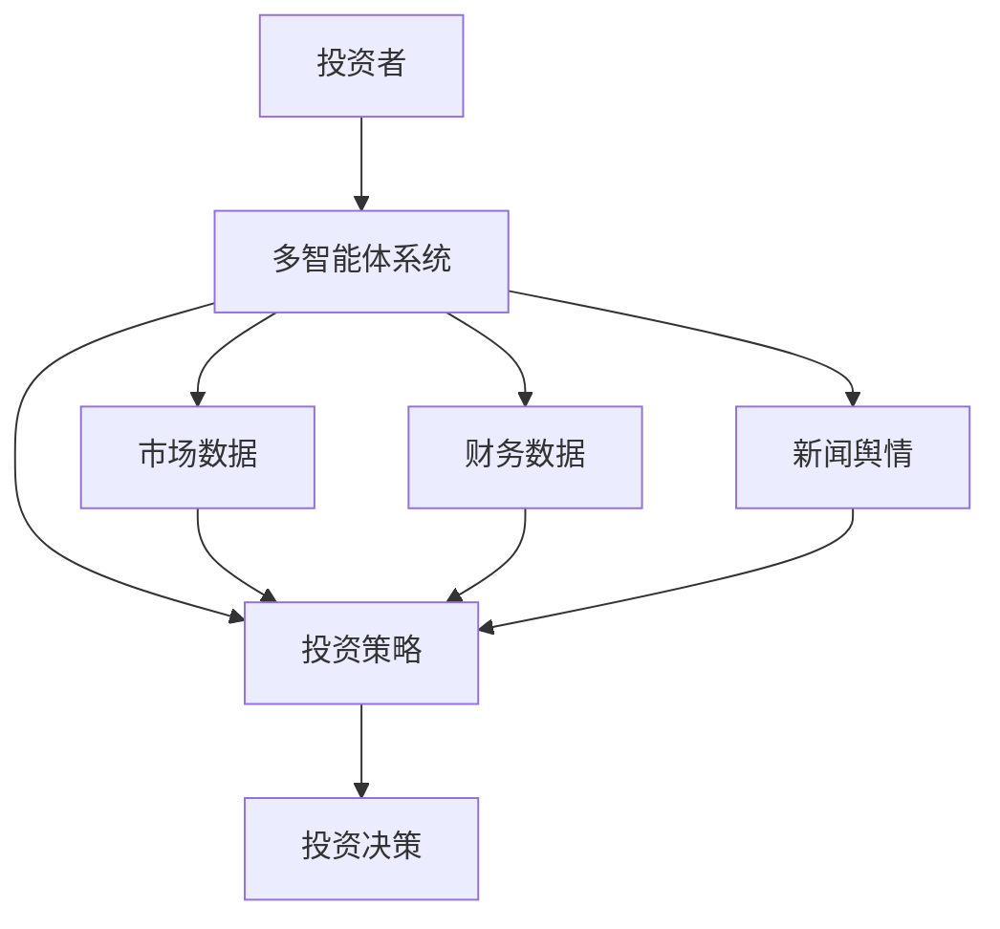
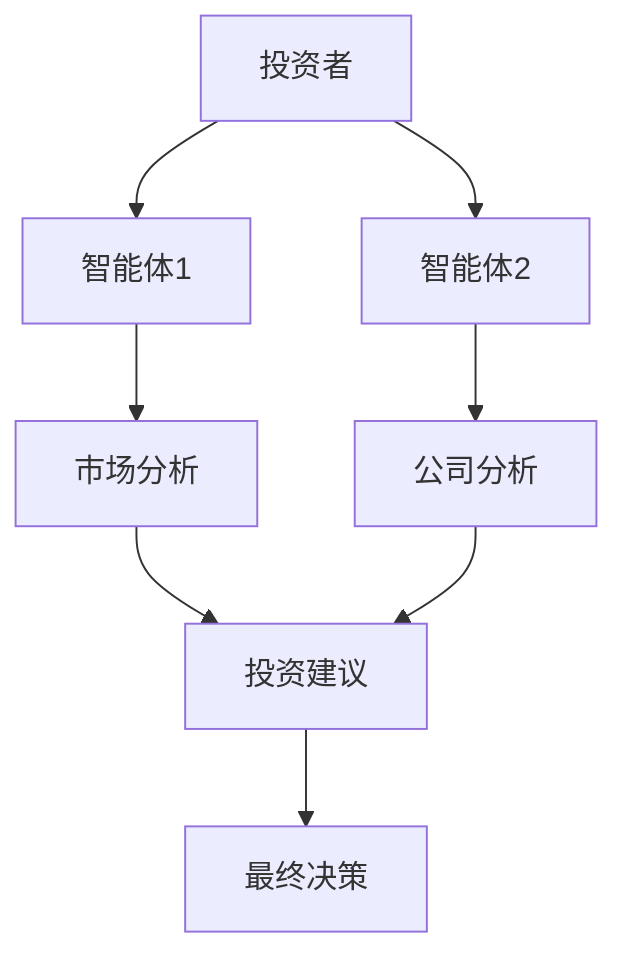
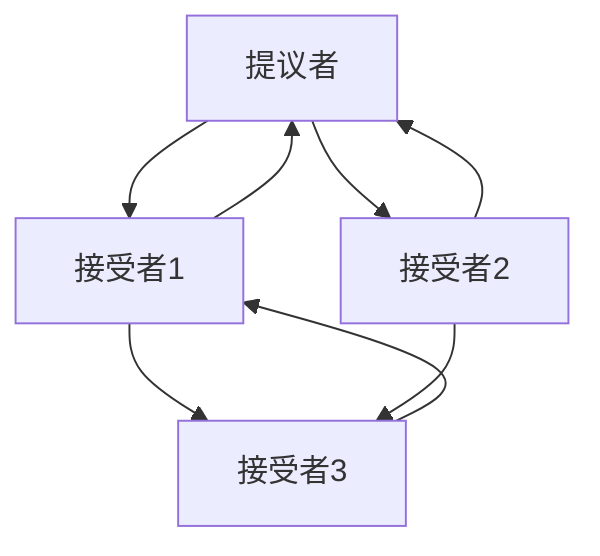
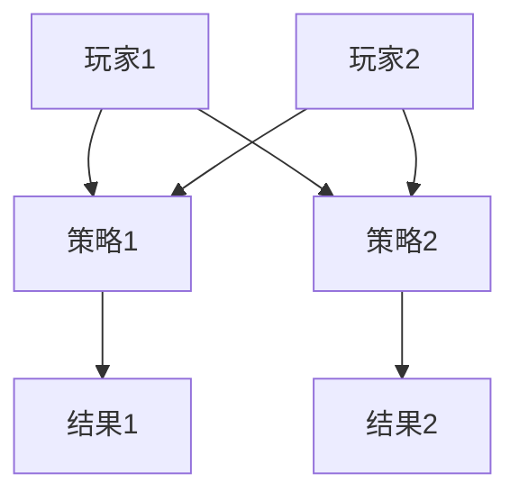
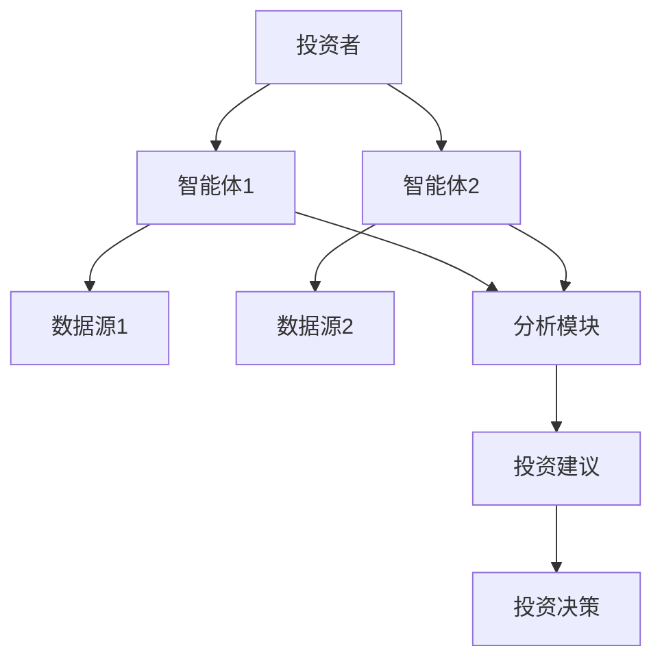
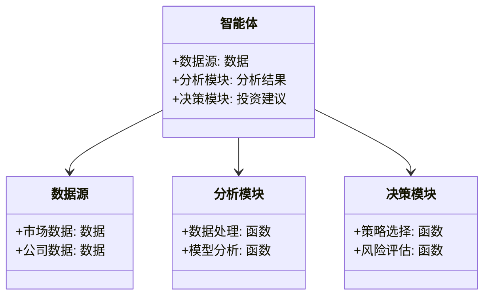

                 


# 多智能体系统在新兴市场价值投资中的应用

> 关键词：多智能体系统，新兴市场，价值投资，分布式决策，博弈论模型，金融数据分析，投资策略优化

> 摘要：本文探讨了多智能体系统在新兴市场价值投资中的应用，分析了多智能体系统的优势及其在新兴市场中的投资策略。通过详细讲解多智能体系统的算法原理和系统架构设计，结合实际案例，展示了如何利用多智能体系统在新兴市场中实现高效的投资决策，解决传统投资方法的局限性，为投资者提供新的思路和工具。

---

## 第一部分: 多智能体系统与新兴市场价值投资概述

### 第1章: 多智能体系统与价值投资的背景

#### 1.1 多智能体系统的基本概念

多智能体系统（Multi-Agent System, 简称MAS）是由多个智能体（Agent）组成的分布式系统，这些智能体能够通过交互和协作完成复杂的任务。与单智能体系统不同，多智能体系统强调智能体之间的协同与合作，能够更好地处理复杂环境中的动态问题。

**表1-1: 多智能体系统与其他投资方法的对比**

| 特性                | 多智能体系统           | 单智能体系统           | 传统人工分析         |
|---------------------|----------------------|----------------------|----------------------|
| 决策主体            | 多个智能体           | 单个智能体           | 人工团队             |
| 信息处理能力        | 高                   | 中                   | 高                   |
| 协作能力            | 高                   | 低                   | 中                   |
| 适应性              | 高                   | 中                   | 低                   |

#### 1.2 新兴市场价值投资的基本概念

新兴市场通常指那些经济快速增长、金融市场尚未完全成熟的地区。价值投资是一种通过分析企业基本面，寻找被市场低估的投资标的的投资策略。在新兴市场中，价值投资面临信息不对称、市场波动大等挑战。

**图1-1: 多智能体系统在新兴市场中的价值投资框架**



### 第2章: 多智能体系统在价值投资中的应用背景

#### 2.1 多智能体系统的投资优势

多智能体系统在投资中的优势在于其分布式决策和协同能力。通过多个智能体的协作，系统能够从多个角度分析数据，制定更加全面的投资策略。

**图2-1: 多智能体系统的分布式决策流程**



---

## 第二部分: 多智能体系统的算法与数学模型

### 第3章: 多智能体系统的算法原理

#### 3.1 多智能体系统的核心算法

**一致性算法**

一致性算法用于确保多个智能体之间的数据一致性。常见的算法包括Paxos和Raft。

**图3-1: Paxos一致性算法流程图**



**博弈论模型**

博弈论模型用于分析智能体之间的策略选择和收益分配。

**图3-2: 博弈论模型中的纳什均衡**



### 第4章: 多智能体系统的数学公式与算法实现

#### 4.1 一致性算法的数学推导

一致性算法的收敛性分析可以通过数学公式证明：

$$ \text{收敛性} = \lim_{n \to \infty} \frac{1}{n} \sum_{i=1}^{n} x_i $$

其中，$x_i$ 是智能体i的值。

#### 4.2 博弈论模型的数学公式

纳什均衡的定义：

$$ \text{纳什均衡} = \{ (a_1, a_2, \dots, a_n) \} $$
$$ \text{其中} \, a_i \, \text{是玩家i的策略} $$

---

## 第三部分: 系统架构与应用场景

### 第5章: 系统架构设计

#### 5.1 问题场景介绍

在新兴市场中，投资者需要处理大量复杂的数据，包括市场波动、公司财务状况等。多智能体系统能够通过分布式的分析能力，帮助投资者制定更优的投资策略。

**图5-1: 系统架构图**



#### 5.2 功能设计与实现

**图5-2: 系统功能模块图**



---

## 第四部分: 项目实战与案例分析

### 第6章: 项目实战

#### 6.1 环境安装与配置

```bash
pip install multi-agent-system
pip install numpy pandas
```

#### 6.2 核心代码实现

```python
import numpy as np
import pandas as pd

class Agent:
    def __init__(self, id):
        self.id = id
        self.data = None

    def analyze(self, data):
        # 数据分析逻辑
        pass

    def decide(self):
        # 决策逻辑
        pass

class MarketData:
    def __init__(self):
        self.data = pd.DataFrame()

    def update(self, new_data):
        self.data = self.data.append(new_data)

# 实例化多个智能体
agents = [Agent(i) for i in range(5)]
market_data = MarketData()

# 智能体分析数据并决策
for agent in agents:
    agent.analyze(market_data.data)
    agent.decide()
```

#### 6.3 案例分析与解读

通过实际案例分析，展示多智能体系统如何在新兴市场中制定投资策略，解决传统方法的不足。

---

## 第五部分: 总结与展望

### 第7章: 总结与展望

#### 7.1 投资策略总结

多智能体系统通过分布式决策和协同分析，能够在新兴市场中制定更加高效和全面的投资策略。

#### 7.2 风险管理

多智能体系统能够实时监控市场变化，及时调整投资策略，降低投资风险。

#### 7.3 技术展望

未来，多智能体系统将与更多先进技术结合，如区块链和大数据分析，进一步提升投资效率和准确性。

---

## 结语

通过本文的详细讲解，读者可以全面了解多智能体系统在新兴市场价值投资中的应用，掌握其算法原理和系统架构设计，并通过实际案例分析，掌握如何在实际投资中应用多智能体系统。未来，随着技术的不断进步，多智能体系统将在金融领域发挥更大的作用。

--- 

> **Tips:** 
> - 在实际投资中，多智能体系统能够帮助投资者更好地应对复杂多变的市场环境。
> - 使用多智能体系统时，需要注意数据的准确性和算法的可解释性。
> - 未来，多智能体系统将与更多先进技术结合，进一步提升投资效率和准确性。

---

# 结束

