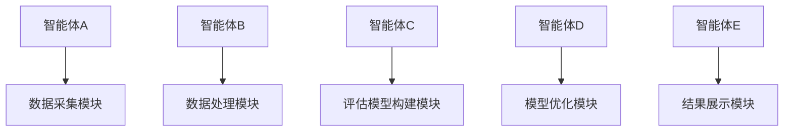
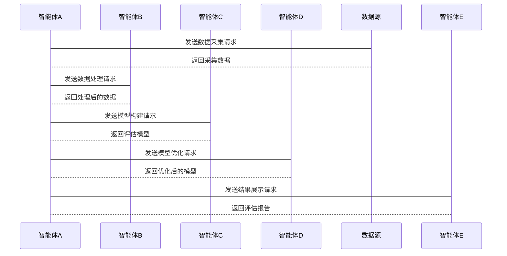

                 


# 多智能体系统在无形资产价值评估中的应用：专利、品牌等

## 关键词：多智能体系统，无形资产评估，专利，品牌，协作评估，分布式计算

## 摘要：多智能体系统在无形资产价值评估中的应用，特别是专利和品牌评估，通过多智能体系统协作机制和算法优化，解决了传统评估方法的局限性。本文详细介绍了多智能体系统的结构、协作机制、算法原理，并通过实际案例展示了其在专利和品牌评估中的应用，提供了系统的架构设计和实施方法，最后总结了最佳实践和未来研究方向。

---

# 第1章：研究背景与意义

## 1.1 无形资产价值评估的重要性

### 1.1.1 无形资产的定义与特征

无形资产是指企业或个人拥有的非实物资产，主要包括专利权、商标权、品牌价值、商誉等。它们具有以下特征：

- **非实体性**：无形资产不具有物理形态。
- **长期性**：无形资产的使用寿命通常较长。
- **价值波动性**：无形资产的价值受市场环境和企业经营状况影响较大。
- **依赖性**：无形资产的价值往往依赖于企业的经营能力和市场地位。

### 1.1.2 无形资产价值评估的挑战

传统的无形资产评估方法主要依赖于财务数据和市场交易数据，存在以下问题：

- **数据不足**：许多无形资产难以直接量化，尤其是品牌价值和专利组合的价值。
- **主观性**：评估结果受到评估人员主观判断的影响。
- **动态性**：市场环境的变化会导致无形资产价值快速波动。

### 1.1.3 多智能体系统在无形资产评估中的潜力

多智能体系统（Multi-Agent System, MAS）通过多个智能体协作完成复杂任务，具有以下优势：

- **分布式计算能力**：MAS能够处理大量分布式数据，适合处理无形资产评估中的复杂数据。
- **协作能力**：智能体之间的协作可以模拟专家团队的评估过程，提高评估结果的准确性。
- **适应性**：MAS能够根据市场变化动态调整评估策略，适应无形资产价值的波动性。

---

## 1.2 多智能体系统的基本概念

### 1.2.1 多智能体系统（MAS）的定义

多智能体系统是由多个智能体组成的分布式系统，智能体能够通过通信和协作完成复杂任务。MAS的核心特点包括：

- **自主性**：每个智能体都能够自主决策。
- **反应性**：智能体能够感知环境并做出实时反应。
- **协作性**：智能体之间通过通信协作完成共同目标。
- **分布性**：智能体分布在不同的位置，能够并行处理任务。

### 1.2.2 多智能体系统的结构与特点

多智能体系统的结构通常包括以下几个部分：

- **智能体**：独立的计算实体，能够完成特定任务。
- **通信机制**：智能体之间的通信方式，如消息传递。
- **协作机制**：智能体之间的协作规则和协议。
- **任务分配**：智能体之间的任务分配策略。

### 1.2.3 多智能体系统与传统AI的区别

传统AI通常基于单一智能体，而多智能体系统基于多个智能体的协作。传统AI在处理复杂任务时容易受到单点故障的影响，而多智能体系统通过分布式计算提高了系统的可靠性和适应性。

---

## 1.3 本书的研究目标与内容框架

### 1.3.1 本书的研究目标

本书旨在研究多智能体系统在无形资产评估中的应用，特别是专利和品牌评估。通过分析MAS的协作机制和算法优化，提出一种高效的评估方法。

### 1.3.2 本书的主要内容框架

本书分为以下几个部分：

- 第一部分：引言，介绍研究背景和意义。
- 第二部分：多智能体系统基础理论，包括MAS的定义、结构和协作机制。
- 第三部分：无形资产评估的核心概念，包括无形资产的定义、分类和评估方法。
- 第四部分：多智能体系统在无形资产评估中的应用，包括MAS协作模型和算法设计。
- 第五部分：系统架构设计，包括系统功能设计和通信协议设计。
- 第六部分：项目实战，通过具体案例展示MAS在专利和品牌评估中的应用。
- 第七部分：总结与展望，总结研究成果并展望未来发展方向。

### 1.3.3 本书的创新点

本书的创新点在于将多智能体系统应用于无形资产评估领域，通过MAS的协作机制和算法优化，提高了评估的准确性和效率。此外，本书还提出了一个基于MAS的无形资产评估系统架构，并通过实际案例展示了系统的实现过程。

---

# 第2章：多智能体系统基础理论

## 2.1 多智能体系统的结构与模型

### 2.1.1 多智能体系统的组成要素

多智能体系统通常包括以下几个要素：

- **智能体**：独立的计算实体，能够完成特定任务。
- **通信机制**：智能体之间的通信方式，如消息传递。
- **协作机制**：智能体之间的协作规则和协议。
- **任务分配**：智能体之间的任务分配策略。

### 2.1.2 多智能体系统的结构模型

多智能体系统的结构模型通常包括以下几种：

- **集中式结构**：有一个中央控制智能体，负责任务分配和协调。
- **分布式结构**：多个智能体协作完成任务，没有中央控制智能体。
- **混合式结构**：结合集中式和分布式结构的特点。

### 2.1.3 多智能体系统的协作模型

多智能体系统的协作模型包括以下几个方面：

- **任务分配**：智能体之间的任务分配策略，如基于角色分配和基于能力分配。
- **通信协议**：智能体之间的通信规则，如消息格式和通信频率。
- **协作规则**：智能体之间的协作规则，如共享资源和协同决策。

---

## 2.2 多智能体系统的协作与协调

### 2.2.1 协作任务分配算法

协作任务分配算法通常包括以下几个步骤：

1. **任务分解**：将整体任务分解为多个子任务。
2. **智能体能力评估**：评估每个智能体的能力，确定其适合完成的子任务。
3. **任务分配**：根据智能体的能力和任务需求，将子任务分配给合适的智能体。
4. **协作协调**：智能体之间通过通信和协作完成任务。

### 2.2.2 协调机制与冲突解决

多智能体系统的协调机制包括以下几个方面：

- **冲突检测**：检测智能体之间的冲突，如任务分配冲突和资源竞争。
- **冲突解决**：通过协商和仲裁机制解决冲突。
- **协作优化**：通过动态调整任务分配和协作策略，提高系统的效率。

### 2.2.3 协作效果评估方法

协作效果评估方法包括以下几个方面：

- **任务完成度**：评估智能体完成任务的质量和效率。
- **协作效率**：评估智能体之间的协作效率和资源利用率。
- **系统稳定性**：评估系统的稳定性和抗干扰能力。

---

## 2.3 多智能体系统的应用领域

### 2.3.1 多智能体系统在金融领域的应用

多智能体系统在金融领域的应用包括以下几个方面：

- **金融风险管理**：通过智能体协作完成风险评估和预警。
- **金融交易优化**：通过智能体协作优化交易策略和订单执行。
- **金融数据分析**：通过智能体协作分析金融市场数据。

### 2.3.2 多智能体系统在物流领域的应用

多智能体系统在物流领域的应用包括以下几个方面：

- **物流网络优化**：通过智能体协作优化物流网络的结构和路径。
- **物流资源调度**：通过智能体协作调度物流资源，如车辆和仓库。
- **物流信息共享**：通过智能体协作实现物流信息的共享和协同。

### 2.3.3 多智能体系统在无形资产评估中的应用前景

多智能体系统在无形资产评估中的应用前景包括以下几个方面：

- **专利评估**：通过智能体协作评估专利的价值和潜在市场。
- **品牌评估**：通过智能体协作评估品牌的价值和市场影响力。
- **无形资产组合评估**：通过智能体协作评估无形资产组合的整体价值。

---

# 第3章：无形资产评估的核心概念

## 3.1 无形资产的定义与分类

### 3.1.1 无形资产的定义

无形资产是指企业或个人拥有的非实物资产，主要包括专利权、商标权、品牌价值、商誉等。它们具有以下特征：

- **非实体性**：无形资产不具有物理形态。
- **长期性**：无形资产的使用寿命通常较长。
- **价值波动性**：无形资产的价值受市场环境和企业经营状况影响较大。
- **依赖性**：无形资产的价值往往依赖于企业的经营能力和市场地位。

### 3.1.2 无形资产的分类

无形资产可以根据不同的标准进行分类，常见的分类包括：

- **按法律性质分类**：专利权、商标权、版权、商誉等。
- **按使用范围分类**：企业内部使用的无形资产和对外使用的无形资产。
- **按价值评估分类**：可量化无形资产和不可量化无形资产。

---

## 3.2 无形资产评估的主要方法

### 3.2.1 市场法

市场法是通过比较类似无形资产的市场交易价格，评估无形资产的价值。这种方法通常用于可比交易数据丰富的资产。

### 3.2.2 收益法

收益法是通过预测无形资产为企业带来的未来收益，折现后评估其价值。这种方法通常用于具有稳定收益的无形资产。

### 3.2.3 成本法

成本法是通过估算无形资产的重置成本，评估其价值。这种方法通常用于可比成本数据丰富的资产。

---

## 3.3 无形资产评估中的挑战

### 3.3.1 数据不足

许多无形资产难以直接量化，尤其是品牌价值和专利组合的价值。

### 3.3.2 评估方法的局限性

传统评估方法在处理复杂无形资产时往往力不从心，难以准确反映其真实价值。

### 3.3.3 市场环境的动态性

无形资产的价值受市场环境和企业经营状况影响较大，传统评估方法难以适应这种动态变化。

---

## 3.4 多智能体系统在无形资产评估中的优势

### 3.4.1 分布式计算能力

多智能体系统通过分布式计算能够处理大量数据，适合处理无形资产评估中的复杂数据。

### 3.4.2 协作能力

智能体之间的协作可以模拟专家团队的评估过程，提高评估结果的准确性。

### 3.4.3 适应性

多智能体系统能够根据市场变化动态调整评估策略，适应无形资产价值的波动性。

---

# 第4章：多智能体系统在无形资产评估中的应用

## 4.1 多智能体系统协作模型

### 4.1.1 协作模型的构建

多智能体系统协作模型包括以下几个部分：

- **智能体角色分配**：根据任务需求分配智能体的角色。
- **任务分解与分配**：将整体任务分解为多个子任务，并分配给不同的智能体。
- **协作规则设计**：设计智能体之间的协作规则和通信协议。

### 4.1.2 协作模型的实现

协作模型的实现包括以下几个步骤：

1. **任务需求分析**：明确评估任务的需求和目标。
2. **智能体能力评估**：评估每个智能体的能力和特点。
3. **任务分解与分配**：将任务分解为多个子任务，并分配给合适的智能体。
4. **协作规则设计**：设计智能体之间的协作规则和通信协议。
5. **协作过程监控**：实时监控协作过程，确保任务顺利完成。

---

## 4.2 多智能体系统的算法设计

### 4.2.1 分布式计算算法

分布式计算算法是多智能体系统的核心算法之一，主要包括以下几个步骤：

1. **任务分解**：将整体任务分解为多个子任务。
2. **任务分配**：根据智能体的能力和资源分配子任务。
3. **子任务执行**：智能体独立完成分配的子任务。
4. **结果汇总**：将子任务的结果汇总，形成最终的评估结果。

### 4.2.2 协作评估算法

协作评估算法是多智能体系统在无形资产评估中的关键算法，主要包括以下几个步骤：

1. **数据收集**：智能体从不同的数据源收集评估数据。
2. **数据处理**：智能体对收集的数据进行预处理和特征提取。
3. **评估模型构建**：智能体基于处理后的数据构建评估模型。
4. **模型优化**：智能体通过协作优化评估模型，提高评估结果的准确性。

---

## 4.3 多智能体系统的评估案例

### 4.3.1 专利评估案例

假设我们有一个专利评估任务，需要评估一项发明专利的价值。我们可以使用多智能体系统来完成这个任务。

1. **任务分解**：将专利评估任务分解为数据收集、数据处理、模型构建和结果分析四个子任务。
2. **任务分配**：将数据收集任务分配给智能体A，数据处理任务分配给智能体B，模型构建任务分配给智能体C，结果分析任务分配给智能体D。
3. **协作过程**：智能体A从专利数据库中收集相关数据，智能体B对收集的数据进行清洗和特征提取，智能体C基于处理后的数据构建评估模型，智能体D对模型进行验证和优化。
4. **结果汇总**：将各个智能体的评估结果汇总，形成最终的专利评估报告。

### 4.3.2 品牌评估案例

假设我们有一个品牌评估任务，需要评估某品牌的价值。我们可以使用多智能体系统来完成这个任务。

1. **任务分解**：将品牌评估任务分解为市场分析、品牌影响力评估、品牌忠诚度评估和品牌价值预测四个子任务。
2. **任务分配**：将市场分析任务分配给智能体A，品牌影响力评估任务分配给智能体B，品牌忠诚度评估任务分配给智能体C，品牌价值预测任务分配给智能体D。
3. **协作过程**：智能体A从市场数据中分析市场趋势，智能体B评估品牌的影响力，智能体C评估品牌的忠诚度，智能体D基于前三个智能体的评估结果预测品牌价值。
4. **结果汇总**：将各个智能体的评估结果汇总，形成最终的品牌评估报告。

---

# 第5章：系统架构设计

## 5.1 系统功能设计

### 5.1.1 系统功能模块

多智能体系统在无形资产评估中的系统功能模块包括以下几个部分：

- **数据采集模块**：负责从各种数据源采集评估数据。
- **数据处理模块**：负责对采集的数据进行预处理和特征提取。
- **评估模型构建模块**：负责基于处理后的数据构建评估模型。
- **模型优化模块**：负责对评估模型进行优化和验证。
- **结果展示模块**：负责展示评估结果和报告。

### 5.1.2 系统功能流程

系统功能流程包括以下几个步骤：

1. **数据采集**：从各种数据源采集评估数据。
2. **数据处理**：对采集的数据进行预处理和特征提取。
3. **模型构建**：基于处理后的数据构建评估模型。
4. **模型优化**：对评估模型进行优化和验证。
5. **结果展示**：展示评估结果和报告。

---

## 5.2 系统架构设计

### 5.2.1 系统架构设计图

以下是多智能体系统在无形资产评估中的系统架构设计图：



### 5.2.2 系统架构设计说明

系统架构设计说明如下：

- **智能体A**：负责与数据源通信，采集评估数据。
- **智能体B**：负责对采集的数据进行预处理和特征提取。
- **智能体C**：负责基于处理后的数据构建评估模型。
- **智能体D**：负责对评估模型进行优化和验证。
- **智能体E**：负责展示评估结果和报告。

---

## 5.3 系统通信协议设计

### 5.3.1 通信协议设计

多智能体系统在无形资产评估中的通信协议设计如下：

1. **消息格式**：每个消息包含发送方、接收方、消息类型和消息内容。
2. **通信频率**：智能体之间定期交换数据和信息。
3. **冲突解决**：通过协商和仲裁机制解决冲突。

### 5.3.2 通信协议实现

通信协议的实现包括以下几个步骤：

1. **消息编码**：将消息内容编码为特定格式。
2. **消息传输**：通过通信通道传输消息。
3. **消息解码**：接收方解码消息内容。
4. **消息处理**：接收方根据消息内容进行相应的处理。

---

## 5.4 系统交互流程设计

### 5.4.1 系统交互流程图

以下是多智能体系统在无形资产评估中的系统交互流程图：



### 5.4.2 系统交互流程说明

系统交互流程说明如下：

1. **数据采集**：智能体A向数据源发送数据采集请求，数据源返回采集数据。
2. **数据处理**：智能体A向智能体B发送数据处理请求，智能体B返回处理后的数据。
3. **模型构建**：智能体A向智能体C发送模型构建请求，智能体C返回评估模型。
4. **模型优化**：智能体A向智能体D发送模型优化请求，智能体D返回优化后的模型。
5. **结果展示**：智能体A向智能体E发送结果展示请求，智能体E返回评估报告。

---

# 第6章：项目实战

## 6.1 项目环境安装

### 6.1.1 系统环境要求

多智能体系统在无形资产评估中的项目环境要求如下：

- **操作系统**：Windows、Linux或MacOS。
- **编程语言**：Python 3.6以上版本。
- **框架与库**：需要安装以下库：
  - `numpy`：用于数据处理。
  - `pandas`：用于数据分析。
  - `scikit-learn`：用于机器学习模型构建。
  - `networkx`：用于网络图分析。
  - `mermaid`：用于流程图绘制。

### 6.1.2 安装步骤

安装步骤如下：

1. **安装Python**：下载并安装Python 3.6以上版本。
2. **安装pip**：确保系统中安装了pip。
3. **安装所需库**：在命令行中运行以下命令：

```bash
pip install numpy pandas scikit-learn networkx mermaid
```

---

## 6.2 系统核心实现

### 6.2.1 智能体通信模块

以下是智能体通信模块的实现代码：

```python
import json

class Agent:
    def __init__(self, name):
        self.name = name
        self.messages = []
    
    def send_message(self, recipient, message):
        self.messages.append((recipient, json.dumps(message)))
    
    def receive_message(self, sender):
        for recipient, message in self.messages:
            if recipient == sender:
                return json.loads(message)
        return None
```

### 6.2.2 数据采集模块

以下是数据采集模块的实现代码：

```python
import requests

class DataCollector:
    def __init__(self, api_key):
        self.api_key = api_key
    
    def collect_data(self, endpoint):
        headers = {'Authorization': f'Bearer {self.api_key}'}
        response = requests.get(endpoint, headers=headers)
        return response.json()
```

---

## 6.3 代码应用解读与分析

### 6.3.1 智能体通信模块解读

智能体通信模块通过`Agent`类实现智能体之间的通信。`send_message`方法用于发送消息，`receive_message`方法用于接收消息。消息内容通过`json.dumps`和`json.loads`进行序列化和反序列化。

### 6.3.2 数据采集模块解读

数据采集模块通过`DataCollector`类实现数据的采集。`collect_data`方法通过API请求从指定的端点获取数据。数据采集模块需要一个API密钥，用于身份验证。

---

## 6.4 实际案例分析

### 6.4.1 专利评估案例

假设我们有一个专利评估任务，需要评估一项发明专利的价值。我们可以使用多智能体系统来完成这个任务。

1. **任务分解**：将专利评估任务分解为数据收集、数据处理、模型构建和结果分析四个子任务。
2. **任务分配**：将数据收集任务分配给智能体A，数据处理任务分配给智能体B，模型构建任务分配给智能体C，结果分析任务分配给智能体D。
3. **协作过程**：智能体A从专利数据库中收集相关数据，智能体B对收集的数据进行清洗和特征提取，智能体C基于处理后的数据构建评估模型，智能体D对模型进行验证和优化。
4. **结果汇总**：将各个智能体的评估结果汇总，形成最终的专利评估报告。

### 6.4.2 品牌评估案例

假设我们有一个品牌评估任务，需要评估某品牌的价值。我们可以使用多智能体系统来完成这个任务。

1. **任务分解**：将品牌评估任务分解为市场分析、品牌影响力评估、品牌忠诚度评估和品牌价值预测四个子任务。
2. **任务分配**：将市场分析任务分配给智能体A，品牌影响力评估任务分配给智能体B，品牌忠诚度评估任务分配给智能体C，品牌价值预测任务分配给智能体D。
3. **协作过程**：智能体A从市场数据中分析市场趋势，智能体B评估品牌的影响力，智能体C评估品牌的忠诚度，智能体D基于前三个智能体的评估结果预测品牌价值。
4. **结果汇总**：将各个智能体的评估结果汇总，形成最终的品牌评估报告。

---

# 第7章：总结与展望

## 7.1 本书总结

### 7.1.1 核心内容回顾

本书的核心内容包括：

- 无形资产的定义、分类和评估方法。
- 多智能体系统的定义、结构和协作机制。
- 多智能体系统在无形资产评估中的应用，包括协作模型和算法设计。
- 系统架构设计，包括功能设计和通信协议设计。
- 项目实战，包括环境安装、代码实现和案例分析。

### 7.1.2 研究成果总结

通过本书的研究，我们提出了一种基于多智能体系统的无形资产评估方法，通过MAS的协作机制和算法优化，提高了评估的准确性和效率。

---

## 7.2 未来研究方向

### 7.2.1 系统优化

未来研究方向包括以下几个方面：

- **系统优化**：进一步优化多智能体系统的协作机制和算法，提高系统的效率和稳定性。
- **数据挖掘**：通过数据挖掘技术，进一步提高评估结果的准确性。
- **人工智能结合**：将人工智能技术结合到多智能体系统中，提高系统的智能化水平。

### 7.2.2 应用拓展

未来研究方向还包括以下几个方面：

- **行业应用拓展**：将多智能体系统应用于更多的行业，如金融、物流、医疗等。
- **技术标准制定**：制定多智能体系统在无形资产评估中的技术标准，推动技术的普及和应用。
- **人才培养**：加强多智能体系统在无形资产评估中的人才培养，提高技术的应用水平。

---

## 7.3 最佳实践 Tips

### 7.3.1 实践建议

- **数据质量**：确保数据的准确性和完整性，是评估结果准确性的关键。
- **算法优化**：不断优化算法，提高系统的效率和准确性。
- **系统维护**：定期维护和更新系统，确保系统的稳定性和安全性。

### 7.3.2 注意事项

- **数据隐私**：在数据采集和处理过程中，要注意保护数据隐私，遵守相关法律法规。
- **系统安全**：确保系统的安全性和抗干扰能力，防止系统被攻击和破坏。
- **团队协作**：多智能体系统需要多个智能体协作完成任务，团队协作非常重要。

---

## 7.4 小结

通过本书的研究和实践，我们深刻体会到多智能体系统在无形资产评估中的巨大潜力。未来，随着技术的不断发展，多智能体系统将在更多的领域得到应用，为人类社会的发展做出更大的贡献。

--- 

**感谢您的耐心阅读，希望这篇文章对您有所帮助！**

