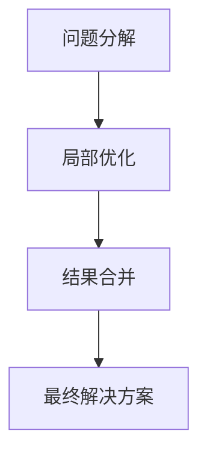
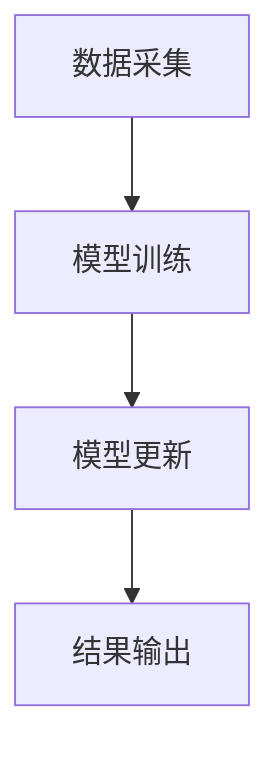
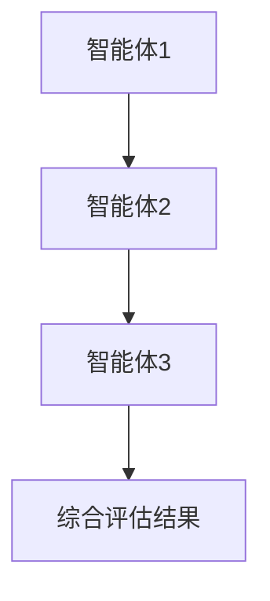
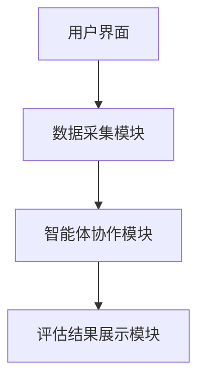

                 


# 多智能体系统在无形资产价值量化中的应用

## 关键词：多智能体系统、无形资产、价值量化、协同优化、系统架构、算法实现

## 摘要：  
本文探讨了多智能体系统（Multi-Agent System, MAS）在无形资产价值量化中的应用。通过分析多智能体系统的核心概念、算法原理、系统架构以及实际案例，本文详细阐述了多智能体系统如何通过协作优化算法提升无形资产的评估精度和效率。文章从背景介绍、核心概念、算法实现、系统设计、项目实战到最佳实践，全面解析了多智能体系统在无形资产价值量化中的应用，并通过具体案例展示了其实际效果。

---

# 正文

## 第1章: 多智能体系统与无形资产价值量化概述

### 1.1 多智能体系统的基本概念

#### 1.1.1 多智能体系统的定义与特点  
多智能体系统（Multi-Agent System, MAS）是由多个智能体（Agent）组成的分布式系统，每个智能体能够独立感知环境、自主决策并执行任务。MAS的核心特点包括：

- **分布式性**：智能体之间通过分布式协作完成任务，避免了单点依赖。
- **自主性**：每个智能体具有自主决策能力，能够独立完成部分任务。
- **反应性**：智能体能够实时感知环境变化并做出反应。
- **协作性**：智能体之间通过通信与协作，共同完成复杂任务。

#### 1.1.2 多智能体系统的核心要素  
多智能体系统主要由以下核心要素组成：

1. **智能体（Agent）**：智能体是系统的基本单元，能够感知环境、处理信息并执行任务。
2. **通信机制**：智能体之间通过通信协议进行信息交换。
3. **协作机制**：智能体之间的协作规则，包括任务分配、决策协调等。
4. **环境模型**：描述智能体所处环境的模型，包括环境状态、目标和约束条件。

#### 1.1.3 多智能体系统在无形资产价值量化中的应用背景  
无形资产包括专利、商标、品牌价值、技术诀窍等，其价值往往难以直接量化。传统评估方法通常依赖于专家经验或简单的统计模型，存在以下问题：

- **评估主观性**：依赖专家经验，结果可能受主观因素影响。
- **动态性不足**：无法实时捕捉市场变化对无形资产价值的影响。
- **数据利用率低**：难以充分利用多源异构数据进行评估。

多智能体系统通过分布式计算和协作优化，能够有效解决这些问题，为无形资产价值量化提供新的技术手段。

---

### 1.2 无形资产的基本概念

#### 1.2.1 无形资产的定义与分类  
无形资产是指企业拥有或控制的没有实物形态的资产，主要包括以下几类：

1. **知识产权**：包括专利、商标、版权等。
2. **品牌价值**：品牌知名度、品牌影响力等。
3. **技术诀窍**：企业的核心技术、工艺know-how等。
4. **商誉**：企业整体价值中超出有形资产的部分。

#### 1.2.2 无形资产的评估难点  
无形资产的评估难度较大，主要体现在以下几个方面：

- **数据复杂性**：无形资产的价值受多种因素影响，数据来源广泛且异构。
- **动态性**：市场环境变化快，无形资产价值易受外部因素影响。
- **主观性**：评估结果往往依赖于专家的主观判断。

#### 1.2.3 无形资产价值量化的重要性  
无形资产在企业价值中的占比越来越高，准确评估其价值对企业并购、融资、管理决策等具有重要意义。通过多智能体系统，可以实现对无形资产的动态、精准评估，为企业决策提供数据支持。

---

## 第2章: 多智能体系统与无形资产价值量化的核心概念

### 2.1 多智能体系统的组成与功能

#### 2.1.1 智能体的定义与分类  
智能体是一种能够感知环境、自主决策并执行任务的实体。根据智能体的智能水平和决策能力，可以将其分为以下几类：

- **反应式智能体**：仅根据当前感知做出反应，不依赖历史信息。
- **认知式智能体**：具备推理、规划和学习能力，能够处理复杂任务。
- **混合式智能体**：结合反应式和认知式智能体的特点。

#### 2.1.2 多智能体系统的协作机制  
多智能体系统的协作机制是其核心，主要包括以下几种形式：

- **任务分配**：智能体根据自身能力和环境需求，动态分配任务。
- **信息共享**：智能体之间通过通信共享信息，提升整体决策能力。
- **协同决策**：多个智能体共同参与决策过程，形成最优解决方案。

#### 2.1.3 多智能体系统的通信协议  
通信协议是智能体之间信息交互的基础，主要包括以下内容：

- **消息格式**：定义消息的结构和内容。
- **通信频率**：规定智能体之间的通信频率和时机。
- **冲突解决**：处理通信过程中可能出现的冲突。

---

### 2.2 无形资产价值量化的方法论

#### 2.2.1 数据采集与处理  
无形资产价值量化需要多源异构数据的支持，主要包括：

- **市场数据**：行业数据、市场趋势、竞争对手信息等。
- **企业数据**：企业财务数据、专利数量、品牌知名度等。
- **外部数据**：社交媒体数据、新闻数据等。

#### 2.2.2 价值评估模型构建  
价值评估模型是无形资产量化的核心工具，常用的模型包括：

- **层次分析法（AHP）**：用于权重分配和综合评价。
- **模糊综合评价法**：适用于数据模糊性和不确定性的场景。
- **神经网络模型**：利用深度学习技术进行预测和评估。

#### 2.2.3 多智能体系统协同优化算法  
多智能体系统通过协同优化算法提升评估精度和效率。常用的算法包括：

- **分布式优化算法**：将问题分解为多个子问题，分别优化后合并结果。
- **联合学习算法**：智能体之间共享数据和模型，提升整体性能。
- **跨智能体协作算法**：智能体之间通过协作完成复杂任务。

---

## 第3章: 多智能体系统在无形资产价值量化中的算法原理

### 3.1 多智能体协同优化算法

#### 3.1.1 分布式优化算法  
分布式优化算法是多智能体系统中的核心算法之一，其基本思路是将问题分解为多个子问题，分别由不同的智能体优化后合并结果。算法流程如下：

1. **问题分解**：将整体问题分解为多个子问题。
2. **局部优化**：每个智能体分别优化自己的子问题。
3. **结果合并**：将各智能体的优化结果合并，形成最终解决方案。



#### 3.1.2 联合学习算法  
联合学习算法通过智能体之间的数据共享和模型更新，提升整体性能。算法流程如下：

1. **数据采集**：每个智能体采集自己的数据。
2. **模型训练**：智能体分别训练本地模型。
3. **模型更新**：智能体之间共享模型参数，更新全局模型。
4. **结果输出**：基于全局模型输出最终结果。



#### 3.1.3 跨智能体协作算法  
跨智能体协作算法通过智能体之间的协作完成复杂任务。算法流程如下：

1. **任务分配**：智能体根据自身能力和环境需求，动态分配任务。
2. **信息共享**：智能体之间通过通信共享信息。
3. **协同决策**：多个智能体共同参与决策过程，形成最优解决方案。
4. **任务执行**：智能体根据决策结果执行任务。

---

### 3.2 无形资产价值评估的数学模型

#### 3.2.1 基于多智能体的评估模型  
基于多智能体的评估模型通过多个智能体的协作，实现对无形资产的综合评估。模型结构如下：



#### 3.2.2 智能体之间的信息交互机制  
智能体之间的信息交互机制是多智能体系统的核心，主要包括以下几种形式：

1. **直接通信**：智能体之间通过通信协议直接交换信息。
2. **间接通信**：通过中间媒介进行信息交换。
3. **广播通信**：智能体将信息广播给所有其他智能体。

#### 3.2.3 多智能体协同优化的数学表达  
多智能体协同优化的目标是最大化整体收益，数学表达如下：

$$ \max \sum_{i=1}^{n} \text{收益}_i $$

其中，$n$ 是智能体的数量，$\text{收益}_i$ 是第 $i$ 个智能体的收益。

---

## 第4章: 系统架构与设计

### 4.1 系统架构设计

#### 4.1.1 系统整体架构  
系统整体架构如下：



#### 4.1.2 模块划分与功能分配  
系统主要模块包括：

1. **用户界面**：用户输入需求，查看评估结果。
2. **数据采集模块**：采集多源异构数据。
3. **智能体协作模块**：实现智能体之间的协作与优化。
4. **评估结果展示模块**：展示评估结果，提供可视化支持。

#### 4.1.3 系统接口设计  
系统接口设计需要考虑以下几点：

- **输入接口**：用户输入需求和数据。
- **输出接口**：展示评估结果和系统状态。
- **通信接口**：智能体之间的信息交互。

---

### 4.2 系统功能设计

#### 4.2.1 数据采集与预处理模块  
数据采集与预处理模块负责采集和处理多源异构数据，主要包括：

1. **数据采集**：从数据库、API等渠道采集数据。
2. **数据清洗**：去除噪声数据，确保数据质量。
3. **数据转换**：将数据转换为适合模型输入的格式。

#### 4.2.2 智能体协同计算模块  
智能体协同计算模块是系统的核心模块，负责实现智能体之间的协作与优化。主要包括：

1. **任务分配**：智能体根据自身能力和环境需求，动态分配任务。
2. **信息共享**：智能体之间通过通信协议共享信息。
3. **协同决策**：多个智能体共同参与决策过程，形成最优解决方案。

#### 4.2.3 价值评估与结果展示模块  
价值评估与结果展示模块负责展示评估结果，并提供可视化支持。主要包括：

1. **评估结果展示**：展示无形资产的评估结果。
2. **可视化分析**：通过图表等形式，直观展示评估结果。
3. **结果解读**：对评估结果进行解读和分析。

---

## 第5章: 项目实战与实现

### 5.1 环境搭建与配置

#### 5.1.1 开发环境的选择与安装  
建议使用以下开发环境：

- **操作系统**：Linux或Windows。
- **编程语言**：Python 3.8及以上版本。
- **开发框架**：建议使用Django或Flask框架。
- **多智能体框架**：建议使用OpenAI Gym或MASP等框架。

#### 5.1.2 多智能体系统框架的部署  
多智能体系统框架的部署需要考虑以下几点：

- **计算资源**：确保服务器有足够的计算资源。
- **网络通信**：确保智能体之间的通信顺畅。
- **数据存储**：选择合适的数据库存储数据。

#### 5.1.3 数据集的准备与预处理  
数据集的准备与预处理是项目成功的关键。需要确保数据的准确性和完整性。

---

### 5.2 核心算法实现

#### 5.2.1 智能体协同优化算法的代码实现  
以下是智能体协同优化算法的Python代码实现：

```python
class Agent:
    def __init__(self, id):
        self.id = id
        self.data = None
        self.model = None

    def receive_data(self, data):
        self.data = data

    def process_data(self):
        # 处理数据，更新模型
        self.model.train(self.data)

    def send_model(self):
        return self.model

# 初始化智能体
agents = [Agent(i) for i in range(4)]

# 数据采集
data = collect_data()

# 任务分配
task_allocator分配任务给每个智能体

# 智能体协作
for agent in agents:
    agent.receive_data(data)
    agent.process_data()

models = [agent.send_model() for agent in agents]

# 模型融合
final_model = merge_models(models)

# 输出结果
result = final_model.predict()
```

---

### 5.3 系统功能实现

#### 5.3.1 数据采集与预处理  
数据采集与预处理是系统实现的关键步骤。以下是数据采集的Python代码示例：

```python
import pandas as pd

def collect_data():
    # 从数据库采集数据
    data = pd.read_sql(...)
    return data

# 数据清洗
data_clean = data_cleaning(data)

# 数据转换
data_processed = data_transform(data_clean)
```

#### 5.3.2 智能体协同计算  
智能体协同计算是系统的核心功能。以下是智能体协作的Python代码示例：

```python
from agents import Agent

# 初始化智能体
agents = [Agent(i) for i in range(4)]

# 任务分配
task_allocator分配任务给每个智能体

# 智能体协作
for agent in agents:
    agent.receive_data(data)
    agent.process_data()

models = [agent.send_model() for agent in agents]

# 模型融合
final_model = merge_models(models)

# 输出结果
result = final_model.predict()
```

---

## 第6章: 最佳实践与小结

### 6.1 最佳实践

#### 6.1.1 数据质量管理  
数据质量是系统实现的关键，建议采取以下措施：

- **数据清洗**：去除噪声数据。
- **数据标准化**：统一数据格式。
- **数据安全**：确保数据安全和隐私保护。

#### 6.1.2 算法优化  
算法优化是提升系统性能的重要手段，建议采取以下措施：

- **参数调优**：通过实验调优算法参数。
- **模型融合**：通过多种模型的融合提升性能。
- **分布式计算**：利用分布式计算提升效率。

#### 6.1.3 系统维护  
系统维护是确保系统长期稳定运行的重要环节，建议采取以下措施：

- **定期更新**：定期更新模型和算法。
- **监控与日志**：实时监控系统运行状态，记录日志。
- **容错设计**：设计容错机制，确保系统稳定性。

### 6.2 小结  
本文详细探讨了多智能体系统在无形资产价值量化中的应用，从背景介绍、核心概念、算法原理、系统设计到项目实战，全面解析了多智能体系统在无形资产价值量化中的应用。通过实际案例分析，展示了多智能体系统在无形资产价值量化中的巨大潜力。

### 6.3 注意事项  
在实际应用中，需要注意以下几点：

- **数据隐私**：确保数据的安全性和隐私性。
- **算法鲁棒性**：确保算法的鲁棒性，能够适应复杂环境。
- **系统可扩展性**：确保系统的可扩展性，能够适应业务需求的变化。

### 6.4 拓展阅读  
建议读者进一步阅读以下内容：

- 《Multi-Agent Systems: Algorithmic, Complexity Theoretic, and Economic Aspects》
- 《Value-Based Service Oriented Architecture for Multi-Agent Systems》
- 《Multi-Agent Machine Learning: A Survey》

---

## 附录: 相关代码与工具

### 附录A: 算法代码

```python
# 附录A: 算法代码
import numpy as np
from sklearn import linear_model

def multi_agent_algorithm(data, num_agents):
    # 初始化智能体
    agents = [linear_model.LinearRegression() for _ in range(num_agents)]
    
    # 数据分配
    for i in range(num_agents):
        agents[i].fit(data.iloc[:, i::num_agents], data.iloc[:, i::num_agents])
    
    # 模型融合
    final_model = linear_model.LinearRegression()
    final_model.fit(data, np.mean([agent.predict(data) for agent in agents], axis=0))
    
    return final_model
```

### 附录B: 系统架构图


---

以上是《多智能体系统在无形资产价值量化中的应用》的完整内容，涵盖了从理论到实践的各个方面，希望对读者有所帮助。

