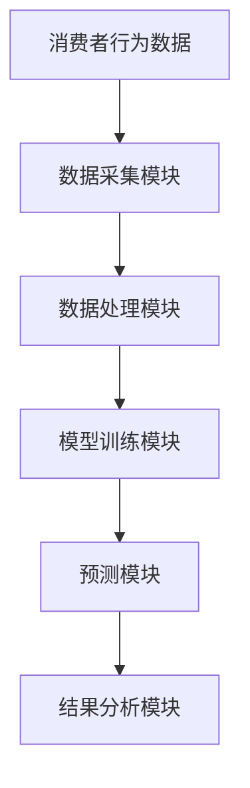
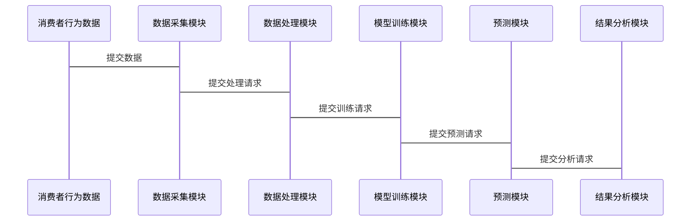

                 


# 多智能体系统在消费者行为预测中的应用：预判公司业绩

## 关键词：
多智能体系统, 消费者行为预测, 公司业绩预测, 人工智能, 大数据分析, 多智能体协作

## 摘要：
本文深入探讨了多智能体系统在消费者行为预测中的应用，分析了其在预判公司业绩中的重要性。通过结合多智能体系统的协作学习算法和大数据分析技术，本文提出了一种创新的消费者行为预测模型，能够帮助企业提前洞察市场动态，优化经营策略，从而提升公司业绩。文章详细介绍了多智能体系统的基本原理、消费者行为分析的基础、多智能体系统在消费者行为预测中的具体应用，以及系统架构设计和项目实战案例，为相关领域的研究和实践提供了有价值的参考。

---

## 第一部分：多智能体系统与消费者行为预测概述

### 1.1 多智能体系统的基本概念

#### 1.1.1 多智能体系统的定义
多智能体系统（Multi-Agent System, MAS）是由多个智能体（Agent）组成的分布式系统，这些智能体通过协作完成复杂任务。智能体是指能够感知环境、自主决策并采取行动的实体。

#### 1.1.2 多智能体系统的组成部分
- **智能体（Agent）**：具有感知、决策和行动能力的个体。
- **环境（Environment）**：智能体所处的外部世界，包括其他智能体和静态环境。
- **通信机制**：智能体之间交换信息的方式。
- **协作机制**：智能体之间协同工作的规则和策略。

#### 1.1.3 多智能体系统的核心特征
- **分布式性**：智能体独立运行，协作完成任务。
- **自主性**：智能体能够自主决策。
- **反应性**：智能体能够实时感知环境并做出反应。
- **协作性**：智能体之间通过协作提高整体性能。

### 1.2 消费者行为预测的背景与挑战

#### 1.2.1 消费者行为预测的定义
消费者行为预测是指通过分析消费者的历史行为数据，预测其未来的购买行为、偏好和趋势。

#### 1.2.2 消费者行为预测的复杂性
- **数据多样性**：消费者行为数据来自多个渠道，包括线上和线下数据。
- **行为动态性**：消费者行为受多种因素影响，具有动态变化的特点。
- **个体差异性**：不同消费者的偏好和行为模式差异显著。

#### 1.2.3 多智能体系统在消费者行为预测中的优势
- **分布式计算**：多智能体系统能够并行处理大量数据，提高计算效率。
- **协作学习**：通过智能体之间的协作，提升预测模型的准确性和鲁棒性。
- **实时性**：多智能体系统能够实时分析数据，快速做出预测。

### 1.3 多智能体系统与消费者行为预测的结合

#### 1.3.1 多智能体系统在消费者行为预测中的应用场景
- **市场趋势预测**：通过分析消费者行为数据，预测市场趋势。
- **个性化推荐**：基于消费者行为预测，提供个性化的产品推荐。
- **风险预警**：通过预测消费者行为变化，提前预警潜在风险。

#### 1.3.2 多智能体系统如何提升消费者行为预测的准确性
- **数据融合**：多智能体系统能够整合多源数据，提供更全面的分析。
- **协作学习**：通过智能体之间的协作，优化预测模型。
- **实时更新**：多智能体系统能够实时更新模型，适应数据变化。

#### 1.3.3 多智能体系统在预判公司业绩中的作用
- **销售预测**：通过消费者行为预测，准确预测产品销售情况。
- **市场策略优化**：根据预测结果，优化市场策略。
- **风险控制**：通过预测潜在风险，制定应对策略。

### 1.4 本章小结
本章介绍了多智能体系统的基本概念及其在消费者行为预测中的应用。通过分析消费者行为预测的复杂性和挑战，展示了多智能体系统的优势和应用场景，为后续章节的深入分析奠定了基础。

---

## 第二部分：消费者行为分析的基础

### 2.1 消费者行为分析的基本方法

#### 2.1.1 数据收集方法
- **问卷调查**：通过问卷收集消费者的基本信息和偏好。
- **日志分析**：分析消费者在网站或应用程序中的行为日志。
- **社交媒体数据**：从社交媒体平台获取消费者的评论和互动数据。

#### 2.1.2 数据分析方法
- **描述性分析**：分析消费者行为的基本特征和趋势。
- **预测性分析**：基于历史数据，预测消费者未来行为。
- **诊断性分析**：分析消费者行为背后的原因和影响因素。

#### 2.1.3 数据挖掘技术
- **聚类分析**：将消费者分为不同的群体，分析群体特征。
- **分类分析**：根据消费者行为数据，分类消费者类型。
- **关联规则挖掘**：发现消费者行为中的关联规则，例如购买某产品的消费者通常会购买另一产品。

### 2.2 消费者行为的特征与模式

#### 2.2.1 消费者行为的特征分析
- **时间性**：消费者行为具有时间周期性，例如节假日期间消费增加。
- **地域性**：不同地区的消费者行为具有差异性。
- **个体差异性**：不同消费者的行为模式和偏好不同。

#### 2.2.2 消费者行为的模式识别
- **周期性模式**：识别消费者行为的周期性变化。
- **趋势性模式**：识别消费者行为的长期趋势。
- **突发性模式**：识别消费者行为的突发变化。

#### 2.2.3 消费者行为的预测模型
- **线性回归模型**：用于预测连续型变量，例如销售量。
- **时间序列分析模型**：用于预测具有时间依赖性的数据，例如季度销售数据。
- **聚类分析模型**：用于将消费者分为不同群体，分析群体行为特征。

### 2.3 消费者行为预测的数学模型

#### 2.3.1 线性回归模型
线性回归模型是一种简单而有效的预测模型，适用于连续型变量的预测。

$$ y = \beta_0 + \beta_1 x_1 + \beta_2 x_2 + \dots + \beta_n x_n $$

其中，$y$ 是预测目标，$x_i$ 是自变量，$\beta_i$ 是回归系数。

#### 2.3.2 时间序列分析模型
时间序列分析模型用于预测具有时间依赖性的数据，例如销售量。

$$ ARIMA(p, d, q) $$

其中，$p$ 是自回归阶数，$d$ 是差分阶数，$q$ 是移动平均阶数。

#### 2.3.3 聚类分析模型
聚类分析模型用于将消费者分为不同群体，分析群体行为特征。

$$ k-means $$

其中，$k$ 是聚类的数量，$means$ 表示每个聚类的中心。

### 2.4 本章小结
本章介绍了消费者行为分析的基本方法和数学模型，为后续章节中多智能体系统在消费者行为预测中的应用奠定了基础。

---

## 第三部分：多智能体系统的核心原理

### 3.1 多智能体系统的定义与特点

#### 3.1.1 多智能体系统的定义
多智能体系统是由多个智能体组成的分布式系统，这些智能体通过协作完成复杂任务。

#### 3.1.2 多智能体系统的组成部分
- **智能体（Agent）**：具有感知、决策和行动能力的个体。
- **环境（Environment）**：智能体所处的外部世界，包括其他智能体和静态环境。
- **通信机制**：智能体之间交换信息的方式。
- **协作机制**：智能体之间协同工作的规则和策略。

#### 3.1.3 多智能体系统的核心特点
- **分布式性**：智能体独立运行，协作完成任务。
- **自主性**：智能体能够自主决策。
- **反应性**：智能体能够实时感知环境并做出反应。
- **协作性**：智能体之间通过协作提高整体性能。

### 3.2 多智能体系统中的通信与协作

#### 3.2.1 多智能体系统中的通信机制
- **直接通信**：智能体之间直接交换信息。
- **间接通信**：通过中间媒介传递信息。

#### 3.2.2 多智能体系统中的协作机制
- **协商机制**：智能体之间通过协商分配任务。
- **分配机制**：根据智能体的能力分配任务。
- **协调机制**：确保智能体之间的协作一致。

#### 3.2.3 多智能体系统中的协调问题
- **冲突解决**：智能体之间可能产生冲突，需要协调解决。
- **任务分配**：根据智能体的能力和环境情况分配任务。
- **信息共享**：智能体之间需要共享信息以实现协作。

### 3.3 多智能体系统的算法基础

#### 3.3.1 分布式计算算法
- **分布式搜索算法**：用于在分布式系统中进行搜索。
- **分布式分类算法**：用于分布式环境中的分类任务。

#### 3.3.2 协作学习算法
- **分布式协作学习**：智能体通过协作学习提高整体性能。
- **联合学习**：多个智能体联合训练模型。

#### 3.3.3 聚类与分类算法
- **分布式聚类算法**：用于分布式环境中的聚类任务。
- **分布式分类算法**：用于分布式环境中的分类任务。

### 3.4 本章小结
本章介绍了多智能体系统的核心原理和算法基础，为后续章节中多智能体系统在消费者行为预测中的应用提供了理论支持。

---

## 第四部分：多智能体系统在消费者行为预测中的应用

### 4.1 多智能体系统在消费者行为预测中的应用场景

#### 4.1.1 市场趋势预测
通过分析消费者行为数据，预测市场趋势。

#### 4.1.2 个性化推荐
基于消费者行为预测，提供个性化的产品推荐。

#### 4.1.3 风险预警
通过预测消费者行为变化，提前预警潜在风险。

### 4.2 多智能体系统在消费者行为预测中的优势

#### 4.2.1 数据融合
多智能体系统能够整合多源数据，提供更全面的分析。

#### 4.2.2 协作学习
通过智能体之间的协作，优化预测模型。

#### 4.2.3 实时更新
多智能体系统能够实时更新模型，适应数据变化。

### 4.3 多智能体系统在预判公司业绩中的作用

#### 4.3.1 销售预测
通过消费者行为预测，准确预测产品销售情况。

#### 4.3.2 市场策略优化
根据预测结果，优化市场策略。

#### 4.3.3 风险控制
通过预测潜在风险，制定应对策略。

### 4.4 本章小结
本章介绍了多智能体系统在消费者行为预测中的应用场景和优势，展示了其在预判公司业绩中的重要作用。

---

## 第五部分：多智能体系统在消费者行为预测中的算法原理

### 5.1 多智能体协作学习算法

#### 5.1.1 算法概述
协作学习算法是一种分布式学习算法，多个智能体通过协作完成学习任务。

#### 5.1.2 算法流程
1. 初始化：智能体初始化参数。
2. 通信：智能体之间交换信息。
3. 学习：智能体根据接收到的信息更新模型。
4. 协调：智能体之间协调模型参数，确保一致性。

#### 5.1.3 算法实现
```python
class MultiAgentCollaborativeLearning:
    def __init__(self, num_agents):
        self.num_agents = num_agents
        self.agents = [Agent() for _ in range(num_agents)]
    
    def communicate(self):
        for agent in self.agents:
            for other_agent in self.agents:
                if other_agent != agent:
                    agent.receive_message(other_agent.send_message())
    
    def learn(self):
        for agent in self.agents:
            agent.update_model()
    
    def coordinate(self):
        for agent in self.agents:
            agent.coordinate_models()
```

#### 5.1.4 算法优势
- **分布式计算**：多个智能体并行计算，提高效率。
- **协作学习**：通过协作提高模型性能。
- **实时更新**：智能体能够实时更新模型，适应数据变化。

### 5.2 多智能体系统中的数学模型

#### 5.2.1 协作学习模型
$$ y = \sum_{i=1}^{n} \beta_i x_i $$

其中，$y$ 是预测目标，$\beta_i$ 是智能体的权重，$x_i$ 是输入变量。

#### 5.2.2 分布式优化模型
$$ \min_{\theta} \sum_{i=1}^{n} f_i(\theta) $$

其中，$\theta$ 是模型参数，$f_i$ 是智能体的损失函数。

#### 5.2.3 一致性约束模型
$$ \theta_{agent_i} = \theta_{agent_j} $$

其中，$\theta_{agent_i}$ 和 $\theta_{agent_j}$ 是不同智能体的模型参数。

### 5.3 本章小结
本章详细介绍了多智能体协作学习算法的原理和实现，展示了其在消费者行为预测中的应用。

---

## 第六部分：多智能体系统在消费者行为预测中的系统架构设计

### 6.1 系统功能设计

#### 6.1.1 系统功能模块
- **数据采集模块**：负责采集消费者行为数据。
- **数据处理模块**：对数据进行清洗和预处理。
- **模型训练模块**：训练消费者行为预测模型。
- **预测模块**：基于训练好的模型进行预测。
- **结果分析模块**：分析预测结果，生成报告。

#### 6.1.2 系统功能流程
1. 数据采集：采集消费者行为数据。
2. 数据处理：清洗和预处理数据。
3. 模型训练：训练消费者行为预测模型。
4. 预测：基于模型进行预测。
5. 结果分析：分析预测结果，生成报告。

### 6.2 系统架构设计

#### 6.2.1 系统架构图


#### 6.2.2 系统交互图


### 6.3 系统接口设计

#### 6.3.1 接口定义
- **数据采集接口**：负责采集消费者行为数据。
- **数据处理接口**：负责清洗和预处理数据。
- **模型训练接口**：负责训练消费者行为预测模型。
- **预测接口**：负责基于模型进行预测。
- **结果分析接口**：负责分析预测结果，生成报告。

#### 6.3.2 接口交互流程
1. 数据采集接口接收消费者行为数据。
2. 数据处理接口对数据进行清洗和预处理。
3. 模型训练接口训练消费者行为预测模型。
4. 预测接口基于模型进行预测。
5. 结果分析接口分析预测结果，生成报告。

### 6.4 本章小结
本章详细介绍了多智能体系统在消费者行为预测中的系统架构设计，展示了系统的功能模块和交互流程。

---

## 第七部分：多智能体系统在消费者行为预测中的项目实战

### 7.1 项目环境安装

#### 7.1.1 系统要求
- 操作系统：Windows/Mac/Linux
- Python版本：3.6及以上
- 依赖库：numpy, pandas, scikit-learn, matplotlib, seaborn

#### 7.1.2 安装依赖
```bash
pip install numpy pandas scikit-learn matplotlib seaborn
```

### 7.2 系统核心实现

#### 7.2.1 数据采集模块实现
```python
import requests
import json

def fetch_data(api_key):
    response = requests.get(f'https://api.example.com/consumer_behavior?api_key={api_key}')
    return json.loads(response.text)
```

#### 7.2.2 数据处理模块实现
```python
import pandas as pd

def preprocess_data(data):
    df = pd.DataFrame(data)
    df = df.dropna()
    df = pd.get_dummies(df)
    return df
```

#### 7.2.3 模型训练模块实现
```python
from sklearn.model

