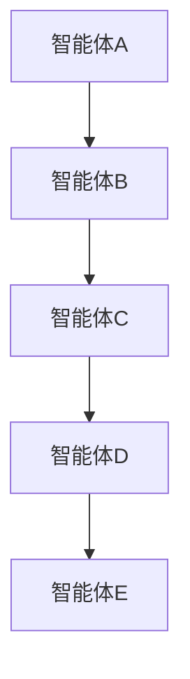
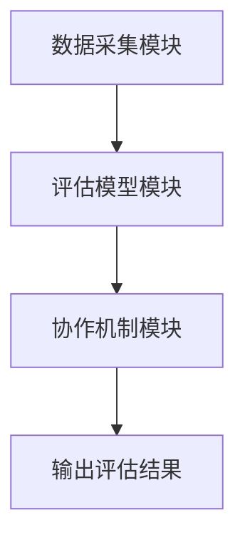
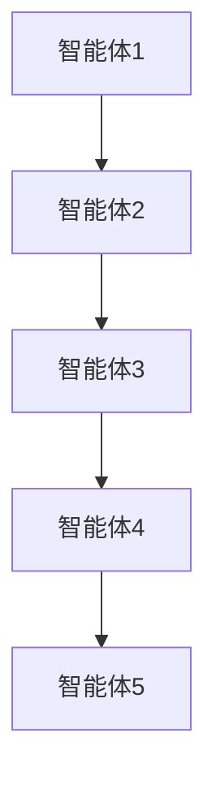

                 


# 多智能体系统在知识产权价值动态评估中的应用

## 关键词：多智能体系统、知识产权评估、动态评估、协作机制、数学模型

## 摘要：本文详细探讨了多智能体系统（Multi-Agent System, MAS）在知识产权价值动态评估中的应用。首先介绍了多智能体系统的基本概念和知识产权评估的核心原理，分析了两者结合的背景和优势。接着深入讲解了多智能体系统的协作机制和动态评估的数学模型，展示了如何利用这些技术实现知识产权价值的动态评估。最后通过项目实战部分，详细阐述了系统设计、实现和案例分析，总结了多智能体系统在知识产权评估中的应用前景和未来发展方向。

---

## 第一部分: 多智能体系统与知识产权评估基础

### 第1章: 多智能体系统概述

#### 1.1 多智能体系统的基本概念

##### 1.1.1 多智能体系统的定义
多智能体系统（Multi-Agent System, MAS）是由多个智能体（Agent）组成的分布式系统，这些智能体能够通过协作完成复杂的任务。每个智能体都有自己的目标、知识、推理能力以及与其他智能体的交互能力。

##### 1.1.2 多智能体系统的核心特征
- **自主性**：智能体能够自主决策。
- **反应性**：智能体能够根据环境变化动态调整行为。
- **协作性**：多个智能体通过协作完成共同目标。
- **分布性**：智能体之间通过分布式计算实现任务。

##### 1.1.3 多智能体系统与单智能体系统的区别
| 特性       | 单智能体系统             | 多智能体系统             |
|------------|--------------------------|--------------------------|
| 结构       | 单一智能体               | 多个智能体               |
| 协作       | 无需协作                 | 需要协作                 |
| 复杂性     | 简单                     | 复杂                     |

#### 1.2 知识产权评估的基本原理

##### 1.2.1 知识产权的定义与分类
- **定义**：知识产权是人们在创造性的智力活动中形成的成果，包括专利、商标、版权、商业秘密等。
- **分类**：发明专利、实用新型专利、外观设计专利、商标、版权等。

##### 1.2.2 知识产权评估的指标与方法
- **指标**：技术创新性、市场价值、法律风险、经济收益等。
- **方法**：市场法、成本法、收益法等。

##### 1.2.3 知识产权动态评估的挑战
- **动态性**：知识产权的价值会随着市场环境的变化而变化。
- **复杂性**：涉及多个因素的综合评估。
- **不确定性**：受政策、技术、市场等多方面影响。

#### 1.3 多智能体系统在知识产权评估中的优势

##### 1.3.1 多智能体系统的优势
- **分布式计算能力**：能够处理复杂的任务。
- **协作能力**：多个智能体可以协同完成任务。
- **适应性**：能够动态调整评估策略。

##### 1.3.2 多智能体系统在动态评估中的应用潜力
- **实时评估**：多智能体系统可以实时收集和分析数据，动态调整评估结果。
- **多维度评估**：多个智能体可以从不同的角度对知识产权进行评估。

---

### 第2章: 多智能体系统在知识产权评估中的应用背景

#### 2.1 知识产权评估的传统方法与局限性

##### 2.1.1 传统评估方法的优缺点
- **优点**：方法成熟，易于操作。
- **缺点**：难以应对动态变化，评估结果可能存在偏差。

##### 2.1.2 传统评估方法的局限性
- **静态性**：传统评估方法难以应对知识产权价值的动态变化。
- **片面性**：传统评估方法往往只考虑单一因素，忽略了多维度的影响。

#### 2.2 多智能体系统在知识产权评估中的优势

##### 2.2.1 多智能体系统的优势
- **分布式计算能力**：能够处理复杂的任务。
- **协作能力**：多个智能体可以协同完成任务。
- **适应性**：能够动态调整评估策略。

##### 2.2.2 多智能体系统在动态评估中的应用潜力
- **实时评估**：多智能体系统可以实时收集和分析数据，动态调整评估结果。
- **多维度评估**：多个智能体可以从不同的角度对知识产权进行评估。

#### 2.3 多智能体系统与知识产权评估的结合

##### 2.3.1 结合的必要性
- 知识产权评估需要综合考虑多个因素，多智能体系统能够提供分布式计算和协作能力。

##### 2.3.2 结合的具体应用场景
- 专利评估：通过多个智能体分别评估专利的技术价值、市场价值和法律风险。
- 商标评估：通过多个智能体分别评估商标的知名度、市场占有率和潜在风险。

---

## 第二部分: 多智能体系统的核心算法与数学模型

### 第3章: 多智能体系统的协作机制

#### 3.1 多智能体系统中的协作问题

##### 3.1.1 协作问题的定义
协作问题是多智能体系统中智能体之间如何协同工作以实现共同目标的问题。

##### 3.1.2 协作问题的分类
- **任务分配**：智能体之间如何分配任务。
- **信息共享**：智能体之间如何共享信息。
- **决策协调**：智能体之间如何协调决策。

#### 3.2 协作机制的设计

##### 3.2.1 协作协议的设计
- **通信协议**：智能体之间的通信方式。
- **协调协议**：智能体之间的协作规则。

##### 3.2.2 协作规则的制定
- **优先级规则**：任务优先级的确定。
- **冲突解决规则**：任务冲突时的解决规则。

#### 3.3 协作机制的实现

##### 3.3.1 协作过程的流程图



##### 3.3.2 协作机制的数学模型

$$
\text{协作效率} = \frac{\text{任务完成数量}}{\text{任务总数}} \times 100\%
$$

---

### 第4章: 知识产权动态评估的数学模型

#### 4.1 知识产权评估的指标体系

##### 4.1.1 评估指标的定义
- **技术创新性**：专利的技术创新程度。
- **市场价值**：专利的市场应用前景。
- **法律风险**：专利的法律纠纷风险。

##### 4.1.2 评估指标的权重分配
| 指标         | 权重 |
|--------------|------|
| 技术创新性   | 40%  |
| 市场价值     | 30%  |
| 法律风险     | 30%  |

#### 4.2 动态评估模型的构建

##### 4.2.1 动态评估模型的框架
$$
\text{评估价值} = \sum_{i=1}^{n} w_i \cdot x_i
$$

其中，$w_i$ 是第 $i$ 个指标的权重，$x_i$ 是第 $i$ 个指标的评估值。

##### 4.2.2 动态评估模型的数学表达式

$$
\text{动态评估价值} = \alpha \cdot \text{技术创新性} + \beta \cdot \text{市场价值} + \gamma \cdot \text{法律风险}
$$

其中，$\alpha + \beta + \gamma = 1$。

---

## 第三部分: 系统分析与架构设计

### 第5章: 系统分析与架构设计

#### 5.1 问题场景介绍
知识产权动态评估系统需要实时监控和分析专利、商标等知识产权的价值变化。

#### 5.2 系统功能设计

##### 5.2.1 系统功能模块
- **数据采集模块**：采集知识产权相关数据。
- **评估模型模块**：构建动态评估模型。
- **协作机制模块**：实现智能体之间的协作。

##### 5.2.2 系统功能流程图



#### 5.3 系统架构设计

##### 5.3.1 系统架构图



---

## 第四部分: 项目实战

### 第6章: 项目实战

#### 6.1 环境配置
- **编程语言**：Python
- **框架**：Django
- **数据库**：MySQL

#### 6.2 系统核心实现源代码

##### 6.2.1 数据采集模块

```python
class DataCollector:
    def collect_data(self):
        # 从数据库中采集数据
        pass
```

##### 6.2.2 评估模型模块

```python
class EvaluationModel:
    def evaluate(self, data):
        # 根据数据计算评估价值
        pass
```

##### 6.2.3 协作机制模块

```python
class CollaborationMechanism:
    def collaborate(self, agents):
        # 协调多个智能体的协作
        pass
```

#### 6.3 代码应用解读与分析
- **数据采集模块**：负责从数据库中采集知识产权相关数据。
- **评估模型模块**：根据采集的数据计算知识产权的评估价值。
- **协作机制模块**：协调多个智能体的协作，确保评估过程的顺利进行。

#### 6.4 实际案例分析和详细讲解剖析
通过具体案例分析，展示多智能体系统在知识产权动态评估中的实际应用。

#### 6.5 项目小结
总结项目实现的关键点和经验教训。

---

## 第五部分: 总结与展望

### 第7章: 总结与展望

#### 7.1 总结
总结全文的主要内容和研究成果。

#### 7.2 展望
展望多智能体系统在知识产权动态评估中的未来发展方向。

---

## 附录

### 附录A: 相关术语解释
- **智能体（Agent）**：具有自主性、反应性、协作性和分布性的实体。
- **动态评估**：根据环境变化实时调整评估结果。

### 附录B: 参考文献
- [1] 书籍或论文1
- [2] 书籍或论文2
- [3] 书籍或论文3

---

通过以上目录结构和内容安排，可以系统地介绍多智能体系统在知识产权价值动态评估中的应用，从理论到实践，从算法到系统设计，全面覆盖相关知识点。

